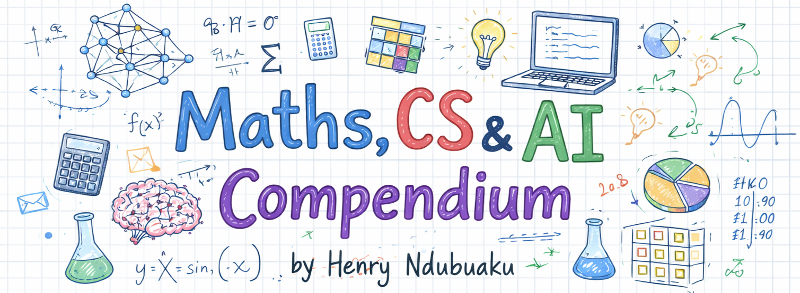

# 数学、计算机与 AI 综合手册



**在线阅读**: [English](https://henryndubuaku.github.io/maths-cs-ai-compendium/) | [简体中文](https://godlockin.github.io/maths-cs-ai-compendium/zh/)

<a href="https://trendshift.io/repositories/21344?utm_source=repository-badge&amp;utm_medium=badge&amp;utm_campaign=badge-repository-21344" target="_blank" rel="noopener noreferrer"></a>

## 项目概览

市面上大多数教材把好想法埋藏在密集的符号之下,跳过直觉,默认你已经懂了一半内容,并且在 AI 这类快速演进的领域里很快过时。本项目是一本开源、非传统的教科书,从零起步覆盖数学、计算机科学与人工智能三大领域,为希望深入理解这些知识(而不仅应付考试/面试)的求知者而写。

## 背景

过去几年在 AI/ML 领域的工作中,我在笔记本上写满了直觉优先、注重真实世界语境、不手挥(hand-waving)的数学、计算机与 AI 概念讲解。2025 年,几位朋友用这些笔记备战 DeepMind、OpenAI、Nvidia 等公司的面试,全部成功拿到 offer 且目前在岗位上表现优秀。与此同时,作者也于去年入选 Y Combinator。所以决定向所有人公开。

## MCP 服务器

本仓库内置 MCP 服务器,允许任何 AI 助手(Claude Code、Cursor、VS Code 等)将本手册作为知识库使用。需要在本地克隆仓库,提供面向教学的工具与示例实现。

## 章节目录

| 编号 | 章节 | 内容 | 状态 |
|------|------|------|------|
| 01 | [向量](zh/第01章%20-%20向量/01.%20向量空间.md) | 空间、模、方向、范数、度量、点积/叉积/外积、基、对偶 | 已发布 |
| 02 | [矩阵](zh/第02章%20-%20矩阵/01.%20矩阵的性质.md) | 性质、特殊类型、运算、线性变换、分解(LU、QR、SVD) | 已发布 |
| 03 | [微积分](zh/第03章%20-%20微积分/01.%20微分学.md) | 导数、积分、多元微积分、泰勒近似、优化与梯度下降 | 已发布 |
| 04 | [统计学](zh/第04章%20-%20统计学/01.%20基础.md) | 描述性度量、抽样、中心极限定理、假设检验、置信区间 | 已发布 |
| 05 | [概率论](zh/第05章%20-%20概率论/01.%20计数.md) | 计数、条件概率、分布、贝叶斯方法、信息论 | 已发布 |
| 06 | [机器学习](zh/第06章%20-%20机器学习/01.%20经典机器学习.md) | 经典 ML、梯度方法、深度学习、强化学习、分布式训练 | 已发布 |
| 07 | [计算语言学](zh/第07章%20-%20计算语言学/01.%20语言学基础.md) | 句法学、语义学、语用学、NLP、语言模型、RNN、CNN、注意力、Transformer、文本扩散、文本 OCR、MoE、SSM、现代 LLM 架构、NLP 评估 | 已发布 |
| 08 | [计算机视觉](zh/第08章%20-%20计算机视觉/01.%20图像基础.md) | 图像处理、目标检测、分割、视频处理、SLAM、CNN、视觉 Transformer、扩散、流匹配、VR/AR | 已发布 |
| 09 | [音频与语音](zh/第09章%20-%20音频与语音/01.%20数字信号处理.md) | DSP、ASR、TTS、语音与声学活动检测、说话人分离、源分离、主动降噪、WaveNet、Conformer | 已发布 |
| 10 | [多模态学习](zh/第10章%20-%20多模态学习/01.%20多模态表征.md) | 融合策略、对比学习、CLIP、VLM、图像/视频 Token 化、跨模态生成、统一架构、世界模型 | 已发布 |
| 11 | [自主系统](zh/第11章%20-%20自主系统/01.%20感知.md) | 感知、机器人学习、VLA、自动驾驶、太空机器人 | 已发布 |
| 12 | [图神经网络](zh/第12章%20-%20图神经网络/01.%20几何深度学习.md) | 几何深度学习、图论、GNN、图注意力、Graph Transformer、3D 等变网络 | 已发布 |
| 13 | [计算与操作系统](zh/第13章%20-%20计算与操作系统/01.%20离散数学.md) | 离散数学、计算机架构、操作系统、并发、并行、编程语言 | 已发布 |
| 14 | [数据结构与算法](zh/第14章%20-%20数据结构与算法/00.%20基础.md) | 大 O、递归、回溯、DP、数组、哈希、链表、栈、树、图、排序、二分搜索 | 已发布 |
| 15 | [生产级软件工程](zh/第15章%20-%20生产级软件工程/01.%20Linux%20与命令行.md) | Linux、Git、代码库设计、测试、CI/CD、Docker、模型服务、MLOps、监控、编码 Agent 的最佳实践 | 草稿(编码任务待补) |
| 16 | [SIMD 与 GPU 编程](zh/第16章%20-%20SIMD%20与%20GPU%20编程/00.%20为什么用%20C++%20与%20ML%20框架的工作原理.md) | ML 用 C++、框架工作原理、硬件基础、ARM NEON/I8MM/SME2、x86 AVX、GPU/CUDA、Triton、TPU、RISC-V、Vulkan、WebGPU | 已发布 |
| 17 | [AI 推理](zh/第17章%20-%20AI%20推理/01.%20量化.md) | 量化、高效架构、服务与批处理、边缘推理、推测解码、成本优化 | 已发布 |
| 18 | [机器学习系统设计](zh/第18章%20-%20机器学习系统设计/01.%20系统设计基础.md) | 系统基础、云计算、分布式系统、ML 生命周期、特征存储、A/B 测试、推荐/搜索/广告/反欺诈设计案例 | 草稿(编码任务待补) |
| 19 | [应用 AI](zh/第19章%20-%20应用%20AI/01.%20AI%20在金融.md) | AI for Finance、蛋白质设计、药物发现、智能体系统、医疗健康 | 草稿/占位 |
| 20 | [前沿 AI](zh/第20章%20-%20前沿%20AI/01.%20量子机器学习.md) | 量子 ML、神经形态计算、太空数据中心、去中心化 AI、脑机接口 | 草稿/占位 |
| 21 | [对齐、安全与可解释性](zh/第21章%20-%20对齐、安全与可解释性/01.%20什么是对齐%20·%20目标错配与规范博弈.md) | 对齐基础、RLHF/DPO、对抗攻击与越狱、机制可解释性、AI 安全治理 | 已发布 |
| 22 | [LLM 评测方法学](zh/第22章%20-%20LLM%20Evaluation%20方法学/01.%20为什么%20Eval%20是%20LLM%20的圣杯.md) | Eval 体系、传统 NLP 指标、现代 Benchmark、竞技场、LLM-as-Judge、Contamination、Capability 与 Safety Eval | 已发布 |
| 23 | [AI Agent 与工具使用](zh/第23章%20-%20AI%20Agent%20与%20工具使用/01.%20什么是%20AI%20Agent%20·%20从%20LLM%20到%20Agent%20的跃迁.md) | Agent 基础、Prompt 推理与规划、工具调用、MCP、Multi-Agent 编排、生产落地 | 已发布 |
| 24 | [数值分析与凸优化](zh/第24章%20-%20数值分析与凸优化补遗/01.%20浮点与数值稳定性.md) | 浮点稳定性、迭代法与稀疏线代、凸优化、对偶与 KKT、二阶方法、内点法、分布式优化 | 已发布 |
| 25 | [AI 系统实战面试指南](zh/第25章%20-%20AI%20系统实战面试指南/01.%20面试全景与准备心法.md) | 面试全景、ML 系统设计 8 步框架、推荐/搜索/排序、反欺诈/风控、对话与 LLM 系统、算法与编程、行为面 | 已发布 |

## 前言

新生儿的大脑是一个刚初始化的神经网络,从真实世界的数据与经验中训练至成年……直到永远。法语说得地道、口音纯正,意味着从小沉浸在优秀的法语与纯正口音中;同理,优秀 AI 研究者与工程师所具备的出色解题能力,源自高质量的知识输入与丰富的执行经验。

Kvashchev 实验是一项塞尔维亚长期研究,证明三年高强度、聚焦的创造性问题训练可以显著提升智力,尤其是流体智力,带来 10-15 个 IQ 点的增益。先天高 IQ 确实存在,正如高质量的权重初始化带来更好的训练,这一点有"先天 vs 后天"实验证据支撑。

然而,高 IQ 个体真正拥有的唯一优势是更快地学习/识别模式。但只要重复使用模式,任何概念都是可以学会的。查尔斯·达尔文曾被父亲和老师们认为是一个非常普通甚至中下的学生,他自述不够机敏,感觉像一个"慢处理器",需要时间慢慢吸收数据。

3-10 岁时,我学业表现良好,自然就能理解概念,从不记笔记也不复习。11-13 岁时变得有点自大,成绩掉到 80 人班级的后一半。14-15 岁时,我开始像一个普通学生一样阅读,在中学最后一个学期考到第一名。早期学校课程天然适合高 IQ 学习者,但真实世界的能力靠的是高质量的知识摄入与执行强度。

事实上,大多数学业出色的人只是更勤奋,但学术系统是为快学者设计的。本手册提供完整、互联的知识流,为"达尔文式"的学习者铺平道路。你只需要初等数学和基础 Python 编程,其余都可以在这里学到,放心读、相信过程即可!

## 如何学得更好

大学第一学期我同时选了 17 门课,成绩不太理想,所以我用了这样一个技巧:

**阶段 1**:课后睡前累积阅读  
每节课后、睡前阅读对应材料。下一节课开始时从头重读至当前进度,然后用额外研究填补知识空白。这让大脑把模式连接起来。

**阶段 2**:考试前遮蔽阅读  
读每个章节的小标题,合上书,然后在脑中(或纸上)把概念默写/默讲一遍。只重读遗漏之处,类似机器学习里的掩码语言建模。重读之后,最终用代码实现概念,你会对每个概念形成肌肉记忆。

这对不太自信的朋友非常有效。事实上,其中一位朋友在高级工程数学课(讲 Hessian 和优化)上击败了我,她目前在一家大型石油天然气公司工作。灵魂的意愿比身体条件更重要(Rosenthal 实验)。

## 谁是 Henry Ndubuaku?

读读他的 GitHub profile!

## 引用

```bibtex
@book{ndubuaku2025compendium,
  title     = {数学、计算机与 AI 综合手册(中文版)},
  author    = {Henry Ndubuaku(原著) · Steven Chen(中译主编)},
  year      = {2026},
  publisher = {GitHub},
  url       = {https://github.com/godlockin/maths-cs-ai-compendium}
}
```

## 翻译贡献

本中文译本由 Steven Chen 主持,基于 Henry Ndubuaku 英文原作。翻译规范、术语表与 QA 流程请参见[翻译规范](zh/TRANSLATION_GUIDE.md)与[术语表](zh/GLOSSARY.md)。
