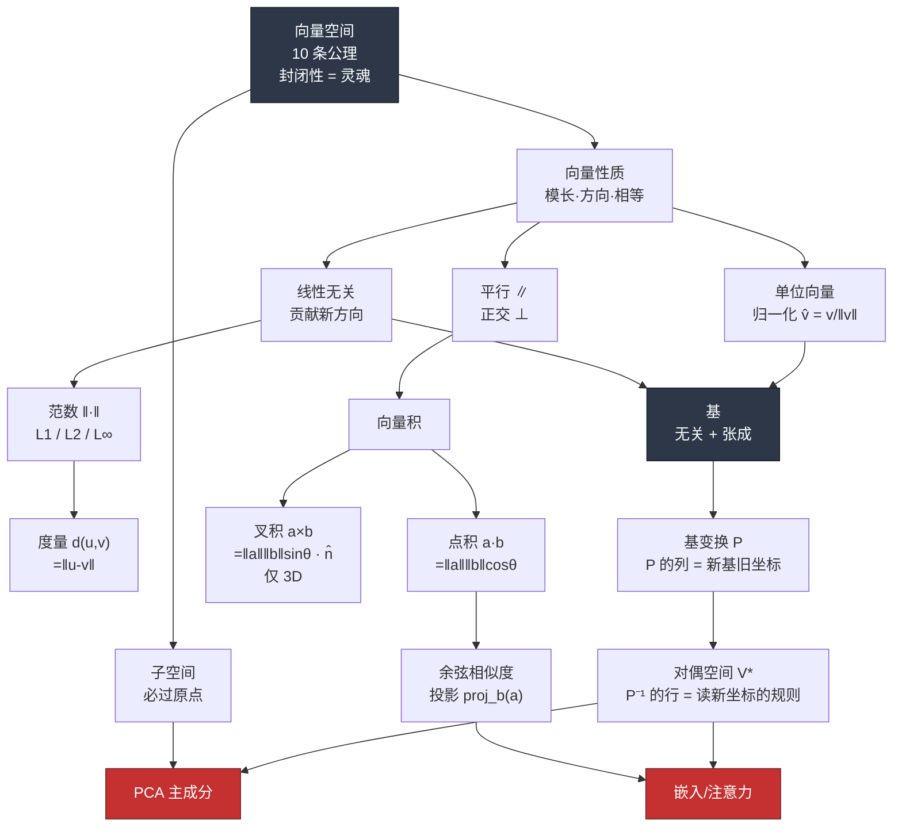

# Ch01 · 向量 · 一页信息图

> **一句话总纲**: 向量 = 装在空间里、有大小 (范数) 有方向 (单位化)、能相乘 (点/叉积)、能换尺子 (基/对偶) 的箭头。

---

## 一 · 知识拓扑图

<!-- FIX: P0-1 拟人化 emoji 收敛 (去掉 🎡/📏/🧭 拟人味, 保留几何图标); 对偶节点措辞收紧 -->

---

## 二 · 符号首现四件套

<!-- FIX: P0-1 δ_ij 首现补定义 (符号/中文名/定义/例子) -->

在读下面公式表之前, 先定义两个后面会用到的符号:

- $\delta_{ij}$ — **Kronecker 记号 (克罗内克 delta)**: 当 $i=j$ 时取 1, 否则取 0。例: $\delta_{22}=1$, $\delta_{13}=0$。
- $P$, $P^{-1}$ — **基变换矩阵及其逆**: $P$ 的**第 $j$ 列** = 新基向量 $\mathbf{b}_j$ 在旧基下的坐标; $P^{-1}$ 的**第 $i$ 行** = 对偶基 $\mathbf{b}_i^\ast$, 作用于旧坐标向量得到第 $i$ 个新坐标。口诀: **"$P$ 的列是新基, $P$ 把新坐标搬回旧描述。"** 关系式 $\mathbf{v}_{旧}=P\mathbf{v}_{新}$, $\mathbf{v}_{新}=P^{-1}\mathbf{v}_{旧}$。

---

## 三 · 核心公式速查表

<!-- FIX: P0-1 增加"数字例子"列; E1/E2 严格表述 P 列/P⁻¹ 行 -->

| 概念 | 公式 | 输入→输出 | 数字例子 | 关键约束 |
|---|---|---|---|---|
| L2 范数 | $\|\mathbf{v}\|_2 = \sqrt{\sum v_i^2}$ | 向量→标量 ≥0 | $\|(3,4)\|_2=\sqrt{9+16}=5$ | 齐次 · 三角不等式 |
| L1 范数 | $\|\mathbf{v}\|_1 = \sum \|v_i\|$ | 向量→标量 ≥0 | $\|(3,-4)\|_1=3+4=7$ | 曼哈顿 |
| L∞ 范数 | $\|\mathbf{v}\|_\infty = \max \|v_i\|$ | 向量→标量 ≥0 | $\|(3,-4)\|_\infty=4$ | 只看最大分量 |
| 归一化 | $\hat{\mathbf{a}} = \mathbf{a}/\|\mathbf{a}\|$ | 向量→单位向量 | $(3,4)/5=(0.6,0.8)$ | $\mathbf{a}\ne\mathbf{0}$ |
| 点积 | $\mathbf{a}\cdot\mathbf{b} = \sum a_i b_i = \|\mathbf{a}\|\|\mathbf{b}\|\cos\theta$ | 2 向量→标量 | $(1,2)\cdot(3,4)=3+8=11$ | 任意维度 |
| 投影 | $\text{proj}_\mathbf{b}(\mathbf{a}) = \dfrac{\mathbf{a}\cdot\mathbf{b}}{\|\mathbf{b}\|^2}\mathbf{b}$ | 2 向量→向量 | $(1,0)$ 到 $(1,1)$: $\tfrac{1}{2}(1,1)$ | $\mathbf{b}\ne\mathbf{0}$ |
| 余弦相似度 | $\cos\theta = \dfrac{\mathbf{a}\cdot\mathbf{b}}{\|\mathbf{a}\|\|\mathbf{b}\|}\in[-1,1]$ | 2 向量→标量 | $(1,0),(1,1)$: $\tfrac{1}{\sqrt 2}\approx 0.707$ | 忽略模长 |
| 叉积 | $\mathbf{a}\times\mathbf{b}=(a_2b_3{-}a_3b_2,\ a_3b_1{-}a_1b_3,\ a_1b_2{-}a_2b_1)$ | 2 向量→向量 | $(1,0,0)\times(0,1,0)=(0,0,1)$ | **仅 3D**; 反交换 |
| 标量三重积 | $\mathbf{a}\cdot(\mathbf{b}\times\mathbf{c})$ = 平行六面体体积 | 3 向量→标量 | $\hat{\imath}\cdot(\hat{\jmath}\times\hat{k})=1$ | =0 ⇔ 共面 |
| **E1 · 基变换** | $\mathbf{v}_{旧}=P\mathbf{v}_{新}$, $\mathbf{v}_{新}=P^{-1}\mathbf{v}_{旧}$; **$P$ 的第 $j$ 列 = 新基 $\mathbf{b}_j$ 在旧基下坐标** | 新坐标↔旧坐标 | 新基 $\mathbf{b}_1{=}(1,1),\mathbf{b}_2{=}(1,-1)$, $P{=}\begin{smallmatrix}1&1\\1&-1\end{smallmatrix}$; 旧 $(2,0)\to$ 新 $(1,1)$ | $\det P\ne 0$ |
| **E2 · 对偶配对** | $\mathbf{b}_i^\ast(\mathbf{b}_j)=\delta_{ij}$; **$P^{-1}$ 的第 $i$ 行 = 对偶基 $\mathbf{b}_i^\ast$** (读第 $i$ 个新坐标的规则) | 旧坐标向量→单个新坐标分量 | 上例 $P^{-1}{=}\tfrac{1}{2}\begin{smallmatrix}1&1\\1&-1\end{smallmatrix}$, 第 1 行 $\tfrac{1}{2}(1,1)$ 作用于 $(2,0)$ 得新坐标 $b_1$ = 1 | 校准规则 |

---

## 四 · 概念对比矩阵

| 维度 | 点积 · | 叉积 × | L1 | L2 | L∞ |
|---|---|---|---|---|---|
| **输出** | 标量 | 向量 | 标量 | 标量 | 标量 |
| **维度限制** | 任意 n | 仅 3D | 任意 n | 任意 n | 任意 n |
| **交换律** | ✅ $a\cdot b=b\cdot a$ | ❌ $a\times b=-(b\times a)$ | — | — | — |
| **几何量** | $\cos\theta$·对齐度 | $\sin\theta$·面积 | 街区距离 | 直线距离 | 最大偏差 |
| **对大分量** | — | — | 平权 | **主导** | 完全主导 |
| **典型 ML 用途** | 相似度/注意力 QK | 3D 几何/法向量 | Lasso/稀疏 | Ridge/kNN | 最坏情况约束 |

| 特性 | 平行 ∥ | 正交 ⊥ | 线性相关 | 线性无关 |
|---|---|---|---|---|
| **条件** | $\mathbf{a}=k\mathbf{b}$ | $\mathbf{a}\cdot\mathbf{b}=0$ | 可被其他线性组合出 | 无法被其他表达 |
| **点积** | $\pm\|\mathbf{a}\|\|\mathbf{b}\|$ | 0 | — | — |
| **信息** | 无新方向 | 完全独立 | 冗余 | 各贡献新维 |
| **ML 含义** | 特征重复 | 理想特征 | 过采样偏差 | 有效基 |

<!-- FIX: P0-1 严格区分 P 列/P⁻¹ 行 -->

| 基类型 | 标准基 $\hat{\imath},\hat{\jmath}$ | 一般基 $\mathbf{b}_1,\mathbf{b}_2$ | 单位正交基 |
|---|---|---|---|
| **读坐标 (新坐标) 的规则** | 分量本身 | **必须用 $P^{-1}$ 的行 (对偶基) 点乘旧坐标向量** | 可直接用新基向量点乘 |
| **对偶基 =** | 自己 | $P^{-1}$ 的第 $i$ 行, 一般 ≠ 第 $i$ 个新基向量本身 | 自己 |
| **陷阱风险** | 无 | 高 (常把 $\mathbf{b}_i$ 自己当尺子) | 无 |

---

## 五 · 应用场景速览

1. **kNN / 检索** — 距离度量选型: L2 惩罚大差、L1 抗离群、余弦忽略长度只比方向 → 文本/嵌入首选。
2. **PCA 降维** — 找一组新基 (主成分), 使坐标轴对齐方差最大方向; 数据其实住在低维子空间。
3. **注意力机制** — Q·K 点积 = 查询与键的方向对齐度; 本质是一组向量在"另一组尺子 (对偶)"上的读数。
4. **正则化** — L1 正则化诱导稀疏解 (Lasso); L2 正则化诱导平滑解 (Ridge); 对应范数几何: 菱形 vs 圆。
5. **图像/音频/多项式** — 全部套进向量空间公理: $28\times28$ 像素 = $\mathbb{R}^{784}$, 44.1kHz·1s 音频 = $\mathbb{R}^{44100}$。

---

## 六 · 易错点红旗清单

<!-- FIX: P0-1 每条补"一句话为什么" -->

| # | 陷阱 | 反例 | 正确姿势 | 一句话为什么 |
|---|---|---|---|---|
| 🚩1 | **误把偏离原点的平面当子空间** | 平面 $z=1$ 不含 $\mathbf{0}$ → 非子空间 | 子空间必过原点 | 子空间要对加法/数乘封闭, 特别是 $0\cdot\mathbf{v}=\mathbf{0}$ 必须在集合内, 平面 $z=1$ 直接违反 |
| 🚩2 | **用基向量自己点积去读非正交基下的坐标** | 新基 $\mathbf{b}_1{=}(1,1),\mathbf{b}_2{=}(1,-1)$, 旧坐标 $(3,2)$: $\mathbf{b}_1\cdot(3,2)=5$, 但真新坐标是 $2.5$ | 用 $P^{-1}$ 的第 $i$ 行 (对偶基) 点乘旧坐标向量, 才得到第 $i$ 个新坐标 | 只有单位正交基满足"基向量 = 对偶基"; 一般基下 $\mathbf{b}_i^\ast$ (即 $P^{-1}$ 的第 $i$ 行) 一般 ≠ $\mathbf{b}_i$, 用 $\mathbf{b}_i$ 自己读会串扰其他分量 |
| 🚩3 | **在非 3D 用叉积** | $\mathbb{R}^2$ 或 $\mathbb{R}^4$ 无叉积 | 叉积仅 3D; 一般化用外积/楔积 | 叉积的公式依赖 3 维行列式结构和"右手法则法向量", 换维度这个结构就没了, 只有外积 $\wedge$ 是通用的 |
| 🚩4 | **假设叉积交换/结合** | 认为 $a\times b=b\times a$ | 反交换 $a\times b=-b\times a$; 不结合 $(a\times b)\times c \ne a\times(b\times c)$ | 叉积由行列式定义, 交换两行变号; 结合律需要外代数, 三重叉积展开有余项 $(a\times b)\times c=(a\cdot c)b-(b\cdot c)a$ |
| 🚩5 | **对存在离群大分量的向量随手选 L2** | 一个 $10^4$ 差值淹没其他所有差 | 有离群 → L1; 要方向 → 余弦; 要最坏 → L∞ | L2 对分量做平方, 大分量的贡献按二次方放大, 单个离群就能主导整个距离, 让 kNN/聚类失真 |

---

*阅读源: `zh/第01章 - 向量/01–05.md` (共 677 行) · 十条公理 · 三条范数公理 · 四条度量公理 · $\delta_{ij}$ 校准 · $P^{-1}P=I$*