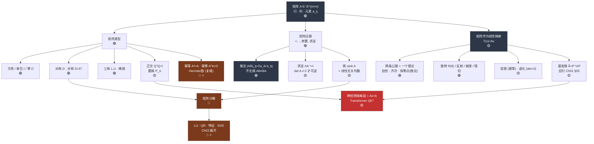

# Ch02 · 矩阵 · 一页信息图

> **一句话总纲**: 矩阵 = 把线性变换写成表格 —— 每列告诉你基向量落到哪里, 特殊结构 (对称/正交/三角/稀疏) 解锁计算捷径, 分解 (LU/QR/特征/SVD) 是线代的四大终极工具。

---

## 一 · 知识拓扑图

难度分布参考: 🟢 ≈ 50%, 🟡 ≈ 30%, 🔴 ≈ 20% (含 ⭐)。

---

## 二 · 符号首现四件套

阅读公式表之前, 先定义本章反复出现的符号:

- $A \in \mathbb{R}^{m\times n}$ — **矩阵**: $m$ 行 $n$ 列的数表, 元素 $a_{ij}$ 表示第 $i$ 行第 $j$ 列。例: $A=\begin{pmatrix}1&2\\3&4\end{pmatrix}$ 中 $a_{12}=2$。
- $I_n$ — **$n$ 阶单位矩阵**: 主对角全 $1$、其余全 $0$; 对任意相容 $A$ 有 $AI=IA=A$。例: $I_2=\begin{pmatrix}1&0\\0&1\end{pmatrix}$。
- $A^\top$ — **转置矩阵**: $(A^\top)_{ij}=a_{ji}$, 行列互换。例: $\begin{pmatrix}1&2\\3&4\end{pmatrix}^\top=\begin{pmatrix}1&3\\2&4\end{pmatrix}$。
- $A^{-1}$ — **逆矩阵**: 满足 $AA^{-1}=A^{-1}A=I$ 的方阵, 仅当 $\det A\ne 0$ 才存在。2×2 公式: $\begin{pmatrix}a&b\\c&d\end{pmatrix}^{-1}=\tfrac{1}{ad-bc}\begin{pmatrix}d&-b\\-c&a\end{pmatrix}$。例: $\begin{pmatrix}1&2\\3&4\end{pmatrix}^{-1}=\tfrac{1}{-2}\begin{pmatrix}4&-2\\-3&1\end{pmatrix}=\begin{pmatrix}-2&1\\1.5&-0.5\end{pmatrix}$。
- $\det A$ — **行列式**: 方阵的一个标量, 度量变换对面积/体积的缩放倍数; 2×2 时 $\det\begin{pmatrix}a&b\\c&d\end{pmatrix}=ad-bc$。例: $\det\begin{pmatrix}1&2\\3&4\end{pmatrix}=1\cdot4-2\cdot3=-2$。
- $\operatorname{rank}A$ — **秩**: $A$ 的列 (等价地行) 中线性无关的个数。例: $\operatorname{rank}\begin{pmatrix}1&2\\2&4\end{pmatrix}=1$ (两行成比例)。
- $\delta_{ij}$ — **Kronecker 记号** (回忆自 Ch01): $i=j$ 时取 $1$, 否则取 $0$。用于 $I=(\delta_{ij})$。
- $P$, $P^{-1}$ — **基变换矩阵** (回引 Ch01 §05): $P$ 的**第 $j$ 列** = 新基 $\mathbf{b}_j$ 在旧基下的坐标。口诀: **"$P$ 的列是新基, $P$ 把新坐标搬回旧描述。"** 关系式 $\mathbf{v}_{旧}=P\mathbf{v}_{新}$, $\mathbf{v}_{新}=P^{-1}\mathbf{v}_{旧}$。

---

<!-- FIX: M1 -->
## 三 · 线性映射公理 · 两条公理 + 一个推论 (Ch02 首次落地)

线性映射 $T:V\to W$ 的定义只需**两条独立公理**: 加性 (L1) 与 齐次 (L2)。**保零点 $T(\mathbf{0})=\mathbf{0}$ 是齐次 L2 令 $c=0$ 得到的推论**, 不是独立公理; 但在判定反例时它是最快的一票否决, 所以单列出来当"体检指标"。

**两条独立公理 (L1, L2) — 三件套 (名称 + 大白话 + 反例)**:

| # | 公理名 | 大白话 | 违反反例 |
|---|---|---|---|
| L1 | **加性 (Additivity)** $T(\mathbf{u}+\mathbf{v})=T(\mathbf{u})+T(\mathbf{v})$ | 先加再变 = 先变再加, 顺序不影响结果。 | $T(x)=x^2$: $T(1+1)=4$, 但 $T(1)+T(1)=2$, $4\ne 2$ → 非线性。 |
| L2 | **齐次 (Homogeneity)** $T(c\mathbf{v})=cT(\mathbf{v})$ | 缩放先做还是后做都一样, 常数可以拎到外面。 | $T(x)=\|x\|$: $T(-1\cdot 2)=2$, 但 $-1\cdot T(2)=-2$, $2\ne -2$ → 非线性。 |

<!-- FIX: M7 -->
**一个推论 (C1) — 保零点 / 零点保持**:

| # | 推论 | 来源 | 大白话 | 违反反例 (仅推论层反例, 定义还看 L1/L2) |
|---|---|---|---|---|
| C1 | **保零点 $T(\mathbf{0})=\mathbf{0}$** | L2 取 $c=0$: $T(0\cdot\mathbf{v})=0\cdot T(\mathbf{v})=\mathbf{0}$ | 原点必须留在原点, 不允许整体平移。 | 平移 $T(x)=x+3$: $T(0)=3\ne 0$ → 是仿射不是线性; 需引入齐次坐标才能拼进矩阵乘。 |

> **合并写法**: $T(a\mathbf{u}+b\mathbf{v})=aT(\mathbf{u})+bT(\mathbf{v})$ 对所有 $a,b\in\mathbb{R}$, $\mathbf{u},\mathbf{v}\in V$ 成立 ⇔ L1 ∧ L2 同时成立。
>
> **为什么把 C1 单列**: 判定一个具体 $T$ 是否线性时, 若 $T(\mathbf{0})\ne\mathbf{0}$ 立即结论"不线性", 省去写 L1/L2 反例的功夫; 但它逻辑上从属于 L2, 不参与"独立公理"计数。
>
> **数字锚点**: $T(\mathbf{x})=A\mathbf{x}$, $A=\begin{pmatrix}2&1\\1&2\end{pmatrix}$。取 $\mathbf{u}=(1,0)^\top, \mathbf{v}=(0,1)^\top$: $T(3\mathbf{u}+2\mathbf{v})=A(3,2)^\top=(8,7)^\top$; $3T(\mathbf{u})+2T(\mathbf{v})=3(2,1)^\top+2(1,2)^\top=(8,7)^\top$ ✓; 顺带 $T(\mathbf{0})=A\mathbf{0}=\mathbf{0}$ ✓ (保零点自动成立)。

---

## 四 · 核心公式速查表

每条配一个"可心算"的数字例, 直接逆向验证。

| # | 概念 | 公式 | 输入→输出 | 数字例子 | 关键约束 |
|---|---|---|---|---|---|
| F1 | **矩阵乘法** | $(AB)_{ij}=\sum_k a_{ik}b_{kj}$ | $m{\times}k \cdot k{\times}n \to m{\times}n$ | $\begin{pmatrix}1&2\\3&4\end{pmatrix}\begin{pmatrix}5\\6\end{pmatrix}=\begin{pmatrix}17\\39\end{pmatrix}$ | 内维匹配; 不交换 |
| F2 | **转置** | $(A^\top)_{ij}=a_{ji}$; $(AB)^\top=B^\top A^\top$ | $m{\times}n \to n{\times}m$ | $\begin{pmatrix}1&2\\3&4\end{pmatrix}^\top=\begin{pmatrix}1&3\\2&4\end{pmatrix}$ | 顺序倒转 |
| F3 | **2×2 求逆** | $A^{-1}=\tfrac{1}{\det A}\begin{pmatrix}d&-b\\-c&a\end{pmatrix}$ | 方阵→方阵 | $\begin{pmatrix}2&1\\1&1\end{pmatrix}^{-1}=\begin{pmatrix}1&-1\\-1&2\end{pmatrix}$; 验: $AA^{-1}=I$ ✓ | $\det A\ne 0$; **3×3 求逆见 Ch03 (Gauss-Jordan / 伴随矩阵)** |
| F4 | **行列式 (2×2)** | $\det\begin{pmatrix}a&b\\c&d\end{pmatrix}=ad-bc$ | 方阵→标量 | $\det\begin{pmatrix}2&1\\1&1\end{pmatrix}=1$ | $=0$ ⇔ 奇异 |
| F5 | **三角矩阵行列式** | $\det L=\prod l_{ii}$ | 方阵→标量 | $\det\begin{pmatrix}2&0&0\\1&3&0\\-1&2&4\end{pmatrix}=2\cdot3\cdot4=24$ | 前代/回代基础 |
| F6 | **正交矩阵** | $Q^\top Q=QQ^\top=I \Rightarrow Q^{-1}=Q^\top$ | 方阵→方阵 | $R(90°)=\begin{pmatrix}0&-1\\1&0\end{pmatrix}$, $R^\top R=I$ ✓ | $\det Q=\pm 1$ |
| F7 | **2D 旋转** | $R(\theta)=\begin{pmatrix}\cos\theta&-\sin\theta\\\sin\theta&\cos\theta\end{pmatrix}$ | 2D→2D | $R(90°)\begin{pmatrix}1\\0\end{pmatrix}=\begin{pmatrix}0\\1\end{pmatrix}$ | 保长保角 |
| F8 | **秩-零化度** | $\operatorname{rank}A+\dim\ker A=n$ (列数) | — | $A=\begin{pmatrix}1&2\\2&4\end{pmatrix}$: $\operatorname{rank}=1, \dim\ker=1, 1+1=2$ ✓ | 神经网络退化诊断 |
| F9 | **基变换 (回引 Ch01 §05)** | $\tilde A=P^{-1}AP$; $\mathbf{v}_{新}=P^{-1}\mathbf{v}_{旧}$ | 旧基下 $A$ → 新基下 $\tilde A$ | 见下方数字例 (L4 展开) | $\det P\ne 0$ |
| F10 | **仿射 + 齐次坐标** | $\begin{pmatrix}A&\mathbf{t}\\\mathbf{0}^\top&1\end{pmatrix}\begin{pmatrix}\mathbf{x}\\1\end{pmatrix}=\begin{pmatrix}A\mathbf{x}+\mathbf{t}\\1\end{pmatrix}$ | $n{+}1$ 维矩阵→仿射变换 | 平移 $\mathbf{t}=(3,0)$: 原点 $(0,0,1)^\top\to(3,0,1)^\top$ | 修补保零点失效 |

**F9 数字锚点 (基变换 2×2 手算完整走一遍, 兑现 Ch01 遗留断层)**:

> 旧基 $\mathbf{e}_1=(1,0)^\top,\mathbf{e}_2=(0,1)^\top$; 新基 $\mathbf{b}_1=(1,1)^\top,\mathbf{b}_2=(1,-1)^\top$。
>
> Step 1: $P=\begin{pmatrix}1&1\\1&-1\end{pmatrix}$ ($P$ 的列 = 新基旧坐标, 遵循 §1.3 约定)。
>
> Step 2: 手算 $P^{-1}$。$\det P = 1\cdot(-1)-1\cdot 1 = -2$。套 F3: $P^{-1}=\tfrac{1}{-2}\begin{pmatrix}-1&-1\\-1&1\end{pmatrix}=\tfrac{1}{2}\begin{pmatrix}1&1\\1&-1\end{pmatrix}$。
>
> Step 3: 取 $A=\begin{pmatrix}2&0\\0&3\end{pmatrix}$ (旧基下沿轴缩放)。新基下 $\tilde A=P^{-1}AP=\tfrac{1}{2}\begin{pmatrix}1&1\\1&-1\end{pmatrix}\begin{pmatrix}2&0\\0&3\end{pmatrix}\begin{pmatrix}1&1\\1&-1\end{pmatrix}=\tfrac{1}{2}\begin{pmatrix}5&-1\\-1&5\end{pmatrix}=\begin{pmatrix}2.5&-0.5\\-0.5&2.5\end{pmatrix}$。
>
> **验证** (选一个向量): $\mathbf{v}_{旧}=(2,0)^\top$, $A\mathbf{v}_{旧}=(4,0)^\top$; $\mathbf{v}_{新}=P^{-1}(2,0)^\top=(1,1)^\top$, $\tilde A(1,1)^\top=(2,2)^\top$; 换回旧: $P(2,2)^\top=(4,0)^\top$ ✓
>
> 3×3 手算求 $P^{-1}$ 请见 Ch03 (Gauss-Jordan 或 伴随矩阵法), 本章不展开。

---

## 五 · 矩阵类型对比矩阵

| 类型 | 形式条件 | 逆 | 行列式 | 特征值 | 典型 AI/ML 场景 | 难度 |
|---|---|---|---|---|---|---|
| **方阵** $n{\times}n$ | 行数 = 列数 | 视 $\det$ 而定 | 有定义 | 有 $n$ 个 (复) | 协方差、Gram 矩阵 | 🟢 |
| **单位** $I$ | $\delta_{ij}$ | $I$ | $1$ | 全 $1$ | 恒等变换; 初始化 | 🟢 |
| **对角** $D$ | 非对角为 $0$ | $\operatorname{diag}(1/d_{ii})$ | $\prod d_{ii}$ | 对角元本身 | 独立缩放; PCA 中间步 | 🟢 |
| **对称** $S=S^\top$ | $s_{ij}=s_{ji}$ | 对称 (若存在) | 实 | **全实**, 特征向量正交 | 协方差、核矩阵、Hessian | 🟢 |
| **上/下三角** $L,U$ | 一侧全零 | 同型三角 | $\prod l_{ii}$ | 对角元 | LU 分解、前代/回代 | 🟢 |
| **正交** $Q$ | $Q^\top Q=I$ | $Q^\top$ (免费) | $\pm 1$ | $\|\lambda\|=1$ | 旋转/反射、QR、正交初始化 | 🟡 |
| **稀疏** | 大部分元素为 $0$ | 一般稠密 | 视矩阵 | 视矩阵 | 图邻接、Attention mask、社交网络 | 🟢 |
| **置换** $P_\pi$ | 每行每列恰一个 $1$ | $P_\pi^\top$ | $\pm 1$ | 单位根 | shuffle、LU pivoting | 🟡 |
| **幂等 (投影)** | $A^2=A$ | 不可逆 (除 $I$) | $0$ 或 $1$ | $\{0,1\}$ | 最小二乘投影、Dropout mask | 🟡 |
| **幂零** | $A^k=O$ | 不可逆 | $0$ | 全 $0$ | Jordan 块理论 ⭐ | 🔴 |
| **正定** $\mathbf{x}^\top A\mathbf{x}>0$ | 对称 + 特征值 $>0$ | 存在, 正定 | $>0$ | 全正 | 协方差、$L^2$ 正则 | 🟡 |
| **Hermite** $A=A^*$ | 复域对称 | 复域可逆 | 实 | 全实 | 量子态、复信号 (⭐ 首次切换 $\mathbb{C}$) | 🔴 |
| **酉** $U^*U=I$ | 复域正交 | $U^*$ | $\|\det\|=1$ | $\|\lambda\|=1$ | 量子门、复数版 QR | 🔴 ⭐ |

> **实/复域声明**: 本章默认工作在 $\mathbb{R}$; 表格最后两行 Hermite / 酉是复数域 $\mathbb{C}$ 的对应物, 转置替换为共轭转置 $A^*$, 实矩阵下 Hermite ≡ 对称、酉 ≡ 正交。

---

## 六 · 应用场景速览

1. **神经网络前向传播** — 每层 $\mathbf{h}=\sigma(W\mathbf{x}+\mathbf{b})$: $W$ 是线性映射, 偏置 $\mathbf{b}$ 使其成仿射, 靠齐次坐标 (F10) 拼进单次矩阵乘。
2. **Transformer 注意力** — $\operatorname{softmax}(QK^\top/\sqrt d)V$: $QK^\top$ 是两组向量的点积矩阵, mask 是稀疏矩阵, 权重共享靠 Toeplitz/循环结构。
3. **PCA / 协方差** — $C=\tfrac{1}{n}X^\top X$ 是对称正定, 特征分解 = 找主成分, 对角化 $C=Q\Lambda Q^\top$ 就是 F9 基变换在正交基下的特例。
4. **图神经网络** — 邻接矩阵 $B$ 是稀疏布尔; Laplacian $L=D-B$ 是对称半正定; $B^k$ 记录 $k$ 步可达。
<!-- FIX: M8 -->
5. **图形/游戏引擎** — 每物体一个 $4\times 4$ 齐次矩阵串联 旋转 (F7) · 缩放 · 平移; 正交矩阵 (F6) 保刚体; 奇异矩阵 = 塌陷投影 (阴影)。**刚体变换严格定义**: 映射 $T(\mathbf{x})=Q\mathbf{x}+\mathbf{t}$, 其中 $Q\in\mathrm{O}(n)$ (正交, $Q^\top Q=I$)、$\mathbf{t}\in\mathbb{R}^n$ (平移); 等价刻画 = 保欧氏距离 $\|T(\mathbf{x})-T(\mathbf{y})\|=\|\mathbf{x}-\mathbf{y}\|$; 若额外要求 $\det Q=+1$ 则称**保定向刚体变换** (即 $\mathrm{SE}(n)$, 排除反射)。

---

## 七 · 易错点红旗清单

| # | 陷阱 | 反例 | 正确姿势 | 一句话为什么 |
|---|---|---|---|---|
| 🚩1 | **假设矩阵乘法可交换** | $A=\begin{pmatrix}0&1\\0&0\end{pmatrix},B=\begin{pmatrix}0&0\\1&0\end{pmatrix}$: $AB=\begin{pmatrix}1&0\\0&0\end{pmatrix}\ne BA=\begin{pmatrix}0&0\\0&1\end{pmatrix}$ | 顺序永远记账: $(AB)^\top=B^\top A^\top$, 求逆同理 $(AB)^{-1}=B^{-1}A^{-1}$ | 矩阵乘法是"变换复合", 先旋转再平移和先平移再旋转在几何上就是两件事; 只有极少数矩阵对 (如都对角) 才交换 |
| 🚩2 | **把仿射变换当线性变换** | $T(\mathbf{x})=\mathbf{x}+(3,0)^\top$: $T(0)=(3,0)^\top\ne\mathbf{0}$ | 用齐次坐标 $(n{+}1)\times(n{+}1)$ 矩阵 (F10) 把平移吸收进矩阵乘 | 线性变换需保零点 $T(\mathbf{0})=\mathbf{0}$ (齐次 L2 的推论); 平移挪原点直接违反, 只有升一维才能装进矩阵乘表格 |
| 🚩3 | **相似变换 $\tilde A=PAP^{-1}$ 方向写反** | 用错公式后 $\tilde A(1,1)^\top$ 得不到 $A(2,0)^\top$ 换基结果 | 严格遵守 Ch01 §05 约定: **$\tilde A=P^{-1}AP$** ("新基版 = P⁻¹ · 旧基版 · P"); $P$ 的列 = 新基旧坐标 | $A$ 作用在向量上, 向量在新基下写成 $\mathbf{v}_{新}=P^{-1}\mathbf{v}_{旧}$, 所以要先 $P$ 把新变旧、再 $A$ 变换、再 $P^{-1}$ 读回新, 三步合起来就是 $P^{-1}AP$; 写反等价于把新旧基调换了角色 |
| 🚩4 | **$\det A=0$ 还硬求逆** | $A=\begin{pmatrix}1&2\\2&4\end{pmatrix}$, $\det A=0$, $A^{-1}$ 不存在 | 先查 $\det A$ 或秩; 奇异矩阵改用**伪逆 $A^+$** (SVD 定义, 见 Ch03) 或最小二乘 | $A$ 的列共线 → 值域是一条线 → 一个方向的输入被压没了 → 逆映射得从一维回到二维, 信息已丢失, 无从恢复 |
| 🚩5 | **把对称 = 正交, 或对称 = 正定** 混为一谈 | $S=\begin{pmatrix}1&2\\2&1\end{pmatrix}$: 对称但**不**正交 ($S^\top S=\begin{pmatrix}5&4\\4&5\end{pmatrix}\ne I$), 特征值 $3,-1$ 有负值→**不**正定 | 三者独立: 对称 = $A^\top{=}A$; 正交 = $Q^\top Q{=}I$; 正定 = 对称 且 特征值全正 | 对称约束的是"元素分布" (镜像), 正交约束的是"列的长度和夹角" (单位正交), 正定约束的是"二次型符号" ($\mathbf{x}^\top A\mathbf{x}{>}0$); 三个条件维度不同, 交集是"对称正交且特征值 $\{\pm 1\}$ 的正定 = $I$" |

---

*阅读源: `zh/第02章 - 矩阵/01–05.md` (共 917 行) · 线性映射两条公理 + 一个推论 · 13 类矩阵结构 · 基变换 $\tilde A=P^{-1}AP$ · Ch01 §05 三处回引 (拓扑图 D4 · 符号表 · F9)*