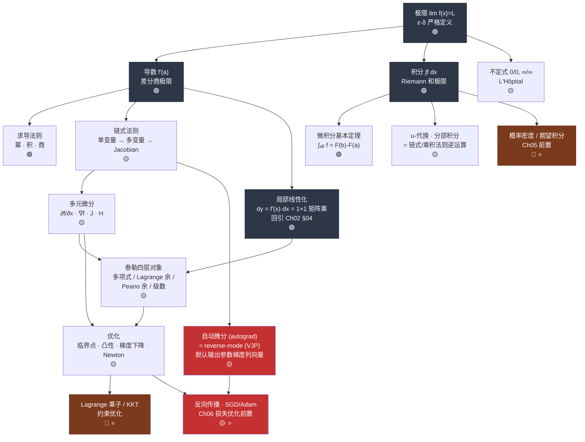

# Ch03 · 微积分 · 一页信息图

> **一句话总纲**: 微积分 = 把"变化"变成可算的量 —— 极限给出严格语言 (ε-δ), 导数是局部线性近似 (dy = f'(x)·dx 就是 1×1 矩阵乘法), 积分把局部率累回总量, 泰勒把任意光滑函数拆成多项式, 梯度/Jacobian/Hessian 把这一切搬到高维, 优化则是它们在训练循环里的落地。

---

## 一 · 知识拓扑图



难度分布: 🟢 ≈ 45%, 🟡 ≈ 35%, 🔴 ≈ 20% (含 ⭐)。⭐ 节点为进阶, 考试不考, 看不懂可跳。

**依赖方向声明**: 本图所有"回引"指向 Ch01/Ch02 (低章号, 允许); 所有指向 Ch05/Ch06/Ch24 的箭头均为**后置引用**, 一律降级为 ⭐ 进阶, 不作为本章理解前提。

---

<!-- FIX: P0-1 -->
## 一·五 · 梯度/Jacobian 形状契约 (全章强制)

> **方向约定**: 梯度取列向量, Jacobian 取行/矩阵。

| 对象 | 输入/输出 | 形状 | 备注 |
|---|---|---|---|
| $\nabla f$ (标量 $f$ 的梯度) | $f:\mathbb R^n\to\mathbb R$ | $\mathbb R^{n\times 1}$ (列向量) | 沿梯度方向函数增长最快 |
| $J_f$ (标量 $f$ 的 Jacobian) | $f:\mathbb R^n\to\mathbb R$ | $\mathbb R^{1\times n}$ (行向量) | $=(\nabla f)^\top$, 即 $\nabla f$ 的转置 |
| $J_{\mathbf F}$ (向量 $\mathbf F$ 的 Jacobian) | $\mathbf F:\mathbb R^n\to\mathbb R^m$ | $\mathbb R^{m\times n}$ (矩阵) | 第 $i$ 行 $=(\nabla f_i)^\top$ |

> **关键等价**: $\nabla f^\top\mathbf v$ 与 $J_f\mathbf v$ 数值一致, 因为 $J_f=(\nabla f)^\top$。
>
> 每一处出现梯度/Jacobian, **必须显式标 shape** (不写 shape 一律不算合格)。

---

## 二 · 符号首现四件套

| 符号 | 中文名 | 一句定义 | 数字例 |
|---|---|---|---|
| $\lim_{x\to a}f(x)=L$ | **极限** | $x$ 无限接近 $a$ 时 $f(x)$ 无限接近 $L$ (不要求 $x=a$ 处有定义) | $\lim_{x\to 1}\frac{x^2-1}{x-1}=2$ (约分得 $x+1$, 代 $x=1$) |
| $\varepsilon,\ \delta$ | **误差容忍 / 邻域半径** | $\varepsilon$ 是"输出允许偏离多少", $\delta$ 是"输入必须多接近" | 证 $\lim_{x\to 0}x^2=0$: 取 $\varepsilon=0.01$ 时 $\delta=0.1$ 即可 |
| $f'(a)$, $\frac{df}{dx}$ | **导数** | $a$ 点差分商的极限, 几何上是切线斜率 | $f(x)=x^2$, $f'(3)=6$ |
| $dy=f'(x)\,dx$ | **微分** | 输入微小变动 $dx$ 引起的输出**线性**估计 | $x=3,dx=0.01$: $dy=6\times 0.01=0.06$; 真实 $\Delta y=0.0601$ |
| $\frac{\partial f}{\partial x}$ | **偏导数** | 固定其他变量, 只对 $x$ 求导 | $f=x^2y+3x-2y$: $\frac{\partial f}{\partial x}=2xy+3$, 在 $(1,2)$ 取 $7$ |
| $\nabla f$ | **梯度** (列向量) | $\nabla f\in\mathbb R^{n\times 1}$, 分量 $(\nabla f)_i=\partial f/\partial x_i$, 指向最陡上升方向 | $f=x^2+y^2$: $\nabla f(1,2)=(2,4)^\top$, $\|\nabla f\|=\sqrt{20}\approx 4.47$ |
| $J$ | **Jacobian 矩阵** | $\mathbf{F}:\mathbb{R}^n\to\mathbb{R}^m$ 的一阶导数表, 第 $i$ 行 = 第 $i$ 个输出的梯度转置, 形状 $\mathbb R^{m\times n}$ (输入 $n$ 维, 输出 $m$ 维) | $\mathbf{F}(x,y)=(x{+}y,\ xy)$: $J=\begin{pmatrix}1&1\\y&x\end{pmatrix}$, 在 $(1,2)$ 为 $\begin{pmatrix}1&1\\2&1\end{pmatrix}$ |
| $H$ | **Hessian 矩阵** | 二阶偏导方阵 $H_{ij}=\frac{\partial^2 f}{\partial x_i\partial x_j}\in\mathbb R^{n\times n}$, 描述曲率; Clairaut 定理保证对称 | $f=x^3{+}2xy^2{-}y^3$ 在 $(1,2)$: $H=\begin{pmatrix}6&8\\8&-8\end{pmatrix}$ |
| $M$ | **误差上界常数** | 在 $\lim_{x\to a}f(x)=\infty$ 的 M-δ 语言里, $M$ 是"任意大的输出门槛" (区别于作为矩阵的 $M\in\mathbb R^{m\times n}$, 出现时显式标) | 证 $\lim_{x\to 0^+}1/x=+\infty$: 取 $M=10^6 \Rightarrow \delta=1/M=10^{-6}$ |
| $E$ | **期望算子** (概率语境) | $E[X]=\int xf(x)\,dx$ 或 $\sum p_i x_i$, 本章作为概率密度的承上启下符号 (Ch05 详述); 与"事件集合 $E$"按上下文区分 | $X\sim U(0,1)$: $E[X]=\int_0^1 x\,dx=1/2$ |
| $\int_a^b f(x)\,dx$ | **定积分** | 曲线与 $x$ 轴间的**带符号**面积, 薄矩形和的极限 | $\int_1^3 x^2dx=\frac{27}{3}-\frac{1}{3}=\frac{26}{3}\approx 8.667$ |
| $F(x)+C$ | **原函数 / 不定积分** | 导数等于 $f$ 的所有函数, 相差一个常数 | $\int 2x\,dx=x^2+C$ ($x^2+7$ 导数也是 $2x$) |
| $R_n(x)$ | **Lagrange 余项** | 泰勒多项式截断 $n$ 项后的误差式 $\frac{f^{(n+1)}(c)}{(n+1)!}(x-a)^{n+1}$, 其中 $c$ 在 $a$ 与 $x$ 之间 | $\sin(0.5)$ 只取一项: 界 $=\frac{0.5^5}{120}=2.60\times10^{-4}$ |
| $\lambda$ | **Lagrange 乘子** | 约束优化中衡量"放松约束一单位, 目标改善多少"的标量; **λ 三义之一** (另两义: 矩阵特征值 $A\mathbf x=\lambda\mathbf x$ 见 Ch02; 正则化系数 $\lambda\|w\|^2$ 见 Ch06) | 最大化 $xy$ 且 $x{+}y{=}10$: $\lambda=5$ |

> **实域声明**: 本章默认工作在实数域 $\mathbb{R}$, 所有极限、导数、积分均为实变量。复变函数 (解析性、Cauchy 积分) 不在本章范围。

---

## 三 · ε-δ 语言 · 三个可复算的例子

ε-δ 是本章第一个劝退点。它只在说一件事: **"$f(x)$ 想多准, 我就能告诉你 $x$ 要多近"** — 你先报 $\varepsilon$ (输出容忍), 我给出 $\delta$ (输入半径), 且这套报价对**任意小**的 $\varepsilon$ 都成立。

**定义 (有限极限)**: $\lim_{x\to a}f(x)=L$ ⟺ 对任意 $\varepsilon>0$, 存在 $\delta>0$, 使得 $0<|x-a|<\delta \Rightarrow |f(x)-L|<\varepsilon$。

### 例 1 (🟢 线性函数): 证 $\lim_{x\to 2}(3x-1)=5$

| Step | 动作 | 数字 |
|---|---|---|
| 1 | 写出要控制的量 | $\|f(x)-5\|=\|3x-1-5\|=3\|x-2\|$ |
| 2 | 反解 $\delta$ | 要 $3\|x-2\|<\varepsilon$, 取 $\delta=\varepsilon/3$ |
| 3 | 验算 | $\varepsilon=0.03 \Rightarrow \delta=0.01$; 取 $x=2.009$: $\|f-5\|=3(0.009)=0.027<0.03$ ✓ |

### 例 2 (🟢 非线性, $\delta$ 与 $\varepsilon$ 不成正比): 证 $\lim_{x\to 0}x^2=0$

| Step | 动作 | 数字 |
|---|---|---|
| 1 | 要控制的量 | $\|x^2-0\|=x^2$ |
| 2 | 反解 $\delta$ | 要 $x^2<\varepsilon$, 取 $\delta=\sqrt{\varepsilon}$ |
| 3 | 验算 | $\varepsilon=0.01\Rightarrow\delta=0.1$; 取 $x=0.09$: $x^2=0.0081<0.01$ ✓ 
 $\varepsilon=10^{-6}\Rightarrow\delta=10^{-3}$ (注意 $\delta$ 收缩比 $\varepsilon$ 慢) |

### 例 3 (🟡 发散到无穷, 换 M-δ 语言): 证 $\lim_{x\to 0^+}\frac{1}{x}=+\infty$

无穷不是一个数, 所以 $\varepsilon$ 换成"任意大的门槛 $M$":
对任意 $M>0$, 存在 $\delta>0$, 使 $0<x<\delta \Rightarrow \frac{1}{x}>M$。

| Step | 动作 | 数字 |
|---|---|---|
| 1 | 要控制的量 | $\frac{1}{x}>M \Leftrightarrow x<\frac{1}{M}$ (因 $x>0$) |
| 2 | 反解 $\delta$ | 取 $\delta=\frac{1}{M}$ |
| 3 | 验算 | $M=10^6\Rightarrow\delta=10^{-6}$; 取 $x=5\times10^{-7}$: $\frac{1}{x}=2\times 10^6>10^6$ ✓ |

<!-- FIX: P0-4 -->
> **关键更正 (红旗 🚩2 的源头)**: **双侧**极限 $\lim_{x\to 0}\frac{1}{x}$ **不存在** — 左侧 $\lim_{x\to 0^-}\frac{1}{x}=-\infty$, 右侧 $\lim_{x\to 0^+}\frac{1}{x}=+\infty$, 两侧极限**不相等**, 极限不存在的定义要求左右两侧趋向**同一个**结果, 这里符号相反就是不存在。写成 $+\infty$ 必须加上单侧标记 $x\to 0^+$; 若想要双侧成立, 得换函数: $\lim_{x\to 0}\frac{1}{x^2}=+\infty$ (取 $\delta=1/\sqrt{M}$, 例如 $M=10^6\Rightarrow\delta=10^{-3}$)。

---

<!-- FIX: R1 -->
## 四 · 概念桥 · "导数 = 线性映射的斜率" (与 Ch02 对接)

微积分不是 Ch02 之外的新学科, 它是**在每一点上做一次线性代数**。

| 维度 | 微分对象 | 在 Ch02 框架下是什么 | 形状 | 数字例 |
|---|---|---|---|---|
| $\mathbb{R}\to\mathbb{R}$ | $dy=f'(x)\,dx$ | $1\times 1$ 矩阵乘向量 | $(1{\times}1)\cdot(1{\times}1)$ | $f=x^2, x=3$: $dy=[6]\cdot[0.01]=0.06$; 真实 $\Delta y=(3.01)^2-9=0.0601$, 差 $10^{-4}=dx^2$ |
| $\mathbb{R}^n\to\mathbb{R}$ | $df=\nabla f^\top d\mathbf{x}$ (梯度列向量 → 转置乘列向量) | $1\times n$ 矩阵 (行向量) 乘列向量 = 内积 | $(1{\times}n)\cdot(n{\times}1)$ | $f=x^2{+}y^2$ 在 $(1,2)$: $\nabla f=(2,4)^\top\in\mathbb R^{2\times 1}$, $df=(2,4)\cdot(0.1,0.1)^\top=0.6$; 真实 $\Delta f=0.61$ |
| $\mathbb{R}^n\to\mathbb{R}^m$ | $d\mathbf{F}=J\,d\mathbf{x}$ | $m\times n$ 矩阵乘列向量 | $(m{\times}n)\cdot(n{\times}1)$ | $\mathbf{F}(x,y)=(x{+}y,xy)$ 在 $(1,2)$: $J=\begin{pmatrix}1&1\\2&1\end{pmatrix}\in\mathbb R^{2\times 2}$, $d\mathbf{x}=(0.1,0)^\top$: $d\mathbf{F}=(0.1,0.2)^\top$ |

**一句话**: 导数是**局部最佳线性近似的那个矩阵**。$\nabla f\in\mathbb R^{n\times 1}$ (列向量), 但作为线性映射作用在 $d\mathbf{x}\in\mathbb R^{n\times 1}$ 上时用的是它的转置 $\nabla f^\top\in\mathbb R^{1\times n}$ — 也就是 Jacobian 在 $m=1$ 时退化的那**一行** ($J_f=(\nabla f)^\top$)。这正是 Ch02 §04 "线性映射 = 矩阵" 的逐点版本; Ch02 学的矩阵乘法在这里不是比喻, 是同一个运算。

<!-- FIX: M2 -->
> **顺带修掉 Ch02 遗留 (M2)**: 齐次性反例统一改用 $T(x)=x^2$ — $T(2\cdot 1)=4$, 而 $2\cdot T(1)=2$, $4\ne 2$ → 违反齐次。$x^2$ 同时也违反加性 ($T(1{+}1)=4\ne T(1){+}T(1)=2$), 所以它是"判否用反例", 不是纯净的单条违反例。
> **想要纯净反例** (只违反加性、齐次仍成立): $T(x,y)=\dfrac{x^2}{y}$。齐次 ✓: $T(cx,cy)=\frac{c^2x^2}{cy}=c\,T(x,y)$; 加性 ✗: $T(3,2)=4.5$, 而 $T(1,1)+T(2,1)=1+4=5$, $4.5\ne 5$。
>
> 选 $x^2$ 作 Ch03 主反例的额外好处: 它是本章第一个"非负、处可导、$f'(0)=0$"的样板函数, 极限 (§三 例 2)、导数 (§二)、泰勒、凸性四处复用同一个函数, 不用换脑。

---

<!-- FIX: M3 -->
## 五 · 兑现 Ch02 遗留 · 3×3 求逆 (Gauss-Jordan 三步手算)

Ch02 §四 F3 注明"3×3 求逆见 Ch03"。这里给完整手算, 全程整数, 不用分数。

取新基 $\mathbf{b}_1=(2,0,1)^\top,\ \mathbf{b}_2=(0,1,0)^\top,\ \mathbf{b}_3=(1,0,1)^\top$, 按 Ch01 §05 约定 ($P$ 的列 = 新基在旧基下的坐标):

$$P=\begin{pmatrix}2&0&1\\0&1&0\\1&0&1\end{pmatrix},\qquad \det P = 2(1)-0+1(0-1)=1 \ne 0\ \text{(可逆)}$$

写增广矩阵 $[P\,|\,I]$, 做行变换直到左块变 $I$:

| Step | 行操作 | 增广矩阵 |
|---|---|---|
| 起点 | — | $\left(\begin{array}{ccc|ccc}2&0&1&1&0\\0&1&0&0&1&0\1&0&1&0&1\end{array}\right)$ |
| 1 | $R_1\leftrightarrow R_3$ (取主元 $1$, 免分数) | $\left(\begin{array}{cc|ccc}1&0&1&0&1\\0&1&0&0&1&0\\2&0&1&0&0\end{array}\right)$ |
| 2 | $R_3\leftarrow R_3-2R_1$ | $\left(\begin{array}{ccc|ccc}1&0&1&0&0&1\\0&1&0&1&0\\0&0&-1&1&0&-2\end{array}\right)$ |
| 3 | $R_3\leftarrow -R_3$, 再 $R_1\leftarrow R_1-R_3$ | $\left(\begin{array}{ccc|ccc}1&0&0&1&0&-1\\0&1&0&1&0\\0&0&1&-1&0&2\end{array}\right)$ |

$$P^{-1}=\begin{pmatrix}1&0&-1\\0&1&0\\-1&0&2\end{pmatrix}$$

**验算**: $P P^{-1}$ 第 1 行 $\times$ 第 1 列 $=2(1)+0+1(-1)=1$ ✓; 第 1 行 $\times$ 第 3 列 $=2(-1)+0+1(2)=0$ ✓; 第 3 行 $\times$ 第 3 列 $=1(-1)+0+1(2)=1$ ✓ → $PP^{-1}=I_3$。

**换基验证一个向量**: $\mathbf{v}_{旧}=(3,1,2)^\top$ → $\mathbf{v}_{新}=P^{-1}\mathbf{v}_{旧}=(3-2,\ 1,\ -3+4)^\top=(1,1,1)^\top$; 回代 $P(1,1,1)^\top=(2{+}0{+}1,\ 1{+}0{+}1)^\top=(3,1,2)^\top$ ✓。口诀照旧: **"$P$ 的列是新基, $P$ 把新坐标搬回旧描述。"**

---

## 六 · 核心公式速查表

每条配一个 ≤3 步可复算的数字例, 答案与解析推导一致。

| # | 概念 | 公式 | 数字例 (≤3 步) | 约束 /陷阱 | 难度 |
|---|---|---|---|---|---|
| F1 | **极限四则运算** | $\lim(f\pm g)=\lim f\pm\lim g$; $\lim(fg)=\lim f\cdot\lim g$; $\lim\frac{f}{g}=\frac{\lim f}{\lim g}$ | $\lim_{x\to 2}\frac{3x^2+1}{x+1}$: ① 分子 $\to 3(4){+}1{=}13$ ② 分母 $\to 3$ ③ 商 $=\frac{13}{3}\approx 4.333$ | 除法要求 $\lim g\ne 0$; 否则先约分或用 F2/L'Hôpital | 🟢 |
| F2 | **ε-δ 极限定义** | $\forall\varepsilon>0,\exists\delta>0: 0<\|x-a\|<\delta\Rightarrow\|f(x)-L\|<\varepsilon$ | 证 $\lim_{x\to 0}x^2=0$: ① $\|x^2\<\varepsilon$ ② $\delta=\sqrt\varepsilon$ ③ $\varepsilon{=}0.01\Rightarrow\delta{=}0.1$ ✓ | 顺序是"先给 $\varepsilon$ 后找 $\delta$", $\delta$ 可依赖 $\varepsilon$ 但不可依赖 $x$ | 🟡 |
| F3 | **导数定义 (差分商极限)** | $f'(a)=\lim_{h\to 0}\frac{f(a+h)-f(a)}{h}$ | $f=x^2$, $a=3$: ① $\frac{(3+h)^2-9}{h}=\frac{6h+h^2}{h}$ ② $=6+h$ ③ $h\to 0$ 得 $6$ | 极限必须双侧存在; $\|x\|$ 在 $0$ 处左右不等 → 不可导 | 🟢 |
| F4 | **基本导数表** | $(x^n)'=nx^{n-1}$; $(e^x)'=e^x$; $(\sin x)'=\cos x$; $(\ln x)'=\frac1x$ | $x{=}2$: $(x^4)'{=}4x^3{=}32$; $(e^x)'{=}e^2{\approx}7.389$; $(\sin x)'{=}\cos 2{\approx}-0.416$; $(\ln x)'{=}0.5$ | $\ln x$仅 $x>0$; $(x^n)'$ 对负/分数指数同样成立 | 🟢 |
| F5 | **乘积 / 商法则** | $(fg)'=f'g+fg'$; $\left(\frac fg\right)'=\frac{f'g-fg'}{g^2}$ | $(x^2e^x)'=(2x+x^2)e^x$, 在 $x{=}1$: $3e\approx 8.155$; $\left(\frac1x\right)'=-\frac1{x^2}$, 在 $x{=}2$: $-0.25$ | 乘积不是 $f'g'$; 商法则分子顺序反了就差一个负号 | 🟢 |
| F6 | **链式法则 (单变量)** | $\frac{d}{dx}f(g(x))=f'(g(x))\cdot g'(x)$ | $(3x+1)^5$: ① 外层 $5(3x{+}1)^4$ ② 内层 $3$ ③ 积 $=15(3x{+}1)^4$, 在 $x{=}0$ 得 $15$ |漏乘内层导数是 backprop 第一大 bug | 🟢 |
| F7 | **链式法则 (多变量)** | $\frac{dz}{dt}=\frac{\partial f}{\partial x}\frac{dx}{dt}+\frac{\partial f}{\partial y}\frac{dy}{dt}$ | $z=x^2y{+}3x{-}y^2$, $x{=}\cos t,y{=}\sin t$, $t{=}0$: ① $x{=}1,y{=}0$ ② $(2xy{+}3)(-\sin t)=0$ ③ $(x^2{-}2y)(\cos t)=1$ → $\frac{dz}{dt}=1$ | 每条 $t\to z$ 的路径贡献一项, 漏路径 = 漏梯度 | 🟡 |
| F8 | **链式法则 (矩阵版 / Jacobian)** | $J_{f\circ g}(\mathbf{x})=J_f(g(\mathbf{x}))\cdot J_g(\mathbf{x})$; 形状 $(p{\times}k)(k{\times}n)$ | $g(x,y)=(x{+}y,xy)$, $f(u,v)=(u^2,u{+}v)$, 在 $(1,2)$: ① $J_g=\begin{pmatrix}1&1\\2&1\end{pmatrix}\in\mathbb R^{2\times 2}$ ② $u{=}3$, $J_f=\begin{pmatrix}6&0\\1&1\end{pmatrix}\in\mathbb R^{2\times 2}$ ③ 积 $=\begin{pmatrix}6&6\3&2\end{pmatrix}\in\mathbb R^{2\times 2}$ | 形状必须内维匹配 $(m{\times}k)(k{\times}n)$; **这就是 Ch02 §04 矩阵乘法** | 🟡 |
| F9 | **微积分基本定理** | $\int_a^b f=F(b)-F(a)$; $\frac{d}{dx}\int_a^x f(t)dt=f(x)$ | $\int_1^3x^2dx$: ① $F=\frac{x^3}{3}$ ② $F(3)=9$, $F(1)=\frac13$ ③ 差 $=\frac{26}{3}\approx 8.667$ | 上下限颠倒变号: $\int_3^1=-\frac{26}{3}$; 被积函数需可积 | 🟢 |
| F10 | **u-代换 / 分部积分** | $\int f(g)g'dx=\int f(u)du$; $\int u\,dv=uv-\int v\,du$ | $\int 2x\cos(x^2)dx$: 令 $u{=}x^2 \Rightarrow \sin(x^2)+C$; $\int xe^xdx$: $u{=}x,dv{=}e^xdx \Rightarrow e^x(x{-}1)+C$ | 二者分别是 F6 / F5 的逆运算; 不定积分**必须写 $+C$** | 🟡 |

<!-- FIX: P0-2 · P1-5 -->
| F11 | **梯度 + 方向导数** | $\nabla f=\left(\frac{\partial f}{\partial x_1},\dots,\frac{\partial f}{\partial x_n}\right)^\top\in\mathbb R^{n\times 1}$ (列向量); $D_{\mathbf u}f=\nabla f\cdot\mathbf u$, **$\mathbf u$ 必须单位化** $\|\mathbf u\|=1$ | $f=x^2{+}y^2$ 在 $(1,2)$: ① $\nabla f=(2,4)^\top$ ② 方向 $\mathbf v=(3,4)$, 单位化 $\hat{\mathbf v}=(3/5,4/5)$ ③ $D_{\hat{\mathbf v}}f=(2,4)\cdot(3/5,4/5)=6/5+16/5=22/5=4.4$ | $\mathbf u$ 必须**单位**向量 (否则 $D$ 不是方向导数, 而是带长度缩放); 梯度垂直于等高线 | 🟡 |
| F12 | **Hessian + 二阶判别** | $H_{ij}=\frac{\partial^2f}{\partial x_i\partial x_j}\in\mathbb R^{n\times n}$; $H\succ 0$ 极小, $H\prec 0$ 极大, 不定 = 鞍点 | $f=x^3{+}2xy^2{-}y^3$ 在 $(1,2)$: ① $H=\begin{pmatrix}6&8\\8&-8\end{pmatrix}\in\mathbb R^{2\times 2}$ ② $\det H=-48{-}64=-112<0$ ③ 特征值一正一负 → **鞍点** | Clairaut 定理保证对称 (Ch02: 对称 ⇒ 实特征值 + 正交特征向量) | 🟡 |
| F13 | **梯度下降 / Newton 法** | $\mathbf{x}_{k+1}=\mathbf{x}_k-\eta\nabla f$; Newton: $\mathbf{x}_{k+1}=\mathbf{x}_k-H^{-1}\nabla f$ | GD: $f=(x{-}3)^2{+}(y{+}1)^2$, 起点 $(0,0)$, $\eta{=}0.1$: ① $\nabla f=(-6,2)^\top$ ② 更新 $(0.6,-0.2)$ ③ loss $5.76{+}0.64=6.4$ (原 $10$) ↓ | $\eta$ 过大发散; Newton 每步 $O(n^3)$ 求逆, 百万参数不可行 | 🟡 |
| F14 | **Newton 求根** | $x_{k+1}=x_k-\frac{f(x_k)}{f'(x_k)}$ | 求 $\sqrt5$ ($f=x^2{-}5$), $x_0{=}2$: ① $x_1=2-\frac{-1}{4}=2.25$ ② $x_2=2.25-\frac{0.0625}{4.5}=2.23611$ ③ 真值 $2.23607$, 误差 $4\times10^{-5}$ | 二次收敛但依赖初值; $f'\approx 0$ 附近会跑飞 | 🟡 |
| F15 | **Lagrange 乘子法** ⭐ | $\mathcal L=f-\lambda(g-c)$ (**λ 此处 = Lagrange 乘子**, 不是特征值也不是正则化系数), 解 $\nabla_{x}\mathcal L=0,\ \partial_\lambda\mathcal L=0$ | 最大化 $xy$ 且 $x{+}y{=}10$: ① $y{-}\lambda{=}0,\ x{-}\lambda{=}0$ ② $x{=}y{=}\lambda$, 代约束 $\Rightarrow x{=}y{=}5,\lambda{=}5$ ③ $f_{\max}=25$ | 只给**候选点**, 需再判极大/极小; 不等式约束升级为 KKT (⭐ Ch24) | 🔴 ⭐ |

**几何一致性交叉验算 (F15)**: 用消元法复算 — $y=10-x \Rightarrow f=10x-x^2$, $f'=10-2x=0 \Rightarrow x=5$, $f=25$, 与乘子法答案完全一致 ✓。$\lambda=5$ 的含义: 约束右端从 $10$ 放宽到 $11$ 时, $f_{\max}$ 约增加 $5$ (实际 $\frac{11^2}{4}-\frac{10^2}{4}=30.25-25=5.25$, 一阶估计 ✓)。

---

<!-- FIX: P0-2 · P0-3 Taylor 四层分层 + Peano 余 + 收敛半径 -->
### Taylor 四层对象分层 (F11/F12 替代行, 必区分)

| 层 | 对象 | 形式 | 误差刻画 | 数字例 |
|---|---|---|---|---|
| 1 | **Taylor 多项式** $P_n(x)$ | $P_n(x)=\displaystyle\sum_{k=0}^{n}\frac{f^{(k)}(a)}{k!}(x-a)^k$ | 无 (本身是公式, 不是误差) | $\sin x$ 在 $a=0$, $n=3$: $P_3(x)=x-\dfrac{x^3}{6}$ |
| 2 | **Lagrange 余项** $R_n^{Lag}(x)$ | $R_n^{Lag}(x)=\dfrac{f^{(n+1)}(\xi)}{(n+1)!}(x-a)^{n+1}$, $\xi$ 在 $a,x$ 之间 | 给数值上界: $\|R_n\|\le M\dfrac{|x-a|^{n+1}}{(n+1)!}$, $M=\max\|f^{(n+1)}\|$ | $\sin x$ 截到 $x$, $n=0$: $\|R_0\|\le\dfrac{|x|^1}{1!}=\|x\|$ |
| 3 | **Peano 余项** $R_n^{Pea}(x)$ | $R_n^{Pea}(x)=o((x-a)^n)$, 即 $\lim_{x\to a}R_n(x)/(x-a)^n=0$ | 渐近阶 (无穷小量级), 不给数值界 | 只要求 $n$ 阶可导 (比 Lagrange 弱) |
| 4 | **Taylor 级数** $\sum_{k\ge 0}\dfrac{f^{(k)}(a)}{k!}(x-a)^k$ | 无穷求和; 当 $R_n\to 0$ 时, 级数 = $f$ | **必须声明收敛半径 $R$** | $e^x$: $R=\infty$; $\frac{1}{1-x}$: $R=1$; $\sin x$: $R=\infty$ |

**四层关系**: 多项式 (层 1) + 余项 (层 2 或 3) = 函数 $f$; 余项 $\to 0$ (层 4 的收敛半径内) ⇒ 级数等于 $f$。

**关键警示**: "Taylor 展开" 笼统说法**禁止** — 每出现泰勒内容必须显式标当前位于哪一层。收敛半径外 Taylor 级数仍可写, 但**不收敛**到 $f$。

---

## 七 · PyTorch autograd 形状卡 (Ch06 损失优化前置)

<!-- FIX: P0-3 autograd = reverse-mode (VJP) 默认输出参数梯度 -->
> **autograd = reverse-mode 自动微分 (VJP), ≠ Jacobian**:
> - 给标量损失 $L(\mathbf\theta)$, `loss.backward()` 默认输出 $\nabla_{\mathbf\theta}L\in\mathbb R^{n\times 1}$ (梯度列向量), **不是** Jacobian 矩阵
> - 一次反向扫所有 $\theta_i$ 的梯度, 单反向 = 一次 VJP = 一个列向量
> - 标量输出 + 多参数场景, reverse-mode 比 forward-mode **指数级更便宜**: $O(1)$ 反向 vs $O(n)$ forward
> - 想看完整 Jacobian $J_f\in\mathbb R^{m\times n}$, 用 `jax.jacobian` 或 $m$ 次 `vjp` (列分解) / `jvp` (行分解)

一层全连接 + MSE 损失。**梯度的形状永远等于被求导变量的形状** — 这条规则比记公式管用。

| 张量 | 形状 | 说明 |
|---|---|---|
| `x` | `(32, 784)` | batch 32, 输入维 784 |
| `W` | `(784, 128)` | `requires_grad=True` |
| `b` | `(128,)` | 广播加到每一行 |
| `h = x @ W + b` | `(32, 128)` | 前向输出 |
| `loss = ((h - y)**2).mean()` | `()` | **标量**, `backward()` 的硬性要求 |
| `W.grad` | `(784, 128)` | 与 `W` 同形 |
| `b.grad` | `(128,)` | 与 `b` 同形 |
| `x.grad` | `(32, 784)` | 与 `x` 同形 |

```python
import torch

x = torch.randn(32, 784)
W = torch.randn(784, 128, requires_grad=True)
b = torch.zeros(128, requires_grad=True)
y = torch.randn(32, 128)

h = x @ W + b                # (32, 128)
loss = ((h - y) ** 2).mean()     # ()  标量
loss.backward()

print(W.grad.shape, b.grad.shape)   # torch.Size([784, 128]) torch.Size([128])
```

**为什么不是直接乘 Jacobian**: $\partial h/\partial x$ 的完整 Jacobian 形状是 `(32, 128, 784)` = $32\times128\times784=3{,}211{,}264$ 个元素, 存不下也没必要。autograd 走 **VJP (vector-Jacobian product)**: 已知上游 `grad_h` 形状 `(32,128)`, 直接算 `grad_x = grad_h @ W.T` → `(32,128)@(128,784)` = `(32,784)`。这一步就是 F8 的矩阵版链式法则, 也是 Ch02 §04 矩阵乘法在训练循环里的原样复用。

**手工核对一条**: 若 `W` 是 $1\times 1$ 的 $[2]$、`x` 是 $[3]$, 则 $h=6$, $\text{loss}=(6-y)^2$, $\frac{\partial \text{loss}}{\partial W}=2(6-y)\cdot x$。取 $y=4$: $2(2)(3)=12$ — 与 `W.grad` 输出一致, 且形状仍是 $1\times 1$ ✓。

---

## 八 · 应用场景速览

1. **梯度下降训练 DNN** — 损失对每个权重求偏导 (F11), 沿 $-\nabla L$ 走一步 (F13); Adam 额外维护梯度一阶/二阶矩的滑动平均 (⭐ 详见 Ch06)。
2. **ODE 求解机器人关节仿真** — 关节角加速度由动力学方程给出, 用数值积分 (Euler / RK4) 把 $\ddot\theta$ 积回 $\theta(t)$; 步长 $h$ 决定局部截断误差, 本质是 Taylor 多项式截断 (⭐ 详见 Ch11 / Ch24)。
3. **概率密度积分 (Bayesian)** — 归一化常数 $Z=\int p(\theta)p(D|\theta)d\theta$、期望 $E[X]=\int xf(x)dx$ 都是定积分 (F9), 高维时改用 MC 采样 (⭐ 详见 Ch05)。
4. **Jacobian 在 RNN BPTT 中** — 沿时间反传时梯度是一串 Jacobian 连乘 (F8), 谱半径 $<1$ 连乘趋 $0$ → 梯度消失, $>1$ → 梯度爆炸, 这是 LSTM / 梯度裁剪要解决的问题 (⭐ 详见 Ch07)。
5. **数值积分 Monte Carlo** — $\int_0^1 x^2dx\approx\frac1N\sum x_i^2$, $x_i\sim U(0,1)$; $N=10^4$ 时标准误 $=\sqrt{\frac{4/45}{10^4}}\approx 0.003$, 精度按 $1/\sqrt N$ 提升, 维数无关 (这是它打赢网格法的地方)。

---

## 九 · 易错点红旗清单

| # | 陷阱 | 反例 / 错在哪 | 正确姿势 | 一句话为什么 |
|---|---|---|---|---|
| 🚩1 | **L'Hôpital 不检查前提就用** | $\lim_{x\to 0}\frac{\sin x}{x+1}$ 直接求导得 $\frac{\cos x}{1}\to 1$, 但真值是 $\frac{0}{1}=0$ | 先代入确认是 $\frac00$ 或 $\frac\infty\infty$; 再确认 $f,g$ 可导且 $g'\ne 0$ | L'Hôpital 只在不定式下等价; 分母极限非零时原式已可直接算, 强行求导等于换了个新函数 |
| 🚩2 | **写 $\lim_{x\to 0}\frac1x=\infty$** | $x\to 0^-$ 时 $\frac1x\to-\infty$, $x\to 0^+$ 时 $\to+\infty$, 双侧不一致 → **极限不存在** | 标单侧 $x\to 0^+$; 想要双侧发散就换 $\frac{1}{x^2}$ ($\delta=1/\sqrt M$) | 极限存在的定义要求左右两侧趋向**同一个**结果; 符号不同就是不存在, 不能因为"都很大"而合写成 $\infty$ (不存在 ≠ $\pm\infty$) |
| 🚩3 | **链式法则漏乘内层导数** | $\frac{d}{dx}(3x{+}1)^5$ 写成 $5(3x{+}1)^4$, 少了因子 $3$, 在 $x{=}0$ 处答案 $5$ 而非 $15$ | 每剥一层就记一次乘法, 逐层写出 $f'(g)\cdot g'$ | 复合函数是"变化的传递": 外层对内层的敏感度还要乘上内层对 $x$ 的敏感度, 少一个因子等于砍掉一段传导链, 深层网络里会累积成数量级偏差 |
| 🚩4 | **梯度 / Jacobian 的形状与转置混用** | $\nabla f$ 是 $n\times 1$ 列向量, 但 $f:\mathbb{R}^n\to\mathbb{R}$ 的 Jacobian 是 $1\times n$ 行向量; 二者直接相乘会得到 $n\times n$ 外积而非标量 | 先写形状再写公式: $df=\nabla f^\top d\mathbf x$ 是 $(1{\times}n)(n{\times}1)$; 代码里用 `assert grad.shape == param.shape` 兜底 | 梯度是"向量"、Jacobian 是"矩阵的一行" ($J_f=(\nabla f)^\top$); 矩阵乘法对方向敏感 (Ch02 🚩1), 摆错就是维度错或静默广播出错误结果 |
| 🚩5 | **$f'(c)=0$ 就断言是极值** | $f=x^3$ 在 $x{=}0$: $f'(0)=0$ 但 $f''(0)=0$, 实际是拐点; 多元例 $f=x^3{+}2xy^2{-}y^3$ 在 $(1,2)$ 处 $H$ 特征值一正一负 → 鞍点 | 单变量查 $f''$ 符号, $f''=0$ 时查更高阶导或左右符号变化; 多元查 $H$ 的特征值符号 (F12) | $f'=0$ 只说明"此刻是平的", 不说明"接下来往哪弯"; 曲率信息在二阶导里, 高维鞍点在深度学习里比局部极小值更常见, 这也是纯一阶方法会卡住的原因 |
| 🚩6 | **`loss.backward()` 当 Jacobian 用** | `backward()` 是 reverse-mode VJP, 输出**标量损失的梯度列向量** $\nabla_\theta L\in\mathbb R^{n\times 1}$; 误以为是 $J_f\in\mathbb R^{m\times n}$ 整矩阵 | 想看 Jacobian 用 `jax.jacobian(F)` 或 $m$ 次 `vjp`; 标量 `backward()` 永远是 VJP | autograd 默认按标量损失设计; 想看完整 Jacobian 必须显式调用 forward-mode 或多次 reverse |
| 🚩7 | **"Taylor 展开" 笼统用** | 把 "Taylor 多项式"、"Lagrange 余项"、"Peano 余项"、"Taylor 级数" 四层混称为 "Taylor 展开" | 每出现泰勒内容显式标当前层: "Taylor 多项式 $P_n$" / "Lagrange 余项 $R_n^{Lag}$" / ... | 四层对象**误差刻画与收敛要求都不同**; 混称会导致"截到几项就是函数"的错误认识, 收敛半径外仍可能不收敛到 $f$ |

---

*阅读源: `chapter 03 - calculus/01–05.md` (共 822 行) · ε-δ 三例 · 链式法则三级递进 (单变量 → 多变量 → Jacobian) ·Ch01 §05 基变换回引 + Ch02 §04 矩阵乘法回引 (§四 概念桥 · F8 · autograd VJP) · 兑现 Ch02 遗留 M2 (齐次反例) / M3 (3×3 $P^{-1}$) / R1 (梯度作为线性映射) · 梯度/Jacobian 形状契约 (§一·五) · Taylor 四层对象分层 (§六) · λ 三义区分 (特征值/Lagrange/正则化)*