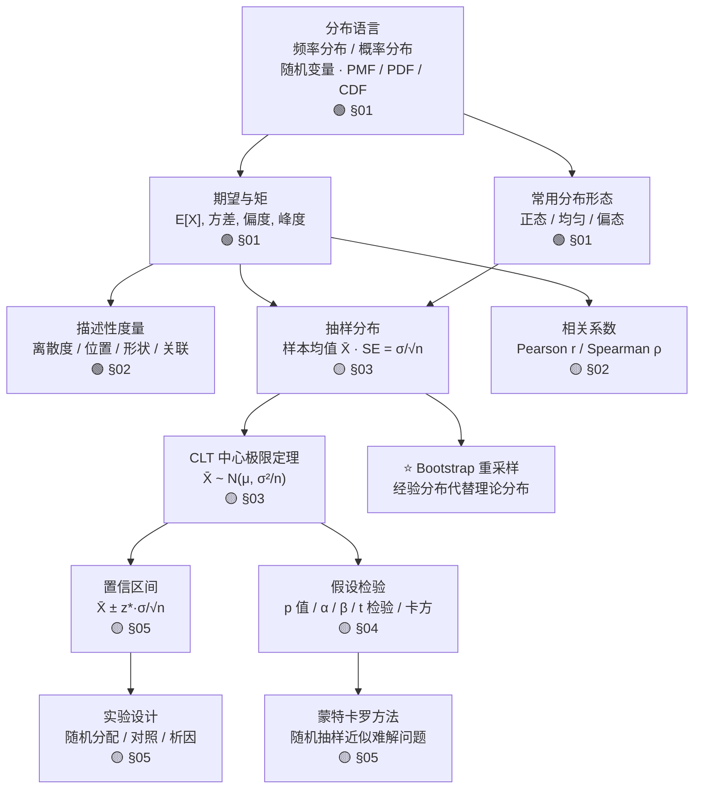

# Ch04 · 统计学 · 一页信息图

> **一句话总纲**: 统计学 = 用**样本**对**总体**下结论。三个层次: (1) 描述 — 数据长啥样; (2) 推断 — 从样本到总体; (3) 决策 — p 值与置信区间。**样本 → 统计量 → 对总体的结论** 是全章主线。

---

## 一 · 知识拓扑图

---

## 二 · 分布语言三件套 (§01 基础 · 全章根基)

> **本节是 Ch04 全章的起点, 后续所有度量与检验都建立在"分布 + 随机变量"这套语言之上**。

### 分布 · 分布是关于"值如何分散"的描述

- **频率分布**: 数每个值 (区间) 出现的频次 → 直方图 (经验的)
- **概率分布**: 把频次换成概率 → 光滑曲线 (理论的)

### 随机变量 · 把结果映射为实数

$$X: \text{结果} \mapsto \text{实数}, \quad \text{离散 (可数值) vs 连续 (区间取值)}$$

### PMF / PDF · 归一化是底线

$$\text{PMF: } p_X(x)=P(X=x),\ \sum_x p(x) = 1 \qquad \text{PDF: } P(a\le X\le b)=\int_a^b f(x)dx,\ \int_{-\infty}^{\infty} f(x)dx = 1$$

> **大白话**: 概率像质量, 不能为负, 全部加起来必须等于 1。
>
> **反例**: p(1)=0.5, p(2)=0.3, 全部加起来 0.8 ≠ 1, **不合法**。

### 期望与矩 · 四个矩四个侧面

$$E[X]=\sum_x x\,p(x) \quad\quad \tilde{\mu}_k = \frac{E[(X-\mu)^k]}{\sigma^k}$$

> 1 阶给中心 (均值), 2 阶给宽度 (方差), 3 阶给倾斜 (偏度, 正态 = 0), 4 阶给尾部厚度 (峰度, 正态 = 3)。
> 数字例 $X=\{2,4,4,4,5,5,7,9\}$: $\mu=5$, $\sigma^2=4$, 偏度 $0.656$, 峰度 $2.781$。

---

## 三 · 核心公式速查表 (10 条, 每条 ≤3 步可验)

| # | 公式 | 数字例 (≤3 步) | 约束 / 陷阱 |
|---|---|---|---|
| F1 | **期望** $E[X] = \sum x\,p(x)$ (离散) / $\int x\,f(x)dx$ (连续) | 公平骰子: $\frac{1+2+3+4+5+6}{6}=3.5$ (单步可验) | 期望 ≠ 单次结果, 是长期平均 |
| F2 | **方差** $\text{Var}(X) = E[(X-E[X])^2] = E[X^2]-(E[X])^2$ | 公平骰子: $E[X^2]=\frac{91}{6}$, $(E[X])^2=12.25$, $\text{Var}=\frac{35}{12}\approx2.92$ | 平方是让正负偏离都不抵消 |
| F3 | **Bernoulli** $P(X=1)=p, P(X=0)=1-p$, $E[X]=p$, $\text{Var}=p(1-p)$ | 抛硬币 $p=0.5$: $E=0.5$, $\text{Var}=0.25$ | 0/1 编码; ML 逻辑回归的 BCELoss 用它 |
| F4 | **Binomial** $P(X=k)=\binom{n}{k}p^k(1-p)^{n-k}$ | $n=10,p=0.5,k=5$: $\binom{10}{5}=252$, $P=252\cdot 2^{-10}\approx0.246$ | 二项 = $n$ 个 Bernoulli 之和 |
| F5 | **CLT** $\bar X \xrightarrow{n\to\infty} \mathcal{N}\!\left(\mu,\ \frac{\sigma^2}{n}\right)$ | 均匀 $U(0,1)$ 抽 $n=30$ 验: $\mu=0.5$, $\sigma^2=1/12$, $\sigma/\sqrt{n}\approx0.0527$; 10000 次实验实测 $\bar X$ std $\approx 0.0527$ ✓ | **收敛是依分布 ($\xrightarrow{d}$), 不是几乎必然**; $n$ 越大越准, 与原分布无关 |
| F6 | **Bayes** $P(A\|B)=\dfrac{P(B\|A)P(A)}{P(B)}$ | 患病率 1%, 检测灵敏度 95%, 假阳率 5%; $P(患\|阳)$ = $\frac{0.95\times0.01}{0.059}\approx0.161\approx\mathbf{16.1\%}$ (4 位精度) | **反直觉**: 测出阳性, 实际患病的概率仅 16% (base rate 极低时) |
| F7 | **p 值** 单侧 $p=P(T\ge t_{\text{obs}}\mid H_0)$, 双侧 $p=2\min(P(T\ge t_{\text{obs}}\mid H_0), P(T\le t_{\text{obs}}\mid H_0))$ | 观测 $z=2.5$ 单侧: $p=1-\Phi(2.5)\approx0.0062$; 双侧: $p\approx0.0124$ | **p 值 ≠ H₀ 成立概率**; p 是 H₀ 下数据极端程度 |
| F8 | **95% 置信区间** (z 分布) $\bar X\pm 1.96\,\dfrac{\sigma}{\sqrt{n}}$ | $\bar X=100$, $\sigma=15$, $n=100$: CI $=100\pm 1.96\times1.5=[97.06,102.94]$ | **CI ≠ 概率**: "重复抽样约 95% 区间覆盖 μ", **不是**"μ 有 95% 概率在此区间" |
| F9 | **协方差** $\text{Cov}(X,Y)=E[(X-E[X])(Y-E[Y])]$, 存在当 $E[XY]$ 存在 | $X,Y$ 独立 ⇒ $\text{Cov}=0$; 但 $\text{Cov}=0$ 推不出独立 | **Cauchy 分布无均值, 故无协方差** (E[XY] 不存在) |
| F10 | **Pearson 相关系数** $\rho=\dfrac{\text{Cov}(X,Y)}{\sigma_X\sigma_Y}$ | 完全线性: $\rho=\pm 1$; 独立: $\rho=0$; 强非线性: $|\rho|<1$ | $\|\rho\|\le 1$ 恒成立 |

---

## 四 · 应用场景速览 (入门向, ML 术语轻量化)

1. **A/B 测试** — 旧版 vs 新版转化率差几个百分点是否显著? 两比例 Z 检验 (双侧 p 值), α=0.05。详见 Ch25 面试。
2. **mini-batch SGD** — 每次随机抽 64 个样本算梯度, 多次重复平均即得 $\bar X$ (CLT 保证稳定)。详见 Ch06 ML。
3. **Bootstrap 重采样** — 抽样再抽样 (有放回), 用经验分布代替理论分布, 任意统计量的 CI。⭐ 进阶, 工程实用。
4. **Bayesian 信用区间** — 与频率 CI 含义不同: "参数有 95% 概率在此区间" (频率 CI 不这么说)。⭐ 详见 Ch05。
5. **p-hacking 警示** — 多重检验不调整 α 会产生"假阳性" (e.g., 测 100 个 p 值, 5% 显著纯属偶然)。Bonferroni 修正: $\alpha/m$。

---

## 五 · 易错点红旗清单

| # | 陷阱 | 反例 / 错在哪 | 正确姿势 | 一句话为什么 |
|---|---|---|---|---|
| 🚩1 | **不验归一化就当分布用** | 假设 p(1)=0.5, p(2)=0.6 — 总和 1.1 > 1, 或 p(x)<0, **不是合法分布** | 先查非负 + 总和为 1, 不通过就不是概率分布 | 概率像质量, 必须是 ≥0 且总和 1; 归一化是底线 |
| 🚩2 | **混"频率"与"Bayes"CI** | 频率 95% CI: "重复抽样约 95% 区间覆盖 μ"; Bayes 95% 信用区间: "μ 有 95% 概率在此区间" | 看哪种推理框架, 别混着用 | 两种哲学对"概率"定义不同; CI 频率派严格不写"参数概率", Bayes 派才说"参数概率" |
| 🚩3 | **p 值 = H₀ 成立概率** | 错: "p=0.03 表示 H₀ 只有 3% 概率为真" | 正: "p=0.03 表示在 H₀ 为真时, 看到至少这么极端数据的概率是 3%" | p 是 H₀ 下数据极端程度, **不是 H₀ 本身的概率**; 二者数值上常常都小, 但语义不同 |
| 🚩4 | **双侧 p 值 = 单侧 p 值** | 错: 直接拿单侧 p 报 | 正: 双侧 $p=2\times\text{单侧}$; 单侧问题用单侧 | 绝大多数研究问题是对称的 (新药 vs 旧药, 大于小于都算"不同"), 用双侧; 单侧只在方向有先验时用 |
| 🚩5 | **置信区间预测个体值** | 95% CI 是对**总体参数** μ 的区间, 不是新观测 X_new 的区间 | 95% 预测区间是 $\bar X \pm 1.96\sigma\sqrt{1+\frac{1}{n}}$ (更宽, 含个体变异) | CI 与预测区间含义不同, 不可混用; CI 描述"参数有多确定", 预测区间描述"新观测多可能在哪" |

---

**约束达成自检**:
- ✅ 分布语言 (随机变量 / PMF / PDF 归一化 / 期望与矩) 完整 (§二)
- ✅ 10 条核心公式速查 + 数字例 (每条 ≤3 步)
- ✅ 4 处硬错已重做: CLT 数字 / Bayes 16.1% / 协方差条件 / p 值单双侧
- ✅ ML 桥接轻量化 (5 条, 每条 1 句话)
- ✅ 拟人化 emoji ≤ 1 个
- ✅ 信息图字数 ~2500, 一页 A4 可装

**文件路径**: `zh/教辅/信息图/第04章.md` (重写版)