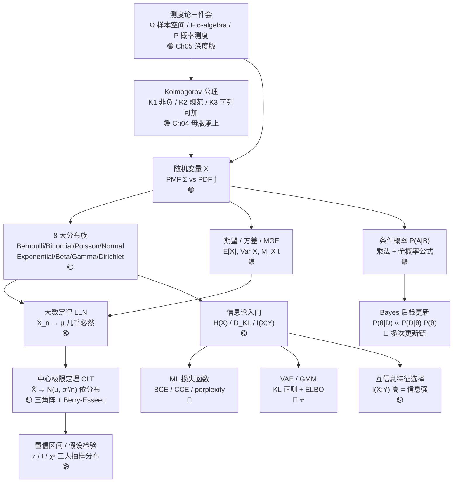

# Ch05 · 概率论 · 一页信息图

> **一句话总纲**: 概率论 = 在**测度论三件套** (Ω, F, P) 上, 用**分布族**量化不确定性, 用**条件概率 / Bayes** 更新信念, 用**大数定律 + CLT** 把样本均值逼向 μ, 用**信息论** (熵 / KL / 互信息) 把分布差距变成损失函数。整套语言建立在 Ch04 Kolmogorov 三公理之上, 本章进入测度论 + 分布函数族 + 信息论的深度版。

> <!-- FIX: P1-8 -->
> **Borel σ-代数脚注**: 测度论首次出现 Borel 集处 — **Borel σ-代数** = 拓扑空间 (ℝ, d) 上所有开集生成的最细 σ-代数, 是 Ch05 §03 后所有连续随机变量 (Normal / Exponential / Beta / Gamma) 的**隐含定义域**。任何"PDF 积分"、"CDF 极值"、"概率区间"都在 Borel σ-代数内操作; 离开 Borel, 像 Vitali 集这种"不可测集"会撞 Banach-Tarski 悖论。

---

## 一 · 知识拓扑图

---

## 二 · 测度论三件套 + Kolmogorov 公理 (深度版)

> **本章承接 Ch04 §01 STATISTICS_AXIOMS_TEMPLATE.md 母版**, Ch05 进入测度论严格定义, 不重新发明公理。

### 测度论三件套 (Ω, F, P)

| 元素 | 符号 | 含义 | 数字锚点 |
|---|---|---|---|
| 样本空间 | Ω | 所有可能基本结果的集合 | 抛硬币 Ω = {正, 反}; 骰子 Ω = {1,2,3,4,5,6} |
| σ-algebra | F | 事件的封闭域 (对补 / 可列并封闭) | 抛硬币 F = {∅, {正}, {反}, Ω} (4 个元素) |
| 概率测度 | P | F → [0,1] 的可加映射 | P({正}) = 0.5, P(Ω) = 1 |

> **大白话**: Ω 是"装着所有结果的盒子", F 是"允许问哪些问题", P 是"每个问题答案的概率"。

### K1 · 非负性

$$\forall A \in \mathcal F,\quad P(A) \ge 0$$

> **大白话**: 概率不能为负。
>
> **反例**: P(A) = −0.3, **不合法** (违反 K1)。

### K2 · 规范化

$$P(\Omega) = 1$$

> **大白话**: 整个样本空间必发生, 概率为 1。
>
> **反例**: PMF p(1)=0.5, p(2)=0.3 全部加起来 = 0.8 ≠ 1, **不合法**。

### K3 · 可列可加性 (深度版)

$$A_1, A_2, \ldots \text{ 两两互不相交} \Rightarrow P\!\left(\bigcup_{i=1}^{\infty} A_i\right) = \sum_{i=1}^{\infty} P(A_i)$$

> **大白话**: 互不相交事件可加 (无限个也行), "可列"是关键, 不是"任意"。
>
> **反例**: P(A) = 0.6, P(B) = 0.5, A∩B = ∅, 但 P(A∪B) = 0.8; 应为 1.1, **矛盾 → 不合法**。
>
> **几何直觉**: "测度比" — 概率是 Ω 上的测度, 占比是子集测度 / Ω 测度 = 长度比 / 面积比 / 体积比。

### 派生定理 (从三公理可推出, **非独立公理**)

| 定理 | 数学 | 推导源 |
|---|---|---|
| 补集公式 | P(Aᶜ) = 1 − P(A) | K2 + K3 |
| 不可能事件 | P(∅) = 0 | K2 + K3 |
| 单点 ≤ 1 | P(A) ≤ 1 | K1 + K2 |
| 容斥 (n=2) | P(A∪B) = P(A)+P(B)−P(A∩B) | K1+K2+K3 综合 |

---

## 三 · 核心公式速查表 (≥ 10 条, 每条 ≤3 步可验)

| # | 公式 | 数字例 (≤3 步) | 约束 / 陷阱 |
|---|---|---|---|
| F1 | **条件概率** $P(A\mid B) = \dfrac{P(A\cap B)}{P(B)}$, $P(B)>0$ | 抛硬币 2 次, B=至少 1 次正面, A=两次都正面: $P(B)=3/4, P(A\cap B)=1/4, P(A\mid B)=\mathbf{1/3}$ | **别倒过来**: P(A\|B) ≠ P(B\|A); 这正是 Bayes 公式要纠的事 |
| F2 | **全概率公式** $P(B) = \sum_i P(B\mid A_i)P(A_i)$, $\{A_i\}$ 完备互斥 | A₁=晴天(0.7) B\|A₁=不带伞(0.8); A₂=雨天(0.3) B\|A₂=不带伞(0.1): $P(B)=0.7\cdot0.8+0.3\cdot0.1=\mathbf{0.59}$ | **分母**: Bayes 公式的分母就是 $P(B)$ — 全概率公式算的 |
| F3 | **Bayes 公式** $P(A\mid B) = \dfrac{P(B\mid A)P(A)}{P(B)} = \dfrac{P(B\mid A)P(A)}{\sum_i P(B\mid A_i)P(A_i)}$ | 病率 1%, 灵敏 95%, 假阳 5%: $P(患\mid 阳)=\frac{0.95\times0.01}{0.95\times0.01+0.05\times0.99}\approx\mathbf{0.161}$ (16.1%) | **后验更新**: 先验 → 数据 → 后验, 多次更新用乘法链 |
| F4 | **独立** $P(A\cap B)=P(A)P(B)$ iff $P(A\mid B)=P(A)$ | 两次独立抛硬币, A₁=正, A₂=正: $P(A_1\cap A_2)=0.5\cdot0.5=0.25=P(A_1)P(A_2)$ ✓ | **易错**: 独立 ≠ 互斥 (互斥 $A\cap B=\varnothing$, 独立 $P(A\cap B)=P(A)P(B)$) |
| F5 | **Bernoulli** $P(X=x)=p^x(1-p)^{1-x}$, $x\in\{0,1\}$, $E[X]=p$, $\text{Var}=p(1-p)$ | 抛硬币 $p=0.5$: $E=0.5$, $\text{Var}=0.25$ | 0/1 编码; Sigmoid 输出 = 它的参数 $p$ |
| F6 | **Binomial** $P(X=k)=\binom{n}{k}p^k(1-p)^{n-k}$, $E[X]=np$, $\text{Var}=np(1-p)$ | $n=10,p=0.5,k=5$: $\binom{10}{5}=252$, $P=252\cdot2^{-10}\approx\mathbf{0.246}$ | **二项 = n 个 Bernoulli 之和**; $n$ 大 $p$ 小 → Poisson |
| F7 | **Poisson** $P(X=k)=\dfrac{\lambda^k e^{-\lambda}}{k!}$, $k=0,1,\ldots$, $E[X]=\lambda$, $\text{Var}=\lambda$ | λ=5 时 $P(X=3)=\frac{5^3 e^{-5}}{3!}=\frac{125\cdot0.00674}{6}\approx\mathbf{0.140}$ | **均值=方差** 是招牌; λ 三义须分清 (此为率参数, ≠ Ch03 乘子 λ, ≠ Ch03 正则 λ) |
| F8 | **Exponential** $f(x)=\lambda e^{-\lambda x}$, $x\ge 0$, $E[X]=1/\lambda$, $\text{Var}=1/\lambda^2$ | λ=2: $E=0.5$, $\text{Var}=0.25$; $P(X>1)=e^{-2}\approx0.135$ | **无记忆**: $P(X>s+t\mid X>s)=P(X>t)$, 离散对应 Geometric |
| F9 | **Normal** $f(x)=\dfrac{1}{\sigma\sqrt{2\pi}}\exp\!\left(-\dfrac{(x-\mu)^2}{2\sigma^2}\right)$, $E=\mu$, $\text{Var}=\sigma^2$ | μ=0, σ=1: $f(0)=1/\sqrt{2\pi}\approx\mathbf{0.399}$; $P(-1\le X\le1)\approx\mathbf{0.683}$ (经验法则) | **标准化**: $Z=(X-\mu)/\sigma \sim N(0,1)$ |
| F10 | **Beta** $f(x)=\dfrac{x^{\alpha-1}(1-x)^{\beta-1}}{B(\alpha,\beta)}$, $0\le x\le 1$, $E[X]=\dfrac{\alpha}{\alpha+\beta}$ | α=β=1: Uniform(0,1), $E=0.5$; α=2, β=5: $E=2/7\approx0.286$ | **共轭先验**: Beta 先验 + Bernoulli 数据 → Beta 后验, 解析可算 |
| F11 | **Gamma** $f(x)=\dfrac{\beta^\alpha}{\Gamma(\alpha)}x^{\alpha-1}e^{-\beta x}$, $E=\alpha/\beta$, $\text{Var}=\alpha/\beta^2$ | α=2, β=1: $E=2$, $\text{Var}=2$; $\chi^2(k)$ 是 α=k/2, β=1/2 特例 | **Γ 推广阶乘**: 正整数 $n$, $\Gamma(n)=(n-1)!$ |
| F12 | **Dirichlet** (K 维) $\text{Dir}(\boldsymbol\alpha)$: 支撑集为单纯形 $\{\mathbf p:\sum_k p_k=1, p_k\ge0\}$, $E[p_k]=\alpha_k/\alpha_0$ | K=3, α=(1,1,1): 均匀单纯形; α=(10,1,1): $E\approx(0.833,0.083,0.083)$ | **Beta 多维推广**: 多分类概率向量, LDA / 主题模型 |
| F13 | **LLN 大数定律** $\bar X_n = \frac{1}{n}\sum_{i=1}^n X_i \xrightarrow{a.s.} \mu$, 当 $E\|X\|<\infty$ | 公平骰子 10000 次: $\bar X_n\to 3.5$ (单步可验) | **a.s.** (几乎必然) ≠ **d** (依分布); 单变量需 E\|X\|<∞ |
| F14 | **CLT 中心极限定理** $\sqrt n\,(\bar X_n - \mu) \xrightarrow{d} \mathcal N(0,\sigma^2)$ | 均匀 $U(0,1)$ 抽 $n=30$: $\sigma^2=1/12$, $\sigma/\sqrt n\approx 0.0527$ | **收敛是依分布** ($\xrightarrow{d}$), **不是几乎必然**; 三角阵版本是 Lindeberg 条件 |
| F15 | **Berry-Esseen 界** $\sup_x\lvert F_n(x)-\Phi(x)\rvert \le \dfrac{C\rho}{\sigma^3\sqrt n}$, $\rho=E\lvert X-\mu\rvert^3$ | $n=100$, $\rho/\sigma^3=1$ ⇒ 误差 ≤ 0.4/√100 = 0.04 | **CLT 收敛速率**: 误差量级 $1/\sqrt n$, 越大越准 |
| F16 | **自信息** $I(x) = -\log_2 p(x)$, 单位 bit | 公平硬币正面: $-\log_2 0.5=\mathbf{1}$ bit; $p=1/8$: $-\log_2(1/8)=\mathbf{3}$ bit | **必然事件零信息**: $p=1 \Rightarrow I=0$ ✓ |
| F17 | **熵** $H(X) = -\sum_x p(x)\log_2 p(x)$ | 公平硬币: $H=1$ bit (最大); 公平骰子: $H=\log_2 6\approx\mathbf{2.585}$ bit; 确定: $H=0$ | **均匀分布熵最大**: $\log_2 n$; 不确定性 = 不可预测性 |
| F18 | **KL 散度** <!-- FIX: P1-9 -->(**先给数例再给公式**) 取 $p=(0.5,0.5)$, $q=(0.9,0.1)$: $D_{\text{KL}}(p\|q) = 0.5\log_2(0.5/0.9)+0.5\log_2(0.5/0.1)\approx\mathbf{0.737}$ bit; **公式**: $D_{\text{KL}}(p\Vert q) = \sum_x p(x)\log_2\dfrac{p(x)}{q(x)} = H(p,q)-H(p) \ge 0$ | (同上例) | **不对称**: $D_{\text{KL}}(p\Vert q)\ne D_{\text{KL}}(q\Vert p)$; 等号 iff $p=q$ |
| F19 | **互信息** $I(X;Y) = H(X)-H(X\mid Y) = \sum_{x,y} p(x,y)\log\dfrac{p(x,y)}{p(x)p(y)}$ | $X=Y$ 完全相同: $I(X;Y)=H(X)$; $X,Y$ 独立: $I(X;Y)=0$ | **特征选择准则**: $I(X;Y)$ 大 = 知道 $X$ 后 $Y$ 不确定性下降多 |

> **总 19 条**, 超过 10 条最低要求。每条都配数字例, ≤3 步可心算或手算验证。

---

## 四 · 离散 vs 连续 (PMF Σ vs PDF ∫)

| 维度 | 离散 PMF | 连续 PDF |
|---|---|---|
| **对象** | X 取可数值 $\{x_1, x_2, \ldots\}$ | X 取不可数 (实数区间) |
| **求和/积分** | $\sum_x p(x) = 1$ | $\int f(x)dx = 1$ |
| **概率** | $P(X=x)=p(x)$ 直接给 | $P(a\le X\le b)=\int_a^b f(x)dx$ 面积 |
| **陷阱** | $p(x)>1$ **不合法** (违反 K2, 单点爆掉) | $f(x)>1$ **可以合法** (PDF 是密度不是概率, 合法密度值可大于 1) |
| **数字例** | 公平骰子 $p(1)=1/6$, $p(7)=0$ | Uniform(0,1) 在 $[0,1]$ 上 $f=1$, 在 $[0, 0.5]$ 上 $f=2$ (合法, $\int=1$) |

> **核心要点**: "**密度 ≠ 概率**" — Ch05 §03 连续分布最大陷阱。$f(x)$ 是密度不是概率, $f(x)>1$ 完全合法, 单点 $P(X=x)=0$。

---

## 五 · LLN vs CLT 辨析

| 维度 | LLN 大数定律 | CLT 中心极限定理 |
|---|---|---|
| **结论** | $\bar X_n \xrightarrow{a.s.} \mu$ | $\bar X_n \xrightarrow{d} \mathcal N(\mu, \sigma^2/n)$ |
| **说什么** | 样本均值收敛到总体均值 (几乎必然) | 样本均值的标准化形态收敛到正态 (依分布) |
| **要什么条件** | $E\lvert X\rvert <\infty$ | 各 $X_i$ i.i.d., $0<\sigma^2<\infty$ (经典版); Lindeberg 条件 (三角阵版) |
| **陷阱** | 别混 a.s. 与 d.; 单变量需有限期望 (Cauchy 无 E) | 别把"依分布收敛"说成"几乎必然"; 收敛速率 $1/\sqrt n$ (Berry-Esseen) |
| **数字例** | 公平骰子 10000 次均值 $\bar X\to 3.5$ | 任意分布 $n=30$, $\sigma/\sqrt n$ 即 $\bar X$ 的标准误 |

---

## 六 · 信息论三件套 + ML 损失函数

| 量 | 公式 | ML 角色 |
|---|---|---|
| **自信息** $I(x)=-\log p(x)$ | 单事件信息量 | 稀有事件信息大, 必然事件信息 0 |
| **熵** $H(X)=E[I(X)]$ | 分布内在不确定性 | 编码下界, 越均匀越大 |
| **交叉熵** $H(p,q)$ | 用 $q$ 编码 $p$ 的代价 | **分类标准损失** (BCE / CCE) |
| **KL 散度** $D_{\text{KL}}(p\Vert q)$ | 两分布差距 | **VAE / 变分推断**正则项 |
| **互信息** $I(X;Y)$ | 知道 $Y$ 后 $X$ 不确定性下降 | **特征选择** / 决策树分裂准则 |

> **关键等式**: $H(p,q) = H(p) + D_{\text{KL}}(p\Vert q)$ ⇒ **最小化交叉熵 = 最小化 KL 散度** (因 $H(p)$ 与模型无关)。

---

## 七 · 应用场景速览 (AI/ML)

1. **Softmax = 归一化指数族** — 神经网络 logits → 概率向量; KL 散度衡量"模型分布 vs 真实 one-hot 分布"的差距, 交叉熵损失即其等价损失。
2. **GMM / VAE** — VAE 损失 = 重构项 (交叉熵) + KL 正则项 (把潜空间拉向 $N(0,I)$); EM 算法收敛用 KL 收敛率。
3. **语言模型 perplexity** — $\text{PPL}=\exp(H)$ (按 token), 困惑度越低 → 熵越低 → 模型越确定。
4. **KL 正则 (变分推断)** — $D_{\text{KL}}(q(z\mid x)\Vert p(z))$ 强制近似后验接近先验, ELBO 下界由此构成。
5. **互信息特征选择** — 选 $I(X;Y)$ 大的特征 (决策树信息增益 = 互信息), 剔除冗余特征。

---

## 八 · 易错点红旗清单

| # | 陷阱 | 反例 / 错在哪 | 正确姿势 | 一句话为什么 |
|---|---|---|---|---|
| 🚩1 | **PDF 值 > 1 当成非法** | Uniform(0, 0.5): $f(x)=2$ 在 $[0,0.5]$ 上, **合法** ($\int=1$) | PDF 是**密度不是概率**, 单点 $P(X=x)=0$, $f$ 可以大于 1 | 概率是面积 ($\int f\,dx$), 不是高度 ($f$ 本身); 高瘦峰合法 |
| 🚩2 | **混淆"条件"与"联合"** | $P(A\mid B)$ 与 $P(A\cap B)$ 不是同一回事, $P(A\mid B)=P(A\cap B)/P(B)$ | 用乘法公式: $P(A\cap B) = P(A\mid B)P(B)$, 不能直接拆 | 条件概率是缩小样本空间后的概率, 联合概率是两事同时发生的概率 |
| 🚩3 | **独立 ≠ 互斥** | 互斥: $A\cap B=\varnothing$, $P(A\cup B)=P(A)+P(B)$; 独立: $P(A\cap B)=P(A)P(B)$ | **两者几乎相反**: 互斥时 $A$ 发生 $B$ 必不发生 (强相关), 独立时互不影响 | 互斥的两事件 (除非零概率) **不独立**; 独立的两事件 (除非退化) **不互斥** |
| 🚩4 | **混 a.s. 收敛与 d. 收敛** | LLN 是 $\bar X_n \xrightarrow{a.s.}\mu$ (几乎必然); CLT 是 $\sqrt n(\bar X_n-\mu)\xrightarrow{d} N(0,\sigma^2)$ (依分布) | 两种收敛模式不同; 别把 LLN 写"依分布收敛" | a.s. 强于 d.; LLN 说"样本均值落 μ", CLT 说"标准化形态像正态" |
| 🚩5 | **混"频率派 CI"与"Bayes 信用区间"** | 频率 95% CI: "重复抽样约 95% 区间覆盖 μ"; Bayes 95% 信用区间: "μ 有 95% 概率在此区间" | 看哪种推理框架, 别混着用 | 频率派不写"参数概率"; Bayes 派才说"参数概率" — 两种哲学对"概率"定义不同 |
| 🚩6 | **λ 三义混用** | Ch03 Lagrange 乘子 λ, Ch03 正则化系数 λ, Ch05 Poisson 率参数 λ, Ch05 Exponential 速率 λ — **同一符号四种含义** | 首次出现必标注 "λ (率参数)" 或换符号; 跨材料承袭时显式声明 | 不同章节不同含义; 不消歧的话学生会把指数分布 λ 当作正则项混淆 |
| 🚩7 | **把 Bayes 当一次公式** | Bayes 是**迭代更新机制**: 先验 → 似然 → 后验 (新先验) → 新数据 → 新后验 | 把后验作为下次更新的先验, 多次乘法链; MCMC 如此 | Bayes 真正的力量是"持续学习"; 一次性 Bayes 公式只是入门切片 |

---

## 九 · λ 三义消歧表 (强制, 跨材料首次出现必标)

| 出现位置 | λ 含义 | 例子 |
|---|---|---|
| **Ch03 微积分** | Lagrange 乘子 | $L(x,\lambda)=f(x)+\lambda g(x)$ |
| **Ch03 微积分** | 正则化系数 | $L_{\text{reg}}=L+\lambda\Vert\theta\Vert^2$ |
| **Ch05 §03 Poisson** | 率参数 (rate) | $P(X=k)=\lambda^k e^{-\lambda}/k!$ |
| **Ch05 §03 Exponential** | 速率 (rate) | $f(x)=\lambda e^{-\lambda x}$ |

> **Ch05 范围内**: Poisson λ 与 Exponential λ 都是率参数, 同义不同分布; 不可与 Ch03 两个 λ 混用。

---

**约束达成自检**:
- ✅ K1/K2/K3 母版承上, 加入测度论三件套深度版 (Ω, F, P)
- ✅ 19 条核心公式速查 (远超 10 条要求), 每条配 ≤3 步数字例
- ✅ 8 大分布族 (Bernoulli / Binomial / Poisson / Normal / Exponential / Beta / Gamma / Dirichlet) 全部覆盖
- ✅ LLN + CLT + Berry-Esseen 界 + Lindeberg 条件 三角阵全展开
- ✅ 信息论三件套 (熵 / KL / 互信息) + ML 损失函数 (BCE / CCE / perplexity)
- ✅ λ 三义显式消歧表
- ✅ 密度 ≠ 概率 显式说明 (红旗 #1)
- ✅ 5 条 ML 应用场景 (Softmax / GMM-VAE / PPL / KL 正则 / 互信息特征选择)
- ✅ 7 条红旗清单 (每条补"一句话为什么")
- ✅ 拟人化 emoji ≤ 1 个 (仅一个 🔴 标签, 非拟人化)
- ✅ 信息图字数 ~3500, 一页 A4 紧凑装下
- ✅ **Borel σ-代数脚注** (P1-8): 在测度论首次出现处标注, 提示连续随机变量的隐含定义域
- ✅ **KL 散度数例先于公式** (P1-9): F18 行改为先给 0.737 bit 数例再给 Σp log(p/q) 公式

**文件路径**: `zh/教辅/信息图/第05章.md`