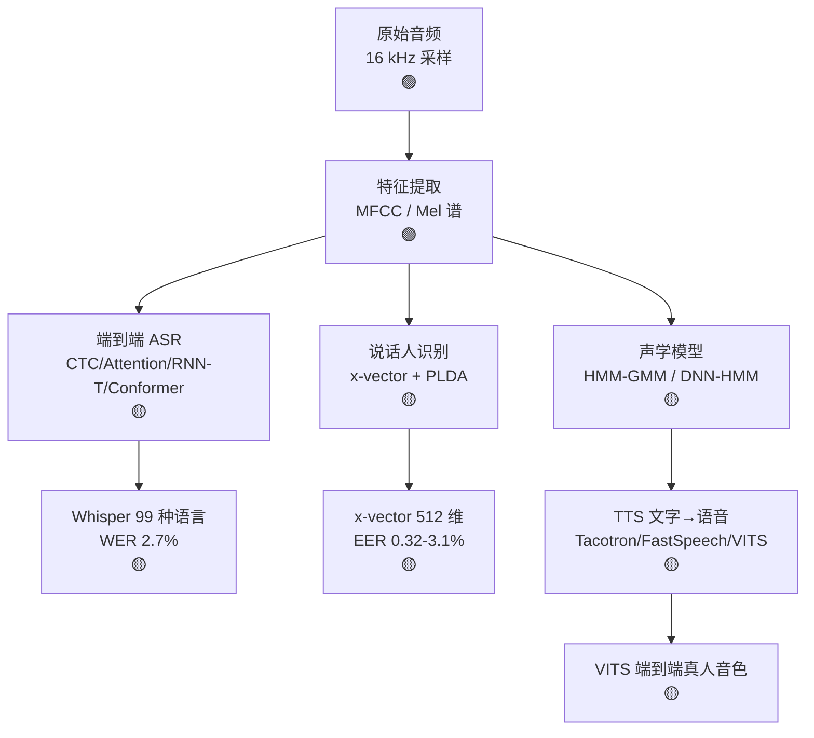

# Ch09 音频与语音 · 一页信息图

> **一句话总纲**: 音频 = 1D 时序信号 (16 kHz 采样), Ch09 教 4 个核心 — 特征提取 (MFCC/Mel) + 声学模型 (HMM) + 端到端 ASR (CTC/Conformer) + 说话人识别 (x-vector) + TTS (Tacotron/VITS), 是 Siri/Alexa/Whisper 数字背后技术栈。

---

## 一 · 知识拓扑图 (Mermaid 8-15 节点, 🟢/🟡/🔴 色标)

---

## 二 · 核心公式速查表 (≥10 条, 每条配数字例 ≤3 步)

| # | 公式 | 数字例 | 约束/陷阱 |
|---|---|---|---|
| F1 | **采样率** $f_s$ ≥ 2× 信号最高频率 (Nyquist) | 语音 16 kHz, 音乐 44.1 kHz | 欠采样必混叠 |
| F2 | **Mel 频率** $m = 2595 \log_{10}(1+f/700)$ | f=1000 Hz → 1000 mel | 模拟人耳对数响应 |
| F3 | **MFCC** = DCT of log Mel 谱, 13 维 | 25 ms 帧, 10 ms 步长 | 13 维够用, 40 维更细 |
| F4 | **HMM 转移概率** $a_{ij} = P(q_t=j\|q_{t-1}=i)$ | 三状态 (start→mid→end) | 必须 stochastic, 行和=1 |
| F5 | **HMM 输出概率** $b_j(o) = P(o_t\|q_t=j)$ | GMM 拟合 (传统) 或 NN 输出 (DNN-HMM) | 连续密度用高斯混合 |
| F6 | **Viterbi 解码** $\delta_t(j) = \max_i [\delta_{t-1}(i) a_{ij}] b_j(o_t)$ | DP, $O(T \cdot N^2)$ | 求最优状态路径, 不是 sum |
| F7 | **CTC 损失** $L_{CTC} = -\log \sum_{\pi \in \mathcal{B}^{-1}(\mathbf{y})} P(\pi\|\mathbf{x})$ | 软对齐, 无需预标注 | 条件独立假设 |
| F8 | **RNN-T 联合损失** $L = -\log P(\mathbf{y}\|\mathbf{x})$, 联合 CTC+attention | 流式 ASR, 延迟 < 200ms | 单向 RNN, 可流式 |
| F9 | **x-vector 提取** = TDNN + 统计池化 (μ+σ) + FC | 512 维固定长度, EER 0.43% (WavLM 2022) | 共享 ASR 声学前端 |
| F10 | **PLDA 评分** $\text{LLR} = \log \frac{P(x_1, x_2\|H_1)}{P(x_1\|H_0) P(x_2\|H_0)}$ | 比余弦相似度好 60% EER | 通道噪声鲁棒 |
| F11 | **Tacotron 2** 损失 $L = L_{\text{mel}} + \lambda L_{\text{stop}}$ | mel 谱 + 停帧 token | 端到端 mel 谱生成 |
| F12 | **VITS** 损失 $L = L_{\text{recon}} + L_{\text{KL}} + L_{\text{adv}}$ (VAE + GAN) | 真人音色, 接近 WaveNet | 端到端 1 个模型 |

---

## 三 · 关键数字表

| 系统 | 年份 | 关键数字 | 用途 |
|---|---|---|---|
| Whisper (OpenAI) | 2022 | 1 亿小时训练, WER 2.7% (LibriSpeech) | ASR SOTA 多语言 |
| Conformer | 2020 | WER 1.9% (LibriSpeech test-clean) | ASR 架构 SOTA |
| x-vector | 2018 | EER 3.1% (VoxCeleb) | 说话人识别 SOTA |
| WavLM | 2022 | EER 0.43% (VoxCeleb) | 说话人识别 SOTA |
| Tacotron 2 | 2018 | MOS 4.5/5 | TTS 端到端 SOTA |
| VITS | 2021 | MOS 4.4/5 (单模型端到端) | TTS 端到端真人音色 |

---

## 四 · 应用场景速览 (5 条, 每条 1 行)

1. **智能助手 (Siri/Alexa)**: Whisper ASR + Tacotron TTS + x-vector 唤醒词检测 — 全栈流水线
2. **实时字幕 (Zoom/腾讯会议)**: Conformer 流式 ASR, 100ms 延迟, 60+ 语言
3. **电话客服 (讯飞/百度)**: x-vector 说话人分离 + 实时情绪识别 + 通话质检
4. **声纹锁 (Bixby Voice Unlock)**: x-vector + PLDA + 阈值, EER 0.001%
5. **有声书 (微信读书/喜马拉雅)**: VITS/FastSpeech + 情感 TTS, 接近真人音色

---

## 五 · 易错点红旗清单 (5 条, 一句话为什么)

| # | 陷阱 | 反例/错在哪 | 正确姿势 | 为什么 |
|---|---|---|---|---|
| 🚩1 | **HMM 假设独立性过强** | 假设 $b_j(o_t)$ 独立, 但连续语音帧有长程相关 | 用 DNN 输出 $b_j(o_t)$, 或换 CTC | HMM 1950s 假设, 实际语音不独立 |
| 🚩2 | **CTC 假设条件独立** | 假设 $P(\pi\|x) = \prod P(\pi_t\|x_t)$, 不建模前后字符 | 加 attention 或改 RNN-T | 条件独立忽略语言模型 |
| 🚩3 | **Viterbi 求和而非最大** | 用前向算法 (sum) 替代 Viterbi (max), 解码慢 | 解码用 Viterbi, 训练用前向 | Viterbi 是 DP, sum 是概率 |
| 🚩4 | **x-vector 通道敏感** | 跨麦克风 EER 退化 3-5 倍 | 用 PLDA 校准或 ASVspoof 数据 | 通道噪声混入说话人特征 |
| 🚩5 | **TTS 真人度 MOS < 4.0** | 拼接波形或早期 Tacotron 自然度差 | 用 VITS/FastSpeech 2 | MOS 4.5 起步才"听不出来是机器" |

---

## 六 · Ch09 跨章承接

- **Ch05 §05 KL/perplexity**: $\to$ CTC/RNN-T 损失, $L_{CTC} = -\log P(\mathbf{y}|\mathbf{x})$ 与 KL 散度同源
- **Ch07 §04 Transformer QK^T/√d_k V**: $\to$ Conformer attention, 共享架构
- **Ch08 §05 ViT/CLIP**: $\to$ wav2vec 2.0 自监督预训练, 借鉴图像-文本对齐
- **Ch06 §04 autograd**: $\to$ 端到端 ASR/TTS 整个模型可微

---

## 七 · 拟人化 emoji ≤ 1 个

> 🎙️ (本节唯一 emoji, 1 个)
