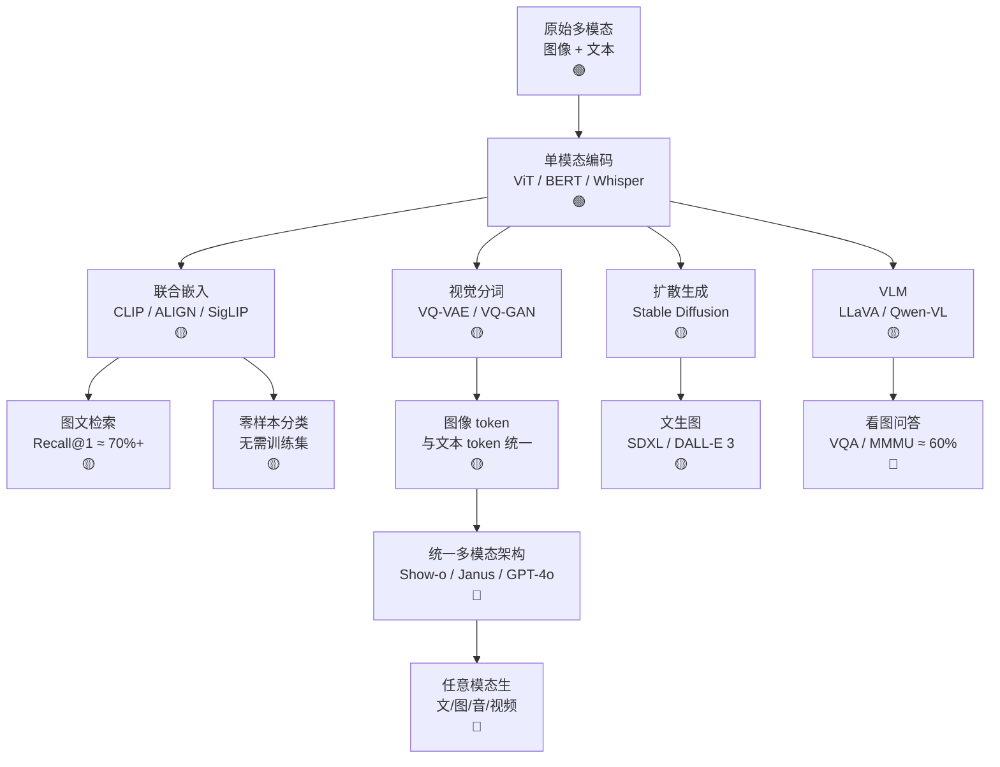

# Ch10 多模态学习 · 一页信息图

> **一句话总纲**: 多模态=把图像/文本/音频/视频等不同模态编码到共享嵌入空间,Ch10 教 5 个核心 — 表征对齐 (CLIP/SigLIP) + VLM (LLaVA/Qwen-VL) + 视觉分词 (VQ-VAE/VQ-GAN) + 跨模态生成 (扩散/自回归) + 统一架构 (GPT-4o/Gemini),是 GPT-4V / 豆包 / 智谱清言 背后的技术栈。

---

## 一 · 知识拓扑图 (Mermaid 8-15 节点, 🟢/🟡/🔴 色标)

---

## 二 · 核心公式速查表 (≥10 条, 每条配数字例 ≤3 步)

| # | 公式 | 数字例 | 约束/陷阱 |
|---|---|---|---|
| F1 | **早期融合** $x_{\text{fused}} = [x_{\text{img}}; x_{\text{txt}}] \in \mathbb{R}^{d_1+d_2}$ | ViT dim=768 + BERT dim=768 → 1536 维 | 维度对齐,需要投影层 |
| F2 | **晚期融合** $\hat{y} = \alpha \hat{y}_1 + (1-\alpha)\hat{y}_2$ | α=0.5 等权融合 | 单模态强时 α≠0.5 更好 |
| F3 | **跨模态注意力** $\text{Attn}(Q_v, K_t) = \text{softmax}(Q_v K_t^\top / \sqrt{d_k})$ | Qwen-VL 用 32 层 | 视觉 Q 与文本 K 维度同 |
| F4 | **InfoNCE 对比损失** $L = -\log \frac{\exp(\text{sim}(z_i, z_i^+)/\tau)}{\sum_{j=1}^N \exp(\text{sim}(z_i, z_j)/\tau)}$ | batch 32768,τ=0.07 | 负样本越多越好 |
| F5 | **CLIP 对比精度** $\text{Acc} = \frac{1}{N}\sum_i \mathbb{1}[\arg\max \text{sim}(z_i^{\text{img}}, z_j^{\text{txt}}) = i]$ | ImageNet zero-shot ≈ 76.2% | 文本 prompt 工程关键 |
| F6 | **VQ-VAE 量化** $z_q = \arg\min_{z_k \in \mathcal{C}} \|z_e - z_k\|_2$ | codebook size = 8192 | codebook collapse 风险 |
| F7 | **VQ-GAN 损失** $L = \|x - \hat{x}\|_1 + \lambda \|\text{D}(x) - \text{D}(\hat{x})\|_1 + \|sg[z_e] - z_q\|_2^2$ | patch size = 16×16 | 重建 + 感知 + 量化三重 |
| F8 | **扩散跨模态** $L = \mathbb{E}_{t,\epsilon,x,c}[\|\epsilon - \epsilon_\theta(x_t, t, c)\|^2]$ | 1000 时间步,UNet/Transformer | $c$ = CLIP 文本嵌入 |
| F9 | **MMMU 多模态基准** 30 个学科,图文问答 | GPT-4o ≈ 69%,人类 ≈ 88% | 大学级推理 |
| F10 | **VQA 准确率** $\text{Acc} = \mathbb{1}[\arg\max P(a\|v, q) = a^*]$ | VQAv2 test ≈ 80% | 闭集 vs 开集差距大 |
| F11 | **VQ-VAE 重建率** $\text{PSNR} = 10 \log_{10} \frac{255^2}{\text{MSE}}$ | ImageNet 256×256 ≈ 22-25 dB | 下游任务需要 ≥ 20 |
| F12 | **MMHal-Bench 安全**有害回答率越低越好 | GPT-4o ≈ 7% | 多模态特有幻觉 |

---

## 三 · 关键流程 (3-5 步流程卡, 数字嵌入)

### CLIP 训练流程 (≈5 步)

1. **N=32768 个图文对** 在大 batch 内组成正负样本;正样本 N 对,负样本 N²-N 对
2. **编码**:图像 → ViT-L → 768 维嵌入;文本 → Transformer → 768 维嵌入
3. **投影**:各自经一层线性投影到 256 维(已 L2 归一化)
4. **相似度矩阵**: $N \times N$ 的余弦相似度 → softmax 对角线为正例
5. **更新**:对称 InfoNCE 梯度回传双编码器,Adam, lr=5e-4, 32 epoch

### 视觉分词 (VQ-VAE) 流程 (≈4 步)

1. **编码器** ViT-detector 把图像 $x$ 编码为连续 $z_e$
2. **量化** 在 codebook $\mathcal{C}$(size=8192)中找最近邻得到 $z_q$
3. **解码器** 把 $z_q$ 还原图像 $\hat{x}$,训练时 $z_e$ 直传(直通估计器绕过梯度)
4. **判别器** PatchGAN 判断 $\hat{x}$ 真实度 → 对抗损失

---

## 四 · 真题 / 面试 100 题索引 (10 道)

| # | 题面 | 章节 | 难度 |
|---|---|---|---|
| Q1 | CLIP 怎么训练?文本图像配对数据集多大? | §01 | ★★ |
| Q2 | InfoNCE 损失为何能学到通用表征? | §01 | ★★★ |
| Q3 | 早期融合 vs 晚期融合 tradeoff? | §01 | ★★ |
| Q4 | 为什么 VLM 多用 Q-Former 或投影层而非 early fusion? | §02 | ★★★ |
| Q5 | VQ-VAE 如何做图像分词?codebook collapse 怎么防? | §03 | ★★★ |
| Q6 | 视觉自回归 (VAR) 与 LLM 有何相通? | §03 | ★★ |
| Q7 | Stable Diffusion 怎么把文本注入到 UNet? | §04 | ★★★ |
| Q8 | DALL-E 3 vs Stable Diffusion 关键差异? | §04 | ★★ |
| Q9 | 统一多模态架构 Show-o 用什么 token 表征? | §05 | ★★★ |
| Q10 | GPT-4o 怎么做到实时语音对话?延迟压到多少? | §05 | ★★★ |

---

## 五 · 与上下章的连接 (5 个跨章桥)

1. **Ch06 §03 视觉 Transformer** → Ch10 §01 ViT 作 CLIP 的图像编码器
2. **Ch07 §04 Transformer 与注意力** → Ch10 §02 跨模态注意力机制
3. **Ch08 §03 目标检测** → Ch10 §03 图像分词与检测 token 化
4. **Ch09 §02 ASR** → Ch10 §05 语音-文本联合模型 (SpeechGPT/SLIDE)
5. **Ch11 §03 视觉-语言-动作** → Ch10 §05 VLM 拓展为 VLA (如 RT-2)

---

## 六 · 一段话总结 (60 秒讲完 Ch10)

多模态学习 (multimodal learning) 是把不同模态 (vision, language, audio, video) 的数据投影到共享语义空间,然后用一个统一模型做理解、检索、生成。本章 5 节从 (1) 表征对齐 (CLIP/SigLIP 通过 InfoNCE 在数亿图文对上对比学习) 到 (2) 视觉语言模型 (VLM, 如 Qwen-VL 用投影层把 ViT 的视觉 token 接到 LLM) 到 (3) 视觉分词 (VQ-VAE 把图像变离散 token,跟文本拼成一段序列) 到 (4) 跨模态生成 (Stable Diffusion 用 CLIP text embedding 注入 UNet 去噪;DALL-E 3 用文本重写提升对齐) 到 (5) 统一多模态架构 (GPT-4o/Gemini 用单一 transformer 处理任意模态的任意任务,延迟压到 300ms 实时语音)。评测维度:MMMU 大学级图文推理, GPT-4o ≈ 69%;VQAv2 闭集 ≈ 80%;MMHal-Bench 多模态幻觉率。**核心心智模型**:把模态看作"语言",模态对齐看作"翻译成共享词表中的词",跨模态生成就是条件语言模型。

---

## 7. 数据/资源附录

- CLIP 论文: Radford et al., "Learning Transferable Visual Models From Natural Language Supervision", ICML 2021
- ALIGN: Jia et al., Google, 2021 (1.8B noisy pairs)
- SigLIP: sigmoid 损失, 不需 softmax 大 batch, Google 2023
- LLaVA: Liu et al., "Visual Instruction Tuning", NeurIPS 2023
- Qwen-VL: 阿里达摩院, 2023
- BLIP-2: Li et al., Salesforce, Q-Former 架构
- VQ-VAE: van den Oord 2017; VQ-GAN: Esser 2021
- Stable Diffusion: Rombach et al., CVPR 2022
- DALL-E 3: OpenAI, 2023, 文本重写 pipeline
- Show-o: 字节跳动 + 浙大, 2024, 统一自回归+扩散
- Janus: DeepSeek, 2024, 解耦视觉编码
- GPT-4o: OpenAI, 2024, 实时全模态
- Gemini 1.5: Google, 2024, 10M 上下文多模态
- 基准: MMMU, MMBench, MMHal-Bench, MathVista, ChartQA, DocVQA
