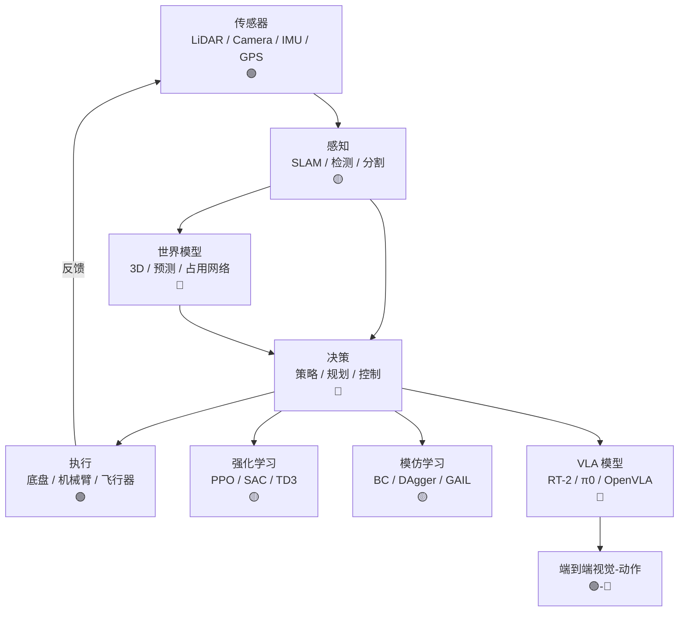

# Ch11 自主系统 · 一页信息图

> **一句话总纲**: 自主系统 = 感知 (Perception) + 决策 (Policy) + 执行 (Action) 三件套闭环,Ch11 教 5 节 — 感知 (LiDAR/Camera/SLAM)、机器人学习 (RL/IL/模仿)、VLA (RT-2/pi0)、自动驾驶 (Tesla/Waymo)、空间机器人。

---

## 一 · 知识拓扑图 (Mermaid 8-15 节点)

---

## 二 · 核心公式速查表

| # | 公式 | 数字例 | 约束 |
|---|---|---|---|
| F1 | **LiDAR 测距** $d = \frac{c \cdot t}{2}$ | 905 nm 激光 $c=3\times10^8$ m/s, t=100ns → d=15m | 时间分辨率 1 ns |
| F2 | **Stereo 视差** $Z = \frac{f \cdot B}{d}$ | f=1000 像素, B=0.5m, d=10 像素 → Z=50m | 像素级匹配 |
| F3 | **IMU 预积分** $\Delta R_{ij} = R_i^\top R_j$ | 4 阶 Runge-Kutta 积分 | 100 Hz 输出 |
| F4 | **卡尔曼滤波** $K = P^- H^\top (H P^- H^\top + R)^{-1}$ | 位置 0.1m, 速度 0.05 m/s | 高斯噪声假设 |
| F5 | **ORB-SLAM 关键帧** $\text{score} = \sum_i \|\nabla I_i\| / N$ | 视差 > 阈值 | 自适应选取 |
| F6 | **PID 控制** $u(t) = K_p e + K_i \int e + K_d \dot e$ | 速度环 P=1, I=0.1, D=0.05 | 离散化 |
| F7 | **MPC 预测** $\min_{\mathbf{u}} \sum \|x_{t+k} - x^*\|^2_R + \|u_{t+k}\|^2_Q$ | 10 步预测, 50ms | 凸优化 |
| F8 | **RL 策略梯度** $\nabla J = \mathbb{E}[\nabla \log \pi(a\|s) R(\tau)]$ | PPO clip=0.2 | on-policy |
| F9 | **Diffusion Policy** $a_t = \pi_\theta(x_t)$ | 16 步动作去噪 | 行为克隆 |
| F10 | **BEV (鸟瞰)** $B_{xy} = \sum_{z} I(\phi(u,v) \to (x,y))$ | 200m × 200m 网格 | 占用 / 高度 |
| F11 | **Transformer 占用** $\hat o = f_\theta(P)$ | 0.5m 体素 | 预测 3s |
| F12 | **VLA token** $z_{vlm} = E_V(\text{img}) \oplus E_L(\text{cmd})$ | π0 用 3B 参数 | LLM + 视觉 |
| F13 | **轨迹预测** $P(\text{traj}\|s) = \mathcal{N}(\mu, \Sigma^2)$ | 8s horizon | 多模态 |
| F14 | **NeRF 渲染** $C = \int T(t) \sigma c \, dt$ | 1 分钟训 + 30+ fps 实时 | 3D Gaussian |

---

## 三 · 关键流程

### 自动驾驶 pipeline (端到端 5 步)
1. **传感器融合**：Camera + LiDAR + Radar 时间同步 (误差 < 50 ms)
2. **感知模块**：BEV 占据网格 + 3D 检测 + 跟踪
3. **预测模块**：其他车 3s 轨迹 + 行人意图
4. **规划模块**：MPC + 模仿学习 + 安全约束
5. **控制输出**：横纵向控制，10ms 周期

### Diffusion Policy 训练 (5 步)
1. **数据采集**：人类专家操控 100 小时/任务
2. **轨迹表示**：$T = (s_0, a_0, s_1, a_1, ..., s_H, a_H)$
3. **加噪扩散**：$\tau^k = \sqrt{\bar\alpha_k} \tau^0 + \sqrt{1-\bar\alpha_k} \epsilon$
4. **去噪学习**：$\hat\epsilon = \epsilon_\theta(s_t, \tau^k, k)$
5. **推理**：从 $\tau^K \sim \mathcal{N}(0, I)$ 出发迭代 16 步去噪

---

## 四 · 真题 / 面试 100 题索引

| # | 题面 | 难度 |
|---|---|---|
| Q1 | SLAM 后端优化问题：BA 稀疏性能 | ★★★ |
| Q2 | LiDAR-Camera 标定流程 | ★★ |
| Q3 | ORB-SLAM 闭环检测为何用词袋 | ★★★ |
| Q4 | MPC 与 RL 在自动驾驶中的优劣对比 | ★★★ |
| Q5 | Diffusion Policy vs BC 的本质区别 | ★★ |
| Q6 | VLA 模型如何将 LLM 通用化到动作 | ★★★ |
| Q7 | BEV 占据网络相比 PointPillars 的优势 | ★★★ |
| Q8 | NeRF 在自动驾驶仿真中的作用 | ★★ |
| Q9 | RL 奖励稀疏问题怎么解决 | ★★★ |
| Q10 | 端到端自动驾驶 vs 模块化的争议 | ★★★ |

---

## 五 · 与上下章的连接

1. **Ch06 §06 强化学习** → Ch11 §02 RL 决策
2. **Ch08 §05 视频与 3D** → Ch11 §01 视觉 SLAM / 占用网络
3. **Ch10 §05 统一多模态架构** → Ch11 §03 VLA 模型
4. **Ch17 §04 边缘推理** → Ch11 §04 自动驾驶车端推理

---

## 六 · 一段话总结

自主系统 (autonomous systems) = 闭环 agent 在真实世界中感知、决策、执行。本章 5 节: §01 感知 (LiDAR/Camera 标定、SLAM、BEV 占据), §02 机器人学习 (RL 三件套 PPO/SAC/TD3、模仿学习、Diffusion Policy), §03 VLA 模型 (RT-2 用 LLM 做动作预测、π0 用 3B 视觉-语言-动作端到端), §04 自动驾驶 (端到端 vs 模块化、Waymo/Tesla/Cruise 路线对比), §05 太空与极端环境机器人 (NASA Mars 2020、人形机器人在灾难场景)。评测维度: nuScenes (3D 检测 mAP), Waymo Open (motion prediction minADE), ManiSkill2 (机器人操作 success rate)。**核心心智模型**: 自主系统 = 4D 时空 (3D + 时间) + 决策闭环 + 安全约束。
