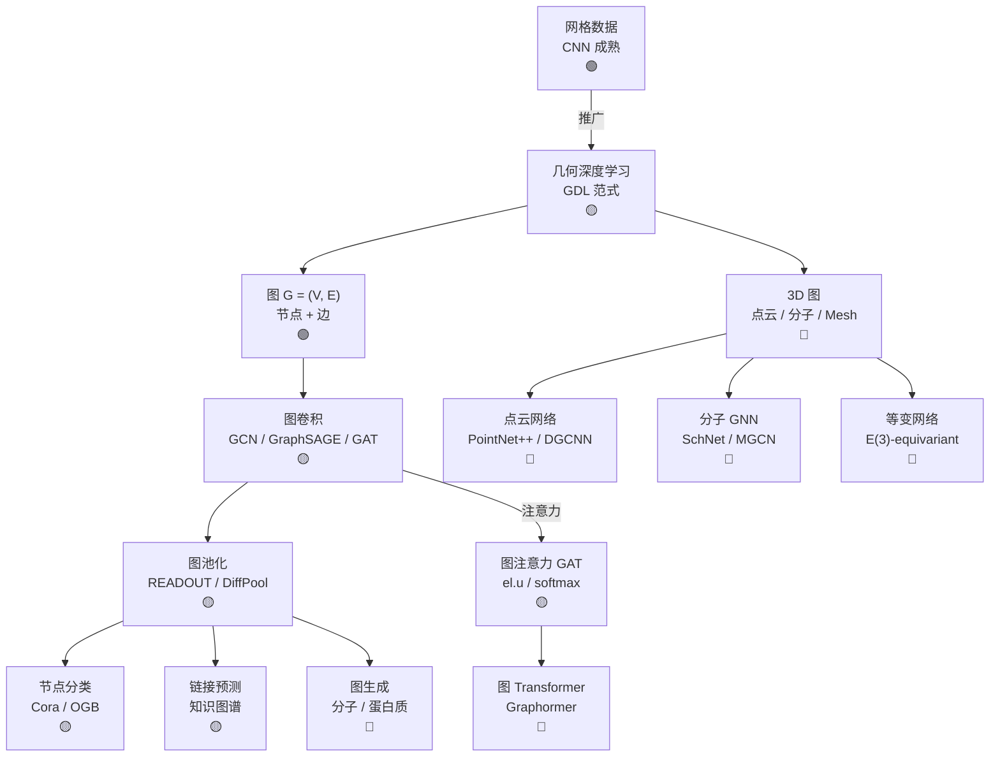

# Ch12 图神经网络 · 一页信息图

> **一句话总纲**: 图(G) = 节点 + 边的非欧数据,图神经网络(GNN) = 卷积从网格推广到任意拓扑,Ch12 教 5 节 — 几何深度学习(几何先验)、图论(基本概念)、GNN(GCN/GraphSAGE/GIN)、GAT(图注意力)、3D 图(分子/点云)。

---

## 一 · 知识拓扑图

---

## 二 · 核心公式速查表

| # | 公式 | 数字例 | 约束 |
|---|---|---|---|
| F1 | **图的度** $d_v = \sum_{u} A_{vu}$ | 单节点度 0-100 | 邻接矩阵对称 |
| F2 | **拉普拉斯** $L = D - A$ | 1 个节点图 $L=0$ | 实对称半正定 |
| F3 | **归一化拉普拉斯** $L = I - D^{-1/2} A D^{-1/2}$ | 度 2 节点, $\lambda \in [0, 2]$ | 谱域 [0, 2] |
| F4 | **GCN 卷积** $H^{(l+1)} = \sigma(\tilde D^{-1/2} \tilde A \tilde D^{-1/2} H^{(l)} W^{(l)})$ | 128 维隐藏 | 邻居平均 |
| F5 | **GraphSAGE 聚合** $h_v^{(l+1)} = W \cdot \text{CONCAT}(h_v^{(l)}, \text{AGG}(\{h_u^{(l)}: u \in \mathcal{N}(v)\}))$ | MEAN/MAX/LSTM | 邻居采样 |
| F6 | **GAT 注意力** $\alpha_v = \text{softmax}_u\left(\text{LeakyReLU}(\mathbf{a}^\top [W h_v \| W h_u])\right)$ | 8 头 | 自适应权重 |
| F7 | **GIN 表达力** $h_v^{(l+1)} = \text{MLP}((1+\epsilon) h_v^{(l)} + \sum_{u \in \mathcal{N}(v)} h_u^{(l)})$ | $\epsilon$ 可学习 | WL 测试最优 |
| F8 | **READOUT** $h_G = \text{READOUT}(\{h_v^{(L)}: v \in V\})$ | SUM / MEAN / MAX | 排列不变 |
| F9 | **链接预测** $y_{uv} = \sigma(f(h_u, h_v))$ | 知识图谱 | 内积或 MLP |
| F10 | **DiffPool** $S^{(l)} = \text{softmax}(\text{GNN}(A, X))$ | 100 节点 → 30 | 可微池化 |
| F11 | **节点特征** $X \in \mathbb{R}^{N \times d}$ | N=1000, d=128 | 度稀疏 |
| F12 | **PageRank** $p_v = \frac{1-d}{N} + d \sum_{u \to v} \frac{p_u}{d_u^{\text{out}}}$ | d=0.85, 100 节点 | 收敛 100 iters |
| F13 | **Pool READOUT** **MEAN** $\bar h = \frac{1}{N} \sum h_v$ | 等权 | 节点数敏感 |
| F14 | **PointNet max** $h_G = \text{MAX}_{v \in V} h_v$ | 1024 点云 | 排列不变 |

---

## 三 · 关键流程 (4 步)

### GCN 训练 (有监督节点分类)

1. **数据加载**: 邻接矩阵 $A$ + 节点特征 $X$ + 标签 $y$
2. **前向**: $H = A \sigma(AHW_0) W_1$ (2 层 GCN)
3. **损失**: 仅在有标签节点上算 CE loss
4. **推理**: 全图前向, softmax 取 top-1

### 图 Transformer (Graphormer 训练)

1. **节点嵌入**: 每个节点 BERT-style embedding
2. **中心性编码** (Centrality Encoding): 度数排序 → 加到 $h_v$
3. **空间编码** (Spatial Encoding): 最短路距离 → bias 项
4. **注意力** $\alpha = (QK^\top + B_{\text{spatial}}) / \sqrt{d} + C_{\text{centrality}}$, Softmax 后加权

---

## 四 · 真题 / 面试 100 题

| # | 题面 | 难度 |
|---|---|---|
| Q1 | GCN 与传统 CNN 的核心差异 | ★★ |
| Q2 | 为什么 GCN 用归一化拉普拉斯而不是 A? | ★★★ |
| Q3 | GraphSAGE 如何支持 inductive? | ★★★ |
| Q4 | GAT 相比 GCN 在什么场景更优? | ★★ |
| Q5 | GIN 为什么是 WL 测试最优? | ★★★ |
| Q6 | Pool READOUT 为什么必须排列不变? | ★★ |
| Q7 | 异构图如何用 GNN? | ★★★ |
| Q8 | 分子图 GNN 怎么表征原子/键? | ★★★ |
| Q9 | 几何深度学习的"群等变性"为何重要? | ★★★ |
| Q10 | GNN 的 over-smoothing 问题及解决? | ★★★ |

---

## 五 · 与上下章连接

1. **Ch06 §04 Transformer + Attention** → Ch12 §04 GAT 注意力
2. **Ch08 §04 Diffusion (E(3) 对称性)** → Ch12 §05 等变图网络
3. **Ch09 §04 点云 Transformer** → Ch12 §05 3D 图
4. **Ch14 §04 图算法 (Dijkstra, BFS)** → Ch12 §02 图论基础

---

## 六 · 一段话总结

图神经网络 = 在非欧拓扑数据上做"卷积"。这一节到 §05 覆盖:**§01 几何深度学习**(Bronstein 等的"群等变性"范式,CNN 是欧氏群的特例) → **§02 图论**(邻接矩阵/拉普拉斯/PageRank/最短路, 是 GNN 数学基础) → **§03 GNN**(GCN 卷积 + GraphSAGE 邻居采样 + GIN Weisfeiler-Lehman) → **§04 GAT**(注意力机制在图上的应用, 与 Transformer 同源) → **§05 3D 图**(分子 + 点云 + Mesh, 需要 E(3) 等变性)。评测基准:OGB-arxiv (~75%)、OGB-mol (~30% MAE)、PCQM4Mv2 (~5 meV)。**核心心智模型**: 图 = 结构化非欧数据, GNN = 通用近似器对图结构组合不变。
