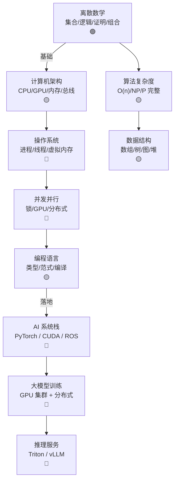

# Ch13 计算与操作系统 · 一页信息图

> **一句话总纲**: 计算机科学 = 离散数学 (集合/逻辑/证明) + 计算机架构 (冯诺依曼/存储层级/CPU/GPU) + 操作系统 (进程/虚拟内存/文件系统) + 并发并行 (线程/GPU 计算/分布式) + 编程语言 (类型系统/范式/编译)。Ch13 是 AI 系统的"基础设施"章。

---

## 一 · 知识拓扑图

---

## 二 · 核心公式速查表

| # | 公式 | 数字例 | 约束 |
|---|---|---|---|
| F1 | **集合幂** $|\mathcal{P}(S)| = 2^{|S|}$ | $|S|=10$ → $1024$ 子集 | 离散 |
| F2 | **排列** $P(n, k) = n!/(n-k)!$ | $P(5,3) = 60$ | 有序 |
| F3 | **组合** $C(n, k) = n!/(k!(n-k)!)$ | $C(5,3) = 10$ | 无序 |
| F4 | **时间复杂度** $T(n) = O(f(n))$ | $T(n) = 3n^2 + 2n = O(n^2)$ | 上界 |
| F5 | **Amdahl 定律** $S_{\text{parallel}} = 1/((1-p) + p/n)$ | $p=0.9, n=8$ → 4.4× | 并行加速 |
| F6 | **CPU 时间** $T_{\text{CPU}} = IC \times CPI \times T_{\text{cycle}}$ | IC=1e9, CPI=1, T=1ns → 1s | 三因子 |
| F7 | **Cache 命中** $h = N_{\text{hit}} / N_{\text{total}}$ | 95% 命中率 | 局部性 |
| F8 | **Amdahl 存储墙** $S_{\text{mem}} = t_{\text{mem}}/t_{\text{compute}}$ | RAM 100 ns vs CPU 1 ns → 100× | 内存墙 |
| F9 | **进程地址空间** $[\text{code}, \text{data}, \text{heap}, \text{stack}]$ | 4 GB 虚拟 | 虚拟内存 |
| F10 | **页表大小** $P = 2^{\text{virt}}/2^{\text{page}}$ | 32-bit / 4KB → 1M 页 | 虚拟内存 |
| F11 | **TLB 命中** $\text{TLB}_\text{hit} < 100 \text{ ns}$ | L1 缓存 1 ns | 硬件 |
| F12 | **线程数** $N_{\text{threads}} \leq 2 \times N_{\text{cores}}$ | 8 核 → 16 线程上限 | 超线程 |
| F13 | **CUDA 块大小** $N_{\text{block}} = 32 \times N_{\text{warp}}$ | 256 = 8 warp | SIMT |
| F14 | **MapReduce** $\text{map}(k,v) \to \text{list}(k', v')$ | word count | 大数据 |
| F15 | **类型 λ 演算** $\lambda x . x + 1$ | Church 数 | 函数式 |

---

## 三 · 关键流程 (4 步)

### 流程 A: 程序从源码到执行

1. **词法分析**: `lex` 把字符流 → token (关键字/标识符/数字)
2. **语法分析**: `yacc` token → 抽象语法树 (AST)
3. **语义分析**: 类型检查, 作用域解析
4. **代码生成**: AST → 中间代码 (IR) → 目标机器码 / 字节码 (JVM)

### 流程 B: 虚拟内存访问

1. **VA → PA**: CPU 发出虚拟地址, MMU 查 TLB
2. **TLB 命中**: 直接翻译 (~1 ns)
3. **TLB miss**: 查页表 (~100 ns)
4. **Page fault**: 磁盘换入 (~10 ms)

### 流程 C: 并发模型

1. **线程**: 共享内存, 轻量 (栈独立)
2. **进程**: 独立内存, 重 (clone 系统调用)
3. **协程**: 用户态调度, 极轻 (Go / Python async)
4. **Actor**: 消息传递, 无共享 (Erlang)

---

## 四 · 真题 / 面试 100 题

| # | 题面 | 难度 |
|---|---|---|
| Q1 | $P$ vs $NP$ 完整问题的差别 | ★★★ |
| Q2 | Amdahl 定律与并行加速 | ★★ |
| Q3 | 虚拟内存如何工作 | ★★★ |
| Q4 | 进程 vs 线程区别 | ★★ |
| Q5 | 死锁的四个条件 | ★★ |
| Q6 | GPU 为什么比 CPU 快 | ★★★ |
| Q7 | 类型系统强弱 (静态 vs 动态) | ★★ |
| Q8 | 函数式 vs 命令式范式 | ★★ |
| Q9 | 编译器前端 vs 后端 | ★★ |
| Q10 | MapReduce 与 Spark 区别 | ★★★ |

补充章节脉络说明: Ch13 是"系统栈"章节, 离散数学 (§01) 是基础, 计算机架构 (§02) 是硬件, 操作系统 (§03) 是中间层, 并发并行 (§04) 是现代化, 编程语言 (§05) 是工具层。AI 工程师的工作日常 = 用 Python 写高层, 用 C++/CUDA 调底层, 在 GPU 集群上跑大模型。
| Q8 | 函数式 vs 命令式范式 | ★★ |
| Q9 | 编译器前端 vs 后端 | ★★ |
| Q10 | MapReduce 与 Spark 区别 | ★★★ |

---

## 五 · 与上下章连接

1. **Ch01 集合 / Ch02 矩阵论** → Ch13 §01 离散数学基础
2. **Ch03 梯度下降 / Ch12 GNN** → Ch13 §04 GPU 并行加速
3. **Ch07 Transformer 训练** → Ch13 §04 分布式训练
4. **Ch12 §02 图算法** → Ch13 §04 并行图算法
5. **Ch14 数据结构** → Ch13 §01 离散数学应用

---

## 六 · 一段话总结

计算与操作系统是 AI 系统的"地基": **§01 离散数学** (集合/逻辑/组合/复杂度, 是 Ch14 数据结构的数学基础) → **§02 计算机架构** (CPU/GPU/存储层级, 是 PyTorch 等深度学习框架的运行平台) → **§03 操作系统** (进程/虚拟内存/文件系统, 是 LLM 推理服务的资源管理基础) → **§04 并发并行** (锁/线程/GPU/分布式, 是大模型训练的核心) → **§05 编程语言** (类型系统/范式/编译, 是 AI 工程师的日常工具)。**核心心智模型**: 现代 AI = 高性能计算 (HPC) + 分布式系统 + 类型安全语言。