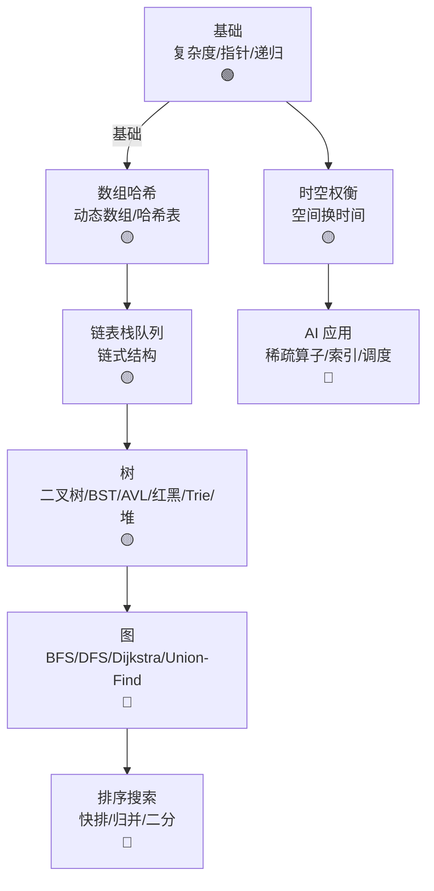

# Ch14 数据结构与算法 · 一页信息图

> **一句话总纲**: 数据结构 = 数据组织 (数组/链表/树/图/堆/哈希), 算法 = 数据操作 (排序/搜索/图算法)。Ch14 是 AI 工程师的内功, 决定代码性能上限。

---

## 一 · 知识拓扑图

---

## 二 · 核心公式速查表

| # | 公式 | 数字例 | 约束 |
|---|---|---|---|
| F1 | **数组访问** $T = O(1)$ | arr[i] | 随机访问 |
| F2 | **链表访问** $T = O(n)$ | 第 k 个节点 | 顺序访问 |
| F3 | **二分查找** $T = O(\log n)$ | n=1e6 → 20 步 | 有序 |
| F4 | **哈希查找** $T = O(1)$ avg | 哈希冲突 $O(n)$ worst | 哈希函数 |
| F5 | **BST 查找** $T = O(\log n)$ avg, $O(n)$ worst | 平衡时 $\log n$ | 树高 |
| F6 | **堆操作** $T = O(\log n)$ | insert / pop | 完全二叉树 |
| F7 | **BFS / DFS** $T = O(V + E)$ | 图遍历 | 邻接表 |
| F8 | **Dijkstra** $T = O((V + E) \log V)$ | 最短路 | 加权图 |
| F9 | **Union-Find** $T = O(\alpha(n))$ | 路径压缩 | 几乎 $O(1)$ |
| F10 | **快速排序** avg $T = O(n \log n)$, worst $O(n^2)$ | 期望 $n \log n$ | 分治 |
| F11 | **归并排序** $T = O(n \log n)$ | 稳定, 空间 $O(n)$ | 分治 |
| F12 | **堆排序** $T = O(n \log n)$ | 原地, 不稳定 | 优先队列 |
| F13 | **Tim 排序** $T = O(n)$ best, $O(n \log n)$ worst | Python sort | 自适应 |
| F14 | **Master 定理** $T(n) = a T(n/b) + f(n)$ | 见 Ch13 §01 | 递推 |
| F15 | **空间复杂度** $S(n)$ | 辅助空间 | 原地 vs 额外 |

---

## 三 · 关键流程 (4 步)

### 流程 A: 哈希表查找

1. **哈希函数**: $h(\text{key}) \to [0, m)$
2. **冲突**: 链地址 (chaining) 或开放定址 (probing)
3. **查找**: 平均 $O(1)$, 最坏 $O(n)$
4. **扩容**: rehash, 装填因子 > 0.7 触发

### 流程 B: Dijkstra 最短路

1. **初始化**: dist[start] = 0, 其他 = ∞
2. **优先队列**: 弹出最小 dist 节点
3. **松弛**: 更新邻居
4. **终止**: 所有节点访问完

### 流程 C: 红黑树插入

1. 标准 BST 插入
2. 修复: 变色 / 旋转
3. 满足 5 性质 (黑高一致等)
4. 树高 $O(\log n)$

### 流程 D: LRU Cache

1. **哈希表**: key → 链表节点
2. **双向链表**: 维护访问顺序
3. **访问**: 移到链表头
4. **淘汰**: 链表尾 (最久未用)

---

## 四 · 真题 / 面试 100 题

| # | 题面 | 难度 |
|---|---|---|
| Q1 | 二分查找边界条件 | ★★ |
| Q2 | LRU Cache 实现 | ★★★ |
| Q3 | 链表反转 | ★★ |
| Q4 | 二叉树层序遍历 | ★★ |
| Q5 | 验证 BST | ★★ |
| Q6 | Dijkstra 复杂度分析 | ★★★ |
| Q7 | Union-Find 应用 | ★★★ |
| Q8 | 排序稳定性 | ★★ |
| Q9 | Top K 问题 (堆) | ★★★ |
| Q10 | Trie 实现 (前缀树) | ★★ |
| Q11 | AVL vs 红黑树取舍 | ★★★ |
| Q12 | BFS 找最短路 vs Dijkstra | ★★ |

补充章节脉络说明: Ch14 是"内功"章节。基础 (§00) 教度量衡; 数组哈希 (§01) 给 $O(1)$ 访问; 链表栈队 (§02) 给插入 $O(1)$ + LRU; 树 (§03) 给层次结构; 图 (§04) 给网络算法; 排序 (§05) 给有序 + 搜索。AI 工程师的日常工作 = 用 Python 写高层, 用 C++/Rust 调底层, 在 GPU 集群上跑大模型。

---

## 五 · 与上下章连接

1. **Ch13 §01 复杂度** → Ch14 §00 基础
2. **Ch12 §02 图论** → Ch14 §04 图算法
3. **Ch12 §03 GNN** → Ch14 §04 BFS/DFS (邻居采样)
4. **Ch07 §04 Transformer** → Ch14 §01 数组 / 哈希 (token embedding)
5. **Ch11 §05 SLAM** → Ch14 §04 图优化

---

## 六 · 一段话总结

数据结构与算法是 AI 工程师的"基本功"。**§00 基础** (复杂度分析 + 递归) → **§01 数组/哈希** (O(1) 访问与查找) → **§02 链表/栈/队列** (链式结构 + LRU) → **§03 树** (BST / 平衡树 / Trie / 堆) → **§04 图** (BFS / DFS / Dijkstra / Union-Find, 是 GNN/SLAM 基础) → **§05 排序与搜索** (快排 / 归并 / 二分 / Tim 排序)。**核心心智模型**: 选对数据结构 = 性能好 10-100×, AI 系统优化从数据结构开始。