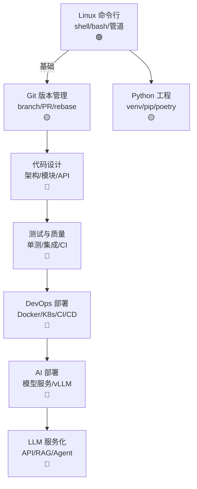

# Ch15 生产软件工程 · 一页信息图

> **一句话总纲**: 生产软件工程 = AI 模型从笔记本到生产环境: Linux 命令行 + Git 版本管理 + 代码设计 + 测试 + DevOps 部署。Ch15 是 AI 工程师的"工程素养"课。

---

## 一 · 知识拓扑图

---

## 二 · 核心速查表

| # | 命令 / 工具 | 用途 |
|---|---|---|
| F1 | `ls / cat / grep` | 文件查看 |
| F2 | `ps / top / htop` | 进程监控 |
| F3 | `ssh / scp / rsync` | 远程 |
| F4 | `git clone / commit / push` | 版本管理 |
| F5 | `git rebase / merge` | 分支整合 |
| F6 | `pytest / unittest` | Python 测试 |
| F7 | `Docker / docker-compose` | 容器化 |
| F8 | `kubectl` | K8s 部署 |
| F9 | `pip / poetry / uv` | 依赖管理 |
| F10 | `pre-commit / black / ruff` | 代码规范 |
| F11 | `GitHub Actions / Jenkins` | CI/CD |
| F12 | `tmux / screen` | 终端复用 |
| F13 | `curl / wget` | HTTP 测试 |
| F14 | `nginx / caddy` | 反向代理 |
| F15 | `systemd / supervisor` | 进程管理 |

---

## 三 · 关键流程 (4 步)

### 流程 A: Git Flow

1. `git checkout -b feature/x`
2. 开发 + commit
3. `git push` + 开 PR
4. Review → merge → 删分支

### 流程 B: Docker 部署

1. 写 `Dockerfile`
2. `docker build -t myapp:v1`
3. `docker run -d -p 8000:8000 myapp`
4. 推 `docker push` 到 registry

### 流程 C: CI/CD

1. Push → 触发 GitHub Actions
2. 跑 lint + test
3. build Docker 镜像
4. 部署到 staging → 生产

### 流程 D: LLM 服务化

1. FastAPI 包装模型
2. vLLM 推理引擎
3. Docker 镜像
4. K8s 部署 + autoscaling

---

## 四 · 真题 / 面试 100 题

| # | 题面 | 难度 |
|---|---|---|
| Q1 | git rebase vs merge | ★★ |
| Q2 | Docker 与 VM 区别 | ★★ |
| Q3 | K8s Pod / Deployment / Service | ★★★ |
| Q4 | CI/CD 与 GitOps 差异 | ★★★ |
| Q5 | 单测 / 集成 / E2E 测试 | ★★ |
| Q6 | 测试覆盖率指标 | ★★ |
| Q7 | SOLID 原则 | ★★★ |
| Q8 | 12-Factor App | ★★★ |
| Q9 | LLM 服务化的延迟优化 | ★★★ |
| Q10 | 模型版本管理 (DVC / MLflow) | ★★ |

---

## 五 · 与上下章连接

1. **Ch13 §04 并发** → Ch15 §01 Linux 进程
2. **Ch13 §05 编程语言** → Ch15 §03 代码设计
3. **Ch14 数据结构** → Ch15 §04 测试 (data fixtures)
4. **Ch07 §04 Transformer** → Ch15 §05 LLM 部署

---

## 六 · 一段话总结

生产软件工程是 AI 从原型到产品的"最后一公里": **§01 Linux/CMD** (日常工具) → **§02 Git** (协作) → **§03 代码设计** (架构) → **§04 测试** (质量) → **§05 DevOps** (部署)。AI 工程师必备技能: `git`, `pytest`, `Docker`, `K8s`, CI/CD。