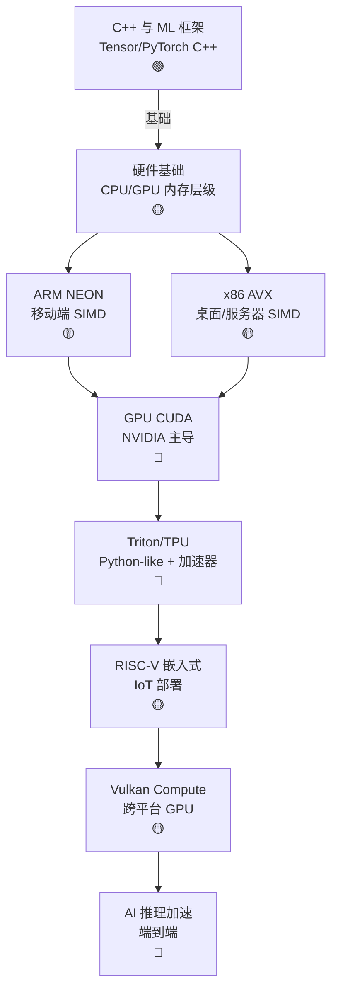

# Ch16 SIMD 与 GPU 编程 · 一页信息图

> **一句话总纲**: SIMD 与 GPU 编程 = AI 内核加速: CPU SIMD (AVX/NEON) + GPU CUDA / Triton + TPU + Vulkan + RISC-V 嵌入式。Ch16 教"如何把模型跑得快"。

---

## 一 · 知识拓扑图

---

## 二 · 核心公式速查表

| # | 公式 / 概念 | 数字例 | 约束 |
|---|---|---|---|
| F1 | **AVX-512 宽度** | 512 bit = 16×FP32 | x86 |
| F2 | **NEON 宽度** | 128 bit = 4×FP32 | ARM |
| F3 | **CUDA core 数** | H100 132 SM × 128 = 16896 | NVIDIA |
| F4 | **Tensor core** | FP16: 256-1024 ops/cycle | AI 专用 |
| F5 | **内存墙** | HBM 3 TB/s vs FP16 1000 TFLOPS | GPU 瓶颈 |
| F6 | **SIMD 加速比** | $n = \text{width} / \text{sizeof}(T)$ | 理论上限 |
| F7 | **Roofline** | $\text{perf} = \min(\pi, I \times B)$ | 计算 / 带宽 |
| F8 | **CUDA warp** | 32 threads | SIMT |
| F9 | **寄存器数 / thread** | H100 65536 × 32bit / SM | 限制 occupancy |
| F10 | **TPU systolic** | MXU 128×128 | Google |
| F11 | **Vulkan workgroup** | 类似 CUDA block | 跨平台 |
| F12 | **RISC-V V 扩展** | 128-2048 bit | 嵌入式 |
| F13 | **Flash Attention** | 减少 IO | GPU 内存优化 |
| F14 | **Triton block size** | 128-1024 | 自动调优 |
| F15 | **INT4 vs FP16** | 4× 内存, 轻微精度损 | 量化 |

---

## 三 · 关键流程 (4 步)

### 流程 A: SIMD 优化

1. **Profile**: `perf` 找热点
2. **向量化**: 用 AVX intrinsics
3. **数据对齐**: 32 / 64 字节
4. **验证**: 数值一致性

### 流程 B: CUDA Kernel

1. **分配**: `cudaMalloc` / `cudaMemcpy`
2. **启动**: `kernel<<<grid, block>>>(...)`
3. **同步**: `cudaDeviceSynchronize`
4. **取结果**: `cudaMemcpy` 回 host

### 流程 C: Triton 编程

1. 定义 `@triton.jit` 函数
2. 自动向量化 / 调优
3. 编译为 PTX
4. 调用执行

### 流程 D: 量化部署

1. FP32 → FP16 / BF16
2. PTQ (训练后量化)
3. QAT (量化感知训练)
4. 部署到边缘 (INT4)

---

## 四 · 真题 / 面试 100 题

| # | 题面 | 难度 |
|---|---|---|
| Q1 | SIMD 加速原理 | ★★ |
| Q2 | AVX 与 NEON 区别 | ★★ |
| Q3 | CUDA warp / block / grid 关系 | ★★★ |
| Q4 | 内存墙与 roofline 模型 | ★★★ |
| Q5 | Tensor core 工作原理 | ★★★ |
| Q6 | Triton 与 CUDA 区别 | ★★ |
| Q7 | TPU 与 GPU 差异 | ★★★ |
| Q8 | Vulkan Compute 用途 | ★★ |
| Q9 | RISC-V 在 AI 边缘的角色 | ★★ |
| Q10 | Flash Attention 优化 | ★★★ |

---

## 五 · 与上下章连接

1. **Ch13 §02 架构** → Ch16 §01 硬件基础
2. **Ch13 §04 CUDA** → Ch16 §04 GPU 编程
3. **Ch15 §05 K8s GPU** → Ch16 §07 Vulkan 跨平台
4. **Ch17 §02 LLM 推理** → Ch16 §05 Triton 加速

---

## 六 · 一段话总结

SIMD 与 GPU 编程是 AI 性能优化的"内功": **§00 C++ 与 ML 框架** (PyTorch C++ 后端) → **§01 硬件基础** (内存层级 / Roofline) → **§02 ARM NEON** (移动端) → **§03 x86 AVX** (服务器) → **§04 GPU CUDA** (NVIDIA 主导) → **§05 Triton/TPU** (Python 风格 + 加速器) → **§06 RISC-V 嵌入式** (IoT) → **§07 Vulkan Compute** (跨平台 GPU)。**核心心智模型**: 现代 AI = GPU 集群 + Triton DSL + 量化。