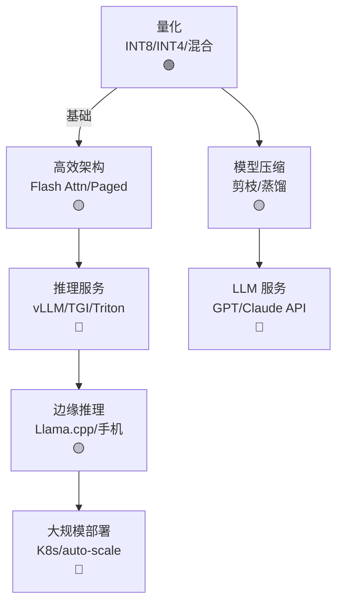

# Ch17 AI 推理 · 一页信息图

> **一句话总纲**: AI 推理 = 模型在生产环境运行: 量化 (INT8/INT4) + 高效架构 (MQA/GQA/Flash) + 推理服务 (vLLM/TGI/batching) + 边缘部署 (Llama.cpp) + 大规模部署 (K8s/autoscaling)。

---

## 一 · 知识拓扑图

---

## 二 · 核心公式速查表

| # | 公式 / 概念 | 数字例 | 约束 |
|---|---|---|---|
| F1 | **量化 INT8** | 4× 内存节省 | 70B FP16 → 35 GB |
| F2 | **量化 INT4** | 8× 内存 | 70B → 17.5 GB |
| F3 | **KV cache 大小** | $2 \cdot N_{\text{layers}} \cdot d \cdot N_{\text{tokens}}$ | 长上下文关键 |
| F4 | **PagedAttention** | 减少碎片 4× | vLLM 核心 |
| F5 | **Continuous batching** | 吞吐 +24× | vLLM |
| F6 | **Speculative decoding** | 1.5-2× 加速 | 小模型猜 + 大模型验证 |
| F7 | **Flash Attention** | 减少 IO | H100/A100 |
| F8 | **Flash decoding** | 长序列推理 | Paged + Flash |
| F9 | **GQA (Grouped Query Attention)** | 减少 KV | Llama 2 / Mistral |
| F10 | **Multi-Query Attention** | 减少 KV 32× | PaLM |
| F11 | **Llama.cpp** | CPU/边缘 | 量化 + SIMD |
| F12 | **TGI tokens/s** | 7B ~50 tok/s | 单 A100 |
| F13 | **TTFT (Time To First Token)** | <500ms | 用户体验 |
| F14 | **TPOT (Time Per Output Token)** | <50ms | 用户体验 |
| F15 | **Edge RAM** | 手机 8 GB | Llama 3 8B 量化 |

---

## 三 · 关键流程 (4 步)

### 流程 A: 量化部署

1. 选择精度 (INT8 / INT4)
2. PTQ (训练后) 或 QAT (训练中)
3. 验证精度
4. 部署

### 流程 B: vLLM 服务化

1. 模型加载 (HuggingFace)
2. PagedAttention KV cache
3. Continuous batching
4. OpenAI 兼容 API

### 流程 C: 边缘部署

1. 模型量化 INT4
2. Llama.cpp 编译
3. 手机/嵌入式运行
4. 端云协同 (fallback)

### 流程 D: 大规模部署

1. Docker 镜像
2. K8s + HPA
3. GPU 监控
4. 金丝雀发布

---

## 四 · 真题 / 面试 100 题

| # | 题面 | 难度 |
|---|---|---|
| Q1 | PTQ vs QAT | ★★ |
| Q2 | PagedAttention 原理 | ★★★ |
| Q3 | Continuous batching | ★★ |
| Q4 | Speculative decoding | ★★★ |
| Q5 | GQA vs MQA | ★★ |
| Q6 | Llama.cpp 工作原理 | ★★ |
| Q7 | KV cache 优化方向 | ★★★ |
| Q8 | TTFT vs TPOT | ★★ |
| Q9 | 推理服务监控指标 | ★★ |
| Q10 | 边缘部署限制 | ★★★ |

---

## 五 · 与上下章连接

1. **Ch07 §04 Transformer** → Ch17 §02 高效架构
2. **Ch13 §04 CUDA** → Ch17 §02 Flash Attention
3. **Ch15 §05 K8s** → Ch17 §05 大规模部署
4. **Ch16 §04/05 CUDA/Triton** → Ch17 §03 vLLM

---

## 六 · 一段话总结

AI 推理 = 模型从训练到生产的"最后一公里": **§01 量化** (INT8/INT4 压缩) → **§02 高效架构** (Flash Attention / GQA / PagedAttention) → **§03 推理服务** (vLLM / TGI / batching) → **§04 边缘推理** (Llama.cpp) → **§05 大规模部署** (K8s / autoscaling / 监控)。**核心心智模型**: 推理 = 内存带宽 + 调度 + 量化, 延迟与吞吐权衡。