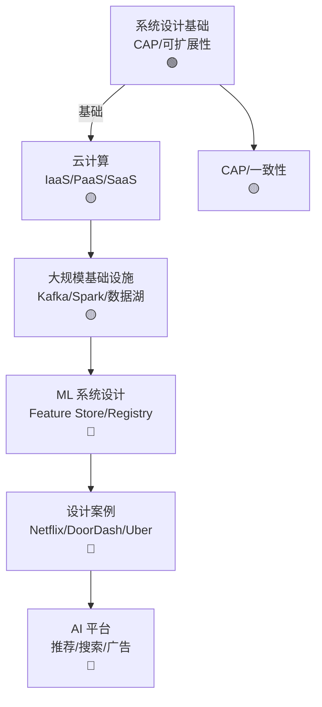

# Ch18 ML 系统设计 · 一页信息图

> **一句话总纲**: ML 系统设计 = 把 ML 模型 + 数据 + 算力 + 服务组合成可扩展生产系统: 系统设计基础 + 云原生 + 大规模基础设施 + ML 特定设计 + 真实案例。

---

## 一 · 知识拓扑图

---

## 二 · 核心公式速查表

| # | 概念 | 公式 / 说明 |
|---|---|---|
| F1 | **CAP 定理** | C / A / P 三选二 |
| F2 | **一致性哈希** | 增删节点只影响邻居 |
| F3 | **可用性** | $U = \frac{MTBF}{MTBF + MTTR}$ |
| F4 | **QPS** | Queries Per Second |
| F5 | **延迟** | p50 / p95 / p99 |
| F6 | **存储层级** | Hot (Redis) / Warm (DB) / Cold (S3) |
| F7 | **Feature Store** | 在线 + 离线一致性 |
| F8 | **数据湖** | S3 + Parquet + Iceberg |
| F9 | **模型 registry** | MLflow / DVC |
| F10 | **数据漂移** | PSI / KS 检验 |
| F11 | **A/B test** | 流量分流 + 指标 |
| F12 | **影子流量** | 不影响用户, 验证 |
| F13 | **回流** | 在线日志 → 训练 |
| F14 | **Kafka 吞吐** | ~1M msg/s |
| F15 | **Spark 内存** | Driver + Executor |

---

## 三 · 关键流程 (4 步)

### 流程 A: 实时推荐

1. 用户事件 → Kafka
2. Flink 实时特征
3. 在线推理 (TensorFlow Serving)
4. 返回结果

### 流程 B: 离线训练

1. 数据湖 (S3) → Spark 处理
2. 特征工程 (离线)
3. 训练 (PyTorch + DDP)
4. 模型注册 (MLflow)

### 流程 C: 在线服务

1. 用户请求 → API Gateway
2. 在线特征 (Redis)
3. 模型推理 (vLLM)
4. 监控 (Prometheus)

### 流程 D: 模型更新

1. 新数据回流
2. 触发重训
3. 评估 (A/B test)
4. 灰度发布

---

## 四 · 真题 / 面试 100 题

| # | 题面 | 难度 |
|---|---|---|
| Q1 | CAP 定理 | ★★ |
| Q2 | 一致性哈希 | ★★ |
| Q3 | Kafka vs RabbitMQ | ★★★ |
| Q4 | Spark vs MapReduce | ★★ |
| Q5 | 数据漂移检测 | ★★★ |
| Q6 | Feature Store 设计 | ★★★ |
| Q7 | 在线 vs 离线特征一致性 | ★★★ |
| Q8 | A/B test 统计显著性 | ★★★ |
| Q9 | Netflix 推荐系统 | ★★★ |
| Q10 | DoorDash 派单系统 | ★★★ |

---

## 五 · 与上下章连接

1. **Ch13 §03 OS** → Ch18 §01 系统设计
2. **Ch15 §05 K8s** → Ch18 §03 大规模基础设施
3. **Ch17 §03 vLLM** → Ch18 §04 ML 系统

---

## 六 · 一段话总结

ML 系统设计 = 把 AI 模型 + 数据 + 算力组合成生产系统: **§01 系统设计基础** (CAP/可扩展性) → **§02 云计算** (IaaS/PaaS/SaaS) → **§03 大规模基础设施** (Kafka/Spark/数据湖) → **§04 ML 系统设计** (Feature Store / Registry / 监控) → **§05 设计案例** (Netflix/DoorDash/Uber)。**核心心智模型**: ML 系统 = 数据流 + 计算流 + 模型流 + 监控。