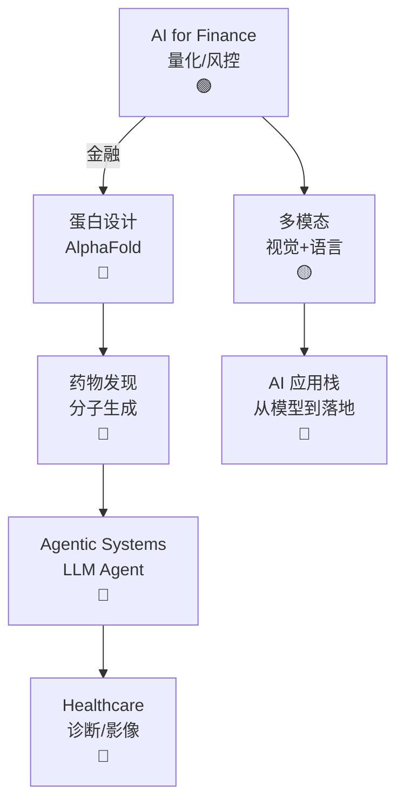

# Ch19 应用 AI · 一页信息图

> **一句话总纲**: 应用 AI = AI 在垂直行业的落地: AI for Finance (量化/风控) + 蛋白设计 (AlphaFold) + 药物发现 (分子生成) + Agentic Systems (LLM Agent) + Healthcare (诊断/影像)。

---

## 一 · 知识拓扑图

---

## 二 · 核心公式速查表

| # | 概念 | 公式 / 说明 |
|---|---|---|
| F1 | **Sharpe ratio** | $S = \frac{R_p - R_f}{\sigma_p}$ |
| F2 | **Value at Risk** | $VaR_\alpha = -\inf\{l : P(L > l) \leq \alpha\}$ |
| F3 | **AlphaFold pLDDT** | 0-100 残基置信度 |
| F4 | **TM-score** | 结构相似度 [0, 1] |
| F5 | **QED** | 药物相似度 [0, 1] |
| F6 | **LogP** | 脂溶性 |
| F7 | **Agent ReAct** | Reasoning + Acting 循环 |
| F8 | **Tool use** | LLM 调用外部工具 |
| F9 | **RAG** | 检索增强生成 |
| F10 | **AUROC** | 医学诊断 ROC |
| F11 | **敏感性 / 特异性** | 诊断评估 |
| F12 | **Dice score** | 影像分割 |
| F13 | **Pearson 相关** | 股价预测 |
| F14 | **IC (信息系数)** | 量化策略评估 |
| F15 | **DDI (药物相互作用)** | 药物风险 |

---

## 三 · 关键流程 (4 步)

### 流程 A: AI 药物发现

1. **靶点**: 选定蛋白 (e.g., 受体)
2. **生成**: Diffusion / RL 生成分子
3. **筛选**: docking + QED
4. **优化**: 合成 + 测试

### 流程 B: LLM Agent

1. **任务**: 用户给目标
2. **规划**: LLM 拆分子任务
3. **执行**: 调工具 / 检索 / 写代码
4. **验证**: 检查结果, 循环

### 流程 C: 蛋白结构预测

1. **MSA**: 多序列比对
2. **Pair representation**: 残基对
3. **Evoformer**: 推理
4. **Structure module**: 3D 输出

### 流程 D: 量化交易

1. **数据**: K 线 / 财报 / 新闻
2. **特征**: 技术指标 / NLP
3. **模型**: LSTM / Transformer
4. **回测**: 策略验证

---

## 四 · 真题 / 面试 100 题

| # | 题面 | 难度 |
|---|---|---|
| Q1 | Sharpe ratio 含义 | ★★ |
| Q2 | AlphaFold 架构 | ★★★ |
| Q3 | 药物分子生成方法 | ★★★ |
| Q4 | LLM Agent 与 LLM 区别 | ★★ |
| Q5 | RAG 原理 | ★★ |
| Q6 | ReAct 框架 | ★★★ |
| Q7 | 医学影像分割 Dice | ★★ |
| Q8 | 量化策略回测 | ★★★ |
| Q9 | 蛋白结构 TM-score | ★★ |
| Q10 | Agent tool use | ★★★ |

---

## 五 · 与上下章连接

1. **Ch07 §04 Transformer** → Ch19 全部 (蛋白/药物/Agent 都用)
2. **Ch12 §05 EGNN** → Ch19 §02 蛋白设计
3. **Ch08 §04 Diffusion** → Ch19 §03 药物生成
4. **Ch17 §03 vLLM** → Ch19 §04 Agent 部署

---

## 六 · 一段话总结

应用 AI = AI 在垂直行业的落地: **§01 AI for Finance** (量化/风控) → **§02 蛋白设计** (AlphaFold/Evoformer/MSA) → **§03 药物发现** (分子生成/QED) → **§04 Agentic Systems** (LLM Agent/ReAct/RAG) → **§05 Healthcare** (诊断/影像分割)。**核心心智模型**: 垂直行业 = 领域知识 + 数据 + 模型 + 评测 + 合规。