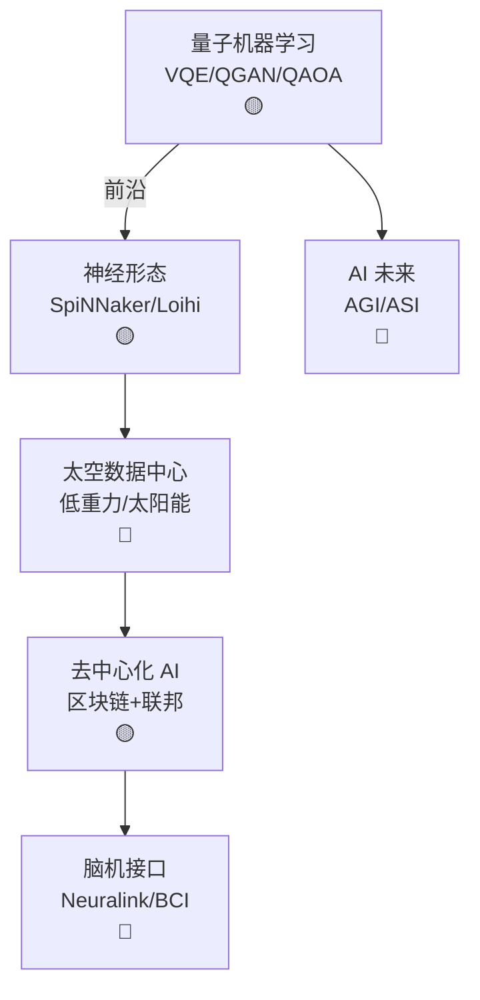

# Ch20 前沿 AI · 一页信息图

> **一句话总纲**: 前沿 AI = AI 未来方向: 量子机器学习 (QML) + 神经形态计算 (类脑芯片) + 太空数据中心 + 去中心化 AI (区块链 + 模型) + 脑机接口 (BMI)。

---

## 一 · 知识拓扑图

---

## 二 · 核心概念速查表

| # | 概念 | 说明 |
|---|---|---|
| F1 | **Qubit** | 量子比特, 0/1 叠加 |
| F2 | **量子纠缠** | 多 qubit 关联, 不可分割 |
| F3 | **VQE** | Variational Quantum Eigensolver |
| F4 | **QAOA** | 量子近似优化 |
| F5 | **Shor 算法** | 量子破解 RSA |
| F6 | **Neuron 芯片** | 模拟大脑神经 |
| F7 | **SpiNNaker** | 曼彻斯特大学, 百万核 |
| F8 | **Intel Loihi** | 神经形态芯片 |
| F9 | **Spike 编码** | 脉冲神经网络 SNN |
| F10 | **低重力冷却** | 太空自然散热 |
| F11 | **太阳能数据中心** | 太空 24h 太阳 |
| F12 | **辐射加固** | 太空芯片 |
| F13 | **联邦学习** | 见 Ch18 §04, Ch19 §05 |
| F14 | **BitTensor** | 去中心化模型市场 |
| F15 | **NEAR** | AI 区块链 |
| F16 | **Neuralink** | 脑机接口公司 |
| F17 | **BCI** | Brain-Computer Interface |
| F18 | **侵入式 vs 非侵入** | 手术 vs EEG |
| F19 | **解码神经信号** | CNN/RNN |
| F20 | **AGI 时间线** | 2030-2050 (估计) |

---

## 三 · 关键流程 (4 步)

### 流程 A: 量子 ML

1. 编码数据 (amplitude / angle)
2. 设计量子电路
3. 测量结果
4. 经典后处理

### 流程 B: 神经形态

1. spike 编码
2. SNN 网络
3. 异步事件驱动
4. 低功耗推理

### 流程 C: 太空数据中心

1. 太阳能板发电
2. 辐射加固服务器
3. 真空环境散热
4. 激光 / RF 通信

### 流程 D: 脑机接口

1. 神经信号采集 (电极 / EEG)
2. 特征提取
3. ML 解码 (意图)
4. 反馈 (机器 / 显示)

---

## 四 · 真题 / 面试 100 题

| # | 题面 | 难度 |
|---|---|---|
| Q1 | Qubit 与经典 bit 区别 | ★★ |
| Q2 | VQE 原理 | ★★★ |
| Q3 | 神经形态优势 | ★★ |
| Q4 | SpiNNaker 规模 | ★★ |
| Q5 | 太空数据中心优势 | ★★ |
| Q6 | 联邦学习与去中心化 AI | ★★★ |
| Q7 | BitTensor 设计 | ★★★ |
| Q8 | Neuralink 进展 | ★★ |
| Q9 | BCI 信号采集方式 | ★★ |
| Q10 | AGI 何时到来 | ★★★ |

---

## 五 · 与上下章连接

1. **Ch02 §04 矩阵** → Ch20 §01 量子 (线性代数)
2. **Ch07 §04 Transformer** → Ch20 §05 BMI (信号解码)
3. **Ch18 §04 ML 平台** → Ch20 §04 去中心化 AI
4. **Ch19 §05 联邦医疗** → Ch20 §04 去中心化 AI

---

## 六 · 一段话总结

前沿 AI = AI 未来 10-20 年方向: **§01 量子机器学习** (Qubit/VQE/QAOA) → **§02 神经形态计算** (SpiNNaker/Loihi/SNN) → **§03 太空数据中心** (低重力 + 24h 太阳) → **§04 去中心化 AI** (区块链 + 联邦 + 模型市场) → **§05 脑机接口** (Neuralink/BCI/解码)。**核心心智模型**: 下一代 AI = 量子 + 类脑 + 太空 + 去中心 + 脑机。