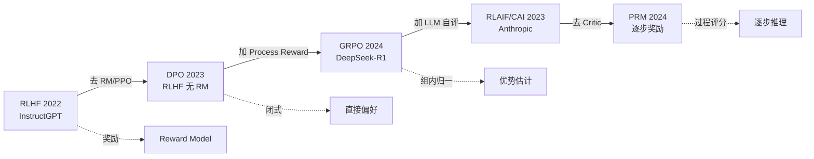
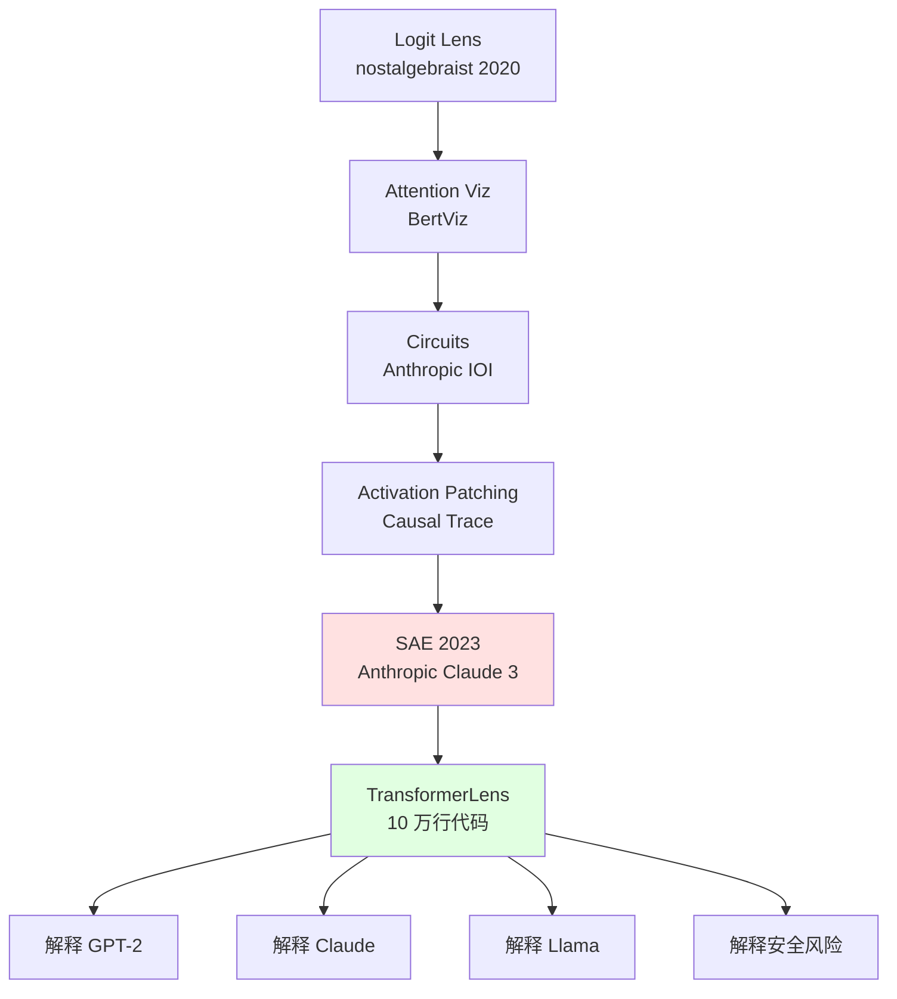
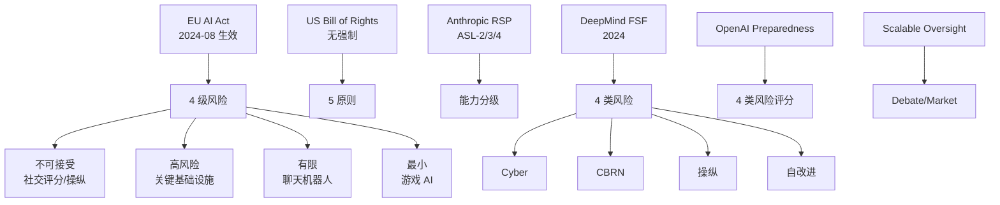

# Ch21 对齐·安全·可解释性 · 信息图

> **定位**: 一图概览本章全貌
> **数据更新**: 2026-07-29

---

## 信息图:对齐技术栈全图

```mermaid
flowchart TB
  A[Ch21 对齐·安全·可解释性] --> B[§01 对齐基础]
  A --> C[§02 训练范式]
  A --> D[§03 攻击防御]
  A --> E[§04 机制可解释]
  A --> F[§05 工具实战]
  A --> G[§06 治理框架]

  B --> B1[Outer Alignment]
  B --> B2[Inner Alignment]
  B --> B3[Mesa-Optimizer]
  B --> B4[Corrigibility]
  B --> B5[Goodhart 4 类型]

  C --> C1[RLHF 3 阶段]
  C --> C2[DPO 闭式]
  C --> C3[GRPO 组内]
  C --> C4[RLAIF / CAI]
  C --> C5[PRM vs ORM]

  D --> D1[Prompt Injection]
  D --> D2[Jailbreak 5 手法]
  D --> D3[3 大防御]
  D --> D4[Red Team]
  D --> D5[Backdoor]

  E --> E1[Circuits]
  E --> E2[SAE 稀疏]
  E --> E3[Logit Lens]
  E --> E4[TransformerLens]
  E --> E5[Activation Patching]

  F --> F1[TransformerLens]
  F --> F2[SAE Viewer]
  F --> F3[GPT-2 实战]

  G --> G1[EU AI Act]
  G --> G2[US Bill of Rights]
  G --> G3[RSP / FSF]
  G --> G4[Scalable Oversight]

  classDef core fill:#f9f,stroke:#333,stroke-width:2px
  classDef align fill:#e1f5ff
  classDef train fill:#fff4e1
  classDef attack fill:#ffe1e1
  classDef interp fill:#e1ffe1
  classDef gov fill:#f5e1ff
  class A core
  class B,B1,B2,B3,B4,B5 align
  class C,C1,C2,C3,C4,C5 train
  class D,D1,D2,D3,D4,D5 attack
  class E,E1,E2,E3,E4,E5 interp
  class F,F1,F2,F3 gov
  class G,G1,G2,G3,G4 gov
```

---

## 信息图:RLHF → DPO → GRPO 演进

---

## 信息图:可解释性工具栈

---

## 信息图:AI 治理全球版图

---

## 数据卡片

- **RLHF 数据需求**: 每 prompt 4-9 个回答,人工排序,典型 10 万 prompts (InstructGPT)
- **SAE 特征数**: Claude 3 Sonnet 3400 万特征 (Anthropic 2024)
- **Anthropic 解释率**: 30% Claude 3 Sonnet 行为已建模
- **EU AI Act 罚款**: 最高 7% 全球营收或 3500 万欧元
- **Jailbreak 成功率**: GPT-4 ~30% (DAN 角色), Claude 3 ~12%