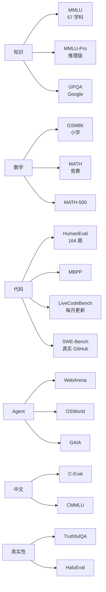
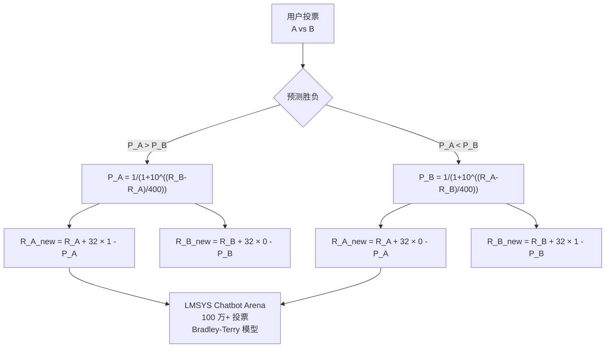
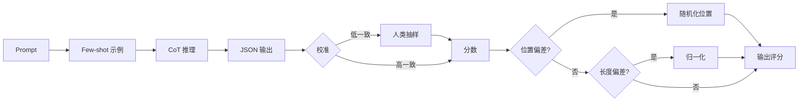
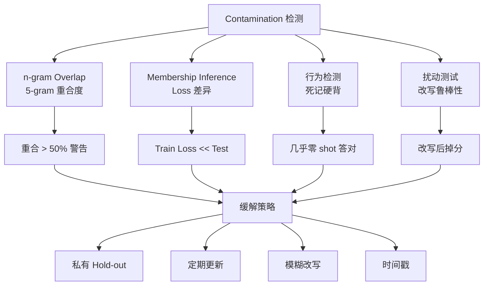

# Ch22 LLM Evaluation 方法学 · 信息图

---

## 信息图:LLM Eval 全景

```mermaid
flowchart TB
  A[LLM Evaluation] --> B[传统指标]
  A --> C[Benchmark]
  A --> D[人类偏好]
  A --> E[LLM-as-Judge]
  A --> F[Contamination]
  A --> G[Harness]

  B --> B1[BLEU/ROUGE]
  B --> B2[METEOR/chrF]
  B --> B3[BERTScore]
  B --> B4[Perplexity/WER]

  C --> C1[知识 MMLU]
  C --> C2[数学 GSM8K]
  C --> C3[代码 HumanEval]
  C --> C4[综合 BBH]
  C --> C5[中文 C-Eval]

  D --> D1[Arena Elo]
  D --> D2[Bradley-Terry]
  D --> D3[TrueSkill]

  E --> E1[MT-Bench]
  E --> E2[AlpacaEval]
  E --> E3[Pairwise Judge]

  F --> F1[检测方法]
  F --> F2[缓解策略]
  F --> F3[历史争议]

  G --> G1[lm-eval-harness]
  G --> G2[OpenCompass]
  G --> G3[HELM]

  classDef core fill:#f9f,stroke:#333,stroke-width:2px
  class A core
```

---

## 信息图:Benchmark 知识体系

---

## 信息图:Elo Rating 算法

---

## 信息图:LLM-as-Judge 工作流

---

## 信息图:Contamination 检测方法

---

## 数据卡片

- **HELM**: 7 维度 × 16 场景, Stanford CRFM 2022
- **LMSYS Arena**: 100 万+ 真实投票, Bradley-Terry 模型
- **MMLU**: 57 学科, GPT-4 86.4%, Claude 3 Opus 86.8%
- **HumanEval**: 164 题, GPT-4 87%, Claude 3.5 Sonnet 92%
- **OpenCompass**: 国内最权威, 涵盖 100+ 数据集
- **MT-Bench**: 80 题 8 类, GPT-4 Judge 与人类 80% 一致