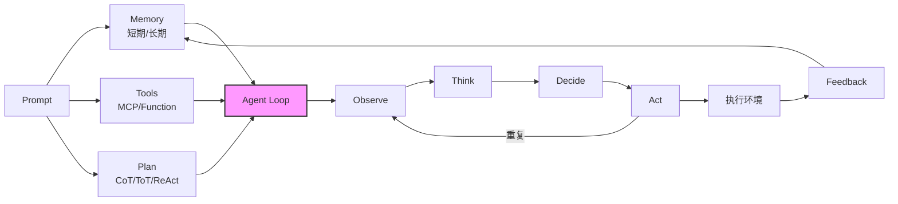
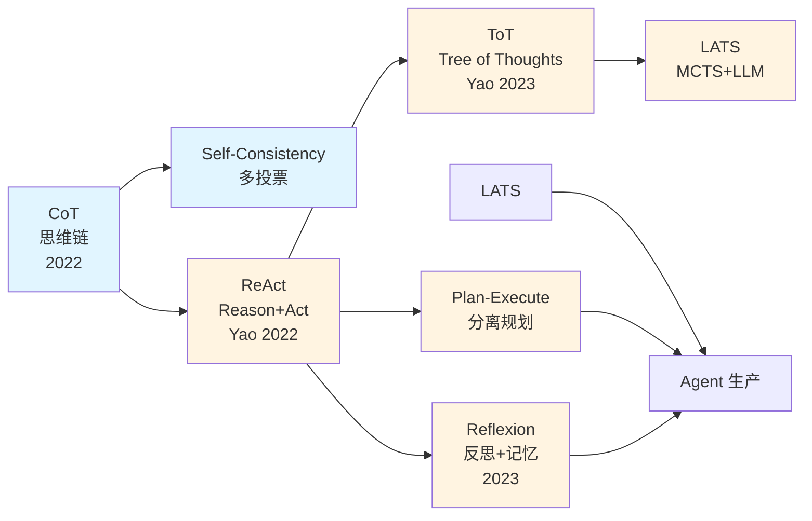
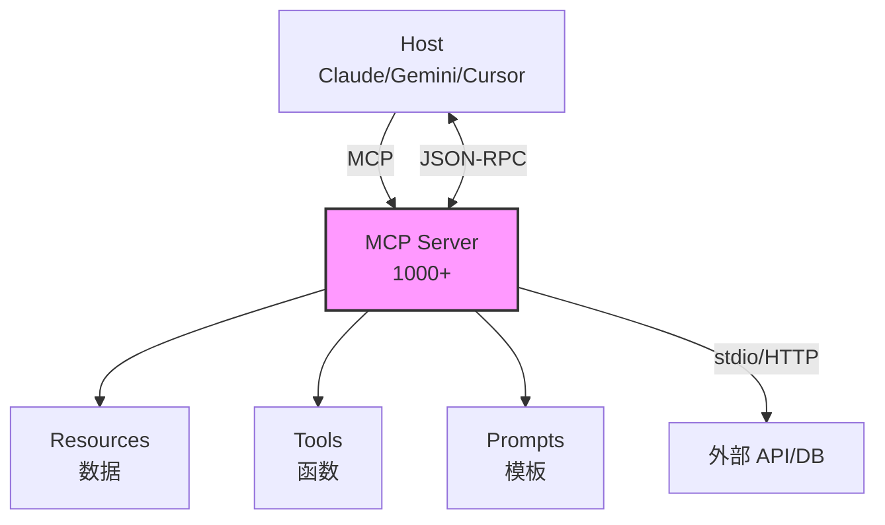
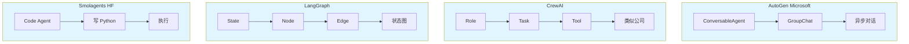
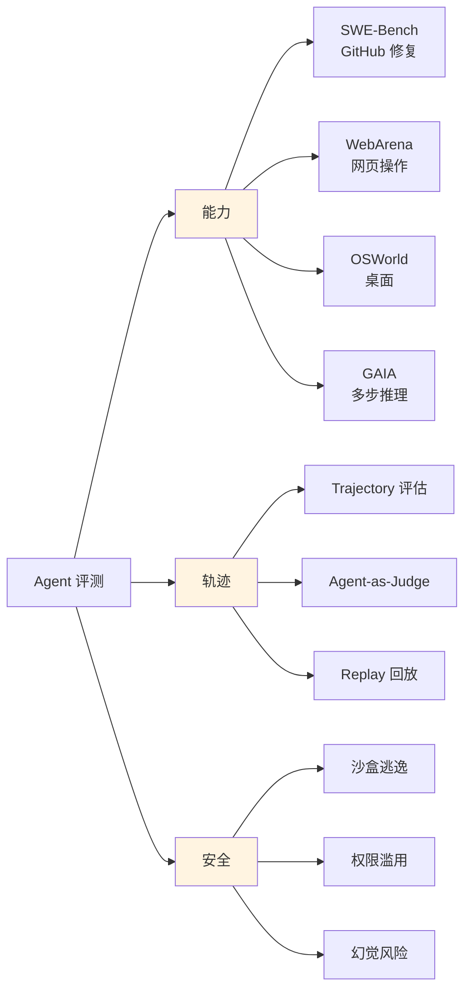
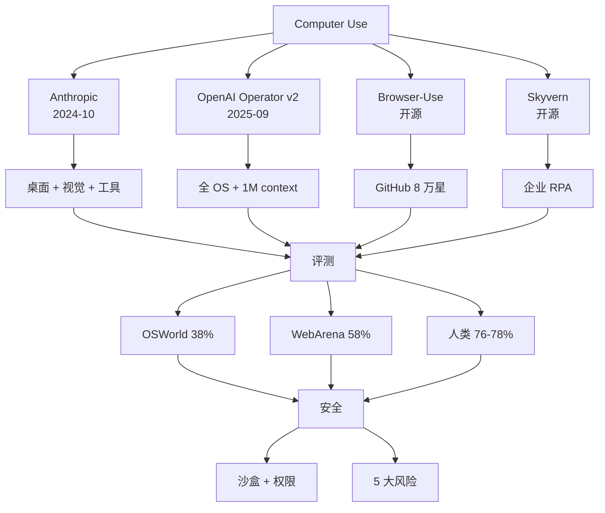

# Ch23 AI Agent 与工具使用 · 信息图

---

## 信息图:Agent 核心架构

---

## 信息图:Agent 推理范式演进

---

## 信息图:MCP 协议架构

---

## 信息图:Multi-Agent 框架对比

---

## 信息图:Agent 评测体系

---

## 信息图:Computer Use 全景

---

## 数据卡片

- **MCP Servers**: 1000+ 官方注册 (2025-Q3)
- **AutoGen**: 微软 2023, GitHub 3 万+ 星
- **Voyager**: 第一个 LLM 自主 Minecraft 钻石 (Anthropic 2023)
- **OSWorld**: Claude 3.5 38.1% vs 人类 76.0%
- **WebArena**: Claude 3.5 Sonnet 58.1% vs 人类 78.1%
- **AI Scientist**: Sakana AI 自动写论文