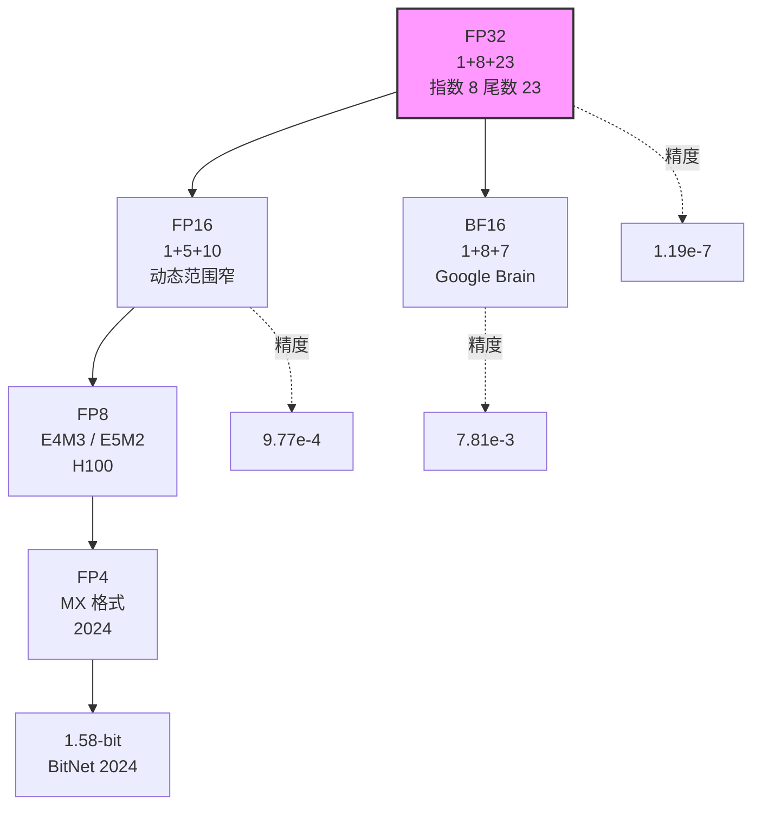
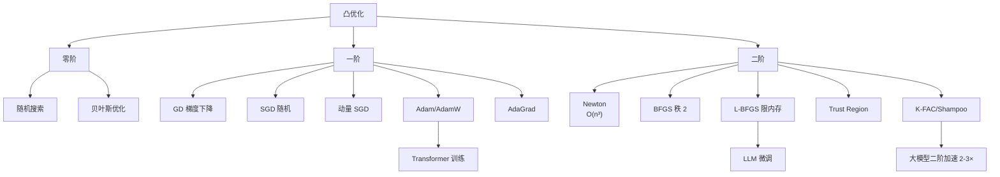
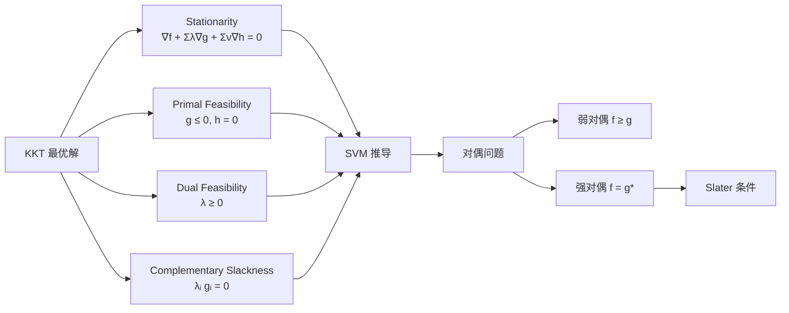
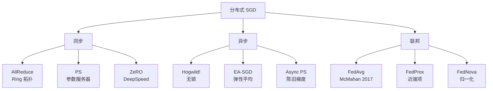
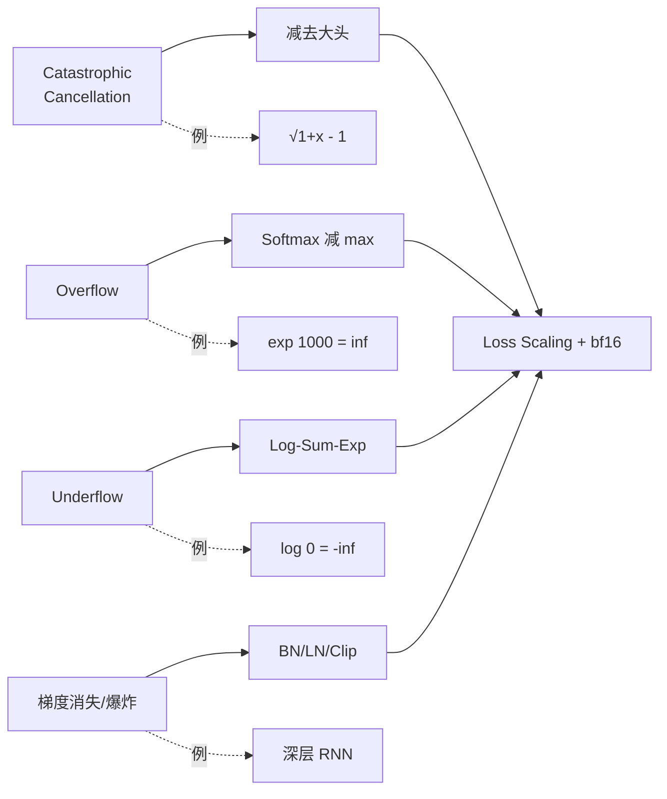
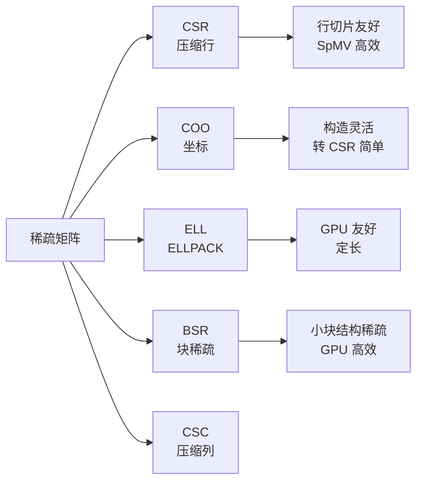

# Ch24 数值分析与凸优化补遗 · 信息图

---

## 信息图:数值精度对比

---

## 信息图:凸优化方法谱系

---

## 信息图:KKT 4 条件

---

## 信息图:分布式训练拓扑

---

## 信息图:数值稳定性 4 大场景

---

## 信息图:稀疏矩阵存储格式

---

## 数据卡片

- **FP32 Epsilon**: 1.19e-7
- **FP16 Epsilon**: 9.77e-4
- **BF16 Epsilon**: 7.81e-3
- **CSR 内存**: 仅存储 nnz×(int+float)
- **Shampoo 加速**: Transformer 训练 2-3×
- **AllReduce Ring**: O(N) 带宽, 最优通信
- **BFGS 收敛**: 超线性, 优于 SGD
- **K-FAC**: Google 2015, 实用化二阶方法