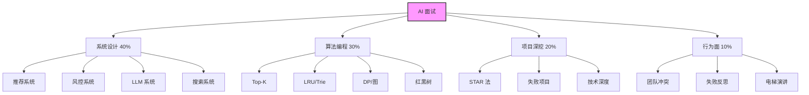
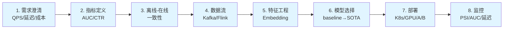
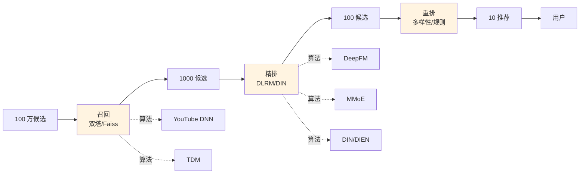
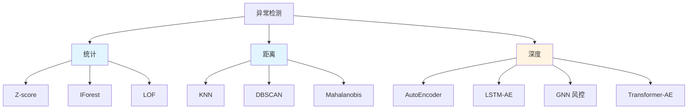
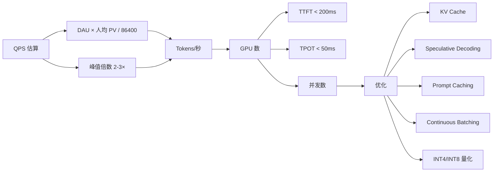
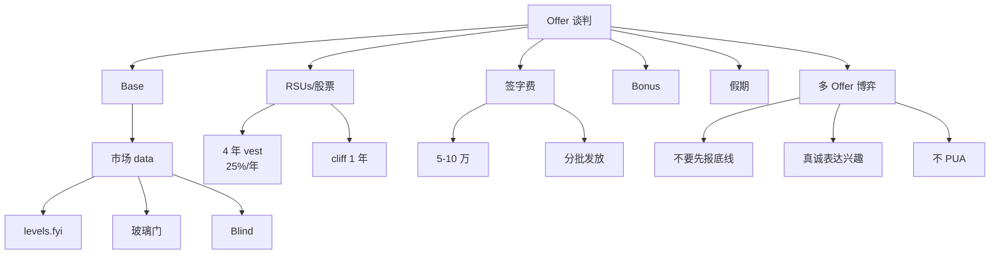

# Ch25 AI 系统实战面试指南 · 信息图

---

## 信息图:4 类面试全景

---

## 信息图:ML 系统设计 8 步

---

## 信息图:推荐系统 3 段式

---

## 信息图:风控异常检测 3 流派

---

## 信息图:LLM 系统容量规划

---

## 信息图:Offer 谈判矩阵

---

## 数据卡片

- **面试类型占比**: 系统设计 40% / 算法 30% / 项目 20% / 行为 10%
- **大厂 8 步框架**: 需求/指标/离线-在线/数据流/特征/模型/部署/监控
- **抖音推荐**: 双塔召回 → DIN 精排 → 重排
- **异常检测**: 风控准确率 95%+ (头部公司)
- **1 千万 DAU LLM**: 约 100-200 张 A100 等价
- **LeetCode Hot 100**: Top-K (347) / LRU (146) / 并查集
- **Offer 4 件套**: Base + RSUs + 签字费 + Bonus