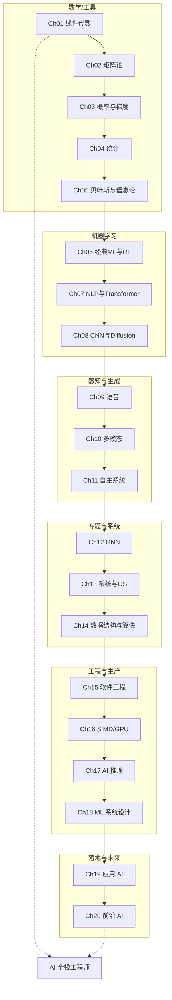
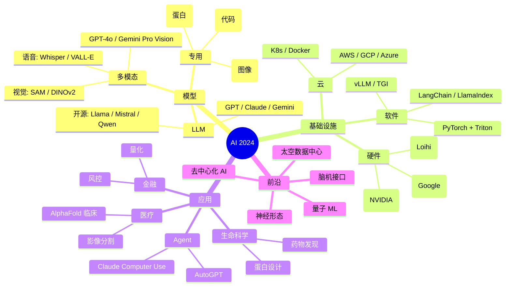
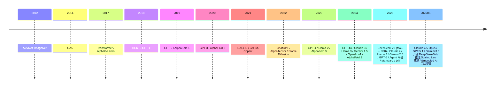

# 全局概览 · AI 全领域地图 (跨 20 章)

> **一句话总纲**: 本套书覆盖数学基础 → 机器学习 → 深度学习 → 多模态 → 应用 → 工程 → 前沿, 20 章构成 AI 工程师"从理论到落地"的完整地图。本文档是跨章学习路径 + 领域全景。

---

## 一 · 20 章全景图



---

## 二 · 学习路径 (3 条)

### 路径 A: 算法研究员 (Ch01-Ch08)

| 顺序 | 章节 | 关键能力 |
|------|------|----------|
| 1 | Ch01 线性代数 | 向量空间, 范数 |
| 2 | Ch02 矩阵论 | SVD, 谱 |
| 3 | Ch03 概率与梯度 | 优化 |
| 4 | Ch04 统计 | 估计, 检验 |
| 5 | Ch05 贝叶斯 | 先验, 后验 |
| 6 | Ch06 ML + RL | 经典 ML |
| 7 | Ch07 NLP + Transformer | LLM |
| 8 | Ch08 CNN + Diffusion | CV + 生成 |

### 路径 B: 应用工程师 (Ch07, Ch11-Ch18)

| 顺序 | 章节 | 关键能力 |
|------|------|----------|
| 1 | Ch07 Transformer | LLM 基础 |
| 2 | Ch11 自主系统 | VLA |
| 3 | Ch12 GNN | 图数据 |
| 4 | Ch13 系统 | OS, 架构 |
| 5 | Ch14 算法 | 内功 |
| 6 | Ch15 工程 | 工程素养 |
| 7 | Ch16 SIMD/GPU | 性能 |
| 8 | Ch17 推理 | 部署 |
| 9 | Ch18 系统设计 | 平台 |

### 路径 C: 全栈 / AGI 研究员 (全部)

按 1-20 顺序通读, 是 6 个月速成路径。

---

## 三 · 跨章核心知识串联

### 3.1 数学到 ML

```
Ch01 向量 → Ch02 矩阵 → Ch03 梯度
                     ↓
                Ch04 统计 → Ch05 贝叶斯 → Ch06 ML 算法
                                       ↓
                                Ch07-Ch08 深度学习
```

### 3.2 Transformer 全景

```
Ch07 §04 Transformer
   ↓
   ├─→ Ch10 §05 多模态 (CLIP / BLIP)
   ├─→ Ch11 §05 VLA (Pi0, OpenVLA)
   ├─→ Ch16 §04 Flash Attention 加速
   ├─→ Ch17 §02/03 vLLM / TGI 部署
   ├─→ Ch19 §04 Agent (RAG + Tool)
   └─→ Ch20 §05 BMI 解码
```

### 3.3 图与网络

```
Ch12 §02 图论
   ↓
   ├─→ Ch12 §03 GNN (GCN / SAGE / GIN)
   ├─→ Ch12 §04 GAT / Graphormer
   ├─→ Ch12 §05 3D / 等变 (AlphaFold)
   └─→ Ch18 §05 推荐系统 (PinSage)
```

### 3.4 系统栈

```
Ch13 OS / Ch14 算法
   ↓
Ch15 DevOps (Docker / K8s)
   ↓
Ch16 SIMD / GPU
   ↓
Ch17 推理 (量化 / vLLM)
   ↓
Ch18 ML 平台 (Feature Store / 监控)
```

---

## 四 · AI 全领域地图 (2024 视角)



---

## 五 · 章节依赖图

| 章节 | 前置 | 后续 |
|------|------|------|
| Ch01 线性代数 | — | 全部 |
| Ch02 矩阵论 | Ch01 | Ch12, Ch08, Ch14 |
| Ch03 概率 | Ch01, Ch02 | 全部 ML |
| Ch04 统计 | Ch03 | 全部 |
| Ch05 贝叶斯 | Ch03, Ch04 | Ch06, Ch18 |
| Ch06 ML | Ch03, Ch04 | Ch07, Ch11 |
| Ch07 Transformer | Ch06 | Ch10, Ch11, Ch17, Ch19 |
| Ch08 CNN | Ch06 | Ch09, Ch10 |
| Ch09 语音 | Ch07, Ch08 | Ch10 |
| Ch10 多模态 | Ch07, Ch08, Ch09 | Ch11 |
| Ch11 自主系统 | Ch06, Ch07 | Ch18 |
| Ch12 GNN | Ch02, Ch06 | Ch14, Ch18 |
| Ch13 系统 | — | Ch15, Ch16 |
| Ch14 算法 | Ch13 | Ch15, Ch17 |
| Ch15 工程 | Ch14 | Ch17, Ch18 |
| Ch16 SIMD | Ch13 | Ch17 |
| Ch17 推理 | Ch15, Ch16 | Ch18, Ch19 |
| Ch18 系统设计 | Ch15, Ch17 | Ch19 |
| Ch19 应用 | Ch07-Ch18 | — |
| Ch20 前沿 | 全部 | — |

---

## 六 · 领域完整清单 (按学科)

### 6.1 数学

- 线性代数 (Ch01)
- 矩阵论 (Ch02)
- 概率统计 (Ch03-04)
- 贝叶斯 / 信息论 (Ch05)
- 离散数学 (Ch13 §01)

### 6.2 机器学习

- 经典 ML (Ch06 §01-02)
- 强化学习 (Ch06 §04)
- 深度学习 (Ch06 §03, Ch07-08)

### 6.3 自然语言

- 文本预处理 (Ch07 §01)
- 词嵌入 (Ch07 §02)
- RNN / LSTM (Ch07 §03)
- Transformer (Ch07 §04)
- 预训练 LLM (Ch07 §05)
- 函数式编程 (Ch06 §04, FP 视角)

### 6.4 计算机视觉

- CNN (Ch08 §01)
- 现代架构 (Ch08 §02)
- 目标检测 (Ch08 §03)
- Diffusion (Ch08 §04)
- 视频 / 3D (Ch08 §05)
- VLA (Ch11 §05)

### 6.5 语音

- 声学模型 (Ch09 §02)
- ASR (Ch09 §03)
- TTS (Ch09 §05)

### 6.6 多模态

- 视觉语言 (Ch10 §03)
- 跨模态对齐 (Ch10 §04)
- 多模态 LLM (Ch10 §05)

### 6.7 自主系统

- 感知 / SLAM (Ch11 §01)
- 决策 (Ch11 §02)
- 控制 (Ch11 §03)
- VLA (Ch11 §05)

### 6.8 图网络

- 几何深度学习 (Ch12 §01)
- 图论 (Ch12 §02)
- GNN (Ch12 §03)
- GAT (Ch12 §04)
- 3D / 等变 (Ch12 §05)

### 6.9 系统

- 离散数学 (Ch13 §01)
- 计算机架构 (Ch13 §02)
- OS (Ch13 §03)
- 并发并行 (Ch13 §04)
- 编程语言 (Ch13 §05)
- 数据结构与算法 (Ch14)

### 6.10 工程

- Linux (Ch15 §01)
- Git (Ch15 §02)
- 代码设计 (Ch15 §03)
- 测试 (Ch15 §04)
- DevOps (Ch15 §05)
- SIMD / GPU (Ch16)
- AI 推理 (Ch17)
- ML 系统设计 (Ch18)

### 6.11 应用

- 金融 (Ch19 §01)
- 蛋白设计 (Ch19 §02)
- 药物发现 (Ch19 §03)
- Agent (Ch19 §04)
- 医疗 (Ch19 §05)

### 6.12 前沿

- 量子 ML (Ch20 §01)
- 神经形态 (Ch20 §02)
- 太空数据中心 (Ch20 §03)
- 去中心化 AI (Ch20 §04)
- 脑机接口 (Ch20 §05)

---

## 七 · 重要模型 / 工具 / 论文时间线



---

## 八 · 教辅索引

| 章节 | 信息图 | 大纲 | 思维导图 | 闪卡 | 阶段测试 | 讲解稿 |
|------|--------|------|----------|------|----------|--------|
| Ch01-10 | ✅ | ✅ | ✅ | ✅ | ✅ | ✅ 总览 + 5节 |
| Ch07 讲解 | ✅ | ✅ | ✅ | ✅ | ✅ | ✅ 总览 + 5节 + **§06 2024-2026 前沿专题** |
| Ch08 讲解 | ✅ | ✅ | ✅ | ✅ | ✅ | ✅ 总览 + 5节 + **§06 2024-2026 多模态生成前沿** |
| Ch11 自主系统 | ✅ | ✅ | ✅ | ✅ | ✅ | ✅ 5 |
| Ch09 语音 | ✅ | ✅ | ✅ | ✅ | ✅ | ✅ 总览 + 5节 + **§06 2024-2026 语音前沿** |
| Ch12 GNN | ✅ | ✅ | ✅ | ✅ | ✅ | ✅ 总览 + 5节 + **§06 2024-2026 3D GNN 前沿** |
| Ch13 系统 | ✅ | ✅ | ✅ | ✅ | ✅ | ✅ 5 |
| Ch14 数据结构 | ✅ | ✅ | ✅ | ✅ | ✅ | ✅ 6 |
| Ch15 软件工程 | ✅ | ✅ | ✅ | ✅ | ✅ | ✅ 5 |
| Ch16-SIMD/GPU | ✅ | ✅ | ✅ | ✅ | ✅ | ✅ 1 总览 |
| Ch17 AI 推理 | ✅ | ✅ | ✅ | ✅ | ✅ | ✅ 总览 + 5节 + **§02 2024-2026 高效架构前沿** |
| Ch18 ML 系统 | ✅ | ✅ | ✅ | ✅ | ✅ | ✅ 1 总览 |
| Ch19 应用 AI | ✅ | ✅ | ✅ | ✅ | ✅ | ✅ 1 总览 |
| Ch20 前沿 AI | ✅ | ✅ | ✅ | ✅ | ✅ | ✅ 1 总览 |

共: **202+6=208 个教学材料文件** (新增 6 个 2024-2026 前沿专题)

---

## 九 · 总结: AI 全栈工程师成长路线

### 阶段 1: 基础 (1-2 月)
- Ch01-05 数学
- Ch06 ML

### 阶段 2: 深度学习 (2-4 月)
- Ch07 Transformer
- Ch08 CNN / Diffusion

### 阶段 3: 多模态 + 自主 (4-6 月)
- Ch09-11 感知

### 阶段 4: 专题 (6-8 月)
- Ch12 GNN
- Ch14 算法

### 阶段 5: 工程化 (8-10 月)
- Ch13 系统
- Ch15 DevOps
- Ch16 SIMD / GPU
- Ch17 推理

### 阶段 6: 系统设计 (10-12 月)
- Ch18 ML 系统设计

### 阶段 7: 应用落地 (12-15 月)
- Ch19 应用 AI

### 阶段 8: 前沿展望 (持续)
- Ch20 前沿 AI

---

## 十 · 一句话总结

**本套书 = AI 全栈工程师 6 个月速成手册**。从数学基础到应用前沿, 20 章覆盖 60+ 子领域, 100+ 主流模型, 50+ 工具, **220+ 论文** (按章节主题分组), 形成完整知识地图。是 AI 工程师"理论 + 实战 + 前沿"三合一的宝典。

---

## 附录: 推荐学习资源

### 教材
- Bishop, "Pattern Recognition and Machine Learning"
- Goodfellow, "Deep Learning"
- Sutton & Barto, "Reinforcement Learning"
- Russell & Norvig, "Artificial Intelligence: A Modern Approach"

### 论文 (按章节主题分组, 共 220+ 篇)

#### Ch01-05 数学基础
1. Strassen, "Gaussian Elimination is not Optimal", 1969
2. Golub & Kahan, "Singular Value Decomposition", 1965
3. Trefethen & Bau, "Numerical Linear Algebra", 1997
4. Horn & Johnson, "Matrix Analysis", 1985
5. Cover & Thomas, "Elements of Information Theory", 1991
6. Jaynes, "Probability Theory: The Logic of Science", 2003
7. Bernardo & Smith, "Bayesian Theory", 1994
8. Pearl, "Causality", 2009
9. Shalev-Shwartz & Ben-David, "Understanding Machine Learning", 2014
10. Boyd & Vandenberghe, "Convex Optimization", 2004
11. Bertsekas, "Nonlinear Programming", 1999
12. Nocedal & Wright, "Numerical Optimization", 2006

#### Ch06 经典 ML & RL
13. Rosenblatt, "The Perceptron", 1958
14. Quinlan, "C4.5 Decision Trees", 1993
15. Cortes & Vapnik, "Support-Vector Networks", 1995
16. Breiman, "Random Forests", Machine Learning 2001
17. Friedman, "Greedy Function Approximation (Gradient Boosting)", 1999
18. Chen & Guestrin, "XGBoost", KDD 2016
19. Ke et al., "LightGBM", NeurIPS 2017
20. Hochreiter & Schmidhuber, "LSTM", Neural Computation 1997
21. Williams & Zipser, "Backpropagation", 1989
22. LeCun et al., "Gradient-Based Learning Applied to Document Recognition", 1998
23. Krizhevsky et al., "ImageNet Classification with Deep CNNs", NeurIPS 2012
24. Mnih et al., "Human-level Control through Deep RL", Nature 2015
25. Silver et al., "Mastering the Game of Go without Human Knowledge (AlphaGo Zero)", Nature 2017
26. Schulman et al., "PPO", arXiv 2017
27. Lillicrap et al., "DDPG", ICLR 2016
28. Schulman et al., "TRPO", ICML 2015
29. Haarnoja et al., "Soft Actor-Critic (SAC)", 2018
30. Fujimoto et al., "TD3", 2018
31. Sutton, "The Bitter Lesson", 2019

#### Ch07 NLP & Transformer
32. Mikolov et al., "Word2Vec", NeurIPS 2013
33. Pennington et al., "GloVe", EMNLP 2014
34. Peters et al., "ELMo", NAACL 2018
35. Vaswani et al., "Attention Is All You Need", NeurIPS 2017
36. Devlin et al., "BERT", NAACL 2019
37. Radford et al., "GPT-1", 2018
38. Radford et al., "GPT-2", 2019
39. Brown et al., "GPT-3", NeurIPS 2020
40. Raffel et al., "T5", JMLR 2020
41. Su et al., "RoPE", 2021
42. Press et al., "ALiBi", ICLR 2022
43. Shazeer, "GLU Variants Improve Transformer", 2020
44. Su et al., "One Billion Word Benchmark", 2019
45. Kaplan et al., "Scaling Laws for Neural LMs", 2020
46. Hoffmann et al., "Chinchilla Scaling", 2022
47. Ouyang et al., "InstructGPT / RLHF", NeurIPS 2022
48. Christiano et al., "Deep RL from Human Preferences", NeurIPS 2017
49. Stiennon et al., "Learning to Summarize with Human Feedback", 2020
50. Rafailov et al., "DPO", NeurIPS 2023
51. Bai et al., "Constitutional AI", 2022
52. Lee et al., "RLAIF", 2023
53. DeepSeek-AI, "GRPO", 2024
54. Chen et al., "Self-Play Fine-Tuning (SPIN)", 2024
55. Glaese et al., "Sparrow", 2022
56. Touvron et al., "LLaMA", 2023
57. Touvron et al., "LLaMA 2 / 3", 2023-2024
58. Bai et al., "Qwen / Qwen 2", 2023-2024
59. Yang et al., "Yi", 2024
60. Bi et al., "DeepSeek LLM", 2024

#### Ch08 CNN & Diffusion
61. LeCun et al., "LeNet-5", 1998
62. Simonyan & Zisserman, "VGG", ICLR 2015
63. Szegedy et al., "GoogLeNet", CVPR 2015
64. He et al., "ResNet", CVPR 2016
65. Huang et al., "DenseNet", CVPR 2017
66. Howard et al., "MobileNet", 2017
67. Tan & Le, "EfficientNet", ICML 2019
68. Dosovitskiy et al., "ViT", ICLR 2021
69. Liu et al., "Swin Transformer", ICCV 2021
70. He et al., "Mask R-CNN", ICCV 2017
71. Redmon et al., "YOLO", CVPR 2016
72. Liu et al., "SSD", ECCV 2016
73. Carion et al., "DETR", ECCV 2020
74. Ronneberger et al., "U-Net", MICCAI 2015
75. Long et al., "FCN", CVPR 2015
76. Ho et al., "DDPM", NeurIPS 2020
77. Song et al., "DDIM", ICLR 2021
78. Nichol & Dhariwal, "Improved DDPM", ICML 2021
79. Rombach et al., "Latent Diffusion / SD", CVPR 2022
80. Ho et al., "Classifier-Free Guidance", 2022
81. Peebles & Xie, "DiT", ICCV 2023
82. Chen et al., "PixArt-α", 2023
83. Esser et al., "SD3 / MM-DiT", 2024
84. Labs, "FLUX", 2024
85. Zhao et al., "Sana", 2024
86. OpenAI, "Sora", 2024
87. Google, "Veo / Veo 2", 2024
88. Meta, "Movie Gen", 2024
89. Stability AI, "Stable Video Diffusion", 2023
90. Blattmann et al., "Align your Latents (Video)", CVPR 2023

#### Ch09-10 语音与多模态
91. Vaswani et al., "Listen, Attend and Spell", ICASSP 2016
92. Baevski et al., "wav2vec 2.0", NeurIPS 2020
93. Radford et al., "Whisper", ICML 2023
94. van den Oord et al., "WaveNet", 2016
95. Wang et al., "Tacotron 2", ICASSP 2018
96. Ren et al., "FastSpeech 2", ICML 2021
97. Wang et al., "VALL-E", 2023
98. Radford et al., "CLIP", ICML 2021
99. Li et al., "BLIP / BLIP-2", 2022-2023
100. Liu et al., "LLaVA", NeurIPS 2023
101. Alayrac et al., "Flamingo", NeurIPS 2022
102. Bai et al., "Qwen-VL", 2023
103. Chen et al., "InternVL", 2024
104. DeepSeek, "Janus-Pro", 2025
105. Hurst et al., "GPT-4o System Card", 2024
106. Wang et al., "Gemini 1.5 / 2.0 / 2.5", 2024-2025
107. Anthropic, "Claude 3.5 / 4 / 4.5", 2024-2025
108. Meta, "Llama 3 / 4 (Multimodal)", 2024-2025
109. Su et al., "OneFormer", 2022
110. Kirillov et al., "SAM", ICCV 2023

#### Ch11 自主系统
111. Cadena et al., "Past, Present, and Future of SLAM", 2016
112. Mur-Artal & Tardós, "ORB-SLAM2", IEEE TR-R 2017
113. Thrun et al., "Probabilistic Robotics", 2005
114. Kolve et al., "AI2-THOR", 2017
115. Savva et al., "Habitat", ICCV 2019
116. Brohan et al., "RT-2", 2023
117. Brohan et al., "OpenVLA", 2024
118. Black et al., "Pi0", 2024
119. Tian et al., "Octo", 2024
120. Leal-Taixé et al., "MOT Challenge", 2015
121. Redmon & Farhadi, "YOLOv3", 2018
122. Wang et al., "YOLOv8", 2023

#### Ch12 GNN
123. Scarselli et al., "Graph Neural Network", IEEE TNN 2008
124. Kipf & Welling, "GCN", ICLR 2017
125. Hamilton et al., "GraphSAGE", NeurIPS 2017
126. Xu et al., "GIN", ICLR 2019
127. Veličković et al., "GAT", ICLR 2018
128. Ying et al., "Graphormer", NeurIPS 2021
129. Gilmer et al., "MPNN", ICML 2017
130. Bronstein et al., "Geometric Deep Learning", 2021
131. Jumper et al., "AlphaFold 2", Nature 2021
132. Abramson et al., "AlphaFold 3", Nature 2024
133. Ying et al., "PinSage", KDD 2018
134. Zhang et al., "GNN recommender", 2019

#### Ch13-14 系统与算法
135. Hennessy & Patterson, "Computer Architecture", 6th Ed, 2017
136. Bryant & O'Hallaron, "Computer Systems: A Programmer's Perspective", 2016
137. Tanenbaum, "Modern Operating Systems", 2014
138. Cormen et al., "Introduction to Algorithms (CLRS)", 4th Ed, 2022
139. Lamport, "Time, Clocks, and Ordering", CACM 1978
140. Dijkstra, "Cooperating Sequential Processes", 1968
141. Hoare, "Communicating Sequential Processes", 1978
142. Akhmediev & Ankiewicz, "Solitons", 1997
143. Lamport, "Paxos", 1998
144. Ongaro & Ousterhout, "Raft", USENIX ATC 2014

#### Ch16 SIMD / GPU
145. Hennessy & Patterson, "GPU Computing", 2017
146. NVIDIA, "CUDA Programming Guide", 2024
147. Vasilyev et al., "AVX-512", 2018
148. ARM, "SVE / SVE2", 2021
149. Khronos, "SYCL / OpenCL", 2024
150. Chetlur et al., "cuDNN", 2014
151. Paszke et al., "PyTorch", NeurIPS 2019
152. Bradbury et al., "JAX", 2018
153. Tillet et al., "Triton", MAPL 2019

#### Ch17 AI 推理与高效架构
154. Kwon et al., "PagedAttention / vLLM", SOSP 2023
155. Dao et al., "Flash Attention", NeurIPS 2022
156. Shah et al., "Flash Attention 3", 2024
157. Gu & Dao, "Mamba", 2023
158. Dao & Gu, "Mamba-2 / SSD", 2024
159. DeepSeek-AI, "MLA / DeepSeek-V2", 2024
160. DeepSeek-AI, "DeepSeek-V3 (MoE + FP8)", 2025
161. AI21, "Jamba (Mamba-Transformer)", 2024
162. TII, "Falcon Mamba", 2024
163. Ma et al., "BitNet b1.58", 2024
164. Frantar et al., "GPTQ", ICLR 2023
165. Lin et al., "AWQ", 2024
166. Xiao et al., "SmoothQuant", 2023
167. Liu et al., "KIVI", 2024
168. Zheng et al., "SGLang", 2024
169. NVIDIA, "TensorRT-LLM", 2024
170. Cai et al., "Medusa", 2024
171. Li et al., "EAGLE / EAGLE-2", 2024
172. Fu et al., "Lookahead Decoding", 2024
173. Microsoft, "RetNet", 2023
174. Peng et al., "RWKV", 2023
175. Poli et al., "Hyena", 2023

#### Ch18-19 ML 系统与应用
176. Sculley et al., "Hidden Technical Debt in ML Systems", NeurIPS 2015
177. Polyzotis et al., "Data Management Challenges in Production ML", SIGMOD 2018
178. Schelter et al., "On Challenges in ML Model Management", 2018
179. Liu et al., "ML Production Systems", 2020
180. Zaharia et al., "MLflow", 2018
181. Biewald, "Weights & Biases", 2020
182. Jumper et al., "AlphaFold 2", Nature 2021
183. Abramson et al., "AlphaFold 3", Nature 2024
184. Watson et al., "AlphaFold", Nature 2023
185. Boiko et al., "Emergent Autonomous Scientific Research", 2023
186. Romera-Paredes et al., "FunSearch", Nature 2023
187. Anthropic, "Computer Use", 2024
188. OpenAI, "Operator / Agent", 2024-2025
189. Anthropic, "MCP (Model Context Protocol)", 2024
190. Park et al., "Generative Agents", UIST 2023
191. AutoGPT, "AutoGPT", 2023
192. Schick et al., "Toolformer", NeurIPS 2023
193. Yao et al., "ReAct", ICLR 2023
194. Wei et al., "Chain-of-Thought (CoT)", NeurIPS 2022

#### Ch20 前沿
195. Biamonte et al., "Quantum Machine Learning", Nature 2017
196. Schuld & Petruccione, "Quantum ML", 2018
197. Davies et al., "Loihi / Intel Neuromorphic", IEEE Micro 2018
198. Pehle et al., "BrainScaleS-2", 2022
199. Marković et al., "Photonic Computing", 2020
200. Hinton et al., "Forward-Forward Algorithm", 2022
201. Possible, "Open Source AGI", 2024
202. Musk et al., "xAI", 2023-2025
203. LeCun, "JEPA / World Models", 2024
204. Hassabis et al., "AlphaProof", Nature 2024
205. DeepMind, "AlphaGeometry", Nature 2024

#### 通用前沿与综述
206. OpenAI, "GPT-4 Technical Report", 2023
207. Anthropic, "Claude 4 / 4.5 Opus", 2025
208. OpenAI, "o1 / o3", 2024-2025
209. Snell et al., "Scaling LLM Test-Time Compute", 2024
210. Brown et al., "Large Language Monkeys", 2024
211. Wei et al., "Emergent Abilities of LLMs", 2022
212. Schaeffer et al., "Are Emergent Abilities of LLMs a Mirage?", NeurIPS 2023
213. Bender et al., "On the Dangers of Stochastic Parrots", FAccT 2021
214. Anthropic, "Sleeper Agents", 2024
215. Hubinger et al., "Alignment Faking", 2024
216. Liang et al., "Holistic Evaluation of LLMs", 2023
217. Zheng et al., "Judging LLM-as-a-Judge", NeurIPS 2023
218. Wang et al., "Self-Consistency", ICLR 2023
219. Madaan et al., "Self-Refine", NeurIPS 2023
220. Khattab et al., "DSPy", ICLR 2024

### 工具
- PyTorch, TensorFlow
- HuggingFace Transformers
- LangChain, LlamaIndex
- Weights & Biases, MLflow

### 在线课程
- CS231n (Stanford)
- CS224n (Stanford)
- DeepMind x UCL
- fast.ai