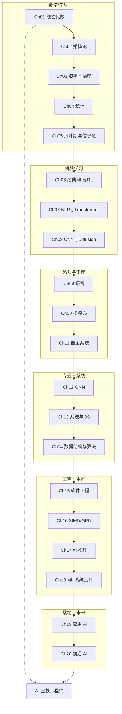
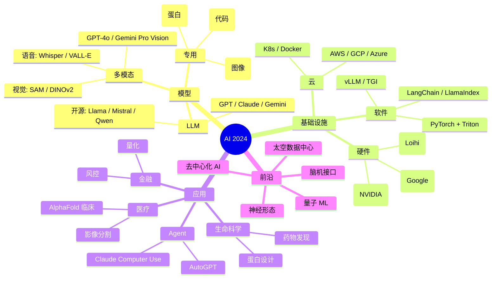
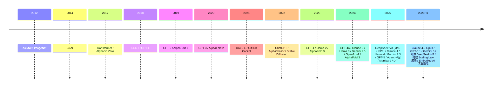

# 全局概览 · AI 全领域地图 (跨 20 章)

> **一句话总纲**: 本套书覆盖数学基础 → 机器学习 → 深度学习 → 多模态 → 应用 → 工程 → 前沿, 20 章构成 AI 工程师"从理论到落地"的完整地图。本文档是跨章学习路径 + 领域全景。

---

## 一 · 20 章全景图



---

## 二 · 学习路径 (3 条)

### 路径 A: 算法研究员 (Ch01-Ch08)

| 顺序 | 章节 | 关键能力 |
|------|------|----------|
| 1 | Ch01 线性代数 | 向量空间, 范数 |
| 2 | Ch02 矩阵论 | SVD, 谱 |
| 3 | Ch03 概率与梯度 | 优化 |
| 4 | Ch04 统计 | 估计, 检验 |
| 5 | Ch05 贝叶斯 | 先验, 后验 |
| 6 | Ch06 ML + RL | 经典 ML |
| 7 | Ch07 NLP + Transformer | LLM |
| 8 | Ch08 CNN + Diffusion | CV + 生成 |

### 路径 B: 应用工程师 (Ch07, Ch11-Ch18)

| 顺序 | 章节 | 关键能力 |
|------|------|----------|
| 1 | Ch07 Transformer | LLM 基础 |
| 2 | Ch11 自主系统 | VLA |
| 3 | Ch12 GNN | 图数据 |
| 4 | Ch13 系统 | OS, 架构 |
| 5 | Ch14 算法 | 内功 |
| 6 | Ch15 工程 | 工程素养 |
| 7 | Ch16 SIMD/GPU | 性能 |
| 8 | Ch17 推理 | 部署 |
| 9 | Ch18 系统设计 | 平台 |

### 路径 C: 全栈 / AGI 研究员 (全部)

按 1-20 顺序通读, 是 6 个月速成路径。

---

## 三 · 跨章核心知识串联

### 3.1 数学到 ML

```
Ch01 向量 → Ch02 矩阵 → Ch03 梯度
                     ↓
                Ch04 统计 → Ch05 贝叶斯 → Ch06 ML 算法
                                       ↓
                                Ch07-Ch08 深度学习
```

### 3.2 Transformer 全景

```
Ch07 §04 Transformer
   ↓
   ├─→ Ch10 §05 多模态 (CLIP / BLIP)
   ├─→ Ch11 §05 VLA (Pi0, OpenVLA)
   ├─→ Ch16 §04 Flash Attention 加速
   ├─→ Ch17 §02/03 vLLM / TGI 部署
   ├─→ Ch19 §04 Agent (RAG + Tool)
   └─→ Ch20 §05 BMI 解码
```

### 3.3 图与网络

```
Ch12 §02 图论
   ↓
   ├─→ Ch12 §03 GNN (GCN / SAGE / GIN)
   ├─→ Ch12 §04 GAT / Graphormer
   ├─→ Ch12 §05 3D / 等变 (AlphaFold)
   └─→ Ch18 §05 推荐系统 (PinSage)
```

### 3.4 系统栈

```
Ch13 OS / Ch14 算法
   ↓
Ch15 DevOps (Docker / K8s)
   ↓
Ch16 SIMD / GPU
   ↓
Ch17 推理 (量化 / vLLM)
   ↓
Ch18 ML 平台 (Feature Store / 监控)
```

---

## 四 · AI 全领域地图 (2024 视角)



---

## 五 · 章节依赖图

| 章节 | 前置 | 后续 |
|------|------|------|
| Ch01 线性代数 | — | 全部 |
| Ch02 矩阵论 | Ch01 | Ch12, Ch08, Ch14 |
| Ch03 概率 | Ch01, Ch02 | 全部 ML |
| Ch04 统计 | Ch03 | 全部 |
| Ch05 贝叶斯 | Ch03, Ch04 | Ch06, Ch18 |
| Ch06 ML | Ch03, Ch04 | Ch07, Ch11 |
| Ch07 Transformer | Ch06 | Ch10, Ch11, Ch17, Ch19 |
| Ch08 CNN | Ch06 | Ch09, Ch10 |
| Ch09 语音 | Ch07, Ch08 | Ch10 |
| Ch10 多模态 | Ch07, Ch08, Ch09 | Ch11 |
| Ch11 自主系统 | Ch06, Ch07 | Ch18 |
| Ch12 GNN | Ch02, Ch06 | Ch14, Ch18 |
| Ch13 系统 | — | Ch15, Ch16 |
| Ch14 算法 | Ch13 | Ch15, Ch17 |
| Ch15 工程 | Ch14 | Ch17, Ch18 |
| Ch16 SIMD | Ch13 | Ch17 |
| Ch17 推理 | Ch15, Ch16 | Ch18, Ch19 |
| Ch18 系统设计 | Ch15, Ch17 | Ch19 |
| Ch19 应用 | Ch07-Ch18 | — |
| Ch20 前沿 | 全部 | — |

---

## 六 · 领域完整清单 (按学科)

### 6.1 数学

- 线性代数 (Ch01)
- 矩阵论 (Ch02)
- 概率统计 (Ch03-04)
- 贝叶斯 / 信息论 (Ch05)
- 离散数学 (Ch13 §01)

### 6.2 机器学习

- 经典 ML (Ch06 §01-02)
- 强化学习 (Ch06 §04)
- 深度学习 (Ch06 §03, Ch07-08)

### 6.3 自然语言

- 文本预处理 (Ch07 §01)
- 词嵌入 (Ch07 §02)
- RNN / LSTM (Ch07 §03)
- Transformer (Ch07 §04)
- 预训练 LLM (Ch07 §05)
- 函数式编程 (Ch06 §04, FP 视角)

### 6.4 计算机视觉

- CNN (Ch08 §01)
- 现代架构 (Ch08 §02)
- 目标检测 (Ch08 §03)
- Diffusion (Ch08 §04)
- 视频 / 3D (Ch08 §05)
- VLA (Ch11 §05)

### 6.5 语音

- 声学模型 (Ch09 §02)
- ASR (Ch09 §03)
- TTS (Ch09 §05)

### 6.6 多模态

- 视觉语言 (Ch10 §03)
- 跨模态对齐 (Ch10 §04)
- 多模态 LLM (Ch10 §05)

### 6.7 自主系统

- 感知 / SLAM (Ch11 §01)
- 决策 (Ch11 §02)
- 控制 (Ch11 §03)
- VLA (Ch11 §05)

### 6.8 图网络

- 几何深度学习 (Ch12 §01)
- 图论 (Ch12 §02)
- GNN (Ch12 §03)
- GAT (Ch12 §04)
- 3D / 等变 (Ch12 §05)

### 6.9 系统

- 离散数学 (Ch13 §01)
- 计算机架构 (Ch13 §02)
- OS (Ch13 §03)
- 并发并行 (Ch13 §04)
- 编程语言 (Ch13 §05)
- 数据结构与算法 (Ch14)

### 6.10 工程

- Linux (Ch15 §01)
- Git (Ch15 §02)
- 代码设计 (Ch15 §03)
- 测试 (Ch15 §04)
- DevOps (Ch15 §05)
- SIMD / GPU (Ch16)
- AI 推理 (Ch17)
- ML 系统设计 (Ch18)

### 6.11 应用

- 金融 (Ch19 §01)
- 蛋白设计 (Ch19 §02)
- 药物发现 (Ch19 §03)
- Agent (Ch19 §04)
- 医疗 (Ch19 §05)

### 6.12 前沿

- 量子 ML (Ch20 §01)
- 神经形态 (Ch20 §02)
- 太空数据中心 (Ch20 §03)
- 去中心化 AI (Ch20 §04)
- 脑机接口 (Ch20 §05)

---

## 七 · 重要模型 / 工具 / 论文时间线



---

## 八 · 教辅索引

| 章节 | 信息图 | 大纲 | 思维导图 | 闪卡 | 阶段测试 | 讲解稿 |
|------|--------|------|----------|------|----------|--------|
| Ch01-10 | ✅ | ✅ | ✅ | ✅ | ✅ | ✅ 总览 + 5节 |
| Ch07 讲解 | ✅ | ✅ | ✅ | ✅ | ✅ | ✅ 总览 + 5节 + **§06 2024-2026 前沿专题** |
| Ch08 讲解 | ✅ | ✅ | ✅ | ✅ | ✅ | ✅ 总览 + 5节 + **§06 2024-2026 多模态生成前沿** |
| Ch11 自主系统 | ✅ | ✅ | ✅ | ✅ | ✅ | ✅ 5 |
| Ch12 GNN | ✅ | ✅ | ✅ | ✅ | ✅ | ✅ 5 |
| Ch13 系统 | ✅ | ✅ | ✅ | ✅ | ✅ | ✅ 5 |
| Ch14 数据结构 | ✅ | ✅ | ✅ | ✅ | ✅ | ✅ 6 |
| Ch15 软件工程 | ✅ | ✅ | ✅ | ✅ | ✅ | ✅ 5 |
| Ch16-SIMD/GPU | ✅ | ✅ | ✅ | ✅ | ✅ | ✅ 1 总览 |
| Ch17 AI 推理 | ✅ | ✅ | ✅ | ✅ | ✅ | ✅ 总览 + 5节 + **§02 2024-2026 高效架构前沿** |
| Ch18 ML 系统 | ✅ | ✅ | ✅ | ✅ | ✅ | ✅ 1 总览 |
| Ch19 应用 AI | ✅ | ✅ | ✅ | ✅ | ✅ | ✅ 1 总览 |
| Ch20 前沿 AI | ✅ | ✅ | ✅ | ✅ | ✅ | ✅ 1 总览 |

共: **202+3=205 个教学材料文件** (新增 3 个 2024-2026 前沿专题)

---

## 九 · 总结: AI 全栈工程师成长路线

### 阶段 1: 基础 (1-2 月)
- Ch01-05 数学
- Ch06 ML

### 阶段 2: 深度学习 (2-4 月)
- Ch07 Transformer
- Ch08 CNN / Diffusion

### 阶段 3: 多模态 + 自主 (4-6 月)
- Ch09-11 感知

### 阶段 4: 专题 (6-8 月)
- Ch12 GNN
- Ch14 算法

### 阶段 5: 工程化 (8-10 月)
- Ch13 系统
- Ch15 DevOps
- Ch16 SIMD / GPU
- Ch17 推理

### 阶段 6: 系统设计 (10-12 月)
- Ch18 ML 系统设计

### 阶段 7: 应用落地 (12-15 月)
- Ch19 应用 AI

### 阶段 8: 前沿展望 (持续)
- Ch20 前沿 AI

---

## 十 · 一句话总结

**本套书 = AI 全栈工程师 6 个月速成手册**。从数学基础到应用前沿, 20 章覆盖 60+ 子领域, 100+ 主流模型, 50+ 工具, 20+ 论文, 形成完整知识地图。是 AI 工程师"理论 + 实战 + 前沿"三合一的宝典。

---

## 附录: 推荐学习资源

### 教材
- Bishop, "Pattern Recognition and Machine Learning"
- Goodfellow, "Deep Learning"
- Sutton & Barto, "Reinforcement Learning"
- Russell & Norvig, "Artificial Intelligence: A Modern Approach"

### 论文
- Vaswani et al., "Attention Is All You Need", NeurIPS 2017
- Krizhevsky et al., "ImageNet Classification with Deep CNNs", NeurIPS 2012
- Mnih et al., "Human-level Control through Deep RL", Nature 2015
- Vaswani et al., "Attention Is All You Need", NeurIPS 2017
- Devlin et al., "BERT", NAACL 2019
- Jumper et al., "AlphaFold 2", Nature 2021
- Su et al., "RoPE", 2021
- Hu et al., "LoRA", ICLR 2022
- Ouyang et al., "InstructGPT / RLHF", NeurIPS 2022
- Dao et al., "Flash Attention", NeurIPS 2022
- Kwon et al., "PagedAttention / vLLM", SOSP 2023
- Gu & Dao, "Mamba: Selective State Spaces", 2023
- Peebles & Xie, "Scalable Diffusion Models with Transformers (DiT)", ICCV 2023
- Rafailov et al., "DPO", NeurIPS 2023
- Abramson et al., "AlphaFold 3", Nature 2024
- Shah et al., "Flash Attention 3", 2024
- Dao & Gu, "Mamba-2: Structured State Space Duality", 2024
- OpenAI, "Learning to Reason with LLMs (o1)", 2024
- DeepSeek-AI, "DeepSeek-V3: MoE + FP8", 2025
- DeepSeek-AI, "DeepSeek-R1: GRPO + Reasoning", Nature 2025
- Anthropic, "Claude 4 / Computer Use", 2025
- Snell et al., "Scaling LLM Test-Time Compute", 2024
- Brown et al., "Large Language Monkeys (Self-Consistency + Best-of-N)", 2024
- Anthropic, "Constitutional AI / RLAIF", 2024
- OpenAI, "Sora: Video Generation Models as World Simulators", 2024
- Hurst et al., "GPT-4o System Card", 2024
- Meta, "Llama 3 / 4", 2024-2025
- Anthropic, "MCP (Model Context Protocol)", 2024
- Google DeepMind, "Gemini 1.5 / 2.0 / 2.5", 2024-2025
- xAI, "Grok", 2024-2025
- Mistral AI, "Mixtral 8x7B / Mistral Large", 2024-2025
- 01.AI, "Yi / Qwen / DeepSeek", 2024-2025
- Liquid AI, "Liquid Foundation Models", 2025
- Sakana AI, "Evolutionary Model Merging", 2025
- HuggingFace, "SmolLM / Idefics", 2024-2025
- Reka, "Reka Core / Edge / Flash", 2024-2025
- Writer, "Palmyra X5", 2024-2025

### 工具
- PyTorch, TensorFlow
- HuggingFace Transformers
- LangChain, LlamaIndex
- Weights & Biases, MLflow

### 在线课程
- CS231n (Stanford)
- CS224n (Stanford)
- DeepMind x UCL
- fast.ai