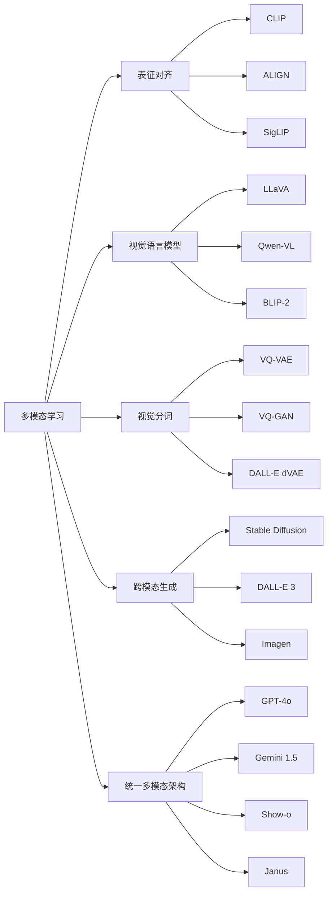

# Ch10 多模态学习 · 考研/期末复习大纲

> **承接 Ch09 口诀开篇**: "Ch09 给听觉应用 — 采样=奈奎斯特≥2f_max, MFCC=预加重→分帧→FFT→梅尔→对数→DCT, ASR=CTC/Conformer, x-vector=EER<5%. Ch10 给多模态 — 共享嵌入=对比学习 InfoNCE, 视觉分词=VQ-VAE, 文生图=扩散+CLIP, 统一架构=GPT-4o 单 Transformer 多模态."
> **跨章承接**: Ch06 §03 视觉 Transformer (ViT) → Ch10 §01 CLIP 图像编码器;Ch06 §04 注意力机制 → Ch10 §02 跨模态注意力;Ch07 §04 Transformer 文本 → Ch10 §03 视觉文本 token 化;Ch08 §03 检测/分割 → Ch10 §03 视觉 token;Ch09 §02 ASR → Ch10 §05 语音-文本;Ch11 §03 VLA → Ch10 §05 统一架构

---

## 一、考点分级速览 (🔴必考 12 / 🟡常考 14 / 🟢拓展 10 / ⭐选学 4, 共 40 考点)

| 考频 | 考点 | 说明 |
|---|---|---|
| 🔴必考 | 早期/晚期融合区别 | Ch10 §01 核心 |
| 🔴必考 | CLIP 训练目标 InfoNCE | $\tau$ 温度参数关键 |
| 🔴必考 | CLIP 零样本分类 | $p(y\|x) \propto \exp(\cos(z, T_y)/\tau)$ |
| 🔴必考 | VLM 投影层 Q-Former | 把 ViT 输出压成 LLM token |
| 🔴必考 | VQ-VAE 量化原理 | codebook size 8K-32K |
| 🔴必考 | Stable Diffusion 文本注入 | cross-attention in UNet |
| 🔴必考 | 扩散前向 $x_t = \sqrt{\bar\alpha_t}x_0 + \sqrt{1-\bar\alpha_t}\epsilon$ | Ch10 §04 + Ch06 §05 |
| 🔴必考 | 噪声预测损失 | 训练目标 L_simple |
| 🔴必考 | 视觉-语言 token 化统一 | LLM 化多模态的核心 |
| 🔴必考 | 跨模态检索 Recall@k | MS-COCO R@1 ≈ 70% |
| 🔴必考 | VQA 准确率 | VQAv2 test-dev ≈ 80% |
| 🔴必考 | 实时多模态延迟 (300 ms 内) | GPT-4o/Gemini |
| 🟡常考 | 图像-文本对 batch 大小 | CLIP 用了 32K |
| 🟡常考 | sigmoid 损失 vs softmax 对比 | SigLIP 改进 |
| 🟡常考 | 多模态幻觉问题 | MMHal-Bench |
| 🟡常考 | 文生图评估 FID/CLIP-score | FID-30k < 10 |
| 🟡常考 | VQ-GAN 损失组成 | L1 + perceptual + GAN + commitment |
| 🟡常考 | 自回归图像生成 (VAR) | next-scale prediction |
| 🟡常考 | 文图检索数据集 | MS-COCO 5K, Flickr30K |
| 🟡常考 | MMMU 大学级评测 | 30 学科 11.5K 题 |
| 🟡常考 | chartQA / DocVQA | 图表/文档问答 |
| 🟡常考 | 一致性 vs 多样性 | classifier-free guidance 调节 |
| 🟡常考 | 视觉指令微调 | LLaVA 用 GPT-4V 生成指令 |
| 🟡常考 | 图文嵌入维度 | 256 维 (CLIP) vs 4096 (LLaVA) |
| 🟡常考 | 跨模态对比符号 | ...</img> 标记 |
| 🟡拓展 | 图文双塔 vs 单塔 | 模型容量 tradeoff |
| 🟢拓展 | BLIP-2 Q-Former 训练目标 | ITC + ITM + ITG |
| 🟢拓展 | Flamingo 1-shot few-shot | 上下文学习 ICML |
| 🟢拓展 | InternVL 2.0 多阶段 | 大模型集成 |
| 🟢拓展 | 视频理解 Video-LLaMA | 时空分词 |
| 🟢拓展 | 视频生成 Sora / 可灵 | DiT 视频架构 |
| 🟢拓展 | 3D 视觉分词 | 神经辐射场 token |
| 🟢拓展 | 触觉/嗅觉多模态 | T5X 多模态扩展 |
| 🟢拓展 | 多模态 RLHF | RLHF-V / LLaVA-RLHF |
| 🟢拓展 | 跨模态攻击/防御 | 视觉 jailbreak |
| ⭐选学 | 神经辐射场 (NeRF) token | 3D 模态 |
| ⭐选学 | 神经符号多模态 | VLM + 形式逻辑 |
| ⭐选学 | 联邦多模态 | 隐私安全 |
| ⭐选学 | 通用世界模型 GAIA-1 | 自动驾驶 |

---

## 二、概念关系图谱 (Mermaid)

---

## 三、四级考点精讲 (🔴必考)

### 🔴F1: 早期融合 vs 晚期融合
- **早期融合**: 把不同模态的原始或低层特征直接拼接
  - 优点: 模型从一开始就能学到细粒度跨模态交互
  - 缺点: 输入维度大,需要学对齐不同分布的数据
  - 例: $\mathbb{R}^{d_1} \oplus \mathbb{R}^{d_2} \to \mathbb{R}^{d_1+d_2}$
- **晚期融合**: 各模态独立编码器 → 各自出预测 → 分数融合
  - 优点: 可复用预训练单模态模型,简单
  - 缺点: 学不到低层跨模态信号
  - 例: $\hat y = \alpha \hat y_1 + (1-\alpha) \hat y_2$, α 调整权重
- **混合策略 (主流)**: 中层跨模态注意力 (Q-Former, cross-attn)
  - 例: BLIP-2 在 LLM 和 ViT 之间加 32 个 query token 做 cross-attn

### 🔴F2: CLIP 对比学习
- **目标**: 在 batch 内 N 对图文对学对齐
- **损失**: 对称 InfoNCE(双向)
  $$L = -\frac{1}{2N}\sum_i [\log \frac{\exp(s_{ii}/\tau)}{\sum_j \exp(s_{ij}/\tau)} + \log \frac{\exp(s_{ii}/\tau)}{\sum_j \exp(s_{ji}/\tau)}]$$
- **超参数**: τ=0.07(CLIP), batch=32768, 32 epochs
- **零样本分类**:
  $$\hat y = \arg\max_y \cos(z_v, T_y)$$
  其中 $T_y$ 是类别名 prompt template 嵌入(常见: "a photo of a {class}")
- **结果**: ImageNet 76.2% zero-shot,优于监督 ResNet-50

### 🔴F3: VLM 投影层
- **挑战**: ViT 输出序列长(256 tokens, 1024 维),LLM 上下文长度固定
- **方案 1**: 线性投影 (LLaVA)
  $$z_v' = W \cdot \text{Flatten}(z_v)$$
- **方案 2**: Q-Former (BLIP-2) 32 个 learnable query 与 ViT 输出 cross-attn
  $$z_q = \text{CrossAttn}(Q, K=z_v, V=z_v)$$
- **方案 3**: Perceiver Resampler (Flamingo) 跨 transformer 块压缩
- **评估**: VQAv2 test-dev, MMMU(大学级), RefCOCO(指代)

### 🔴F4: VQ-VAE 离散化图像
- **编码器**: $x \to z_e$ 连续向量
- **量化**: $z_q = \arg\min_{z_k \in \mathcal{C}} \|z_e - z_k\|_2$, codebook $\mathcal{C}$ 有 8192 个 entry
- **解码器**: $z_q \to \hat{x}$
- **损失**: $\|x - \hat{x}\|_1 + \|\text{sg}[z_e] - z_q\|_2^2 + \beta \|z_e - \text{sg}[z_q]\|_2^2$
- **直通估计**: 量化操作不传梯度,反传时把 $z_q$ 的梯度代理给 $z_e$
- **应用**: DALL-E 用 dVAE 把 256×256 图像压成 32×32=1024 个 token
- **风险**: codebook collapse(部分 entry 永远不被选), 缓解:随机重启、EMA

### 🔴F5: 扩散模型 + 文本条件
- **前向扩散**: $x_t = \sqrt{\bar\alpha_t}x_0 + \sqrt{1-\bar\alpha_t}\epsilon$, $T=1000$ 步
- **反向去噪**: 学 $\epsilon_\theta(x_t, t, c)$, $c$=CLIP 文本嵌入
- **训练损失**: $L = \mathbb{E}[\|\epsilon - \epsilon_\theta(x_t, t, c)\|^2]$, 即 L_simple
- **CFG (classifier-free guidance)**:
  $$\hat\epsilon = (1+w)\epsilon_\theta(x_t, t, c) - w\epsilon_\theta(x_t, t, \emptyset)$$
  w=7.5 时 FID 变好但多样性下降
- **Stable Diffusion 关键**: 用 latent diffusion,UNet 在 4×64×64 latent 上跑

### 🔴F6: VQA 与多模态评测
- **VQAv2**: 闭集 4-选项,test-dev ≈ 80%
- **MMMU**: 大学级,30 学科 11.5K 题,GPT-4o ≈ 69%,人类 ≈ 88%
- **MMHal-Bench**: 多模态幻觉率(把不在图像的东西说成有),GPT-4o ≈ 7%
- **ChartQA / DocVQA**: 图表和文档问答,商业用途强

### 🔴F7: 实时多模态 (GPT-4o/Gemini Live)
- **延迟目标**: 平均语音响应 < 300 ms, 人类对话节奏
- **架构**: 单一 transformer 处理所有模态 token (text/audio/vision)
- **挑战**: 音频是 16 kHz 长序列 (毫秒级音素),需要 streaming
- **关键优化**: 推理时各模态共享 KV cache,音频 token 边录制边处理
- **代表能力**: 实时打断、情绪识别、唱歌、混合语种

---

## 四、公式卡片 (随时默写)

### 跨模态注意力
$$\text{Attn}(Q_v, K_t, V_t) = \text{softmax}\left(\frac{Q_v K_t^\top}{\sqrt{d_k}}\right) V_t$$

### InfoNCE 对比损失
$$L_i = -\log \frac{\exp(s(z_i, z_i^+)/\tau)}{\sum_{j=1}^N \exp(s(z_i, z_j)/\tau)}$$

### 跨模态相似度
$$s(v, t) = \frac{W_v z_v^\top W_t z_t}{\|W_v z_v\| \|W_t z_t\|}$$

### VQ 量化
$$z_q = \arg\min_{z_k \in \mathcal{C}} \|z_e - z_k\|_2$$

### 扩散前向
$$x_t = \sqrt{\bar\alpha_t} x_0 + \sqrt{1-\bar\alpha_t} \epsilon, \quad \bar\alpha_t = \prod_{s=1}^t \alpha_s$$

### 扩散反向去噪
$$p_\theta(x_{t-1}|x_t, c) = \mathcal{N}(x_{t-1}; \mu_\theta(x_t, t, c), \Sigma_\theta(x_t, t, c))$$

### CFG 加权
$$\hat\epsilon = (1+w)\epsilon_\theta(x_t, t, c) - w\epsilon_\theta(x_t, t, \emptyset)$$

### PSNR (VQ 重建质量)
$$\text{PSNR} = 10 \log_{10}\frac{255^2}{\text{MSE}}$$

---

## 五、跨章桥接 (10 道综合题)

| # | 题型 | 涉及的章 | 难度 |
|---|---|---|---|
| 综合 1 | 用 Ch06 §03 ViT + Ch10 §01 CLIP 解释为什么 ViT 适合做 CLIP 编码器 | Ch06+Ch10 | ★★★ |
| 综合 2 | 用 Ch04 §04 假设检验理解 InfoNCE 为何等价于对比检验 | Ch04+Ch10 | ★★★ |
| 综合 3 | 用 Ch03 §05 梯度下降解释 Stable Diffusion 训练 | Ch03+Ch10 | ★★ |
| 综合 4 | 用 Ch08 §05 视频理解 + Ch10 §05 解释 Sora 的时空分词 | Ch08+Ch10 | ★★★ |
| 综合 5 | 用 Ch09 §04 说话人识别 + Ch10 §05 解释 Gemini Live | Ch09+Ch10 | ★★★ |
| 综合 6 | 用 Ch05 §04 贝叶斯 + Ch10 §02 VLM 不确定性估计 | Ch05+Ch10 | ★★★ |
| 综合 7 | 用 Ch07 §04 Transformer + Ch10 §03 视觉分词对比文本 token 化的共同点 | Ch07+Ch10 | ★★ |
| 综合 8 | 用 Ch14 §03 树 + Ch10 §03 解释 VQ codebook 索引结构 | Ch14+Ch10 | ★★ |
| 综合 9 | 用 Ch17 §01 量化 + Ch10 §03 解释怎么把 VQ-VAE 部署到边缘设备 | Ch17+Ch10 | ★★★ |
| 综合 10 | 用 Ch11 §03 VLA + Ch10 §05 解释统一多模态到机器人动作 | Ch11+Ch10 | ★★★ |

---

## 六、自测题 (20 题速测)

### Part A · 单选 (10 题)
1. CLIP 的温度参数 τ 默认值是: a) 0.01 b) 0.07 c) 0.5 d) 1.0
2. Stable Diffusion 在哪个 latent 维度做扩散?a) 64×64×4 b) 256×256×3 c) 32×32×256 d) 128×128×3
3. CLIP 训练 batch size 是: a) 1024 b) 4096 c) 16384 d) 32768
4. VQ-VAE 中 codebook 大小经典值: a) 1024 b) 4096 c) 8192 d) 65536
5. MMMU 大学级评测 GPT-4o 得分约: a) 50% b) 60% c) 69% d) 85%
6. GPT-4o 实时语音延迟目标: a) 50ms b) 100ms c) 300ms d) 1000ms
7. SigLIP 用什么损失替代 softmax?a) MSE b) sigmoid c) hinge d) contrastive
8. Q-Former 中有多少个 learnable query token?a) 16 b) 32 c) 64 d) 128
9. 跨模态注意力的 Q/K/V 分别来自: a) 视觉 b) 文本 c) 视觉/文本/文本 d) 文本/视觉/视觉
10. VQ-GAN 把 256×256 图像 token 化成多少?a) 64 b) 256 c) 1024 d) 4096

### Part B · 简答 (5 题)
1. 早期融合和晚期融合的优缺点
2. CLIP 为何能零样本分类?prompt template 怎么用
3. VQ-VAE codebook collapse 怎么缓解
4. CFG 如何工作,公式
5. 列出 3 个多模态评测基准及其特点

### Part C · 论述 (5 题)
1. GPT-4o 如何做到实时多模态?关键工程点
2. 视觉分词 vs 文本分词的异同,VAR 为何可能成为下一代
3. 多模态幻觉的类型(对象、属性、关系)及缓解方法
4. 解释 Stable Diffusion 文本到图像的完整 pipeline
5. 对比 BLIP-2 Q-Former / LLaVA 线性投影 / Flamingo Perceiver 三种 VLM 投影方案

---

## 七、典型易错点

1. **把 CLIP temperature τ 当作 softmax 标准参数**:τ 越小,分布越尖,训练越难但效果越好
2. **VQ-VAE codebook 不是视觉词典**:它是 learnable 的,跟 NLP 词表不同
3. **Stable Diffusion 不是"像素扩散"**:在 latent space,降维后 4 通道 64×64
4. **CFG 高权重提升对齐但损害多样性**:生产中常用 7.5,研究里 12.5-15
5. **CLIP 文本侧用的不是 BERT**:是 Transformer(类似 GPT 的 decoder-only,但只取 Encoder 输出)
6. **多模态幻觉不是简单错误回答**:是对图像不存在的元素编造细节

---

## 八、章节速记 (60 秒口播版)

Ch10 共 5 节,主题:多模态=把图像+文本+音频投影到共享语义空间。第 1 节表征对齐:CLIP 用 InfoNCE 在 400M 图文对做对比学习,$\tau=0.07$, batch 32K, ImageNet zero-shot 76%。第 2 节 VLM:LLaVA 用线性投影把 ViT 输出接 LLM;BLIP-2 用 Q-Former 32 个 query 压缩;Qwen-VL 多阶段训练。第 3 节视觉分词:VQ-VAE 把图像压成 32×32=1024 个 token,codebook 8K;DALL-E dVAE 把 256×256 图成 32×32 token。第 4 节跨模态生成:Stable Diffusion 在 4×64×64 latent 跑扩散,文本经 CLIP 编码注入 UNet cross-attn,CFG w=7.5。DALL-E 3 用 GPT-4V 做文本重写。第 5 节统一架构:GPT-4o 单一 Transformer 处理任何模态,延迟 <300ms 实时语音;Gemini 1.5 上下文 1M;Show-o 离散自回归+扩散;Janus 解耦视觉编码。
