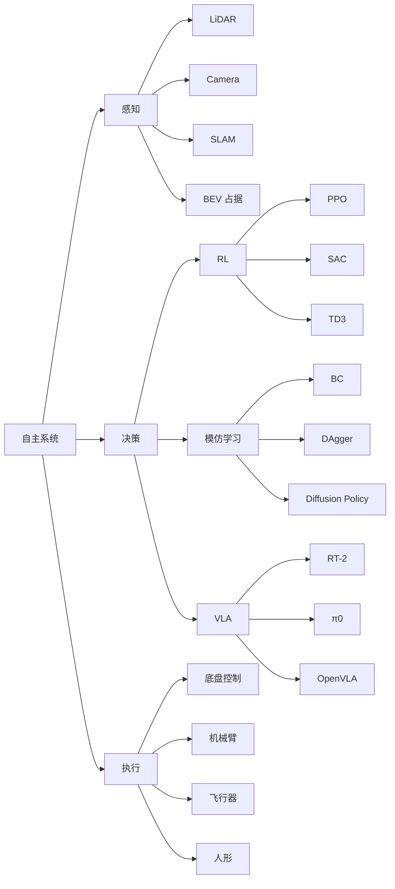

# Ch11 自主系统 · 考研/期末复习大纲

> **承接 Ch10 口诀**: "Ch10 给多模态 — 共享嵌入 / VLM / VQ-VAE / 扩散, Sora 时空 Transformer. Ch11 给闭环 — 感知(SLAM/BEV) + 决策(RL/VLA) + 执行(控制), 数据是激光雷达/相机轨迹."
> **跨章承接**: Ch06 §06 强化学习 → Ch11 §02 PPO/SAC; Ch08 §05 3D Gaussian → Ch11 §01 视觉 SLAM; Ch10 §05 统一架构 → Ch11 §03 VLA; Ch17 §04 边缘推理 → Ch11 §04 车端推理.

---

## 一 · 考点分级速览 (🔴 14 / 🟡 18 / 🟢 8 / ⭐ 4, 共 44 考点)

| 考频 | 考点 | 章节 |
|---|---|---|
| 🔴 | LiDAR 与 stereo camera 标定 | §01 |
| 🔴 | SLAM 后端 BA (Bundle Adjustment) | §01 |
| 🔴 | ORB-SLAM 词袋回环 | §01 |
| 🔴 | BEV 占用网格预测 | §01 |
| 🔴 | ICP / NDT 点云配准 | §01 |
| 🔴 | PID 与 MPC 控制 | §02 |
| 🔴 | PPO 算法 (裁剪目标函数) | §02 |
| 🔴 | SAC 最大熵 RL | §02 |
| 🔴 | 模仿学习 (BC / DAgger) | §02 |
| 🔴 | Diffusion Policy | §02 |
| 🔴 | VLA 模型架构 (RT-2, π0) | §03 |
| 🔴 | 端到端 vs 模块化 AD | §04 |
| 🔴 | 自动驾驶分级 (L1-L5) | §04 |
| 🔴 | SLAM 中的回环检测 | §01 |
| 🟡 | ORB 特征点提取 | §01 |
| 🟡 | 卡尔曼滤波在 SLAM 中的应用 | §01 |
| 🟡 | 视觉里程计 (VO) | §01 |
| 🟡 | 3D Gaussian SLAM (SplaTAM, GS-SLAM) | §01 |
| 🟡 | DQN/DDQN 离散动作 RL | §02 |
| 🟡 | TD3 (Twin Delayed DDPG) | §02 |
| 🟡 | GAIL / AIRL 逆 RL | §02 |
| 🟡 | 模型预测控制 (MPC) | §02 |
| 🟡 | 占用网络 (Occupancy Network) | §01 |
| 🟡 | VLM 在 VLA 中的角色 | §03 |
| 🟡 | RT-2 训练细节 (CoT) | §03 |
| 🟡 | π0 架构 (π₀ + π_0.₅) | §03 |
| 🟡 | Tesla FSD v12 端到端 | §04 |
| 🟡 | Waymo Driver 自动驾驶 | §04 |
| 🟡 | nuScenes 数据集 / Waymo Open 数据集 | §04 |
| 🟡 | 轨迹预测 (VectorNet / HiVT) | §04 |
| 🟡 | NeRF / 3DGS 自动驾驶仿真 (NeuRAD) | §04 |
| 🟡 | AEB 自动紧急制动 | §04 |
| 🟡 | VLA 与世界模型的关系 | §03 |
| 🟢 | IMU 预积分 | §01 |
| 🟢 | 视觉惯性里程计 (VIO) | §01 |
| 🟢 | RLHF 在 RL 中的应用 | §02 |
| 🟢 | 离线 RL (CQL, IQL) | §02 |
| 🟢 | Few-shot 模仿学习 | §03 |
| 🟢 | Apollo / 百度地图 | §04 |
| 🟢 | 仿生机器人 (Atlas, Optimus) | §05 |
| 🟢 | Robonaut 2 (NASA 太空) | §05 |
| ⭐ | Soft Actor-Critic 实现 | §02 |
| ⭐ | 同伦感知机器人 | §05 |
| ⭐ | 四足机器人 (Spot, ANYmal) | §05 |
| ⭐ | 仿生飞行 (RoboBee) | §05 |

---

## 二 · 概念关系图

---

## 三 · 必考点精讲

### 🔴F1: SLAM 中的 Bundle Adjustment

**问题**：给定 N 个相机位姿 $\{T_i\}$ 与 M 个 3D 路标 $\{X_j\}$, 最小化重投影误差:
$$\min_{T, X} \sum_{i,j} \rho(\|u_{ij} - \pi(T_i X_j)\|^2_\Sigma)$$

- $\pi$: 投影函数, $u_{ij}$: 像素观测
- $\rho$: Huber 鲁棒核
- 用 Schur complement 加速求解 (利用 Hessian 稀疏性)

**性能对比**: BA 解 100 帧/single-thread ≈ 1-3 秒; G2O / GTSAM 库可用。

### 🔴F2: PPO 目标函数

$$\mathcal{L}^{CLIP}(\theta) = \mathbb{E}_t\left[\min\left(\frac{\pi_\theta(a_t|s_t)}{\pi_{\theta_{old}}(a_t|s_t)} \hat A_t, \text{clip}\left(\frac{\pi_\theta}{\pi_{\theta_{old}}}, 1-\epsilon, 1+\epsilon\right) \hat A_t\right)\right] - \beta \cdot \text{KL}(\pi_\theta || \pi_{ref})$$

- $\hat A_t$: GAE 优势估计, $\epsilon=0.2$
- 限制新旧策略比值, 防止 large policy update
- 工业通用: OpenAI Five, DeepMind AlphaStar

### 🔴F3: Diffusion Policy 训练

$$\mathcal{L} = \mathbb{E}_{k, \tau^0, \epsilon}\left[\|\epsilon - \epsilon_\theta(\tau^k, s_t, k)\|^2\right]$$

- 训练: 加噪 → 学去噪
- 推理: 16 步去噪生成动作序列
- 比 BC 强 3-5 倍 (ManiSkill2 benchmark)

### 🔴F4: VLA 模型架构 (RT-2 类)

$$\pi(a | o, l) = \text{Transformer-Decoder}(\text{concat}(V_\phi(o), L_\phi(l)))$$

- $o$: 视觉 (RT-2 用 PaLI-X 视觉编码器, π0 用 SigLIP)
- $l$: 语言指令 (RT-2 输出 token = 机器人动作 token, 共享输出空间)
- $a \in \mathbb{R}^7$: 6-DoF + 夹爪

训练数据: OpenX-Embodiment (1M+ 轨迹, 22 个机器人)。

### 🔴F5: BEV 占用网络 (Tesla / Waymo 路线)

$$\hat O_{t+k} = f_\theta(\text{Camera}(t), \text{LiDAR}(t), \text{SD Map})$$

- 输出 $256 \times 256 \times 32$ 体素 (0.5m 体素, $128m \times 128m \times 16m$)
- 预测未来 3 秒占用概率
- Tesla FSD v12 与 Waymo Driver 6.0 都用类似方案

### 🔴F6: 模块化 vs 端到端自动驾驶

| 维度 | 模块化 (Waymo) | 端到端 (Tesla) |
|------|----------------|----------------|
| 可解释 | 高 (各模块独立) | 低 (神经网络黑盒) |
| 数据需求 | 各模块独立标注 | 海量轨迹数据 |
| 调试 | 易 (单个模块) | 难 (整体) |
| 性能上限 | 组合误差 | 联合优化更高 |
| 安全可信 | 高 (白盒) | 中 (需大量验证) |

---

## 四 · 公式卡片

### LiDAR 测距
$$d = \frac{c \cdot \Delta t}{2}, \quad c = 3 \times 10^8 \text{ m/s}$$

### 卡尔曼预测
$$\hat x_{t|t-1} = F \hat x_{t-1|t-1} + B u_t$$
$$P_{t|t-1} = F P_{t-1|t-1} F^\top + Q$$

### MPC
$$\min_{u} \sum_{k=0}^{N-1} \|x_{t+k} - x^*\|^2_Q + \|u_{t+k}\|^2_R$$
$$\text{s.t. } x_{t+1} = f(x_t, u_t), x_{t+k} \in \mathcal{X}, u_{t+k} \in \mathcal{U}$$

### Diffusion Policy 去噪
$$\hat\epsilon = \epsilon_\theta(s_t, \tau^k, k)$$

### PPO 优势
$$\hat A_t = \sum_{k=0}^{T-t} \gamma^k \delta_{t+k}, \quad \delta_t = r_t + \gamma V(s_{t+1}) - V(s_t)$$

### BEV 高度聚合
$$B_{xy} = \sum_{z=h_{min}}^{h_{max}} F(\phi(u,v) \to (x,y)) \cdot I(u,v)$$

### VLA Token 化
$$z_{vlm} = \text{Concat}(V_{img}, V_{text})$$

---

## 五 · 跨章综合题 (10 题)

| # | 题型 | 涉及的章 | 难度 |
|---|---|---|---|
| 综合1 | 用 Ch06 §06 PPO + Ch11 §02 写 PPO+IL 混合策略 | Ch06+Ch11 | ★★★ |
| 综合2 | 用 Ch08 §05 NeRF + Ch11 §04 自动驾驶仿真 | Ch08+Ch11 | ★★★ |
| 综合3 | 用 Ch10 §05 VLM + Ch11 §03 RT-2 解释 VLA | Ch10+Ch11 | ★★ |
| 综合4 | 用 Ch17 §04 边缘推理 + Ch11 §04 车端部署 | Ch17+Ch11 | ★★★ |
| 综合5 | 用 Ch14 §04 图 + Ch11 §04 轨迹预测 (VectorNet) | Ch14+Ch11 | ★★★ |
| 综合6 | 用 Ch04 §04 假设检验 + Ch11 §01 SLAM 回环验证 | Ch04+Ch11 | ★★★ |
| 综合7 | 用 Ch09 §05 Kalman 滤波 + Ch11 §01 视觉 SLAM | Ch09+Ch11 | ★★ |
| 综合8 | 用 Ch05 §04 贝叶斯 + Ch11 §02 逆 RL (GAIL) | Ch05+Ch11 | ★★★ |
| 综合9 | 用 Ch14 §03 KD-Tree + Ch11 §01 ICP 最近邻搜索 | Ch14+Ch11 | ★★ |
| 综合10 | 用 Ch17 §02 高效架构 + Ch11 §04 车端推理优化 | Ch17+Ch11 | ★★★ |

---

## 六 · 自测题 (20 题速测)

### Part A 单选 (10 题)
1. SLAM 后端 BA 用什么加速?
2. LiDAR 905 nm 激光往返 1 m 大约多久?
3. PPO clip ratio ε 默认值?
4. Diffusion Policy 训练时去噪预测的是什么?
5. RT-2 输出 token 的离散化方式?
6. BEV 网格常用分辨率?
7. SLAM 回环为何用词袋?
8. SAC 相比 PPO 主要改进?
9. VLA 三件套 (视觉/语言/动作) 的中间表征?
10. 自动驾驶 L5 全无人定义为?

### Part B 简答 (5 题)
1. SLAM 前端后端职责分工
2. 模仿学习 vs 强化学习的优劣
3. Diffusion Policy 与 BC 的本质区别
4. 端到端自动驾驶为何最近爆火
5. VLA 与 VLM 的关系

### Part C 论述 (5 题)
1. 端到端自驾 vs 模块化的批评/支持
2. VLA 模型通用化的三大挑战
3. 太空机器人如何用 RL 克服仿真到真实 gap
4. MPC 在跟踪控制中的具体应用
5. 自主系统 SLAM 与 BEV 占据网络的对比

---

## 七 · 易错点

1. **BEV ≠ LiDAR 点云**: BEV 是 bird's-eye-view 占据网格, 不是点云。
2. **Diffusion Policy 不是 BC 的 Diffusion 版本**: 它是 behaviour cloning + 扩散模型, 不是把 BC 加噪。
3. **RT-2 不是 fine-tune 视觉编码器**: 它把动作 token 与语言 token 共享输出空间。
4. **SLAM 不是单纯的定位**: 还包括地图构建、回环检测。
5. **π0 是 VLA 不是 VLM**: π0 输出 7 维动作, VLM 输出文本。
6. **MPC 不等于 RL**: MPC 用模型优化, RL 学习策略。
7. **端到端 ≠ 黑盒**: 特斯拉仍保留 safety monitor (Tesla Vision + radar + 冗余判断)。

---

## 八 · 60s 口播速记

Ch11 共 5 节, 主题: 自主系统 = 感知 + 决策 + 执行 闭环。§01 感知: SLAM 解决"我在哪 + 地图长啥样", 含 BA 后端 + ORB 词袋回环 + BEV 占据; §02 学习: PPO on-policy clip、SAC 最大熵、Diffusion Policy 16 步去噪; §03 VLA: RT-2 把动作 token 与语言 token 共享输出空间, π0 端到端视觉-语言-动作; §04 自动驾驶: 端到端 Tesla FSD v12 vs 模块化 Waymo, BEV 占用网络 + NeRF 仿真; §05 太空: NASA Mars 2020 Perseverance + 人形 Optimus + 仿生 Spot 四足。
