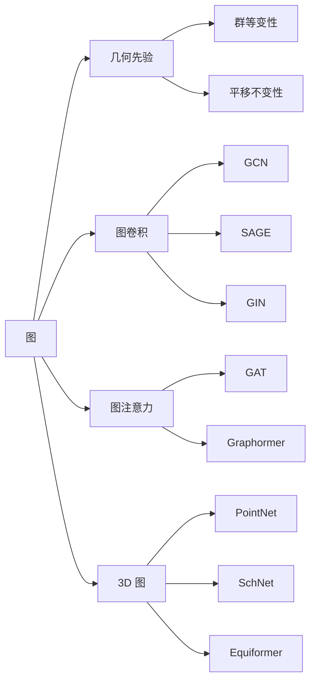

# Ch12 图神经网络 · 考研/期末复习大纲

> **承接 Ch11 口诀**: "Ch11 给闭环 — 感知(SLAM/BEV) + 决策(RL/VLA) + 执行(控制). Ch12 给非欧 — 几何先验(等变性) + 图论(拉普拉斯) + GNN(GCN/SAGE/GAT) + 3D 图(分子点云)."
> **跨章承接**: Ch06 §04 Transformer → Ch12 §04 GAT 注意力机制; Ch08 §04 Diffusion (E(3) 对称) → Ch12 §05 等变图网络; Ch09 §04 点云 → Ch12 §05 3D 图; Ch14 §04 图算法 (Dijkstra, BFS, Bellman-Ford) → Ch12 §02 图论基础

---

## 一 · 考点分级速览 (🔴 14 / 🟡 18 / 🟢 8 / ⭐ 4, 共 44 考点)

| 考频 | 考点 | 章节 |
|---|---|---|
| 🔴 | 几何深度学习范式 (群等变性) | §01 |
| 🔴 | 群作用与不变性/等变性定义 | §01 |
| 🔴 | 欧氏群 SE(3) / SO(3) 概念 | §01 |
| 🔴 | GCN 卷积归一化 $\tilde D^{-1/2} \tilde A \tilde D^{-1/2}$ | §03 |
| 🔴 | GraphSAGE 邻居采样与聚合 | §03 |
| 🔴 | GIN Weisfeiler-Lehman 最优性 | §03 |
| 🔴 | GAT 注意力 $\alpha_{ij} = \text{softmax}_j(\text{LeakyReLU}(\mathbf{a}^\top [Wh_i \| Wh_j]))$ | §04 |
| 🔴 | Over-smoothing 问题与残差连接 | §03 |
| 🔴 | READOUT 排列不变性 (SUM/MEAN/MAX) | §03 |
| 🔴 | 拉普拉斯矩阵 $L = D - A$ | §02 |
| 🔴 | 归一化拉普拉斯 $I - D^{-1/2} A D^{-1/2}$ | §02 |
| 🔴 | 谱卷积定理 (ChebNet 起源) | §03 |
| 🔴 | 节点分类 (Cora, OGB-arxiv) | §03 |
| 🔴 | 链接预测 (知识图谱) | §02 |
| 🟡 | PageRank 收敛性 | §02 |
| 🟡 | 邻接矩阵幂解释 | §02 |
| 🟡 | 谱方法基础 | §02 |
| 🟡 | ChebNet 多项式截断 | §03 |
| 🟡 | 异构图 (heterogeneous graph) | §03 |
| 🟡 | 子图采样 (GraphSAINT) | §03 |
| 🟡 | 知识图谱嵌入 (TransE, RotatE) | §02 |
| 🟡 | 图对比学习 (GraphCL) | §03 |
| 🟡 | 图扩散模型 (GDSS) | §03 |
| 🟡 | Graphormer 空间/中心性编码 | §04 |
| 🟡 | GAT 多头注意力 | §04 |
| 🟡 | Transformer 与 GAT 关系 | §04 |
| 🟡 | 注意力复杂度 (边编码) | §04 |
| 🟡 | 量子化分子动力学 | §05 |
| 🟡 | 等变网络 E(n)-equivariant | §05 |
| 🟡 | PointNet 排列不变性 (max) | §05 |
| 🟡 | DGCNN 边卷积 | §05 |
| 🟡 | SchNet / MGCN 距离基 | §05 |
| 🟡 | GIN 在分子性质预测 | §03 |
| 🟡 | OGB 数据集 (ogbg-mol, ogbg-ppa) | §03 |
| 🟢 | 邻接稀疏存储 | §02 |
| 🟢 | 元路径 (meta-path) | §03 |
| 🟢 | 异构注意力 (HAN) | §04 |
| 🟢 | 量子图 (Quiver) 嵌入 | §05 |
| 🟢 | 物理建模 GNN | §05 |
| 🟢 | 蛋白质结构 (AlphaFold-Multimer) | §05 |
| ⭐ | Weisfeiler-Lehman 测试严格证明 | §03 |
| ⭐ | E(3)-equivariant Transformer | §05 |
| ⭐ | 谱图卷积严格推导 | §03 |
| ⭐ | 拓扑数据分析 (TDA) 与 GNN | §05 |

---

## 二 · 概念关系图

---

## 三 · 必考点精讲

### 🔴F1: GCN 卷积
$$H^{(l+1)} = \sigma\left(\tilde D^{-1/2} \tilde A \tilde D^{-1/2} H^{(l)} W^{(l)}\right)$$

- $\tilde A = A + I$ (加自环, 让节点聚合自身)
- $\tilde D$: $\tilde A$ 的度矩阵
- **归一化**: 防止度大节点主导聚合 (高维特征爆炸)
- 邻居平均 + 线性变换

### 🔴F2: GAT 注意力
$$\alpha_{ij} = \frac{\exp\left(\text{LeakyReLU}\left(\mathbf{a}^\top [Wh_i \| Wh_j]\right)\right)}{\sum_{k \in \mathcal{N}(i)} \exp\left(\text{LeakyReLU}\left(\mathbf{a}^\top [Wh_i \| Wh_k]\right)\right)}$$

- 自适应邻居权重 (vs GCN 等权)
- 多头: $K$ 个注意力并行
- 适用: 异质图,关键节点突出

### 🔴F3: GIN 最优性
$$h_v^{(l+1)} = \text{MLP}_\theta\left((1+\epsilon) h_v^{(l)} + \sum_{u \in \mathcal{N}(v)} h_u^{(l)}\right)$$

- 与 Weisfeiler-Lehman 同判别力
- $\epsilon$ 可学习(0 或 -1)
- 表示能力最强, 适合分子任务

### 🔴F4: 几何深度学习 (GDL) 5 条原则
1. **先验**: 几何/对称性 (旋转, 平移)
2. **尺度分离**: 多尺度处理
3. **群等变性**: $f(Tx) = T f(x)$
4. **不变量特征**: 接近任务目标
5. **组合性**: 子结构拼接

### 🔴F5: Over-smoothing 解决方案

**问题**: 多层 GNN 后所有节点表示趋同 (类似神经网络深度崩溃)。

**解决**:
- 残差连接 $H^{(l+1)} = H^{(l)} + \text{GNN}(H^{(l)})$ (类似 ResNet)
- DropEdge: 训练时随机删边
- PairNorm / BatchNorm
- Pair-wise loss (距离正则)

### 🔴F6: READOUT 排列不变

$$h_G = \sum_{v \in V} h_v^{(L)} \quad \text{(SUM)}$$

- SUM/MEAN/MAX 都是置换不变
- Sum 比 mean 更具表达力 (节点数信息保留)
- 用于图级分类 (如分子性质)

---

## 四 · 公式卡片

### 邻接矩阵与度
$$A_{uv} = \begin{cases} 1 & (u, v) \in E \\ 0 & \text{otherwise} \end{cases}$$
$$d_v = \sum_u A_{uv}$$

### 拉普拉斯与归一化
$$L = D - A$$
$$L = I - D^{-1/2} A D^{-1/2}, \quad \lambda \in [0, 2]$$

### GCN 传播
$$H^{(l+1)} = \sigma\left(\tilde D^{-1/2} \tilde A \tilde D^{-1/2} H^{(l)} W^{(l)}\right)$$

### GraphSAGE 聚合
$$h_v^{(l+1)} = W \cdot [\text{CONCAT}(h_v^{(l)}, \text{AGG}(\{h_u^{(l)}\}))]$$

### GAT
$$\alpha_{ij} = \text{softmax}_j\left(\text{LeakyReLU}(\mathbf{a}^\top [Wh_i \| Wh_j])\right)$$
$$h_i' = \sigma\left(\sum_{j \in \mathcal{N}(i)} \alpha_{ij} W h_j\right)$$

### GIN
$$h_v^{(l+1)} = \text{MLP}\left((1+\epsilon) h_v + \sum_{u \in \mathcal{N}(v)} h_u\right)$$

### Graphormer 注意力
$$\alpha_{ij} = (Q_i K_j + b_{\text{spd}(i,j)}) / \sqrt{d}$$

### SchNet
$$h_v^{(l+1)} = h_v^{(l)} + \sum_{u \in \mathcal{N}(v)} \text{MLP}(h_u^{(l)}, \|x_v - x_u\|)$$

### PointNet 全局特征
$$h_G = \text{MAX}_{v \in V} \text{MLP}(h_v)$$

---

## 五 · 跨章综合题

| # | 题型 | 涉及的章 | 难度 |
|---|---|---|---|
| 综合1 | 用 Ch06 §04 Transformer + Ch12 §04 GAT 解释注意力迁移 | Ch06+Ch12 | ★★★ |
| 综合2 | 用 Ch08 §05 NeRF + Ch12 §05 等变图解释 3D 表征 | Ch08+Ch12 | ★★★ |
| 综合3 | 用 Ch14 §04 Dijkstra + Ch12 §02 Graphormer 空间编码 | Ch14+Ch12 | ★★ |
| 综合4 | 用 Ch10 §05 多模态 + Ch12 §03 异构 GNN 解释推荐系统 | Ch10+Ch12 | ★★★ |
| 综合5 | 用 Ch05 §04 贝叶斯 + Ch12 §03 图扩散 (GDSS) | Ch05+Ch12 | ★★★ |
| 综合6 | 用 Ch04 §04 假设检验 + Ch12 §03 图对比学习损失 | Ch04+Ch12 | ★★ |
| 综合7 | 用 Ch02 §04 SVD + Ch12 §02 谱图卷积 | Ch02+Ch12 | ★★★ |
| 综合8 | 用 Ch03 §05 梯度 + Ch12 §05 分子梯度 (力) 预测 | Ch03+Ch12 | ★★★ |
| 综合9 | 用 Ch08 §04 Diffusion + Ch12 §03 图扩散去噪 | Ch08+Ch12 | ★★ |
| 综合10 | 用 Ch06 §03 CNN + Ch12 §01 几何深度学习统一视角 | Ch06+Ch12 | ★★★ |

---

## 六 · 自测题 (20 题)

### Part A 单选 (10 题)
1. GCN 归一化用的是?
2. GAT 与 GCN 最大的不同是?
3. GraphSAGE 适合以下哪种场景?
4. Weisfeiler-Lehman 测试对哪种 GNN 最关键?
5. 谱图卷积基本思想是?
6. 几何深度学习的核心先验是什么?
7. PointNet 全局特征如何实现排列不变?
8. E(3)-equivariant 网络的设计动机?
9. OGB-arxiv 数据集是哪种任务?
10. 知识图谱嵌入 TransE 的核心假设?

### Part B 简答 (5 题)
1. 为什么 GCN 需要归一化 (不用 A 直接乘)
2. GAT 多头注意力的好处
3. Over-smoothing 现象及缓解
4. PointNet++ 如何分层处理
5. 图池化的两种方法 (READOUT vs Pool)

### Part C 论述 (5 题)
1. 几何深度学习 vs 普通深度学习的对比
2. GCN/SAGE/GAT/GIN 模型对比表
3. 等变网络的工程价值
4. 分子 GNN 与点云网络的差异
5. 图 Transformer 与注意力机制的关系

---

## 七 · 易错点

1. **拉普拉斯**: $L = D - A$, 不是 $A - D$
2. **GCN 加自环**: $\tilde A = A + I$ 而非 $A$ 本身
3. **GCN 多次聚合**: 1 层只能 1-hop,2 层 2-hop
4. **GAT 注意力计算 Q,K 同一节点**: $W h_i$ 与 $W h_j$,但 $i$ 中心
5. **READOUT 必须置换不变**: SUM/MEAN/MAX 之外不行
6. **GIN 表达力 ≠ GCN**: GIN 是 WL 最优, GCN 等权近似 WL
7. **E(3) ≠ SE(3)**: E(3) 含反射, SE(3) 不含
8. **点云 ≠ 图**: 点云是欧氏邻接, 图是任意边
9. **图注意力 vs Transformer 注意力**: GAT 边结构约束, Transformer 全连接
10. **扩散 GNN**: 用 diffusion 模型反向生成图结构

---

## 八 · 速记口播版 (60s)

Ch12 共 5 节:**§01 几何深度学习**(GDL 范式: 群等变性是核心, SE(3)/SO(3) 旋转平移不变性) → **§02 图论基础**(邻接矩阵 $A$、度 $d$、拉普拉斯 $L=D-A$、归一化 $L=I-D^{-1/2}AD^{-1/2}$、谱、PageRank 收敛) → **§03 GNN**(GCN 邻居平均 + 归一化, GraphSAGE 邻居采样, GIN WL 最优, over-smoothing 用残差) → **§04 GAT**(注意力 $\alpha = \text{softmax}(\text{LeakyReLU}(\mathbf{a}^\top [Wh_i \| Wh_j]))$,多头, 图 Transformer 加空间/中心性 bias) → **§05 3D 图**(PointNet max 排列不变, SchNet 距离基, 等变 SE(3) 不变, 分子 GNN 应用)。
