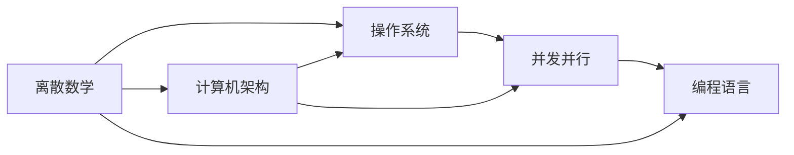

# Ch13 计算与操作系统 · 考研/期末复习大纲

> **承接 Ch12 口诀**: "Ch12 给非欧数据 (图/分子). Ch13 给 AI 系统栈 — 离散数学 (复杂度) + 计算机架构 (CPU/GPU) + OS (进程/虚拟内存) + 并发 (线程/分布式) + 编程语言 (类型/范式)."
> **跨章承接**: Ch01 §01 集合 → Ch13 §01 离散数学; Ch03 §05 梯度 → Ch13 §04 GPU 加速; Ch07 §04 Transformer → Ch13 §04 分布式训练; Ch14 §01 数据结构 → Ch13 §01 算法复杂度

---

## 一 · 考点分级速览 (🔴 12 / 🟡 16 / 🟢 8 / ⭐ 4, 共 40 考点)

| 考频 | 考点 | 章节 |
|---|---|---|
| 🔴 | 集合运算 (并/交/差/补) | §01 |
| 🔴 | 命题逻辑与谓词逻辑 | §01 |
| 🔴 | 数学归纳法 | §01 |
| 🔴 | 排列组合 | §01 |
| 🔴 | 大 O / Ω / Θ 记号 | §01 |
| 🔴 | 冯诺依曼架构 | §02 |
| 🔴 | CPU 性能公式 $T = IC \times CPI \times T_{\text{cycle}}$ | §02 |
| 🔴 | 缓存命中率与平均访问时间 | §02 |
| 🔴 | 进程 vs 线程 | §03 |
| 🔴 | 虚拟内存与页表 | §03 |
| 🔴 | 死锁四条件 | §03 |
| 🔴 | Amdahl 定律 | §04 |
| 🟡 | 鸽巢原理 | §01 |
| 🟡 | 图论基础 (Ch12 §02 拓展) | §01 |
| 🟡 | P / NP 完整 | §01 |
| 🟡 | 流水线 CPI | §02 |
| 🟡 | DRAM 与 SRAM 区别 | §02 |
| 🟡 | GPU SIMT 架构 | §02 |
| 🟡 | 文件系统 (inode / FAT) | §03 |
| 🟡 | 调度算法 (FCFS / RR / CFS) | §03 |
| 🟡 | 同步原语 (mutex / semaphore) | §04 |
| 🟡 | CUDA 内存模型 | §04 |
| 🟡 | MapReduce 编程模型 | §04 |
| 🟡 | 类型推导 (Hindley-Milner) | §05 |
| 🟡 | Lambda 演算 | §05 |
| 🟡 | 函数式 vs 命令式 | §05 |
| 🟡 | 垃圾回收 (GC) 算法 | §05 |
| 🟡 | LLVM IR | §05 |
| 🟢 | 编码 (ASCII / Unicode) | §01 |
| 🟢 | 二进制 / 十六进制 | §02 |
| 🟢 | 中断与异常 | §03 |
| 🟢 | socket 编程 | §04 |
| 🟢 | Actor 模型 | §04 |
| 🟢 | Rust 所有权 | §05 |
| 🟢 | 字节码 vs 机器码 | §05 |
| 🟢 | JIT 编译 | §05 |
| ⭐ | Curry-Howard 对应 | §05 |
| ⭐ | CAP 定理 | §04 |
| ⭐ | 一致性哈希 | §04 |
| ⭐ | Chaitin 不完备性 | §01 |

---

## 二 · 概念关系图

---

## 三 · 必考点精讲

### 🔴F1: 大 O 记号
$$T(n) = O(f(n)) \iff \exists c > 0, n_0: T(n) \leq c f(n), \forall n \geq n_0$$

- 上界
- $\Omega$: 下界
- $\Theta$: 紧界

例: $T(n) = 3n^2 + 2n + 1 = O(n^2)$。

### 🔴F2: CPU 性能公式
$$T_{\text{CPU}} = IC \times CPI \times T_{\text{cycle}}$$

- IC: 指令数 (instruction count)
- CPI: 每指令周期数 (cycles per instruction)
- $T_{\text{cycle}}$: 周期时间

优化: 减 IC (编译优化) / 减 CPI (流水线) / 减 $T_{\text{cycle}}$ (工艺)。

### 🔴F3: Amdahl 定律
$$S(n) = \frac{1}{(1 - p) + p/n}$$

$p$ = 可并行比例, $n$ = 处理器数。即使 $p = 0.95, n \to \infty$, $S \leq 20$。

### 🔴F4: 缓存平均访问时间
$$T_{\text{avg}} = h \cdot T_{\text{L1}} + (1-h)(T_{\text{L1}} + T_{\text{L2}})$$

$h$ = L1 命中率, $T_{\text{L1}}$ = 1 ns, $T_{\text{L2}}$ = 10 ns。$h=0.95$ → $T_{\text{avg}} = 1.45$ ns。

### 🔴F5: 死锁四条件
1. **互斥**: 资源独占
2. **占有并等待**: 持有 + 等待
3. **不剥夺**: 不能强制释放
4. **循环等待**: 形成环路

打破任一即可避免死锁。

### 🔴F6: 虚拟内存
- 虚拟地址 $\to$ 物理地址: MMU 翻译
- 页表: VA → PA 映射
- TLB: 页表缓存
- Page fault: 磁盘换入 (ms 级)

---

## 四 · 公式卡片

### 组合数学
$$\binom{n}{k} = \frac{n!}{k!(n-k)!}$$
$$|\mathcal{P}(S)| = 2^{|S|}$$

### 复杂度
$$T(n) = O(n^k) \iff \text{多项式时间}$$
$$\text{NP} \supseteq \text{P}$$

### CPU
$$T_{\text{CPU}} = IC \cdot CPI \cdot T_{\text{cycle}}$$

### 并行
$$S(n) = \frac{1}{(1-p) + p/n}$$

### 内存
$$T_{\text{avg}} = h T_{\text{L1}} + (1-h) T_{\text{L2}}$$

### 缓存
$$\text{Cache 命中} = \frac{\text{Hits}}{\text{Hits} + \text{Misses}}$$

### GPU
$$\text{FLOPs}_{\text{GPU}} = N_{\text{SM}} \times \text{core/SM} \times F \times 2$$

### 类型
$$\lambda x. x + 1 :: \text{Int} \to \text{Int}$$

---

## 五 · 跨章综合题

| # | 题型 | 涉及的章 | 难度 |
|---|---|---|---|
| 综合1 | 用 Ch03 梯度 + Ch13 GPU 并行解释大模型训练加速 | Ch03+Ch13 | ★★★ |
| 综合2 | 用 Ch07 Transformer + Ch13 分布式训练解释 GPT | Ch07+Ch13 | ★★★ |
| 综合3 | 用 Ch12 GNN + Ch13 GPU 解释 OGB 评测 | Ch12+Ch13 | ★★ |
| 综合4 | 用 Ch05 概率 + Ch13 操作系统随机调度 | Ch05+Ch13 | ★★ |
| 综合5 | 用 Ch11 SLAM + Ch13 GPU 实时点云处理 | Ch11+Ch13 | ★★★ |
| 综合6 | 用 Ch04 假设检验 + Ch13 类型系统 (Hindley-Milner) | Ch04+Ch13 | ★★ |
| 综合7 | 用 Ch02 矩阵论 + Ch13 BLAS 库 | Ch02+Ch13 | ★★★ |
| 综合8 | 用 Ch06 RL + Ch13 分布式 RL (IMPALA) | Ch06+Ch13 | ★★★ |
| 综合9 | 用 Ch08 CNN + Ch13 CUDA 卷积实现 | Ch08+Ch13 | ★★ |
| 综合10 | 用 Ch12 GNN + Ch13 内存墙与 over-smoothing | Ch12+Ch13 | ★★★ |

---

## 六 · 自测题 (20 题)

### Part A 单选 (10 题)
1. $O(n \log n)$ 优于 $O(n^2)$ 在什么情况下?
2. CPU 性能公式的三个因子?
3. Amdahl 定律的可并行比例 $p=1$ 时, 加速比是?
4. 进程切换 vs 线程切换的主要区别?
5. 虚拟内存的主要目的是?
6. 死锁的四个条件?
7. GPU 与 CPU 的核心差异?
8. Lambda 演算的 Church 数 $c_3$ 是?
9. 静态类型 vs 动态类型?
10. MapReduce 的两个阶段?

### Part B 简答 (5 题)
1. 解释 $P \neq NP$ 的含义 (即使未证明)
2. 缓存命中率高为什么重要?
3. 进程间通信 (IPC) 方式
4. CUDA 中 block / grid / warp 关系
5. 函数式编程的不可变性优势

### Part C 论述 (5 题)
1. 冯诺依曼瓶颈与现代架构
2. 内存墙 (Memory Wall) 对 AI 的影响
3. GPU 并行训练的关键技术
4. 强类型 vs 弱类型系统的工程权衡
5. 分布式系统 CAP 定理

---

## 七 · 易错点

1. **大 O**: $O(n)$ 不等于 $T(n) = n$, 是上界。
2. **P vs NP**: P ⊆ NP, 但 P 是否等于 NP 未证。
3. **Amdahl**: 即使 $p=0.95$, 8 核加速比 ≤ 6.5。
4. **进程 vs 线程**: 进程独立内存, 线程共享。
5. **死锁**: 必要条件, 不是充分条件。
6. **GPU SIMT**: 单指令多线程, 不是多指令。
7. **虚拟内存**: 进程看到的是虚拟地址, 不是物理地址。
8. **Lambda**: 函数是一等公民, 但不是"函数式等于好用"。
9. **类型推导**: 不需要写类型, 但不代表无类型。
10. **GC**: 不等同于无内存泄漏, 仍有引用泄漏。

---

## 八 · 速记口播版 (60s)

Ch13 共 5 节: **§01 离散数学**(集合/逻辑/组合/O(n)/P vs NP) → **§02 计算机架构**(冯诺依曼, $T = IC \cdot CPI \cdot T_c$, CPU/GPU/缓存层级) → **§03 操作系统**(进程/线程/虚拟内存/页表/死锁四条件) → **§04 并发并行**(Amdahl, 锁/GPU SIMT/MapReduce) → **§05 编程语言**(类型系统/Hindley-Milner/Lambda 演算/Curry-Howard)。是 AI 工程师的"基础设施课"。