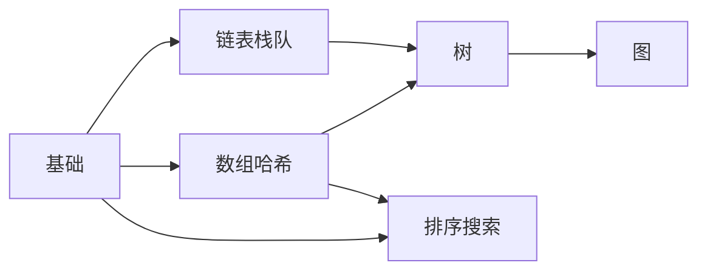

# Ch14 数据结构与算法 · 考研/期末复习大纲

> **承接 Ch13 口诀**: "Ch13 给系统栈 — 离散数学 + 架构 + OS + 并发 + 语言. Ch14 给内功 — 数组/链表/树/图/堆/排序/搜索。"
> **跨章承接**: Ch13 §01 复杂度 → Ch14 §00 基础; Ch12 §02 图论 → Ch14 §04 图算法; Ch12 §03 GNN → Ch14 §04 BFS/DFS; Ch11 §05 SLAM → Ch14 §04 图优化

---

## 一 · 考点分级速览 (🔴 12 / 🟡 18 / 🟢 8 / ⭐ 4, 共 42 考点)

| 考频 | 考点 | 章节 |
|---|---|---|
| 🔴 | 大 O 复杂度分析 | §00 |
| 🔴 | 数组与动态数组 (vector) | §01 |
| 🔴 | 哈希表与冲突解决 | §01 |
| 🔴 | 链表反转与快慢指针 | §02 |
| 🔴 | 栈与队列应用 | §02 |
| 🔴 | 二叉树遍历 (前/中/后/层序) | §03 |
| 🔴 | BST 查找 / 插入 / 删除 | §03 |
| 🔴 | 平衡树 (AVL / 红黑树) | §03 |
| 🔴 | 堆与优先队列 | §03 |
| 🔴 | BFS / DFS | §04 |
| 🔴 | Dijkstra 最短路 | §04 |
| 🔴 | Union-Find (Kruskal) | §04 |
| 🟡 | 递归与分治 | §00 |
| 🟡 | 字符串哈希 | §01 |
| 🟡 | 双向链表与 LRU | §02 |
| 🟡 | 单调栈 | §02 |
| 🟡 | 二叉搜索树验证 | §03 |
| 🟡 | Trie 前缀树 | §03 |
| 🟡 | 树状数组 (BIT) | §03 |
| 🟡 | 线段树 | §03 |
| 🟡 | 拓扑排序 | §04 |
| 🟡 | Bellman-Ford | §04 |
| 🟡 | Floyd-Warshall | §04 |
| 🟡 | 最小生成树 (Prim / Kruskal) | §04 |
| 🟡 | 二分查找 (含变种) | §05 |
| 🟡 | 快速排序与归并排序 | §05 |
| 🟡 | 堆排序 | §05 |
| 🟡 | 计数排序 / 基数排序 | §05 |
| 🟡 | Tim 排序 (Python) | §05 |
| 🟢 | 数组双指针 | §01 |
| 🟢 | 滑动窗口 | §01 |
| 🟢 | 前缀和 | §01 |
| 🟢 | 优先队列应用 | §03 |
| 🟢 | A* 算法 | §04 |
| 🟢 | 字符串匹配 KMP | §05 |
| 🟢 | 外排序 | §05 |
| 🟢 | 跳表 | §03 |
| ⭐ | Fibonacci 堆 | §03 |
| ⭐ | Splay 树 | §03 |
| ⭐ | 持久化数据结构 | §00 |
| ⭐ | 近似算法 | §04 |

---

## 二 · 概念关系图



---

## 三 · 必考点精讲

### 🔴F1: 复杂度分析
$$T(n) = O(f(n))$$

- 找主项, 丢常数, 丢低阶
- 主定理: $T(n) = aT(n/b) + f(n)$

### 🔴F2: 数组 vs 链表

| 操作 | 数组 | 链表 |
|------|------|------|
| 访问 | $O(1)$ | $O(n)$ |
| 插入 | $O(n)$ | $O(1)$ |
| 删除 | $O(n)$ | $O(1)$ |
| 空间 | 紧凑 | 多指针 |

### 🔴F3: 哈希表
- 链地址 vs 开放定址
- 装填因子 $\alpha = n/m$, > 0.7 扩容
- 哈希函数: 除留余数, 乘法哈希

### 🔴F4: 链表反转
```python
def reverse(head):
    prev, curr = None, head
    while curr:
        nxt = curr.next
        curr.next = prev
        prev = curr
        curr = nxt
    return prev
```

### 🔴F5: BST 性质
- 左子树 < 根 < 右子树
- 中序遍历有序
- 平衡时查找 $O(\log n)$

### 🔴F6: BFS vs DFS
| 维度 | BFS | DFS |
|------|-----|-----|
| 数据结构 | 队列 | 栈 / 递归 |
| 最短路 | ✓ (无权) | ✗ |
| 空间 | 宽 | 深 |
| 应用 | 层序, 拓扑 | 回溯, 路径 |

### 🔴F7: Dijkstra
$$d(v) = \min_{u \in \text{visited}} d(u) + w(u, v)$$

不适用负权边。

### 🔴F8: Union-Find
- 路径压缩 + 按秩合并 → 几乎 $O(1)$
- 应用: Kruskal, 朋友圈, 等价类

---

## 四 · 公式卡片

### 时间复杂度
$$T(n) = O(n \log n), \text{ e.g., merge sort}$$
$$T(n) = O(n^2), \text{ e.g., bubble}$$
$$T(n) = O(n), \text{ e.g., linear scan}$$
$$T(n) = O(\log n), \text{ e.g., binary search}$$

### 哈希
$$h(\text{key}) = \text{key} \mod m$$
$$\alpha = n/m$$

### 堆
$$h_i \leq h_{2i+1}, h_i \leq h_{2i+2}$$
$$\text{heapify } T = O(n)$$

### 图
$$\text{BFS/DFS } T = O(V + E)$$
$$\text{Dijkstra } T = O((V+E)\log V)$$
$$\text{Bellman-Ford } T = O(VE)$$

### 排序
$$T_{\text{merge}} = T_{\text{quick,avg}} = O(n \log n)$$
$$T_{\text{counting}} = O(n + k)$$

---

## 五 · 跨章综合题

| # | 题型 | 涉及的章 | 难度 |
|---|---|---|---|
| 综合1 | 用 Ch12 §02 图论 + Ch14 §04 BFS/DFS 实现 GNN 邻居采样 | Ch12+Ch14 | ★★★ |
| 综合2 | 用 Ch07 §04 Transformer + Ch14 §01 哈希 实现 LLM 推理缓存 | Ch07+Ch14 | ★★★ |
| 综合3 | 用 Ch11 §05 SLAM + Ch14 §04 Dijkstra 实现路径规划 | Ch11+Ch14 | ★★ |
| 综合4 | 用 Ch13 §03 OS + Ch14 §02 LRU 实现页面置换 | Ch13+Ch14 | ★★ |
| 综合5 | 用 Ch05 §04 贝叶斯 + Ch14 §03 Trie 实现前缀概率 | Ch05+Ch14 | ★★★ |
| 综合6 | 用 Ch04 §04 假设检验 + Ch14 §05 二分查找 实现 A/B 测试 | Ch04+Ch14 | ★★ |
| 综合7 | 用 Ch02 §04 矩阵论 + Ch14 §03 B 树 实现稀疏矩阵索引 | Ch02+Ch14 | ★★★ |
| 综合8 | 用 Ch06 §04 RL + Ch14 §03 优先队列 实现优先级经验回放 | Ch06+Ch14 | ★★★ |
| 综合9 | 用 Ch08 §04 Diffusion + Ch14 §03 KD-Tree 实现 k-NN 加速 | Ch08+Ch14 | ★★ |
| 综合10 | 用 Ch12 §03 GNN + Ch14 §04 Union-Find 实现连通分量 | Ch12+Ch14 | ★★★ |

---

## 六 · 自测题 (20 题)

### Part A 单选 (10 题)
1. 数组访问复杂度?
2. 哈希表平均查找复杂度?
3. BST 平衡时查找复杂度?
4. 堆的插入复杂度?
5. BFS 用什么数据结构?
6. Dijkstra 不适用什么图?
7. 快速排序最坏复杂度?
8. 归并排序空间复杂度?
9. Union-Find 复杂度?
10. Tim 排序最坏复杂度?

### Part B 简答 (5 题)
1. 哈希冲突的两种解决方法
2. 平衡二叉树 vs 普通 BST
3. Dijkstra 适用条件
4. LRU Cache 实现思路
5. 排序算法稳定性

### Part C 论述 (5 题)
1. 时空权衡的工程实例
2. 二叉树遍历的应用场景
3. 图算法在 AI 的应用
4. 数据结构对深度学习的支撑
5. Python 内置数据结构 (list / dict / set) 复杂度

---

## 七 · 易错点

1. **大 O**: $O(n)$ 不等于 $T(n) = n$, 是上界。
2. **哈希表**: 最坏 $O(n)$, 装填因子大时退化。
3. **BST vs 平衡树**: BST 退化为链表时 $O(n)$。
4. **Dijkstra vs BFS**: Dijkstra 用于加权图, BFS 仅无权。
5. **排序稳定性**: 归并 / 插入 / 冒泡稳定, 快排 / 堆排不稳定。
6. **二分查找**: 必须有序。
7. **链表**: 插入 $O(1)$, 但找位置 $O(n)$。
8. **堆 vs BST**: 堆取最小 $O(1)$, BST 取最小需遍历。
9. **递归 vs 迭代**: 递归空间 $O(n)$ (栈), 迭代空间 $O(1)$。
10. **Python list**: 不是链表, 是动态数组。

---

## 八 · 速记口播版 (60s)

Ch14 共 6 节: **§00 基础**(大 O / 递归 / 分治 / 空间换时间) → **§01 数组哈希**(动态数组 / 哈希表 / 冲突) → **§02 链表栈队**(单链表 / 双向 / 循环, 栈, 队列, 单调栈, LRU) → **§03 树**(前/中/后/层序, BST, AVL, 红黑, Trie, 堆) → **§04 图**(BFS/DFS, Dijkstra, Bellman-Ford, Floyd, MST, Union-Find) → **§05 排序搜索**(冒泡 / 插入 / 选择 / 快排 / 归并 / 堆排 / 计数 / 基数 / Tim, 二分 / 哈希)。是 AI 工程师的"基本功"。