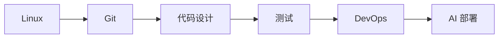

# Ch15 生产软件工程 · 考研/期末复习大纲

> **承接 Ch14 口诀**: "Ch14 给内功 — 数据结构算法. Ch15 给工程素养 — Linux/Git/代码设计/测试/DevOps。"
> **跨章承接**: Ch13 §04 并发 → Ch15 §01 Linux; Ch13 §05 编程语言 → Ch15 §03 代码设计; Ch14 数据结构 → Ch15 §04 测试 fixtures

---

## 一 · 考点分级速览 (🔴 10 / 🟡 14 / 🟢 6 / ⭐ 4, 共 34 考点)

| 考频 | 考点 | 章节 |
|---|---|---|
| 🔴 | Linux 文件与权限 | §01 |
| 🔴 | 进程 / 端口 / 信号 | §01 |
| 🔴 | git 基础 (add/commit/push) | §02 |
| 🔴 | git branch / merge / rebase | §02 |
| 🔴 | 单元测试与 pytest | §04 |
| 🔴 | 集成测试 / E2E | §04 |
| 🔴 | Docker 核心概念 | §05 |
| 🔴 | K8s Pod / Service / Deployment | §05 |
| 🔴 | CI/CD 流程 | §05 |
| 🔴 | 模型版本管理 | §05 |
| 🟡 | shell 脚本 | §01 |
| 🟡 | 网络命令 (curl / ssh / nc) | §01 |
| 🟡 | git stash / cherry-pick | §02 |
| 🟡 | git submodule / LFS | §02 |
| 🟡 | 模块化设计 | §03 |
| 🟡 | API 设计 (REST / GraphQL) | §03 |
| 🟡 | 设计模式 | §03 |
| 🟡 | 测试覆盖率 | §04 |
| 🟡 | 性能测试 / 压测 | §04 |
| 🟡 | Dockerfile 最佳实践 | §05 |
| 🟡 | Helm Chart | §05 |
| 🟡 | GitOps / ArgoCD | §05 |
| 🟡 | 模型监控 (Prometheus) | §05 |
| 🟡 | LLM 服务化 (vLLM / TGI) | §05 |
| 🟢 | ssh key 管理 | §01 |
| 🟢 | git hook | §02 |
| 🟢 | GitHub Actions 缓存 | §05 |
| 🟢 | nginx 反向代理 | §05 |
| 🟢 | LLM 量化部署 | §05 |
| 🟢 | 灰度发布 | §05 |
| ⭐ | eBPF / strace / perf | §01 |
| ⭐ | GitOps 安全 | §02 |
| ⭐ | Argo Workflows | §05 |
| ⭐ | Service Mesh (Istio) | §05 |

---

## 二 · 概念关系图



---

## 三 · 必考点精讲

### 🔴F1: Linux 权限
- `rwx` 三位, 分别 owner/group/other
- `chmod 755 file`: 7=rwx, 5=r-x, 5=r-x
- `chown user:group file`

### 🔴F2: git 工作流
- `git add` → `git commit` → `git push`
- `git branch` → `git checkout -b`
- `git merge` / `git rebase`

### 🔴F3: 单元测试
```python
def add(a, b): return a + b

def test_add():
    assert add(1, 2) == 3
    assert add(-1, 1) == 0
```

`pytest` 自动发现 `test_*.py` 文件。

### 🔴F4: Docker
- 镜像: 只读模板
- 容器: 镜像实例
- Dockerfile: 构建镜像的脚本

### 🔴F5: K8s 三件套
- **Pod**: 1+ 容器
- **Deployment**: 管理 Pod 副本
- **Service**: 暴露 Pod 给外部

---

## 四 · 易错点

1. **git push --force**: 危险, 慎用。
2. **Docker 容器数据**: 容器删数据丢, 用 volume。
3. **K8s 节点亲和**: 调度规则复杂。
4. **CI 缓存**: 没用 cache 慢 10×。
5. **测试覆盖率**: 高 ≠ 无 bug。

---

## 五 · 跨章综合题

| # | 题型 | 涉及的章 | 难度 |
|---|---|---|---|
| 综合1 | Ch15 Docker + Ch07 Transformer 模型部署 | Ch07+Ch15 | ★★★ |
| 综合2 | Ch15 K8s + Ch17 LLM 推理 | Ch15+Ch17 | ★★★ |
| 综合3 | Ch15 测试 + Ch14 数据结构 | Ch14+Ch15 | ★★ |
| 综合4 | Ch13 Linux + Ch15 Git | Ch13+Ch15 | ★★ |
| 综合5 | Ch15 监控 + Ch05 概率 | Ch05+Ch15 | ★★★ |

---

## 六 · 自测题 (15 题)

1. `chmod 644` 含义?
2. git rebase vs merge 区别?
3. pytest 如何发现测试?
4. Docker volume 与 bind mount 区别?
5. K8s Deployment vs StatefulSet?

---

## 七 · 速记口播版 (60s)

Ch15 共 5 节: **§01 Linux/CMD** (文件/权限/进程/网络) → **§02 Git** (分支/PR/rebase) → **§03 代码设计** (模块/API/模式) → **§04 测试** (pytest/集成/CI) → **§05 DevOps** (Docker/K8s/CI/CD)。是 AI 工程师的"工程素养"课。