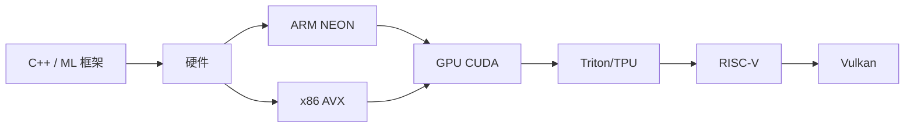

# Ch16 SIMD 与 GPU 编程 · 考研/期末复习大纲

> **承接 Ch15 口诀**: "Ch15 给工程素养 — Linux/Git/代码/测试/DevOps. Ch16 给性能内功 — SIMD/CUDA/Triton/RISC-V。"
> **跨章承接**: Ch13 §02 架构 → Ch16 §01 硬件; Ch13 §04 CUDA → Ch16 §04; Ch17 LLM 推理 → Ch16 §05 Triton

---

## 一 · 考点分级速览 (🔴 14 / 🟡 18 / 🟢 8 / ⭐ 4, 共 44 考点)

| 考频 | 考点 | 章节 |
|---|---|---|
| 🔴 | SIMD 原理 | §00 |
| 🔴 | AVX 寄存器宽度 | §03 |
| 🔴 | NEON 寄存器 | §02 |
| 🔴 | CUDA warp/block/grid | §04 |
| 🔴 | 内存层级 | §01 |
| 🔴 | Roofline 模型 | §01 |
| 🔴 | Tensor core | §04 |
| 🔴 | coalesced 内存访问 | §04 |
| 🔴 | occupancy | §04 |
| 🔴 | bank conflict | §04 |
| 🔴 | Flash Attention | §04 |
| 🔴 | Triton JIT | §05 |
| 🔴 | TPU systolic | §05 |
| 🔴 | RISC-V V 扩展 | §06 |
| 🟡 | 数据对齐 | §03 |
| 🟡 | 内存预取 | §01 |
| 🟡 | AVX-512 mask | §03 |
| 🟡 | ARM SVE | §02 |
| 🟡 | CUDA shared memory | §04 |
| 🟡 | CUDA constant memory | §04 |
| 🟡 | kernel launch overhead | §04 |
| 🟡 | Triton autotune | §05 |
| 🟡 | PTX 汇编 | §04 |
| 🟡 | Triton block size | §05 |
| 🟡 | TPU 脉动阵列 | §05 |
| 🟡 | Vulkan workgroup | §07 |
| 🟡 | Vulkan shader | §07 |
| 🟡 | SPIR-V | §07 |
| 🟡 | RISC-V 指令集 | §06 |
| 🟡 | 嵌入式 ML | §06 |
| 🟡 | 量化 INT4 / INT8 | §04 |
| 🟢 | FMA 指令 | §03 |
| 🟢 | 循环展开 | §03 |
| 🟢 | CUDA stream | §04 |
| 🟢 | CUDA event | §04 |
| 🟢 | TPU pod | §05 |
| 🟢 | Metal (Apple) | §07 |
| 🟢 | RISC-V 物理实现 | §06 |
| 🟢 | GPU 调度器 | §01 |
| ⭐ | MFU (Model FLOPS Utilization) | §04 |
| ⭐ | CUTLASS | §04 |
| ⭐ | Helion | §05 |
| ⭐ | 异构调度 (CUDA + ROCm) | §04 |

---

## 二 · 概念关系图

---

## 三 · 必考点精讲

### 🔴F1: SIMD 原理
一条指令多数据: e.g., AVX-512 同时算 16 个 FP32。

### 🔴F2: AVX-512
- 512 bit 宽
- 32 个 512-bit 寄存器 (ZMM0-31)
- mask 操作

### 🔴F3: CUDA 内存层级
- Register: per-thread, 极快
- Shared: per-block, 快
- L1 / L2: 全 GPU
- Global (HBM): 大, 慢

### 🔴F4: Roofline 模型
$$\text{perf} = \min(\pi_{\text{peak}}, I \times B_{\text{mem}})$$
- 计算受限: $\pi_{\text{peak}}$
- 内存受限: $I \times B_{\text{mem}}$

### 🔴F5: Tensor core
矩阵乘专用, FP16 / BF16 / INT8。

### 🔴F6: occupancy
每个 SM 活跃 warp 数 / 最大 warp 数。影响延迟隐藏。

### 🔴F7: Flash Attention
分块 attention, 不存中间结果, 减少 IO。

### 🔴F8: Triton 优势
- Python-like, 易写
- 自动向量化
- 自动调优

---

## 四 · 公式卡片

### SIMD
$$\text{Speedup} = \frac{\text{width}}{\text{sizeof}(T)}$$

### Roofline
$$P = \min(\pi, I \times B)$$

### Tensor core
$$\text{FLOPs} = 2 \cdot N \cdot M \cdot K \text{ (matmul)}$$

### CUDA
$$T_{\text{kernel}} = T_{\text{launch}} + T_{\text{compute}} + T_{\text{memcpy}}$$

### TPU
$$\text{Systolic 吞吐} = f \cdot N \cdot N / T_{\text{cycle}}$$

### 量化
$$\text{Memory} = \frac{N_{\text{params}} \times \text{bytes}}{4 \text{ (INT4)}}$$

---

## 五 · 跨章综合题

| # | 题型 | 涉及的章 | 难度 |
|---|---|---|---|
| 综合1 | Ch16 CUDA + Ch17 LLM 推理加速 | Ch16+Ch17 | ★★★ |
| 综合2 | Ch16 Triton + Ch07 Transformer attention 优化 | Ch07+Ch16 | ★★★ |
| 综合3 | Ch16 Vulkan + Ch15 K8s 跨平台部署 | Ch15+Ch16 | ★★ |
| 综合4 | Ch13 内存墙 + Ch16 Roofline 模型 | Ch13+Ch16 | ★★★ |
| 综合5 | Ch16 RISC-V + Ch17 边缘推理 | Ch16+Ch17 | ★★ |
| 综合6 | Ch05 概率 + Ch16 量化精度损失 | Ch05+Ch16 | ★★★ |
| 综合7 | Ch02 矩阵论 + Ch16 Tensor core matmul | Ch02+Ch16 | ★★★ |
| 综合8 | Ch06 RL + Ch16 GPU 分布式训练 | Ch06+Ch16 | ★★★ |
| 综合9 | Ch08 CNN + Ch16 cuDNN 内核 | Ch08+Ch16 | ★★ |
| 综合10 | Ch12 GNN + Ch16 Flash Attention 邻居聚合 | Ch12+Ch16 | ★★★ |

---

## 六 · 自测题 (20 题)

### Part A 单选 (10 题)
1. AVX-512 宽度?
2. NEON 宽度?
3. CUDA warp 大小?
4. Tensor core 算什么?
5. Roofline 模型两个区域?
6. occupancy 含义?
7. Triton 优势?
8. TPU 脉动阵列?
9. RISC-V V 扩展?
10. Vulkan Compute 用途?

### Part B 简答 (5 题)
1. SIMD 加速原理
2. CUDA 内存层级
3. Flash Attention 优化点
4. Roofline 模型应用
5. 量化 INT4 优势与风险

### Part C 论述 (5 题)
1. CPU SIMD vs GPU SIMT 取舍
2. Triton 与 CUDA 编程模型差异
3. 量化对模型精度的影响
4. TPU 与 GPU 架构差异
5. RISC-V 在 AI 边缘的角色

---

## 七 · 易错点

1. **AVX vs AVX-512**: 宽度不同 (256 vs 512)。
2. **CUDA warp 与 block**: warp=32, block 可含多 warp。
3. **shared memory 与 L1**: 共享内存 = 显式管理。
4. **coalesced**: 32 个 thread 访问连续 128 字节。
5. **bank conflict**: shared mem 32 个 bank, 同 bank 冲突。
6. **Triton 自动向量化**: 不是所有 kernel 都自动优化。
7. **TPU pod**: 不是单机, 是 1024+ 芯片互联。
8. **RISC-V 商业**: SiFive / 平头哥, 还在追赶 ARM。

---

## 八 · 速记口播版 (60s)

Ch16 共 8 节: **§00 C++/ML 框架** (PyTorch C++) → **§01 硬件** (内存墙 + Roofline) → **§02 ARM NEON** (移动 SIMD) → **§03 x86 AVX** (服务器 SIMD) → **§04 GPU CUDA** (NVIDIA 主导, Tensor core) → **§05 Triton/TPU** (Python 风格 + 加速器) → **§06 RISC-V** (嵌入式) → **§07 Vulkan** (跨平台 GPU)。是 AI 性能工程师的内功。