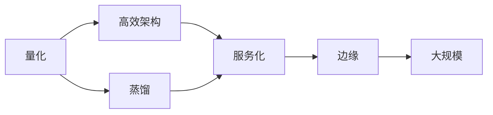

# Ch17 AI 推理 · 考研/期末复习大纲

> **承接 Ch16 口诀**: "Ch16 给性能内功 — SIMD/CUDA/Triton. Ch17 给推理工程 — 量化 + 高效架构 + 服务化 + 边缘 + 大规模。"
> **跨章承接**: Ch07 §04 Transformer → Ch17 §02 高效架构; Ch15 §05 K8s → Ch17 §05 部署

---

## 一 · 考点分级速览 (🔴 12 / 🟡 16 / 🟢 8 / ⭐ 4, 共 40 考点)

| 考频 | 考点 | 章节 |
|---|---|---|
| 🔴 | PTQ vs QAT | §01 |
| 🔴 | INT8 / INT4 量化 | §01 |
| 🔴 | GPTQ / AWQ | §01 |
| 🔴 | KV cache 大小 | §02 |
| 🔴 | Flash Attention 原理 | §02 |
| 🔴 | PagedAttention | §03 |
| 🔴 | Continuous batching | §03 |
| 🔴 | Speculative decoding | §03 |
| 🔴 | vLLM 架构 | §03 |
| 🔴 | GQA / MQA | §02 |
| 🔴 | Llama.cpp | §04 |
| 🔴 | Edge inference 限制 | §04 |
| 🟡 | 量化精度损失 | §01 |
| 🟡 | SmoothQuant | §01 |
| 🟡 | Activation checkpointing | §01 |
| 🟡 | Multi-Query Attention | §02 |
| 🟡 | Sliding Window Attention | §02 |
| 🟡 | KV cache 压缩 | §02 |
| 🟡 | Prompt cache | §03 |
| 🟡 | TGI 架构 | §03 |
| 🟡 | TensorRT-LLM | §03 |
| 🟡 | Triton Inference Server | §03 |
| 🟡 | Quantization aware training | §01 |
| 🟡 | ONNX Runtime | §04 |
| 🟡 | CoreML | §04 |
| 🟡 | Android NNAPI | §04 |
| 🟡 | 模型路由 | §05 |
| 🟢 | KV cache 量化 | §02 |
| 🟢 | 模型蒸馏 | §01 |
| 🟢 | WebLLM | §04 |
| 🟢 | NVIDIA Triton | §03 |
| 🟢 | 推理 SLO | §05 |
| 🟢 | 模型灰度 | §05 |
| 🟢 | 端云协同 | §04 |
| ⭐ | Megablocks | §02 |
| ⭐ | Flash decoding | §03 |
| ⭐ | SSM (Mamba) 推理 | §02 |
| ⭐ | MoE 推理 | §03 |

---

## 二 · 概念关系图

---

## 三 · 必考点精讲

### 🔴F1: PTQ vs QAT
- **PTQ**: 训练后量化, 简单, 损失 < 1%
- **QAT**: 训练中量化, 精度高, 复杂

### 🔴F2: 量化方法
- **GPTQ**: 逐层量化, GPT 命名
- **AWQ**: Activation-aware, 保护显著权重
- **SmoothQuant**: 数学等价变换
- **bitsandbytes**: 简单 NF4/INT8

### 🔴F3: KV cache 大小
$$S_{\text{KV}} = 2 \cdot N_{\text{layers}} \cdot N_{\text{heads}} \cdot d_{\text{head}} \cdot N_{\text{tokens}}$$

Llama 70B 长上下文 (128K) → ~50 GB KV cache。

### 🔴F4: PagedAttention
像 OS 虚拟内存分页, KV cache 分块, 减少碎片。

### 🔴F5: Continuous batching
不等待所有请求完成, 动态调度, 提升吞吐 24× (vLLM 论文)。

### 🔴F6: Speculative decoding
小模型 (draft) 猜 N token, 大模型 (target) 验证, 通过则采纳。

### 🔴F7: GQA / MQA
减少 KV head 数, 减少 KV cache 8-32×。

---

## 四 · 公式卡片

### 量化
$$\text{Memory} = N_{\text{params}} \times \text{bytes}$$
$$\text{bytes}_{\text{INT4}} = 0.5$$

### KV cache
$$S_{\text{KV}} = 2 L d_{\text{model}} N_{\text{tokens}} \times 2 \text{ bytes (FP16)}$$

### 吞吐
$$T = \frac{N_{\text{tokens}}}{\text{time}}$$

### TTFT / TPOT
$$\text{TTFT} = T_{\text{prompt prefill}} + T_{\text{first decode}}$$
$$\text{TPOT} = T_{\text{decode}} / N_{\text{tokens}}$$

### 内存墙
$$T_{\text{min}} = \frac{S_{\text{model}}}{B_{\text{HBM}}}$$

---

## 五 · 跨章综合题

| # | 题型 | 涉及的章 | 难度 |
|---|---|---|---|
| 综合1 | Ch07 §04 + Ch17 §02 Flash Attention | Ch07+Ch17 | ★★★ |
| 综合2 | Ch15 §05 + Ch17 §05 K8s 部署 | Ch15+Ch17 | ★★★ |
| 综合3 | Ch16 §04 + Ch17 §03 vLLM | Ch16+Ch17 | ★★★ |
| 综合4 | Ch13 §04 + Ch17 §01 量化 | Ch13+Ch17 | ★★ |
| 综合5 | Ch12 §05 + Ch17 §04 边缘 3D | Ch12+Ch17 | ★★ |
| 综合6 | Ch05 §04 + Ch17 §01 量化误差 | Ch05+Ch17 | ★★★ |
| 综合7 | Ch02 §04 + Ch17 §03 batching 调度 | Ch02+Ch17 | ★★ |
| 综合8 | Ch06 §04 + Ch17 §03 RL 推理 | Ch06+Ch17 | ★★ |
| 综合9 | Ch08 §04 + Ch17 §02 Diffusion 加速 | Ch08+Ch17 | ★★ |
| 综合10 | Ch10 §05 + Ch17 §05 多模态部署 | Ch10+Ch17 | ★★★ |

---

## 六 · 自测题 (20 题)

### Part A 单选 (10 题)
1. PTQ 含义?
2. INT4 比 FP16 内存节省?
3. PagedAttention 来源?
4. Continuous batching 优势?
5. Speculative decoding 原理?
6. GQA 与 MQA 区别?
7. Llama.cpp 主要用途?
8. TTFT 含义?
9. vLLM 后端?
10. 边缘 LLM 限制?

### Part B 简答 (5 题)
1. PTQ vs QAT
2. KV cache 大小计算
3. PagedAttention 原理
4. GQA 减少 KV 多少
5. 量化精度损失原因

### Part C 论述 (5 题)
1. 推理延迟优化三方向
2. vLLM 核心创新
3. 边缘部署 vs 云端
4. 大规模推理服务的关键
5. 量化与稀疏化联合

---

## 七 · 易错点

1. **量化精度**: 不是无损, 需要评估。
2. **KV cache**: 长上下文大, 内存墙主因。
3. **PagedAttention**: vLLM, 不是 TensorRT-LLM。
4. **Speculative decoding**: 需要 draft 模型。
5. **Continuous batching**: 不是简单 batch。

---

## 八 · 速记口播版 (60s)

Ch17 共 5 节: **§01 量化** (INT8/INT4, GPTQ/AWQ) → **§02 高效架构** (Flash Attn, GQA, PagedAttn) → **§03 推理服务** (vLLM, TGI, batching) → **§04 边缘推理** (Llama.cpp, ONNX) → **§05 大规模部署** (K8s + autoscaling)。是 AI 工程师的"推理优化"课。