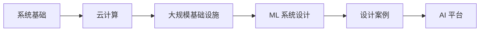

# Ch18 ML 系统设计 · 考研/期末复习大纲

> **承接 Ch17 口诀**: "Ch17 给推理工程 — 量化 + 服务化 + 边缘. Ch18 给系统设计 — 云原生 + 大规模基础设施 + ML 平台。"
> **跨章承接**: Ch13 §03 OS → Ch18 §01; Ch15 §05 K8s → Ch18 §03; Ch17 §03 → Ch18 §04 ML 系统

---

## 一 · 考点分级速览 (🔴 10 / 🟡 14 / 🟢 6 / ⭐ 4, 共 34 考点)

| 考频 | 考点 | 章节 |
|---|---|---|
| 🔴 | CAP 定理 | §01 |
| 🔴 | 一致性 vs 可用性 | §01 |
| 🔴 | Kafka 架构 | §03 |
| 🔴 | Spark vs MapReduce | §03 |
| 🔴 | 数据漂移检测 | §04 |
| 🔴 | Feature Store 设计 | §04 |
| 🔴 | 在线 / 离线一致性 | §04 |
| 🔴 | A/B test 显著性 | §04 |
| 🔴 | 模型注册 (Registry) | §04 |
| 🔴 | ML 系统监控 | §04 |
| 🟡 | IaaS / PaaS / SaaS | §02 |
| 🟡 | AWS / GCP / Azure | §02 |
| 🟡 | 数据湖架构 | §03 |
| 🟡 | Iceberg / Delta | §03 |
| 🟡 | 回流闭环 | §04 |
| 🟡 | 影子流量 | §04 |
| 🟡 | Netflix Zuul / Eureka | §05 |
| 🟡 | DoorDash 派单 | §05 |
| 🟡 | Uber Michelangelo | §05 |
| 🟡 | Airbnb ML Platform | §05 |
| 🟡 | Pinterest 推荐 | §05 |
| 🟢 | Lambda 架构 | §03 |
| 🟢 | Kappa 架构 | §03 |
| 🟢 | 边缘 ML | §02 |
| 🟢 | 模型卡片 | §04 |
| 🟢 | SLA / SLO | §01 |
| ⭐ | Ray / Dask | §03 |
| ⭐ | Ray Serve | §04 |
| ⭐ | KServe | §04 |
| ⭐ | 数据网格 (Data Mesh) | §03 |

---

## 二 · 概念关系图

---

## 三 · 必考点精讲

### 🔴F1: CAP 定理
C 一致性 / A 可用性 / P 分区容忍。分布式系统三选二。
- CP: 强一致, 牺牲可用 (HBase, ZooKeeper)
- AP: 高可用, 弱一致 (Cassandra, DynamoDB)

### 🔴F2: Kafka 架构
- **Producer**: 写入
- **Broker**: 存储
- **Consumer**: 读取
- **Topic / Partition**: 消息分类
- 吞吐: ~1M msg/s

### 🔴F3: Spark vs MapReduce
- **MapReduce**: 磁盘迭代, 慢
- **Spark**: 内存计算, RDD/Dataset, 100× 快

### 🔴F4: Feature Store
统一特征管理, 在线 + 离线一致性:
- Feast / Tecton / Hopsworks

### 🔴F5: 数据漂移
- **Covariate shift**: $P(X)$ 变
- **Prior shift**: $P(Y)$ 变
- **Concept shift**: $P(Y|X)$ 变

检测: PSI, KS 检验, 模型性能监控。

### 🔴F6: A/B test
- 随机分流
- 统计显著性 (p < 0.05)
- 长期 + 短期指标

---

## 四 · 公式卡片

### CAP
$$\text{CAP}_{\text{three}} \to \text{choose two}$$

### 可用性
$$U = \frac{MTBF}{MTBF + MTTR}$$

### 一致性哈希
$$\text{node}_i \to \text{hash} \to \text{ring}$$

### QPS / Latency
$$\text{QPS} = \frac{N_{\text{reqs}}}{T}$$
$$\text{p99} = 99\% \text{ reqs under this latency}$$

### PSI
$$PSI = \sum (P_{\text{new}} - P_{\text{ref}}) \ln \frac{P_{\text{new}}}{P_{\text{ref}}}$$

---

## 五 · 跨章综合题

| # | 题型 | 涉及的章 | 难度 |
|---|---|---|---|
| 综合1 | Ch15 + Ch18 K8s + Spark 大规模数据 | Ch15+Ch18 | ★★★ |
| 综合2 | Ch17 + Ch18 vLLM + Feature Store | Ch17+Ch18 | ★★★ |
| 综合3 | Ch13 + Ch18 OS + Kafka | Ch13+Ch18 | ★★ |
| 综合4 | Ch05 + Ch18 概率 + A/B test | Ch05+Ch18 | ★★★ |
| 综合5 | Ch12 + Ch18 GNN 推荐系统 | Ch12+Ch18 | ★★★ |
| 综合6 | Ch10 + Ch18 多模态 + 数据湖 | Ch10+Ch18 | ★★ |
| 综合7 | Ch11 + Ch18 SLAM + 边缘 ML | Ch11+Ch18 | ★★ |
| 综合8 | Ch08 + Ch18 CNN + 模型服务 | Ch08+Ch18 | ★★★ |

---

## 六 · 自测题 (15 题)

1. CAP 定理三选二?
2. Kafka 三个角色?
3. 数据漂移三种?
4. Feature Store 解决什么问题?
5. A/B test 显著性阈值?
6. Spark 为什么比 MapReduce 快?
7. Lambda vs Kappa 架构?
8. 一致性哈希优势?
9. ML 系统监控哪些指标?
10. 在线 vs 离线特征一致性?

---

## 七 · 易错点

1. **CAP**: 三选二, 不是任选。
2. **Kafka**: 不是队列, 是日志。
3. **Feature Store**: 在线 / 离线 schema 一致。
4. **A/B test**: 流量分配要随机。
5. **数据漂移**: 不止 covariate shift。

---

## 八 · 速记口播版 (60s)

Ch18 共 5 节: **§01 系统设计基础** (CAP/可扩展) → **§02 云计算** (IaaS/PaaS) → **§03 大规模基础设施** (Kafka/Spark/数据湖) → **§04 ML 系统设计** (Feature Store / Registry / 监控) → **§05 设计案例** (Netflix/DoorDash/Uber)。是 AI 工程师的"系统设计"课。