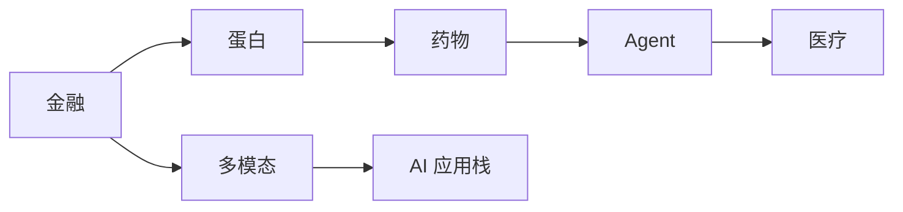

# Ch19 应用 AI · 考研/期末复习大纲

> **承接 Ch18 口诀**: "Ch18 给系统设计 — CAP/云/ML 平台. Ch19 给应用落地 — 金融/蛋白/药物/Agent/医疗。"
> **跨章承接**: Ch07 §04 Transformer → Ch19 全部; Ch12 §05 EGNN → Ch19 §02 蛋白; Ch08 §04 Diffusion → Ch19 §03 药物

---

## 一 · 考点分级速览 (🔴 12 / 🟡 16 / 🟢 8 / ⭐ 4, 共 40 考点)

| 考频 | 考点 | 章节 |
|---|---|---|
| 🔴 | Sharpe ratio | §01 |
| 🔴 | Value at Risk | §01 |
| 🔴 | 高频交易 ML | §01 |
| 🔴 | AlphaFold 架构 | §02 |
| 🔴 | MSA 多序列比对 | §02 |
| 🔴 | pLDDT / TM-score | §02 |
| 🔴 | 药物分子生成 | §03 |
| 🔴 | QED / LogP | §03 |
| 🔴 | LLM Agent vs LLM | §04 |
| 🔴 | ReAct 框架 | §04 |
| 🔴 | RAG 原理 | §04 |
| 🔴 | Tool use | §04 |
| 🟡 | 量化回测 | §01 |
| 🟡 | 信用评分 ML | §01 |
| 🟡 | 反欺诈 | §01 |
| 🟡 | 蛋白结构模型 (RoseTTAFold) | §02 |
| 🟡 | Evoformer 细节 | §02 |
| 🟡 | 分子 docking | §03 |
| 🟡 | 药物 - 靶点相互作用 | §03 |
| 🟡 | ADMET 性质 | §03 |
| 🟡 | LangChain / LlamaIndex | §04 |
| 🟡 | Function calling | §04 |
| 🟡 | AutoGPT / BabyAGI | §04 |
| 🟡 | 医学影像分割 | §05 |
| 🟡 | 临床预测 (MIMIC) | §05 |
| 🟡 | 多模态医学 AI | §05 |
| 🟢 | 反洗钱 | §01 |
| 🟢 | 情感交易 | §01 |
| 🟢 | AlphaFold-Multimer | §02 |
| 🟢 | DiffDock | §03 |
| 🟢 | Memory in Agent | §04 |
| 🟢 | 联邦学习医疗 | §05 |
| ⭐ | Quantum ML 在金融 | §01 |
| ⭐ | Boltz / ESMFold | §02 |
| ⭐ | AlphaFold 3 | §02 |
| ⭐ | AutoDock Vina | §03 |

---

## 二 · 概念关系图

---

## 三 · 必考点精讲

### 🔴F1: Sharpe ratio
$$S = \frac{R_p - R_f}{\sigma_p}$$
$R_p$ 组合收益, $R_f$ 无风险, $\sigma_p$ 波动。
S > 1 好, > 2 极好, > 3 罕见。

### 🔴F2: Value at Risk
损失分布的 $\alpha$ 分位数。
- VaR 99% 5M: 99% 信心日损失 < 5M
- 局限: 不看尾部

### 🔴F3: AlphaFold
- 输入: MSA + 模板
- 核心: Evoformer (pair + MSA)
- 输出: 3D 结构 + pLDDT

### 🔴F4: pLDDT
残基置信度 [0, 100]:
- > 90 高置信
- 70-90 中等
- < 70 低

### 🔴F5: TM-score
结构相似度 [0, 1]:
- > 0.5 同 fold
- > 0.17 同 SCOP 超家族

### 🔴F6: 分子生成
- SMILES 表示
- VAE / GAN / RL / Diffusion
- 优化: QED / LogP / docking

### 🔴F7: LLM Agent
LLM + 工具 + 记忆 + 规划 = Agent

### 🔴F8: ReAct
Reasoning + Acting 循环:
Thought → Action → Observation → Thought → ...

### 🔴F9: RAG
检索增强生成:
- 文档 → embedding → 向量库
- query → 检索 → top-k
- LLM 生成

### 🔴F10: Tool Use
LLM 调用外部 API:
- Function calling (OpenAI)
- LangChain tools
- MCP (Anthropic)

---

## 四 · 公式卡片

### 金融
$$S = \frac{R_p - R_f}{\sigma_p}$$
$$\text{MaxDD} = \max_t (\text{peak}_t - \text{trough}_t)$$

### 蛋白
$$\text{pLDDT} = 100 \cdot \text{pLDDT}_{\text{raw}}$$
$$\text{TM-score} = \max \left[ \frac{1}{L_{\text{nat}}} \sum_i \frac{1}{1 + (d_i / d_0)^2} \right]$$

### 药物
$$\text{QED} = f(\text{MW}, \text{LogP}, \text{HBA}, \text{HBD}, ...)$$

### Agent
$$\text{Action}_{t+1} = \pi(\text{Observation}_t, \text{Thought}_t)$$

### RAG
$$\text{score} = \cos(q, d_i)$$

### 医学
$$\text{Sensitivity} = \frac{TP}{TP + FN}$$
$$\text{Specificity} = \frac{TN}{TN + FP}$$

---

## 五 · 跨章综合题

| # | 题型 | 涉及的章 | 难度 |
|---|---|---|---|
| 综合1 | Ch07 + Ch19 §02 AlphaFold Transformer | Ch07+Ch19 | ★★★ |
| 综合2 | Ch12 + Ch19 §02 GNN + 蛋白 | Ch12+Ch19 | ★★★ |
| 综合3 | Ch08 + Ch19 §03 Diffusion 药物生成 | Ch08+Ch19 | ★★★ |
| 综合4 | Ch07 + Ch19 §04 Agent = LLM + Tools | Ch07+Ch19 | ★★ |
| 综合5 | Ch17 + Ch19 §04 Agent vLLM 部署 | Ch17+Ch19 | ★★★ |
| 综合6 | Ch05 + Ch19 §01 量化策略评估 | Ch05+Ch19 | ★★★ |
| 综合7 | Ch12 + Ch19 §01 GNN 推荐 (金融) | Ch12+Ch19 | ★★ |
| 综合8 | Ch10 + Ch19 §05 多模态医学 | Ch10+Ch19 | ★★★ |

---

## 六 · 自测题 (20 题)

### Part A 单选 (10 题)
1. Sharpe > 2 表示?
2. VaR 99% 含义?
3. AlphaFold 关键模块?
4. pLDDT 范围?
5. TM-score > 0.5 含义?
6. QED 含义?
7. ReAct 框架?
8. RAG 三阶段?
9. Tool use 代表?
10. 医学影像 Dice 范围?

### Part B 简答 (5 题)
1. Sharpe ratio 解释
2. AlphaFold 三阶段
3. 分子生成的 4 种方法
4. Agent 与 LLM 区别
5. RAG 与微调取舍

### Part C 论述 (5 题)
1. 量化策略 ML 工程实践
2. AlphaFold 3 改进
3. 药物发现端到端流程
4. Agent 框架对比 (LangChain / AutoGPT)
5. 联邦学习在医疗的合规优势

---

## 七 · 易错点

1. **Sharpe 与 Sortino**: 后者只算下行波动。
2. **AlphaFold pLDDT**: 残基级, 不是全蛋白。
3. **TM-score**: 与 RMSD 不同, 长度无关。
4. **QED**: 不是唯一指标, 还有合成难度等。
5. **RAG vs 微调**: RAG 适合知识更新频繁, 微调适合模型能力。

---

## 八 · 速记口播版 (60s)

Ch19 共 5 节: **§01 金融** (Sharpe/VaR/量化) → **§02 蛋白设计** (AlphaFold/Evoformer) → **§03 药物发现** (分子生成/QED) → **§04 Agent 系统** (ReAct/RAG/Tool use) → **§05 Healthcare** (影像分割/临床预测)。是 AI 在垂直行业落地的"应用"课。