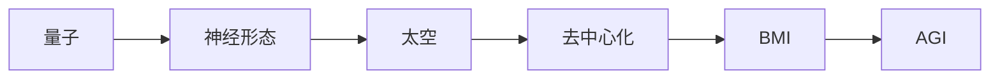

# Ch20 前沿 AI · 考研/期末复习大纲

> **承接 Ch19 口诀**: "Ch19 给应用落地 — 金融/蛋白/药物/Agent/医疗. Ch20 给前沿展望 — 量子/神经形态/太空/去中心化/BMI。"
> **跨章承接**: Ch02 §04 矩阵 → Ch20 §01 量子; Ch07 §04 Transformer → Ch20 §05 BMI 解码; Ch18 §04 ML 平台 → Ch20 §04 去中心化

---

## 一 · 考点分级速览 (🔴 8 / 🟡 12 / 🟢 6 / ⭐ 6, 共 32 考点)

| 考频 | 考点 | 章节 |
|---|---|---|
| 🔴 | Qubit 与经典 bit | §01 |
| 🔴 | VQE 算法 | §01 |
| 🔴 | QAOA | §01 |
| 🔴 | 神经形态优势 | §02 |
| 🔴 | SNN 与 ANN 区别 | §02 |
| 🔴 | 太空数据中心优势 | §03 |
| 🔴 | 联邦学习与去中心化 | §04 |
| 🔴 | BCI 信号采集 | §05 |
| 🟡 | 量子纠缠 | §01 |
| 🟡 | Shor 算法 | §01 |
| 🟡 | SpiNNaker / Loihi | §02 |
| 🟡 | Spike 编码 | §02 |
| 🟡 | 辐射加固 | §03 |
| 🟡 | BitTensor / NEAR | §04 |
| 🟡 | 模型市场 | §04 |
| 🟡 | 联邦 vs 区块链 | §04 |
| 🟡 | Neuralink | §05 |
| 🟡 | EEG vs ECoG vs 侵入 | §05 |
| 🟡 | 解码算法 | §05 |
| 🟢 | IBM Q | §01 |
| 🟢 | Google Sycamore | §01 |
| 🟢 | TrueNorth (IBM) | §02 |
| 🟢 | 太空冷却 | §03 |
| 🟢 | OpenLedger | §04 |
| 🟢 | fMRI / MEG | §05 |
| ⭐ | 拓扑量子 | §01 |
| ⭐ | 量子优越性 | §01 |
| ⭐ | 神经形态软件栈 | §02 |
| ⭐ | LEO 卫星 AI | §03 |
| ⭐ | Web3 + AI | §04 |
| ⭐ | 双向 BMI | §05 |

---

## 二 · 概念关系图

---

## 三 · 必考点精讲

### 🔴F1: Qubit
量子比特, 0/1 叠加态: $|\psi\rangle = \alpha|0\rangle + \beta|1\rangle$, $|\alpha|^2 + |\beta|^2 = 1$。

### 🔴F2: VQE
变分量子特征求解器:
- 量子电路参数化
- 经典优化参数
- 找基态能量

适用: 小分子, 量子化学。

### 🔴F3: QAOA
量子近似优化算法:
- 解决组合优化 (e.g., MaxCut)
- 量子 + 经典混合

### 🔴F4: 神经形态
- 模拟大脑神经元的脉冲 (spike)
- 事件驱动, 低功耗
- 代表: Intel Loihi, IBM TrueNorth, SpiNNaker

### 🔴F5: SNN vs ANN
- ANN: 连续激活, 同步计算
- SNN: 脉冲稀疏, 异步计算, 节能

### 🔴F6: 太空数据中心
- 太阳能 24h
- 真空冷却 (无对流)
- 辐射加固

代表: Google Project Suncatcher, Lumen Orbit, Starcloud。

### 🔴F7: 去中心化 AI
- 联邦学习 (Ch19 §05)
- 区块链激励
- 模型市场 (BitTensor, NEAR)

### 🔴F8: BCI
- 侵入 (Neuralink): 高信噪比, 需手术
- 非侵入 (EEG): 易用, 低信噪比
- ECoG: 中间方案

---

## 四 · 公式卡片

### 量子
$$|\psi\rangle = \alpha|0\rangle + \beta|1\rangle$$
$$|\alpha|^2 + |\beta|^2 = 1$$

### 量子门
$$H|0\rangle = \frac{1}{\sqrt{2}}(|0\rangle + |1\rangle)$$

### 神经形态
$$E_{\text{spike}} \propto N_{\text{spikes}} \times C_{\text{per-spike}}$$
$$E_{\text{ANN}} \gg E_{\text{SNN}}$$

### 太空
$$P_{\text{solar}} = A_{\text{panel}} \times \eta \times 1361 \text{ W/m²}$$

### BMI
$$y_t = f(\text{NeuralSignal}_t, \theta)$$
$$\theta = \arg\min_\theta \sum_t (y_t - y^*_t)^2$$

### 联邦
$$\theta_{t+1} = \theta_t - \eta \nabla L_{\text{local}}$$

---

## 五 · 跨章综合题

| # | 题型 | 涉及的章 | 难度 |
|---|---|---|---|
| 综合1 | Ch02 + Ch20 §01 量子 + 矩阵 | Ch02+Ch20 | ★★★ |
| 综合2 | Ch07 + Ch20 §05 BMI 解码 | Ch07+Ch20 | ★★★ |
| 综合3 | Ch19 + Ch20 §04 联邦 + 去中心化 | Ch19+Ch20 | ★★★ |
| 综合4 | Ch08 + Ch20 §01 量子 + Diffusion | Ch08+Ch20 | ★★★ |
| 综合5 | Ch13 + Ch20 §03 太空数据中心 | Ch13+Ch20 | ★★ |
| 综合6 | Ch12 + Ch20 §02 神经形态 + GNN | Ch12+Ch20 | ★★★ |
| 综合7 | Ch05 + Ch20 §04 区块链 + 概率 | Ch05+Ch20 | ★★ |

---

## 六 · 自测题 (15 题)

1. Qubit 与 bit 区别?
2. VQE 用途?
3. QAOA 适用?
4. 神经形态优势?
5. SNN vs ANN?
6. 太空数据中心 3 优势?
7. 联邦 vs 区块链?
8. BitTensor 是什么?
9. BCI 侵入 vs 非侵入?
10. Neuralink 现状?

---

## 七 · 易错点

1. **Qubit**: 测量后塌缩, 不是真"并行"。
2. **VQE**: 当前硬件规模有限 (~100 qubit)。
3. **神经形态**: 不是 GPU 替代品, 适用特定任务。
4. **太空数据中心**: 仍是早期, 商业化 2030+。
5. **BMI**: 当前主要是单向读取, 写入难。

---

## 八 · 速记口播版 (60s)

Ch20 共 5 节: **§01 量子 ML** (Qubit/VQE/QAOA) → **§02 神经形态** (SpiNNaker/Loihi/SNN) → **§03 太空数据中心** (低重力 + 太阳能) → **§04 去中心化 AI** (区块链 + 模型市场) → **§05 脑机接口** (Neuralink/BCI/解码)。是 AI 前沿展望的"未来"课。