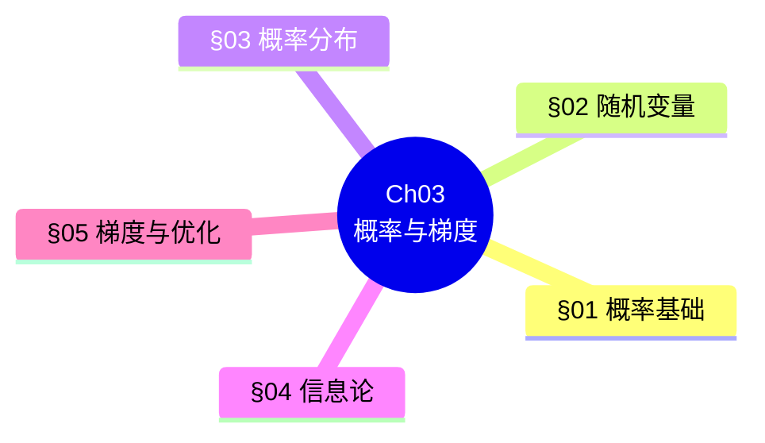

# Ch03 概率论与梯度 · 思维导图 (占位 / 待重写)

> **状态**: 本文件原内容被会话日志污染,已被清理。当前为占位。
> **重建优先级**: P1 — 完整思维导图待补。

## 章节主入口

```mermaid
mindmap
  root((Ch03<br/>概率与梯度))
    §01 概率基础
    §02 随机变量
    §03 概率分布
    §04 信息论
    §05 梯度与优化
```

## 备注

完整思维导图 (含 mermaid 子图 / 公式表 / 时间线) 将在后续轮次补齐。