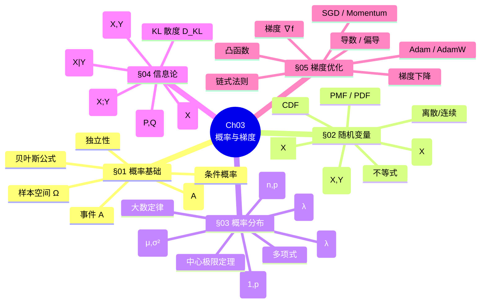
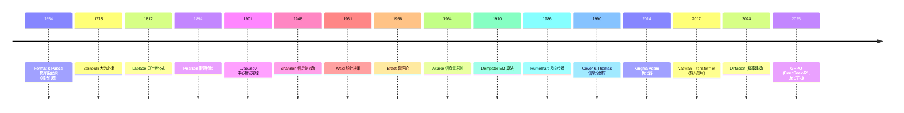
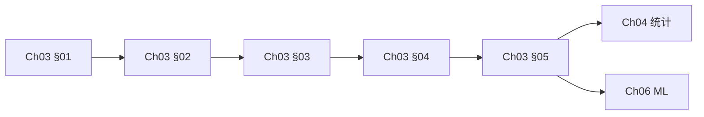

# Ch03 概率论与梯度 · 思维导图

> **章节**: Ch03 概率论与梯度 (5 节)
> **视图**: 概念树 / 公式卡 / 关系图 / 时间线
> **学习阶段**: 基础理解 + 速查复习

---

## 1 · 章节全景 (Mermaid)



---

## 2 · 公式速查卡

### 概率基础

| 公式 | 名称 | 应用 |
|------|------|------|
| $P(A\|B) = \frac{P(A \cap B)}{P(B)}$ | 条件概率 | 医学诊断 |
| $P(A \cap B) = P(A\|B) P(B)$ | 乘法公式 | 联合概率 |
| $P(A) = \sum_i P(A\|B_i) P(B_i)$ | 全概率 | 多场景 |
| $P(H\|E) = \frac{P(E\|H) P(H)}{P(E)}$ | 贝叶斯 | 反向推理 |
| $P(A \cap B) = P(A) P(B)$ | 独立 | 投币 |

### 随机变量

| 公式 | 含义 |
|------|------|
| $E[X] = \int x f(x) dx$ | 期望 |
| $Var(X) = E[(X-\mu)^2]$ | 方差 |
| $Cov(X,Y) = E[(X-\mu_X)(Y-\mu_Y)]$ | 协方差 |
| $\rho = \frac{Cov(X,Y)}{\sigma_X \sigma_Y}$ | 相关系数 |
| $E[aX + b] = aE[X] + b$ | 期望线性 |
| $Var(X+Y) = Var(X) + Var(Y) + 2Cov$ | 方差相加 |

### 分布

| 分布 | PDF/PMF |
|------|---------|
| $B(1,p)$ | $p^x (1-p)^{1-x}$ |
| $B(n,p)$ | $\binom{n}{k} p^k (1-p)^{n-k}$ |
| $\mathcal{N}(\mu, \sigma^2)$ | $\frac{1}{\sqrt{2\pi}\sigma} e^{-\frac{(x-\mu)^2}{2\sigma^2}}$ |
| $P(\lambda)$ | $\frac{\lambda^k e^{-\lambda}}{k!}$ |
| $\text{Exp}(\lambda)$ | $\lambda e^{-\lambda x}$ |

### 信息论

| 公式 | 含义 |
|------|------|
| $H(X) = -\sum p \log p$ | 熵 |
| $H(X,Y) = -\sum\sum p(x,y) \log p(x,y)$ | 联合熵 |
| $H(X\|Y) = -\sum\sum p(x,y) \log p(x\|y)$ | 条件熵 |
| $I(X;Y) = H(X) - H(X\|Y)$ | 互信息 |
| $D_{KL}(P \| Q) = \sum p \log \frac{p}{q}$ | KL 散度 |
| $H(P,Q) = -\sum p \log q$ | 交叉熵 |

### 优化

| 公式 | 含义 |
|------|------|
| $\nabla f = [\partial f / \partial x_1, \ldots]$ | 梯度 |
| $D_u f = \nabla f \cdot \mathbf{u}$ | 方向导数 |
| $\frac{\partial f}{\partial x} = \frac{\partial f}{\partial u} \cdot \frac{\partial u}{\partial x}$ | 链式法则 |
| $\theta_{t+1} = \theta_t - \eta \nabla L$ | 梯度下降 |
| $v_t = \beta v_{t-1} + \nabla L$ | Momentum |
| $m_t = \beta_1 m_{t-1} + (1-\beta_1) g_t$ | Adam 1阶 |
| $v_t = \beta_2 v_{t-1} + (1-\beta_2) g_t^2$ | Adam 2阶 |

---

## 3 · 概念关系图

```
概率空间 ────→ 随机变量 ────→ 概率分布
    │              │              │
    ↓              ↓              ↓
条件概率 ────→ 期望方差 ────→ 大数定律 + CLT
    │              │              │
    ↓              ↓              ↓
贝叶斯公式 ────→ 协方差 ────→ 多维高斯
    │              │
    ↓              ↓
熵 / KL ────→ 互信息
    │
    ↓
交叉熵 (ML loss)
    │
    ↓
梯度下降 → Adam
```

---

## 4 · 时间线



---

## 5 · 易错点

```mermaid
mindmap
  root((易错点))
    独立性
      独立 ⟹ 不相关
      反之不成立
      高斯时等价
    KL 散度
      非对称
      始终非负
      等号仅当 P=Q
    期望
      E[X²] ≠ (E[X])²
      Var(X) = E[X²] - (E[X])²
    梯度
      梯度 = 上升方向
      负梯度 = 下降方向
    优化器
      Adam ≠ AdamW
      权重衰减 ≠ L2 正则
      动量 ≠ 二阶优化
```

---

## 6 · 跨章节连接

```
       Ch01 线性代数
              ↓
       Ch02 矩阵论
              ↓
       Ch03 概率与梯度 (本章节)
              ↓
       ┌──────────┬──────────┐
       ↓          ↓          ↓
    Ch04 统计   Ch05 贝叶斯  Ch06 ML
       ↓          ↓          ↓
       └──────────┴──────────┘
              ↓
       Ch07+ 深度学习
              (Transformer, GPT, etc.)
```

---

## 7 · 学习路径



**建议**: 5 节按顺序学习, 80% 时间在 §03-04 (高斯 + 信息论)。

---

## 8 · 自查速查表

| 概念 | 公式 | 数值例子 |
|------|------|----------|
| 贝叶斯 | $P(H\|E) = P(E\|H)P(H)/P(E)$ | 假阳性 17% |
| 期望 | $E[X] = \sum x p(x)$ | 骰子 3.5 |
| 方差 | $Var(X) = E[X^2] - (E[X])^2$ | 骰子 2.92 |
| 高斯 PDF | $\frac{1}{\sqrt{2\pi}\sigma} e^{-(x-\mu)^2/2\sigma^2}$ | 标准正态 |
| 熵 | $H(X) = -\sum p \log p$ | 公平硬币 1 bit |
| KL | $D_{KL}(P \| Q) = \sum p \log(p/q)$ | 始终 ≥ 0 |
| 梯度 | $\nabla f = [\partial f/\partial x_i]$ | 凸函数 |
| Adam | $m, v$ + bias correction | 通用优化 |

---

## 9 · 章节核心思想

> **Ch03 = 不确定性 + 优化的数学语言**。
> 
> 概率论让我们**量化不确定**, 优化论让我们**在不确定中找到最优**。
> 整个 ML/DL 都是这两件事的组合应用。

---

## 10 · 配套资源

- **教材**: Bishop PRML Ch1-2, Goodfellow DL Ch3-4
- **视频**: 3Blue1Brown 概率, StatQuest 统计
- **工具**: NumPy, SciPy, PyTorch
- **习题**: 见 `阶段测试题/第03章.md`
