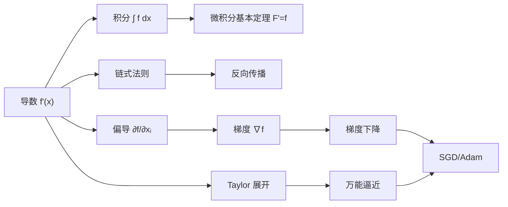

# Ch03 微积分 · 思维导图

> **章节**: Ch03 微积分 (5 节)
> **视图**: 概念树 / 公式卡 / 关系图 / 时间线
> **学习阶段**: 基础理解 + 速查复习

---

## 1 · 章节全景 (Mermaid)

```
🌳 Ch03 微积分 · 知识图谱
├─ §01 微分学
│  └─ 极限 lim
│  └─ 导数 f'(x)
│  └─ 求导法则
│  │  └─ 线性
│  │  └─ 乘积
│  │  └─ 商
│  │  └─ 链式 ⭐
│  │     └─ 反向传播的地基
│  └─ 高阶导 f''(x)
│  └─ 隐函数
├─ §02 积分学
│  └─ 定积分 ∫ₐᵇ f(x)dx
│  └─ 不定积分 F(x)+C
│  └─ 微积分基本定理 ⭐
│  │  └─ F'(x)=f(x)
│  │  └─ ∫ₐᵇ f = F(b)-F(a)
│  └─ 积分技巧
│  │  └─ 换元
│  │  └─ 分部
│  └─ ML 应用
│     └─ 概率密度
│     └─ 期望 E[f(X)]
│     └─ ROC 面积
├─ §03 多元微积分
│  └─ 偏导 ∂f/∂xᵢ
│  └─ 梯度 ∇f
│  └─ 方向导数 Dᵤf
│  └─ Jacobian J
│  └─ Hessian H
│  └─ 多元链式法则 ⭐
│     └─ dz/dt = ∇f·(dx/dt, dy/dt)
│     └─ 反向传播的多元版
│  └─ 数值微分
├─ §04 函数逼近
│  └─ 线性化 L(x) = f(a)+f'(a)(x-a)
│  └─ Taylor 级数 ⭐
│  │  └─ f(x) = Σ fⁿ(a)/n!·(x-a)ⁿ
│  │  └─ e^x ≈ 1+x+x²/2+x³/6
│  │  └─ sin x ≈ x - x³/6
│  └─ Maclaurin (a=0 特殊)
│  └─ Fourier 级数
│  │  └─ f(x) = a₀/2 + Σ(an cos nx + bn sin nx)
│  └─ 万能逼近定理 ⭐
│     └─ 足够宽的神经网络
│     └─ 可逼近任意连续函数
├─ §05 优化
│  └─ 零点/根 f(x)=0
│  └─ 临界点 f'(x)=0
│  │  └─ 极小 (f''>0)
│  │  └─ 极大 (f''<0)
│  │  └─ 鞍点 (∇f=0, ∇²f 不定)
│  └─ 凸性
│  │  └─ f(λx+(1-λ)y) ≤ λf(x)+(1-λ)f(y)
│  │  └─ 凸优化 ⟹ 全局最优
│  └─ 梯度下降 ⭐
│  │  └─ x_{n+1} = x_n - α·∇f(x_n)
│  │  └─ 学习率 α
│  └─ 牛顿法
│  │  └─ x_{n+1} = x_n - H⁻¹∇f
│  └─ 约束优化
│  │  └─ Lagrange 乘子 ∇f = λ∇g
│  └─ 现代优化器
│     └─ SGD
│     └─ Momentum
│     └─ Adam/AdamW
│     └─ 学习率调度
```

---

## 2 · 公式速查卡

### 导数公式
| 类型 | 公式 |
|---|---|
| 极限定义 | $f'(x) = \lim_{h\to 0} \dfrac{f(x+h)-f(x)}{h}$ |
| 幂函数 | $\dfrac{d}{dx}x^n = nx^{n-1}$ |
| 指数 | $\dfrac{d}{dx}e^x = e^x$ |
| 对数 | $\dfrac{d}{dx}\ln x = \dfrac{1}{x}$ |
| 三角 | $\dfrac{d}{dx}\sin x = \cos x$ |

### 链式法则 (反向传播基础)
$$\dfrac{d}{dx}f(g(x)) = f'(g(x))\cdot g'(x)$$

### 多变量版 (反向传播多元)
$$\dfrac{dz}{dt} = \dfrac{\partial f}{\partial x}\dfrac{dx}{dt} + \dfrac{\partial f}{\partial y}\dfrac{dy}{dt}$$

### Taylor 展开
$$f(x) = \sum_{n=0}^{\infty} \dfrac{f^{(n)}(a)}{n!}(x-a)^n$$

### 梯度下降
$$x_{n+1} = x_n - \alpha \nabla f(x_n)$$

---

## 3 · 概念关系图



---

## 4 · 时间线

```
微积分 发展史
├─ 公元前 300  阿基米德穷举法 (积分前身)
├─ 1670s  牛顿 + 莱布尼茨 微积分独立发明
├─ 1734  伯克莱 主教质疑"无穷小"严格性
├─ 1821  柯西 极限严格定义
├─ 1850s  黎曼 积分的现代定义
├─ 1947  梯度下降法诞生 (Curry / Haskell Curry 论文)
├─ 1964  共轭梯度法 (Hestenes & Stiefel)
├─ 1986  反向传播 (Rumelhart, Hinton, Williams)
├─ 2014  Adam 优化器 (Kingma & Ba)
└─ 2017  Transformer 全靠反向传播
```

---

## 5 · 易错点

```
🌳 易错点 红旗
├─ 链式忘乘
│  └─ d/dx[f(g)]=f'(g)·g'(x), 不是 f'(g)
├─ 偏导与全微分
│  └─ ∂f/∂x 只看 x, 其他当常数
│  └─ df = ∂f/∂x·dx + ∂f/∂y·dy
├─ 凸/非凸混淆
│  └─ 线性函数既凸又凹
│  └─ f(λx+(1-λ)y) ≤ λf(x)+(1-λ)f(y) 是凸
├─ 梯度的反方向
│  └─ 梯度上升 +α, 梯度下降 -α
│  └─ 永远朝 -∇f 走才是下降
├─ 二阶检验前提
│  └─ 临界点 f'=0 才能用 f'' 判定
│  └─ f''(c)=0 是不确定, 不是鞍点判定
└─ 万能逼近 ≠ 学得到
   └─ 理论存在, 训练未必找到 (非凸 + 局部极小)
```

---

## 6 · 跨章节连接

- **承接 Ch01 §05 基变换**: 多元链式法则 = 高维版的反向传播
- **承接 Ch02 §04 线性变换**: 仿射变换在仿射空间里仍保凸性
- **连接 Ch06 神经网络**: 反向传播 = 多元链式法则的工程化
- **连接 Ch08 卷积**: 卷积梯度 = 二维 Taylor
- **连接 Ch17 Attention**: Softmax 的 Jacobian 在反向传播里是关键

---

## 7 · 学习路径

```
入门 → 进阶 → 高阶
├─ 极限 → 导数 → 链式法则
├─ 定积分 → 基本定理 → 换元/分部
├─ 偏导 → 梯度 → Jacobian/Hessian
├─ 线性化 → Taylor → Fourier/万能逼近
└─ 临界点 → 凸性 → 梯度下降/Adam
建议节奏: 每节配套 5 张闪卡 + 5 道测试题
```

---

## 8 · 自查速查表

| 知识点 | 自检命令 |
|---|---|
| 极限定义 | 能写出 lim ε-δ 形式 |
| 链式法则 | 能写出多元与一元两版 |
| Taylor 展开 | 能展 e^x 到 x³ 项 |
| 梯度下降 | 能解释 α 过大/过小后果 |
| 凸性判定 | 能用二阶 Hessian 判断 |
| 反向传播 | 能写出最后层到第一层的递推 |

---

## 9 · 章节核心思想

> **微积分 = 变化的数学**。微分问"多快", 积分问"多少", 二者通过基本定理互通。**多元链式法则**让百万参数的反向传播成为可能, **梯度下降**让模型能从数据中学到规律。深度学习的整个训练循环, 本质就是用数值方法解一个**非凸优化问题**。

---

## 10 · 配套资源

- 讲解稿: `zh/教辅/讲解稿/第03章/index.md`
- 闪卡: `zh/教辅/闪卡/第03章.md`
- 阶段测试题: `zh/教辅/阶段测试题/第03章.md`
- 复习大纲: `zh/教辅/复习大纲/第03章.md`
- 信息图 (mermaid): `zh/教辅/信息图/第03章.md`
- 单页 proposal: `zh/教辅/单页proposal/第03章.md`