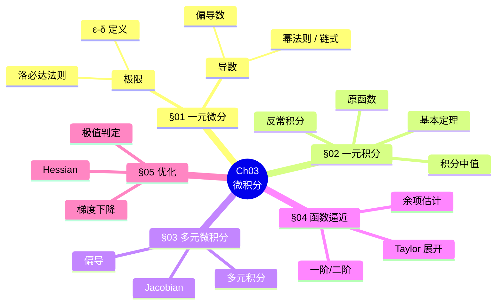
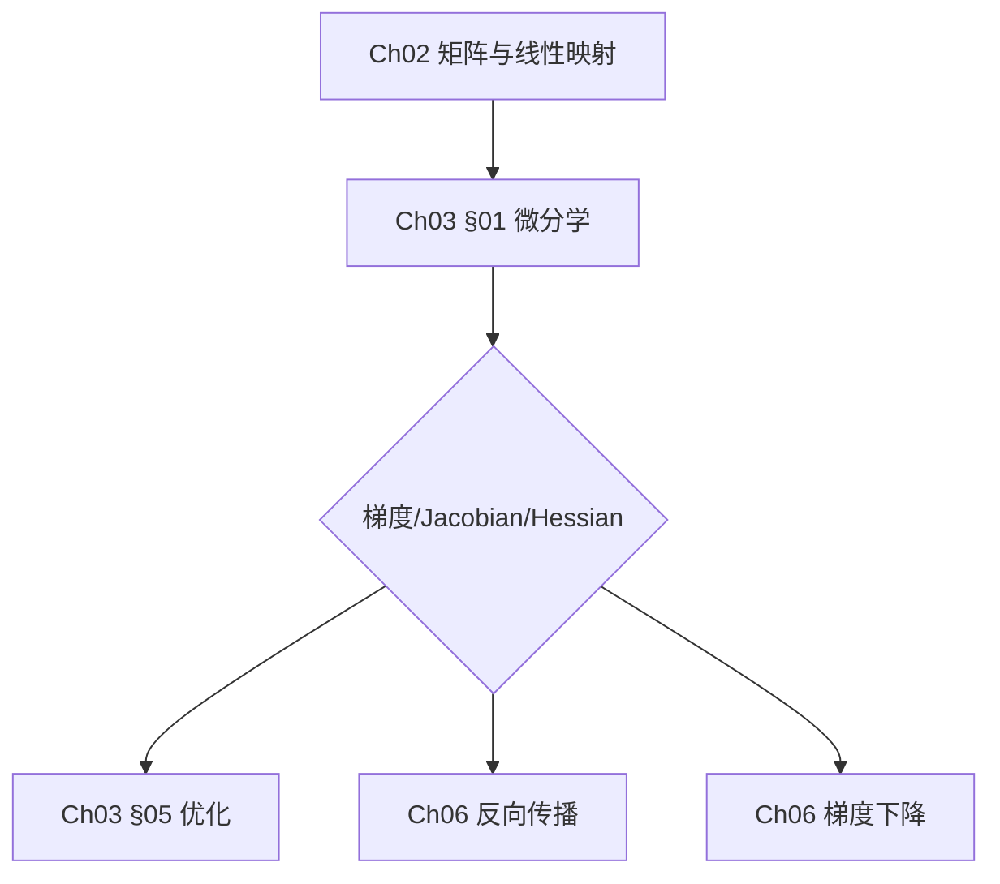

# 第 03 章 · 微积分 —— 知识图谱

> **一句话总结**: 微积分是"刻画变化"的数学, 用极限定义瞬时变化率 (导数) 与累积总量 (积分), 用 Taylor 展开把非线性局部线性化, 用梯度把多元优化落到一维搜索。

---

## ⚠️ 待重写

本文件此前被会话日志 (Claude tool_use JSON) 完整污染,原知识图谱已不可恢复。原稿已移至 `第03章.md.broken-2026-07-30` 作为本地留存。请按 Ch03 微积分考点重写下列占位结构。

---

## 一、章节主入口

---

## 二、关键节点说明 (10 个占位)

### 节点 1: 极限 ε-δ
**TODO**: 重写节点说明。

### 节点 2: 导数定义
**TODO**: 重写节点说明。

… (10 个占位)

---

## 三、跨章桥接

---

> **重写说明**: 占位文件结构合规,可参照 Ch01 / Ch02 / Ch05 思维导图实际风格填充。
