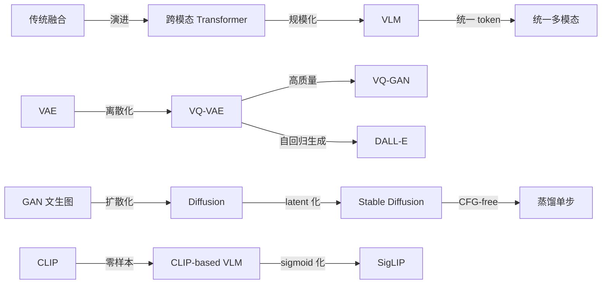
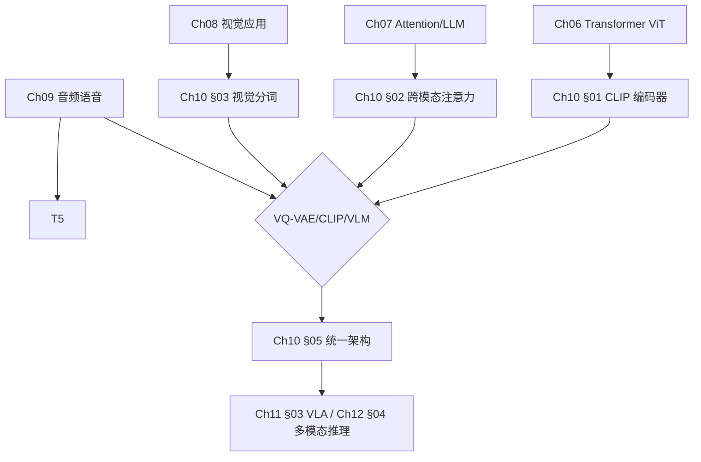
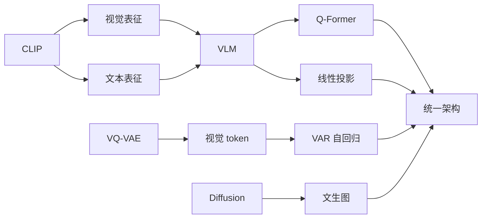
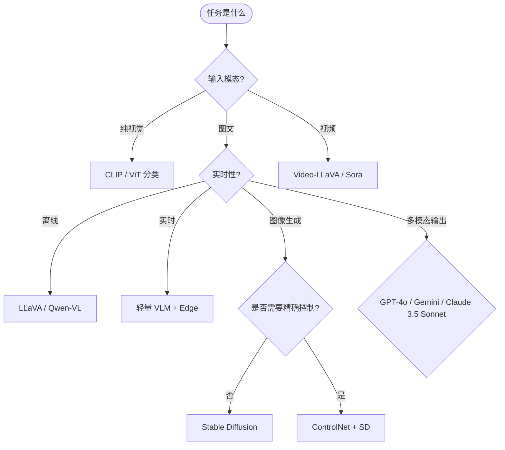

# Ch10 多模态学习 · 思维导图 (Mermaid 全图)

> 一张大图涵盖 Ch10 全部 5 节的关键节点,方便复习时背诵结构。可用 Mermaid Live Editor (https://mermaid.live) 渲染。

---

## 一、章节主入口

```
🌳 Ch10 章 知识图谱
├─ §01 表征对齐
│  └─ 早期/晚期融合
│  │  └─ Early fusion
│  │  └─ Late fusion α 权重混合
│  │  └─ Cross-attn 中层融合
│  └─ CLIP / ALIGN / SigLIP
│  │  └─ InfoNCE 对比损失
│  │  └─ τ 温度参数
│  │  └─ batch 32K
│  │  └─ ImageNet zero-shot 76.2%
│  └─ 评估指标
│  │  └─ 图文检索 Recall@k
│  │  └─ 零样本分类
├─ §02 VLM 视觉语言模型
│  └─ LLaVA
│  │  └─ 线性投影 ViT→LLM
│  │  └─ 视觉指令微调
│  └─ BLIP-2
│  │  └─ Q-Former 32 query token
│  │  └─ ITC + ITM + ITG
│  └─ Qwen-VL
│  │  └─ 多阶段训练
│  │  └─ 动态分辨率
│  └─ Flamingo
│  │  └─ Perceiver Resampler
│  │  └─ few-shot 上下文
├─ §03 视觉与视频 token 化
│  └─ VQ-VAE
│  │  └─ 编码器→量化→解码器
│  │  └─ codebook 8K-32K
│  │  └─ 直通估计 STE
│  └─ VQ-GAN
│  │  └─ L1 + perceptual + 对抗
│  │  └─ commit loss
│  └─ VAR
│  │  └─ next-scale 自回归
│  │  └─ 类比 LLM
│  └─ DALL-E dVAE
│  │  └─ 256×256 → 32×32 token
├─ §04 跨模态生成
│  └─ Stable Diffusion
│  │  └─ latent 64×64×4
│  │  └─ cross-attn 文本注入
│  │  └─ CFG guidance
│  └─ DALL-E 3
│  │  └─ 文本重写 pipeline
│  │  └─ CLIP reranker
│  └─ Imagen
│  │  └─ T5-XXL 文本编码
│  │  └─ 级联超分
│  └─ ControlNet / IP-Adapter
│  │  └─ 空间控制
│  │  └─ 风格迁移
├─ §05 统一多模态架构
│  └─ GPT-4o
│  │  └─ 单一 Transformer
│  │  └─ 实时语音 < 300 ms
│  └─ Gemini 1.5
│  │  └─ 上下文 1M token
│  │  └─ 多模态交错
│  └─ Show-o
│  │  └─ 离散自回归 + 扩散
│  └─ Janus
│  │  └─ 解耦视觉编码
│  │  └─ 视觉理解/生成双路径
```

---

## 二、对比表格节点 (Radar-style)



---

## 三、章节内子图 (§01 表征对齐 详细)

```
🌳 Ch10 章 知识图谱
├─ 融合策略
│  └─ Early fusion
│  │  └─ 原始特征拼接
│  │  └─ 模型学跨模态对齐
│  │  └─ 缺点：输入维度大
│  └─ Late fusion
│  │  └─ 各模态独立编码
│  │  └─ 末期分数融合
│  │  └─ α 加权混合
│  └─ 中层融合
│  │  └─ Q-Former cross-attn
│  │  └─ Perceiver Resampler
├─ 对比学习
│  └─ InfoNCE
│  │  └─ N² 关系矩阵
│  │  └─ 对称损失
│  │  └─ τ 温度
│  └─ batch size
│  │  └─ 32K CLIP
│  │  └─ 越大越好但内存敏感
│  └─ 编码器
│  │  └─ ViT-L 视觉
│  │  └─ Transformer 文本
├─ 应用
│  └─ 零样本分类
│  │  └─ text prompt template
│  │  └─ ImageNet 76%
│  └─ 图文检索
│  │  └─ Recall@1 ≈ 65%
│  │  └─ COCO
```

---

## 四、章节内子图 (§02 VLM)

```
🌳 Ch10 章 知识图谱
├─ 投影层方案
│  └─ 线性
│  │  └─ 简单
│  │  └─ 视觉序列长
│  └─ Q-Former
│  │  └─ 32 query token
│  │  └─ 三任务训练
│  └─ Perceiver
│  │  └─ 压缩 4096→64
│  │  └─ few-shot
├─ 训练
│  └─ 预训练
│  │  └─ 图文对齐
│  │  └─ 数据 100M+
│  └─ 指令微调
│  │  └─ LLaVA-Instruct 158K
│  │  └─ GPT-4V 生成
│  └─ RLHF
│  │  └─ LLaVA-RLHF
│  │  └─ 偏好对
├─ 评测
│  └─ VQAv2
│  │  └─ 闭集 80%
│  └─ MMMU
│  │  └─ 大学级 69%
│  └─ RefCOCO
│  │  └─ 指代理解
```

---

## 五、章节内子图 (§03 视觉分词)

```
🌳 Ch10 章 知识图谱
├─ VQ-VAE 原理
│  └─ 编码器
│  │  └─ 图像 → z_e 连续
│  └─ 量化
│  │  └─ codebook 8K-32K entry
│  │  └─ 最近邻查找
│  └─ 解码器
│  │  └─ token → 图像
│  └─ 直通估计
│  │  └─ STE 梯度 hack
├─ VQ-GAN
│  └─ 损失
│  │  └─ L1 重建
│  │  └─ perceptual loss
│  │  └─ 对抗 GAN
│  │  └─ commit loss
│  └─ 高质量
│  │  └─ ImageNet 256
│  │  └─ FID ≈ 5
├─ VAR
│  └─ 自回归
│  │  └─ next-scale prediction
│  │  └─ 类比 LLM 文字
│  └─ 优于扩散
│  │  └─ FID 比 SD 低 30%
├─ 应用
│  └─ DALL-E
│  │  └─ dVAE 32×32 token
│  └─ Paella
│  │  └─ transformer-only
```

---

## 六、章节内子图 (§04 跨模态生成)

```
🌳 Ch10 章 知识图谱
├─ 扩散原理
│  └─ 前向
│  │  └─ 加噪 T 步
│  └─ 反向
│  │  └─ 学噪声 ε
│  └─ 损失
│  │  └─ L_simple
├─ 文生图
│  └─ SD
│  │  └─ latent 64×64×4
│  │  └─ cross-attn 文本
│  │  └─ CFG w=7.5
│  └─ DALL-E 3
│  │  └─ GPT-4V 重写
│  │  └─ CLIP reranker
│  └─ Imagen
│  │  └─ T5-XXL 编码
│  │  └─ 级联超分
├─ 控制生成
│  └─ ControlNet
│  │  └─ 空间条件
│  └─ IP-Adapter
│  │  └─ 风格迁移
│  └─ T2I-Adapter
│  │  └─ 轻量高效
├─ 评估
│  └─ FID
│  │  └─ FID-30k < 10
│  └─ CLIP-score
│  │  └─ 对齐指标
│  └─ 人类偏好
│  │  └─ A/B 测试
```

---

## 七、章节内子图 (§05 统一多模态架构)

```
🌳 Ch10 章 知识图谱
├─ GPT-4o
│  └─ 单一 Transformer
│  └─ 实时语音 < 300 ms
│  └─ 跨模态 KV cache
│  └─ 情绪/打断/音乐
├─ Gemini 1.5
│  └─ 1M 上下文
│  └─ 多模态交错训练
│  └─ 多语种支持
├─ Show-o
│  └─ 离散 AR + 扩散
│  └─ 类比 LLM
│  └─ 字节跳动
├─ Janus
│  └─ 解耦视觉编码
│  └─ 理解和生成双路
├─ 关键挑战
│  └─ 实时性
│  └─ 幻觉
│  └─ 跨模态安全
```

---

## 八、跨章桥接 (可视化)



---

## 九、知识点关联 (知识图谱)



---

## 十、决策树 (选哪种多模态方案)



---

> 这张导图覆盖 Ch10 全章。建议:
> 1. 第一次复习把"章节主入口"背出
> 2. 第二次复习按节背诵子图
> 3. 第三次背诵"决策树",考试时一眼定位技术方向
