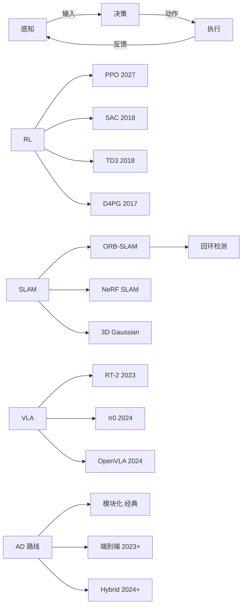
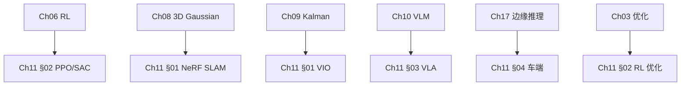
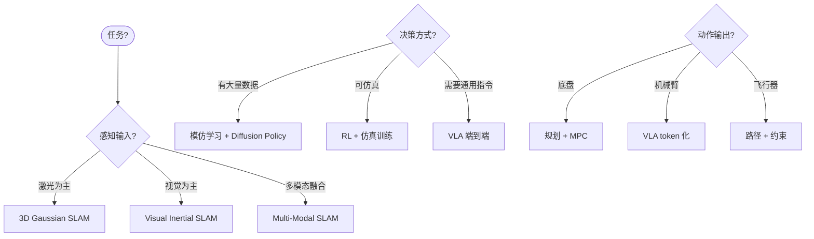
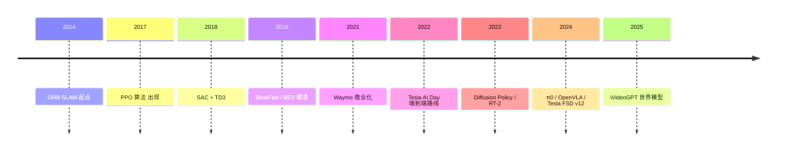
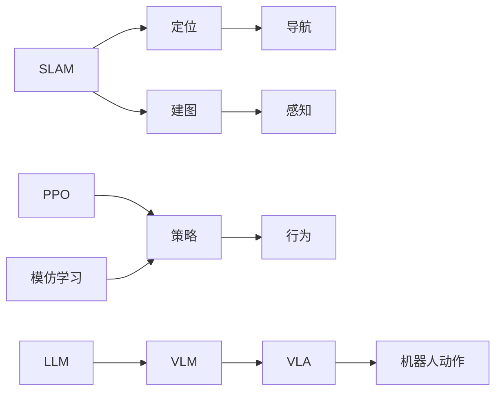
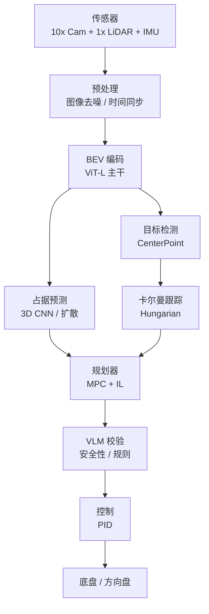

# Ch11 自主系统 · 思维导图 (Mermaid)

---

## 一 · 章节主入口

```
🌳 Ch11 章 知识图谱
├─ §01 感知
│  └─ LiDAR 测距
│  │  └─ 905 nm / 1550 nm
│  │  └─ 点云配准 ICP/NDT
│  └─ Camera
│  │  └─ Mono / Stereo
│  │  └─ 深度估计
│  └─ SLAM
│  │  └─ ORB-SLAM
│  │  └─ VIO
│  │  └─ 3DGS SLAM
│  └─ BEV 占据
│  │  └─ 端到端 BEV
│  │  └─ 占据网络
│  │  └─ Diffusion 占据
├─ §02 机器人学习
│  └─ 强化学习
│  │  └─ PPO 裁剪
│  │  └─ SAC 最大熵
│  │  └─ TD3 双 critic
│  │  └─ Offline RL
│  └─ 模仿学习
│  │  └─ Behavior Cloning
│  │  └─ DAgger 数据聚合
│  │  └─ GAIL 逆 RL
│  └─ Diffusion Policy
│  │  └─ 16 步去噪
│  │  └─ Horizon-hierarchy
│  └─ Sim-to-Real
│  │  └─ Domain Randomization
│  │  └─ Real2Sim
├─ §03 VLA 模型
│  └─ RT-2
│  │  └─ 动作 token
│  │  └─ 通用化
│  └─ π0
│  │  └─ 3B VLA
│  │  └─ 异构机器人
│  └─ OpenVLA
│  │  └─ 7B 开源
│  │  └─ SigLIP + Llama
│  └─ VLA + 世界模型
│  │  └─ DreamGen
│  │  └─ iVideoGPT
│  └─ 评测 OpenX-Embodiment
│  │  └─ 22 机器人
│  │  └─ 1M 轨迹
├─ §04 自动驾驶
│  └─ 模块化
│  │  └─ 检测 / 跟踪
│  │  └─ 预测 / 规划
│  └─ 端到端
│  │  └─ BEV 占据
│  │  └─ 世界模型
│  │  └─ 端到端规划
│  └─ 仿真
│  │  └─ NeuRAD
│  │  └─ CARLA
│  │  └─ Waymax
│  └─ 等级 L1-L5
│  │  └─ L2 辅助
│  │  └─ L4 限定
│  │  └─ L5 全场景
├─ §05 太空与极端机器人
│  └─ Mars 2020
│  │  └─ Ingenuity 直升机
│  │  └─ Perseverance 机械臂
│  └─ 四足
│  │  └─ Spot
│  │  └─ ANYmal
│  └─ 人形
│  │  └─ Figure 02
│  │  └─ Unitree H1
│  └─ 仿生
│  │  └─ RoboBee
│  │  └─ Snake 机器人
│  └─ 仿真到真实
│  │  └─ 高保真仿真
│  │  └─ 鲁棒 RL
```

---

## 二 · 对比路径



---

## 三 · §01 感知子图

```
🌳 Ch11 章 知识图谱
├─ LiDAR
│  └─ 测距 d=ct/2
│  └─ 点云
│  └─ ICP 配准
├─ Camera
│  └─ Mono
│  └─ Stereo Z=fB/d
│  └─ 深度估计
├─ IMU
│  └─ 加速度
│  └─ 角速度
│  └─ 预积分
├─ SLAM
│  └─ 前端 ORB
│  └─ 后端 BA
│  └─ 回环 词袋
├─ BEV
│  └─ 鸟瞰网格
│  └─ 高度聚合
│  └─ 占用预测
├─ 3D Gaussian
│  └─ SplaTAM
│  └─ GS-SLAM
```

---

## 四 · §02 学习子图

```
🌳 Ch11 章 知识图谱
├─ RL
│  └─ On-policy
│  │  └─ PPO clip
│  │  └─ TRPO
│  └─ Off-policy
│  │  └─ SAC
│  │  └─ TD3
│  └─ Model-Based
│  │  └─ Dreamer
│  │  └─ MBPO
├─ IL
│  └─ Behavior Cloning
│  └─ DAgger
│  └─ GAIL
│  └─ Diffusion Policy
├─ Sim2Real
│  └─ Domain Rand
│  └─ System ID
│  └─ Robust RL
├─ Reward
│  └─ Sparse
│  └─ Dense
│  └─ Human
```

---

## 五 · §03 VLA 子图

```
🌳 Ch11 章 知识图谱
├─ Architecture
│  └─ V encoder
│  └─ L encoder
│  └─ Token 共享输出
│  └─ Action token
├─ 训练
│  └─ 预训练 SFT
│  └─ OpenX-Embodiment
│  └─ CoT 推理
├─ 评测
│  └─ ManiSkill2
│  └─ RLBench
│  └─ Bridge Data
├─ 代表作
│  └─ RT-2
│  └─ π0
│  └─ OpenVLA
├─ World Model
│  └─ DreamGen
│  └─ iVideoGPT
```

---

## 六 · §04 自动驾驶子图

```
🌳 Ch11 章 知识图谱
├─ 等级
│  └─ L2 辅助
│  └─ L3 条件
│  └─ L4 限定 ODD
│  └─ L5 全场景
├─ 路线
│  └─ 模块化 Waymo Classic
│  └─ 端到端 Tesla FSD v12
│  └─ Hybrid DriveVLM
├─ 核心模块
│  └─ BEV 占据
│  └─ Diffusion 预测
│  └─ Planner
│  └─ Safety Monitor
├─ 仿真
│  └─ CARLA
│  └─ Waymax
│  └─ NeuRAD
├─ 数据集
│  └─ nuScenes
│  └─ Waymo Open
│  └─ Argoverse 2
├─ 公司
│  └─ Waymo
│  └─ Cruise
│  └─ Pony.ai
│  └─ 小马智行
│  └─ Apollo
│  └─ Momenta
```

---

## 七 · §05 太空子图

```
🌳 Ch11 章 知识图谱
├─ Mars
│  └─ Perseverance
│  │  └─ 机械臂采样
│  │  └─ 自主导航
│  └─ Ingenuity
│  │  └─ 直升机
│  │  └─ 52 次飞行
├─ 四足
│  └─ Spot
│  └─ ANYmal
│  └─ GO1
├─ 人形
│  └─ Optimus
│  └─ Figure 02
│  └─ H1
├─ 危险
│  └─ 搜救
│  └─ 巡检
│  └─ 灾难响应
├─ 仿真到真
│  └─ Isaac Sim
│  └─ MuJoCo
│  └─ 高保真物理
```

---

## 八 · 跨章桥接



---

## 九 · 决策树 (选哪种自主系统方案)



---

## 十 · 时间线 (历史里程碑)



---

## 十一 · 关键概念关系



---

## 十二 · 实际工业部署架构



---

> 这张导图覆盖 Ch11 全章。建议:
> 1. 第一次复习把"章节主入口"背出
> 2. 第二次复习按节背诵子图
> 3. 第三次背诵"时间线",感知历史发展
