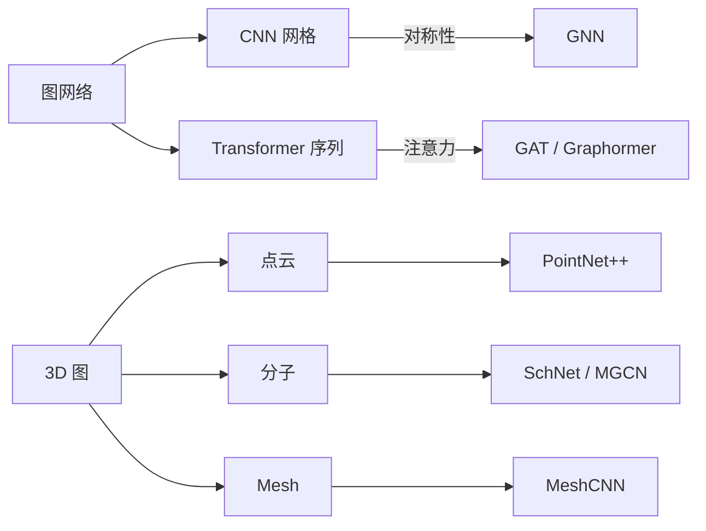
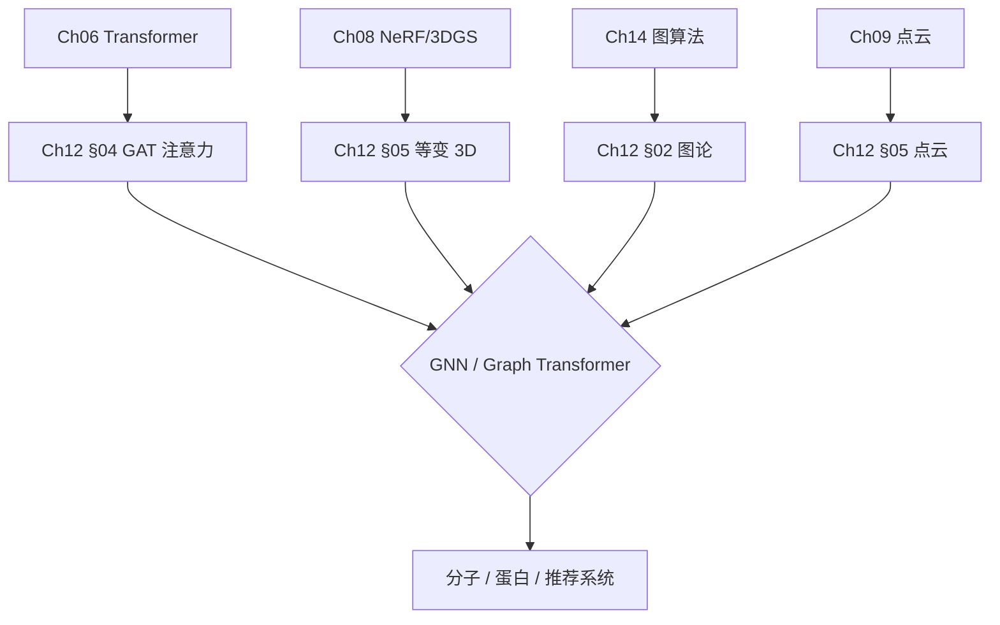
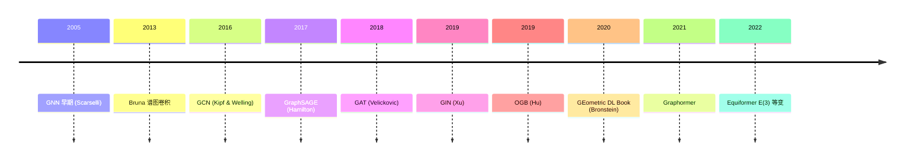
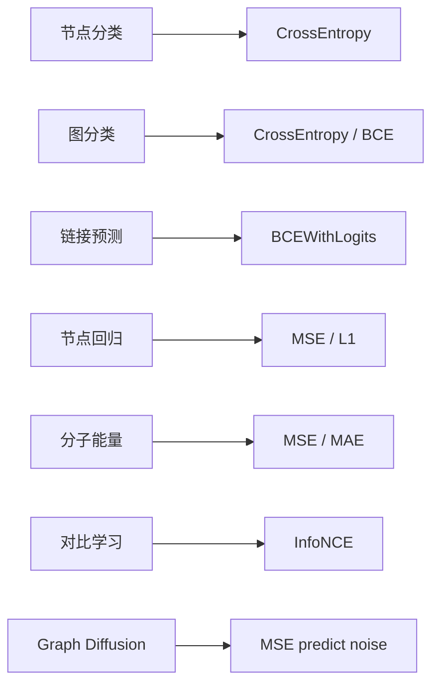

# Ch12 图神经网络 · 思维导图 (Mermaid)

---

## 一 · 章节主入口

```
🌳 Ch12 章 知识图谱
├─ §01 几何深度学习
│  └─ 群等变性
│  └─ SE
│  └─ 等变网络
├─ §02 图论
│  └─ 邻接/度
│  └─ 拉普拉斯
│  └─ PageRank
│  └─ 谱方法
├─ §03 图神经网络
│  └─ GCN
│  └─ GraphSAGE
│  └─ GIN
│  └─ READOUT
│  └─ Over-smoothing
├─ §04 图注意力
│  └─ GAT
│  └─ 多头
│  └─ Graphormer
│  └─ 空间编码
├─ §05 3D 图
│  └─ PointNet++
│  └─ SchNet
│  └─ E(3) 等变
│  └─ 分子动力学
```

---

## 二 · 对比路径



---

## 三 · §01 几何深度学习子图

```
🌳 Ch12 章 知识图谱
├─ 群
│  └─ SO(3) 旋转
│  └─ SE(3) 旋转平移
│  └─ E(3) 含反射
├─ 等变性
│  └─ 不变 f
│  └─ 等变 f
├─ 几何先验
│  └─ 平移不变
│  └─ 旋转不变
│  └─ 尺度分离
```

---

## 四 · §02 图论子图

```
🌳 Ch12 章 知识图谱
├─ 表示
│  └─ 邻接 A
│  └─ 度 D
│  └─ 拉普拉斯 L = D - A
│  └─ 归一化 L
├─ 度量
│  └─ 最短路
│  └─ 中心性
│  └─ PageRank
├─ 算法
│  └─ BFS
│  └─ Dijkstra
│  └─ Bellman-Ford
├─ 谱方法
│  └─ Laplacian 特征值
│  └─ 谱图卷积
```

---

## 五 · §03 GNN 子图

```
🌳 Ch12 章 知识图谱
├─ GCN
│  └─ 邻居平均
│  └─ 归一化
│  └─ 2 层常用
├─ GraphSAGE
│  └─ 邻居采样
│  └─ MEAN/MAX/LSTM
│  └─ Inductive
├─ GIN
│  └─ Sum 聚合
│  └─ MLP
│  └─ WL 最优
├─ READOUT
│  └─ SUM/MEAN/MAX
├─ 池化
│  └─ DiffPool
│  └─ TopK
├─ 应用
│  └─ 节点分类
│  └─ 链接预测
│  └─ 图分类
```

---

## 六 · §04 GAT 子图

```
🌳 Ch12 章 知识图谱
├─ GAT
│  └─ 注意力权重
│  └─ 头数 K
│  └─ LeakyReLU
│  └─ softmax
├─ Graphormer
│  └─ 中心性编码
│  └─ 空间编码
│  └─ path encoding
├─ Transformer 与 GAT
│  └─ 全连接 vs 局部
│  └─ 图结构约束
├─ 边编码
│  └─ 关系嵌入
│  └─ 距离编码
```

---

## 七 · §05 3D 图子图

```
🌳 Ch12 章 知识图谱
├─ 点云
│  └─ PointNet
│  └─ PointNet++
│  └─ DGCNN
├─ 分子
│  └─ SchNet
│  └─ MGCN
│  └─ Equiformer
├─ 等变
│  └─ E
│  └─ SO
│  └─ 不可约表示
├─ 应用
│  └─ AlphaFold
│  └─ MD 模拟
│  └─ 药物发现
```

---

## 八 · 跨章桥接



---

## 九 · 演进时间线



---

## 十 · 决策树 (选哪种 GNN)

```mermaid
graph TD
    START([任务?]) --> Q1{图类型?}
    Q1 -->|同质| Q2{节点级还是图级?}
    Q1 -->|异构| HET[RGCN / HAN]
    Q2 -->|节点级| N1{数据规模?}
    N1 -->|小 (万)| GCN[GCN]
    N1 -->|大 (亿)| SAGE[GraphSAGE]
    N1 -->|Transd| GIN[GIN]
    Q2 -->|图级| MOL[GIN / GINE / SchNet]
    Q1 -->|3D 分子| MOL3D["E(3) 等变"]
    Q1 -->|3D 点云| PN[PointNet++]
```

---

## 十一 · GDL 范式 (5 条原则)

```
🌳 Ch12 章 知识图谱
├─ 先验
│  └─ 对称性
│  └─ 等变性
├─ 尺度
│  └─ 多尺度
│  └─ 粗到细
├─ 群作用
│  └─ f
├─ 不变量
│  └─ 任务相关特征
├─ 组合性
│  └─ 子结构拼接
```

---

## 十二 · 评测基准对比

| 任务 | 数据集 | 模型 | 指标 | SOTA |
|------|--------|------|------|------|
| 节点分类 | OGB-arxiv | GCN/GIN | Accuracy | ~75% |
| 图分类 | OGB-mol | GIN | ROC-AUC | ~80% |
| 链接预测 | OGB-ddi | GIN | Hits@K | ~30% |
| 分子 | PCQM4Mv2 | Graphormer | MAE | ~5 meV |
| 分子动力学 | MD17 | SchNet | MAE | 0.5 kcal/mol |
| 蛋白 | CASP15 | AlphaFold2/3 | TM-score | 90+ |

---

## 十三 · 损失函数大全



---

> 这张导图覆盖 Ch12 全章。建议: 先背章节主入口 → 按节背子图 → 演进时间线
