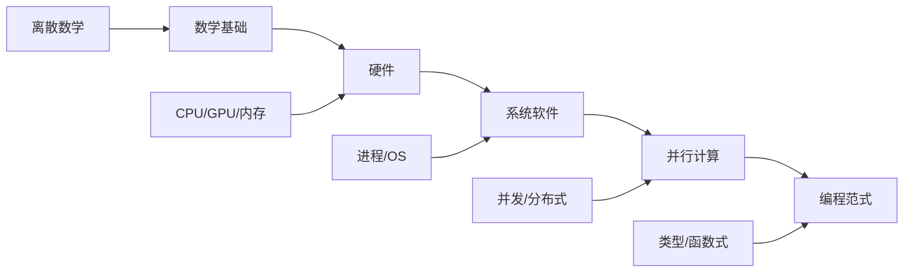
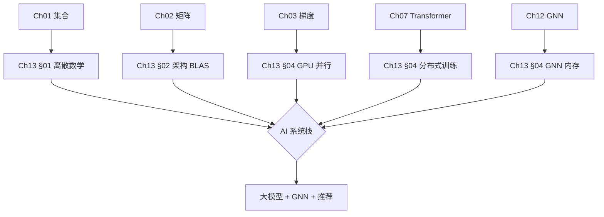
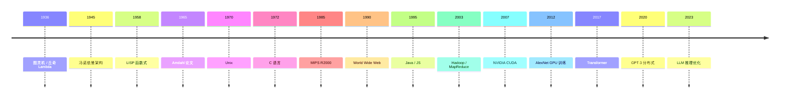
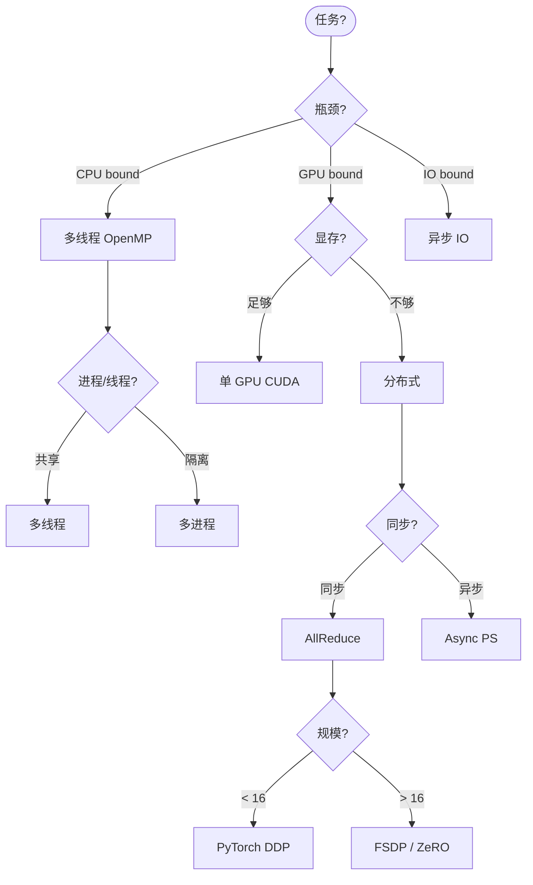
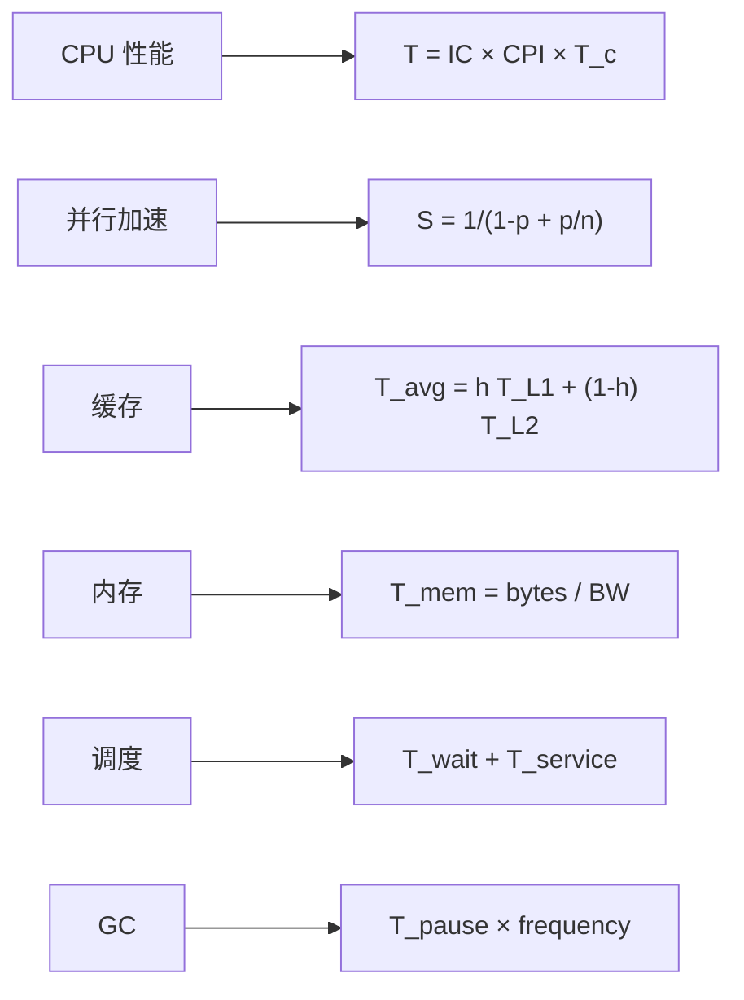

# Ch13 计算与操作系统 · 思维导图 (Mermaid)

---

## 一 · 章节主入口

```
🌳 Ch13 章 知识图谱
├─ §01 离散数学
│  └─ 集合
│  └─ 逻辑
│  └─ 组合
│  └─ 复杂度
├─ §02 计算机架构
│  └─ 冯诺依曼
│  └─ CPU
│  └─ GPU
│  └─ 缓存
├─ §03 操作系统
│  └─ 进程
│  └─ 虚拟内存
│  └─ 文件系统
├─ §04 并发并行
│  └─ 线程
│  └─ 锁
│  └─ GPU
│  └─ 分布式
├─ §05 编程语言
│  └─ 类型
│  └─ 范式
│  └─ 编译
```

---

## 二 · 五大子领域



---

## 三 · §01 离散数学子图

```
🌳 Ch13 章 知识图谱
├─ 集合
│  └─ 并/交/差
│  └─ 幂集
│  └─ 笛卡尔积
├─ 逻辑
│  └─ 命题
│  └─ 谓词
│  └─ 证明
├─ 组合
│  └─ 排列 P
│  └─ 组合 C
│  └─ 鸽巢
├─ 图论
│  └─ 路径
│  └─ 树
│  └─ 圈
├─ 复杂度
│  └─ O/Ω/Θ
│  └─ P/NP
│  └─ 归约
```

---

## 四 · §02 计算机架构子图

```
🌳 Ch13 章 知识图谱
├─ 冯诺依曼
│  └─ CPU
│  └─ 内存
│  └─ 总线
├─ CPU
│  └─ IC/CPI/T
│  └─ 流水线
│  └─ 分支预测
├─ 内存层级
│  └─ 寄存器
│  └─ L1/L2/L3
│  └─ DRAM
│  └─ 磁盘
├─ GPU
│  └─ SM
│  └─ Warp
│  └─ HBM
```

---

## 五 · §03 操作系统子图

```
🌳 Ch13 章 知识图谱
├─ 进程
│  └─ fork/exec
│  └─ PCB
│  └─ 调度
├─ 线程
│  └─ 用户级
│  └─ 内核级
├─ 内存
│  └─ 虚拟内存
│  └─ 页表
│  └─ TLB
├─ 文件系统
│  └─ inode
│  └─ FAT
│  └─ ext4
├─ 调度
│  └─ FCFS
│  └─ RR
│  └─ CFS
```

---

## 六 · §04 并发并行子图

```
🌳 Ch13 章 知识图谱
├─ 同步
│  └─ 锁
│  └─ 信号量
│  └─ 原子操作
├─ 并行
│  └─ Amdahl
│  └─ OpenMP
│  └─ MPI
├─ GPU
│  └─ CUDA
│  └─ SIMT
│  └─ 内存模型
├─ 分布式
│  └─ MapReduce
│  └─ Spark
│  └─ 共识
```

---

## 七 · §05 编程语言子图

```
🌳 Ch13 章 知识图谱
├─ 类型
│  └─ 静态/动态
│  └─ 强/弱
│  └─ 推导
├─ 范式
│  └─ 命令式
│  └─ 函数式
│  └─ 逻辑式
├─ 编译
│  └─ 前端
│  └─ 后端
│  └─ JIT
├─ 内存
│  └─ GC
│  └─ 引用计数
│  └─ 手动
```

---

## 八 · 跨章桥接



---

## 九 · 演进时间线



---

## 十 · 决策树 (选哪种并行方案)



---

## 十一 · 复杂度大 O 表

```
🌳 Ch13 章 知识图谱
├─ 优
│  └─ O(1) 哈希
│  └─ O(log n) 二分
│  └─ O(n) 线性
│  └─ O(n log n) 归并
├─ 良
│  └─ O(n²) 冒泡
│  └─ O(n³) 矩阵乘
├─ 差
│  └─ O(2ⁿ) 子集
│  └─ O(n!) 旅行
├─ 不可
│  └─ NP 完整
│  │  └─ SAT
│  │  └─ 旅行商
│  │  └─ 团
```

---

## 十二 · 评测基准对比

| 任务 | 基准 | 工具 | 指标 |
|------|------|------|------|
| CPU 性能 | SPEC CPU | gcc | time |
| GPU 性能 | MLPerf | CUDA | throughput |
| 分布式 | MLPerf Training | NCCL | time-to-accuracy |
| OS | lmbench | Linux | latency |
| 编译 | llvm-test-suite | Clang | time |
| GC | Dacapo | Java | pause |

---

## 十三 · 损失 / 性能函数大全



---

> 这张导图覆盖 Ch13 全章。建议: 先背章节主入口 → 按节背子图 → 演进时间线 → 决策树。