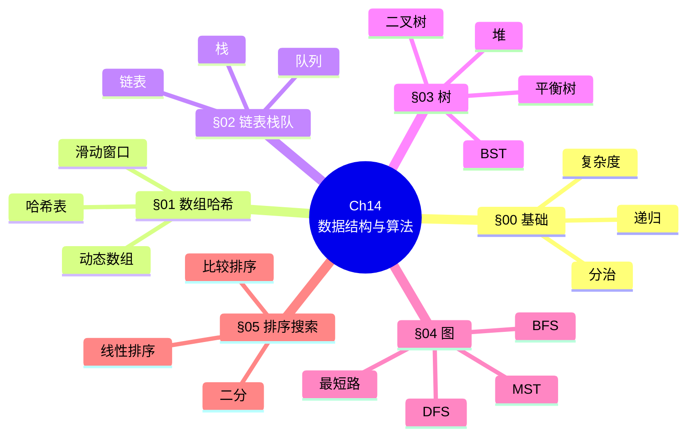
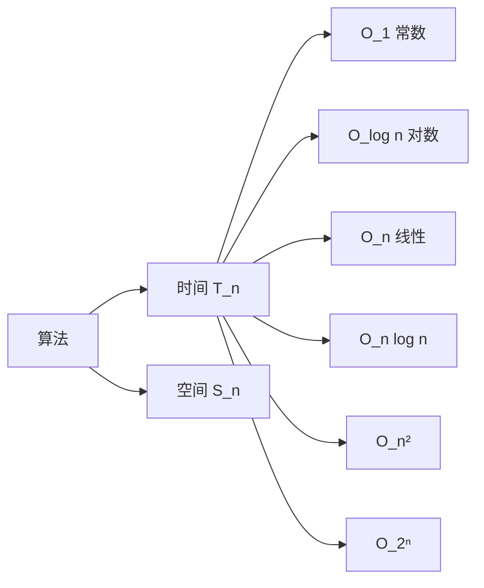
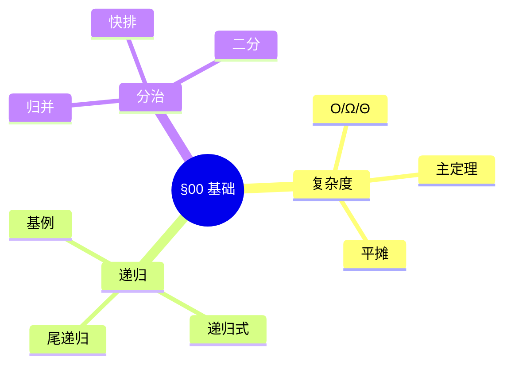
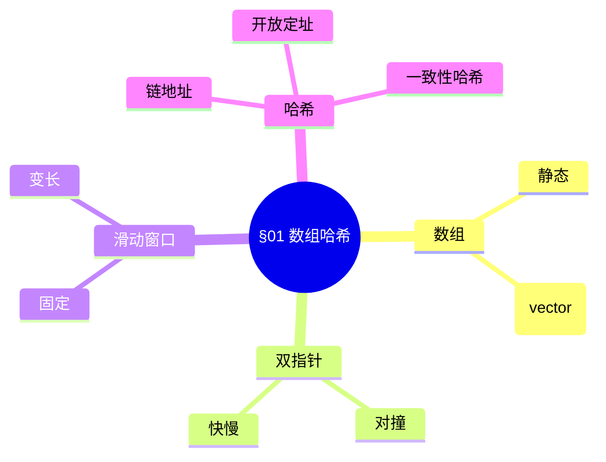
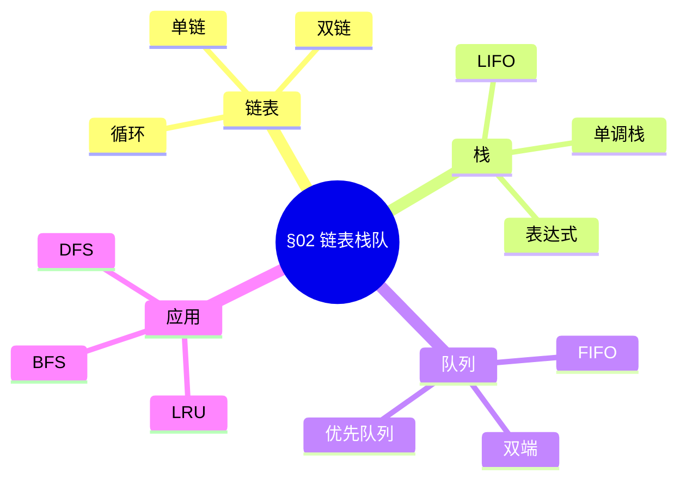
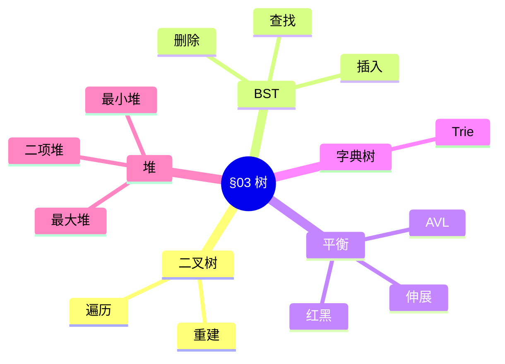
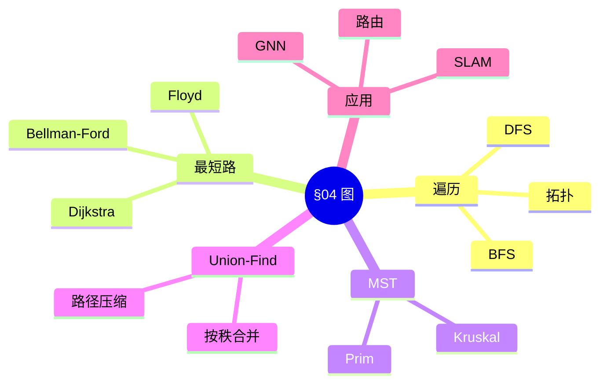
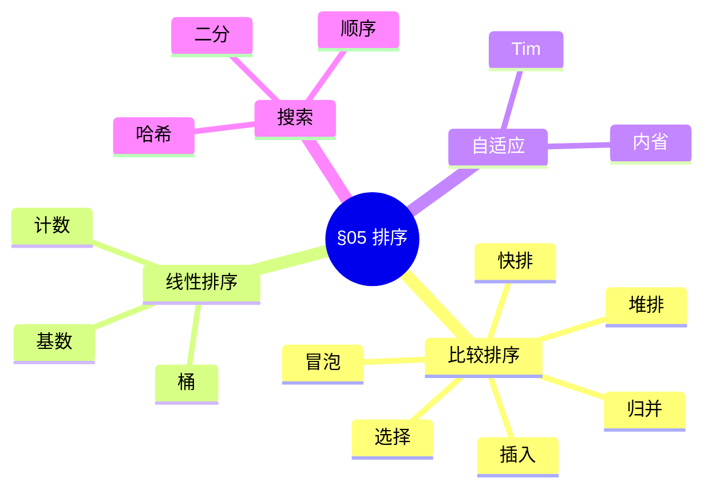
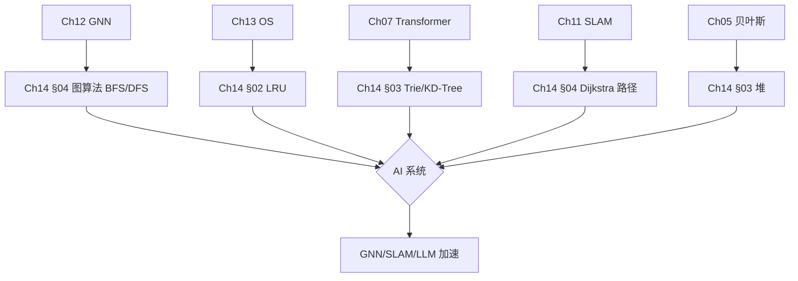
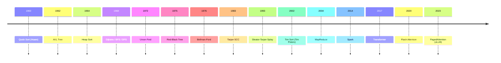

# Ch14 数据结构与算法 · 思维导图 (Mermaid)

---

## 一 · 章节主入口

---

## 二 · 复杂度速查

---

## 三 · §00 基础子图

---

## 四 · §01 数组哈希子图

---

## 五 · §02 链表栈队子图

---

## 六 · §03 树子图

---

## 七 · §04 图子图

---

## 八 · §05 排序搜索子图

---

## 九 · 跨章桥接

---

## 十 · 演进时间线

---

## 十一 · 数据结构 vs 操作复杂度

| 操作 | 数组 | 链表 | 哈希 | BST | 堆 |
|------|------|------|------|-----|-----|
| 访问第 k | $O(1)$ | $O(n)$ | - | $O(\log n)$ | $O(n)$ |
| 查找 | $O(n)$ | $O(n)$ | $O(1)$ | $O(\log n)$ | $O(n)$ |
| 插入 | $O(n)$ | $O(1)$ | $O(1)$ | $O(\log n)$ | $O(\log n)$ |
| 删除 | $O(n)$ | $O(1)$ | $O(1)$ | $O(\log n)$ | $O(\log n)$ |
| 取最小 | $O(n)$ | $O(n)$ | $O(n)$ | $O(\log n)$ | $O(1)$ |

---

## 十二 · 排序对比

| 算法 | 最优 | 平均 | 最坏 | 空间 | 稳定 |
|------|------|------|------|------|------|
| 冒泡 | $O(n)$ | $O(n^2)$ | $O(n^2)$ | $O(1)$ | ✓ |
| 插入 | $O(n)$ | $O(n^2)$ | $O(n^2)$ | $O(1)$ | ✓ |
| 选择 | $O(n^2)$ | $O(n^2)$ | $O(n^2)$ | $O(1)$ | ✗ |
| 快排 | $O(n \log n)$ | $O(n \log n)$ | $O(n^2)$ | $O(\log n)$ | ✗ |
| 归并 | $O(n \log n)$ | $O(n \log n)$ | $O(n \log n)$ | $O(n)$ | ✓ |
| 堆排 | $O(n \log n)$ | $O(n \log n)$ | $O(n \log n)$ | $O(1)$ | ✗ |
| 计数 | $O(n+k)$ | $O(n+k)$ | $O(n+k)$ | $O(k)$ | ✓ |
| Tim | $O(n)$ | $O(n \log n)$ | $O(n \log n)$ | $O(n)$ | ✓ |

---

## 十三 · 图算法对比

| 算法 | 适用 | 时间 | 空间 |
|------|------|------|------|
| BFS | 无权最短路 | $O(V+E)$ | $O(V)$ |
| DFS | 拓扑 / 强连通 | $O(V+E)$ | $O(V)$ |
| Dijkstra | 加权非负 | $O((V+E) \log V)$ | $O(V)$ |
| Bellman-Ford | 有负权 | $O(VE)$ | $O(V)$ |
| Floyd | 全对最短 | $O(V^3)$ | $O(V^2)$ |
| Prim | MST | $O(E \log V)$ | $O(V)$ |
| Kruskal | MST | $O(E \log E)$ | $O(V)$ |

---

> 这张导图覆盖 Ch14 全章。建议: 先背章节主入口 → 按节背子图 → 排序 / 图算法对比表 → 演进时间线。