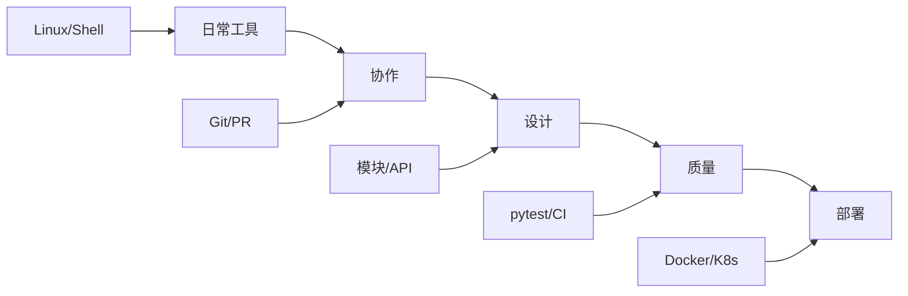
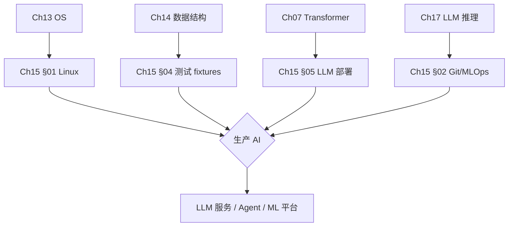
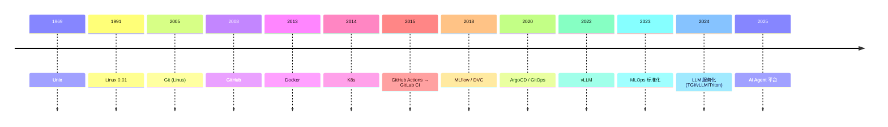
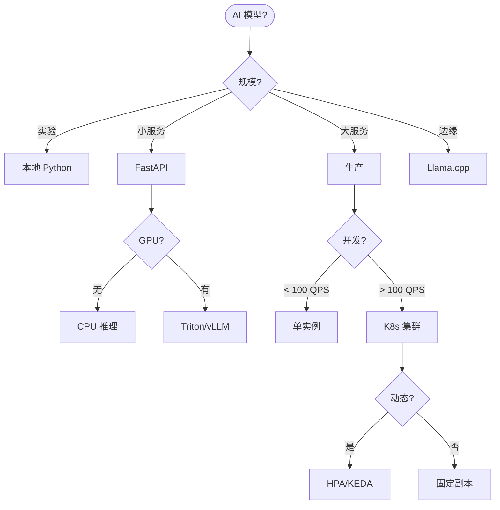
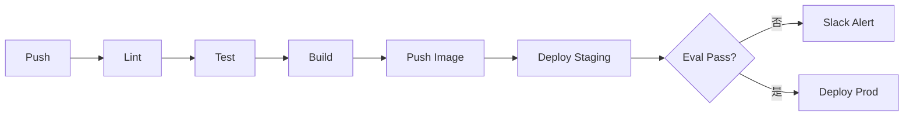

# Ch15 生产软件工程 · 思维导图 (Mermaid)

---

## 一 · 章节主入口

```
🌳 Ch15 章 知识图谱
├─ §01 Linux/CMD
│  └─ 文件
│  └─ 进程
│  └─ 网络
├─ §02 Git
│  └─ commit
│  └─ branch
│  └─ rebase
├─ §03 代码设计
│  └─ 模块
│  └─ API
│  └─ 模式
├─ §04 测试
│  └─ 单测
│  └─ 集成
│  └─ 覆盖率
├─ §05 DevOps
│  └─ Docker
│  └─ K8s
│  └─ CI/CD
```

---

## 二 · 五大子领域



---

## 三 · §01 Linux/CMD 子图

```
🌳 Ch15 章 知识图谱
├─ 文件
│  └─ ls/cat/grep
│  └─ find/sed/awk
├─ 权限
│  └─ chmod/chown
│  └─ rwx
├─ 进程
│  └─ ps/top/htop
│  └─ kill/signal
├─ 网络
│  └─ curl/ssh
│  └─ netstat/nc
├─ Shell
│  └─ bash/zsh
│  └─ pipe/redirect
```

---

## 四 · §02 Git 子图

```
🌳 Ch15 章 知识图谱
├─ 基础
│  └─ add/commit
│  └─ push/pull
├─ 分支
│  └─ branch
│  └─ checkout
│  └─ merge
├─ 高级
│  └─ rebase
│  └─ cherry-pick
│  └─ stash
├─ 协作
│  └─ PR
│  └─ review
│  └─ conflict
├─ 平台
│  └─ GitHub
│  └─ GitLab
```

---

## 五 · §03 代码设计子图

```
🌳 Ch15 章 知识图谱
├─ 模块化
│  └─ 包/库
│  └─ 依赖
├─ API
│  └─ REST
│  └─ GraphQL
│  └─ gRPC
├─ 模式
│  └─ SOLID
│  └─ DI
│  └─ 工厂
├─ 文档
│  └─ docstring
│  └─ README
```

---

## 六 · §04 测试子图

```
🌳 Ch15 章 知识图谱
├─ 单测
│  └─ pytest
│  └─ unittest
├─ 集成
│  └─ fixtures
│  └─ mock
├─ 端到端
│  └─ Selenium
│  └─ Playwright
├─ 覆盖率
│  └─ coverage
│  └─ branch
├─ CI
│  └─ GitHub Actions
│  └─ Jenkins
```

---

## 七 · §05 DevOps 子图

```
🌳 Ch15 章 知识图谱
├─ 容器
│  └─ Docker
│  └─ Compose
├─ 编排
│  └─ K8s
│  └─ Helm
│  └─ Argo
├─ CI/CD
│  └─ GitHub Actions
│  └─ GitLab CI
├─ 监控
│  └─ Prometheus
│  └─ Grafana
├─ 模型
│  └─ MLflow
│  └─ DVC
```

---

## 八 · 跨章桥接



---

## 九 · 演进时间线



---

## 十 · 决策树 (选哪种部署方式)



---

## 十一 · Git 工作流对比

```
🌳 Ch15 章 知识图谱
├─ 集中式
│  └─ main
│  └─ trunk
├─ Git Flow
│  └─ main
│  └─ develop
│  └─ feature
│  └─ release
│  └─ hotfix
├─ GitHub Flow
│  └─ main
│  └─ feature
│  └─ PR
├─ GitLab Flow
│  └─ main
│  └─ feature
│  └─ 环境分支
```

---

## 十二 · CI/CD 流水线



---

## 十三 · 性能指标

| 指标 | 公式 | 用法 |
|------|------|------|
| 部署频率 | deploys/day | DevOps |
| 失败率 | failed/total | 可靠性 |
| MTTR | mean recovery time | SLA |
| 延迟 | p50/p95/p99 | 服务质量 |
| 吞吐 | RPS | 性能 |
| 错误率 | errors/total | 健康 |

---

> 这张导图覆盖 Ch15 全章。建议: 先背章节主入口 → 按节背子图 → 演进时间线 → 部署决策树。