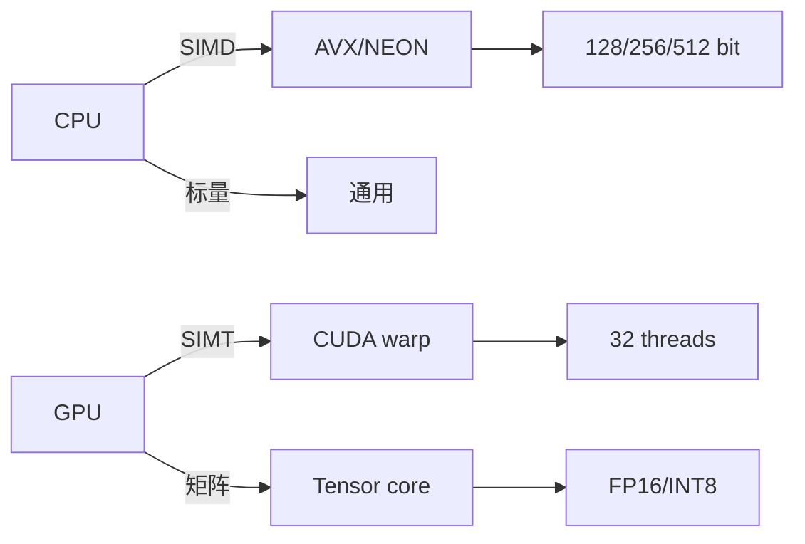
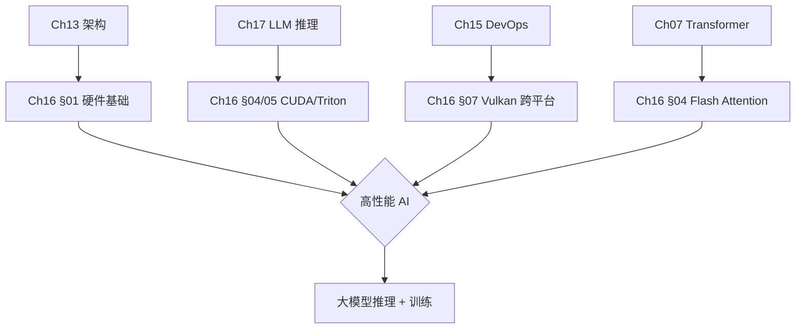
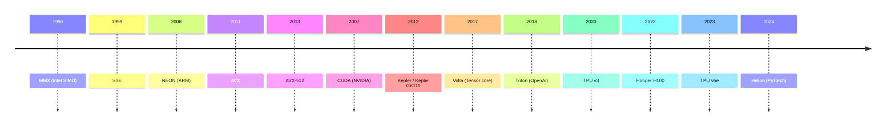
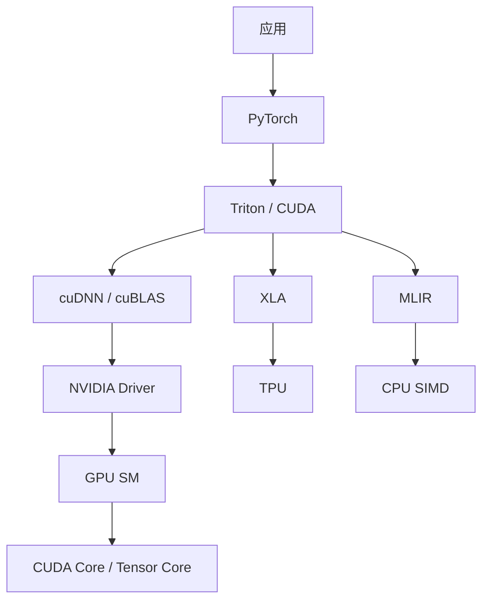

# Ch16 SIMD 与 GPU 编程 · 思维导图 (Mermaid)

---

## 一 · 章节主入口

```
🌳 Ch16 章 知识图谱
├─ §00 C++/框架
│  └─ PyTorch C++
│  └─ Tensor
├─ §01 硬件
│  └─ 内存层级
│  └─ Roofline
├─ §02 ARM NEON
│  └─ 寄存器
│  └─ 移动端
├─ §03 x86 AVX
│  └─ AVX-512
│  └─ FMA
├─ §04 GPU CUDA
│  └─ warp/block
│  └─ Tensor core
├─ §05 Triton/TPU
│  └─ Triton DSL
│  └─ 脉动阵列
├─ §06 RISC-V
│  └─ V 扩展
│  └─ 嵌入式
├─ §07 Vulkan
│  └─ 跨平台
│  └─ SPIR-V
```

---

## 二 · SIMD vs SIMT



---

## 三 · §01 硬件子图

```
🌳 Ch16 章 知识图谱
├─ 内存
│  └─ 寄存器
│  └─ L1/L2
│  └─ DRAM
│  └─ HBM
├─ Roofline
│  └─ 计算受限
│  └─ 带宽受限
├─ CPU/GPU
│  └─ 少核高频
│  └─ 多核低频
├─ Cache
│  └─ 局部性
│  └─ line
```

---

## 四 · §02 ARM NEON 子图

```
🌳 Ch16 章 知识图谱
├─ 寄存器
│  └─ Q0-Q15
│  └─ D0-D31
├─ 指令
│  └─ vmul/vadd
│  └─ vfma
├─ 应用
│  └─ 移动端
│  └─ Apple Silicon
├─ 进阶
│  └─ SVE
│  └─ Helium
```

---

## 五 · §03 x86 AVX 子图

```
🌳 Ch16 章 知识图谱
├─ 寄存器
│  └─ XMM
│  └─ YMM
│  └─ ZMM
├─ 指令集
│  └─ SSE
│  └─ AVX
│  └─ AVX-512
│  └─ AVX-10
├─ 应用
│  └─ 服务器
│  └─ HPC
├─ 编译
│  └─ -mavx512f
│  └─ intrinsics
```

---

## 六 · §04 CUDA 子图

```
🌳 Ch16 章 知识图谱
├─ 线程
│  └─ warp
│  └─ block
│  └─ grid
├─ 内存
│  └─ global
│  └─ shared
│  └─ register
├─ 优化
│  └─ coalesce
│  └─ bank conflict
│  └─ occupancy
├─ 库
│  └─ cuBLAS
│  └─ cuDNN
│  └─ CUTLASS
```

---

## 七 · §05 Triton/TPU 子图

```
🌳 Ch16 章 知识图谱
├─ Triton
│  └─ JIT
│  └─ autotune
│  └─ Python-like
├─ TPU
│  └─ systolic
│  └─ MXU
│  └─ pod
├─ 对比
│  └─ CUDA 复杂
│  └─ Triton 简单
│  └─ TPU Google
```

---

## 八 · §06 RISC-V 子图

```
🌳 Ch16 章 知识图谱
├─ 指令
│  └─ RV32/64
│  └─ V 扩展
│  └─ P 扩展
├─ 实现
│  └─ SiFive
│  └─ 平头哥
│  └─ Andes
├─ 应用
│  └─ IoT
│  └─ 嵌入式
│  └─ AI 边缘
```

---

## 九 · §07 Vulkan 子图

```
🌳 Ch16 章 知识图谱
├─ API
│  └─ Khronos
│  └─ 跨平台
├─ Compute
│  └─ workgroup
│  └─ SPIR-V
│  └─ shader
├─ 对比
│  └─ CUDA NVIDIA
│  └─ OpenCL 老
│  └─ Vulkan 现代
├─ 应用
│  └─ 游戏
│  └─ ML
│  └─ 渲染
```

---

## 十 · 跨章桥接



---

## 十一 · 演进时间线



---

## 十二 · 数据流对比

| 维度 | CPU SIMD | GPU SIMT | TPU |
|------|----------|----------|-----|
| **核心数** | 1 | 数千 | 4 (chip) |
| **频率** | 3-5 GHz | 1-2 GHz | 1 GHz |
| **数据** | 16×FP32 | 32 / warp | 128×128 |
| **擅长** | 控制 | 并行 | matmul |
| **功耗** | 中 | 高 | 中 |
| **代表** | AVX-512 | H100 | TPU v5 |

---

## 十三 · 加速器层次



---

> 这张导图覆盖 Ch16 全章。建议: 先背章节主入口 → 按节背子图 → 演进时间线 → 数据流对比。