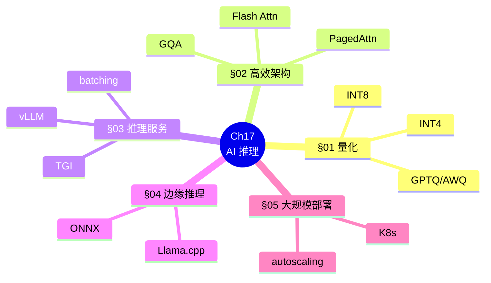
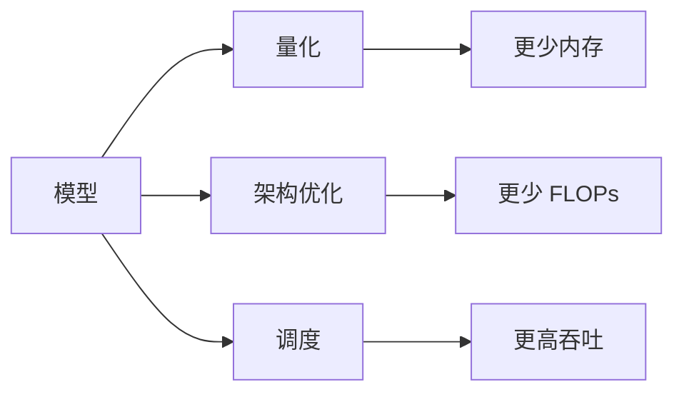
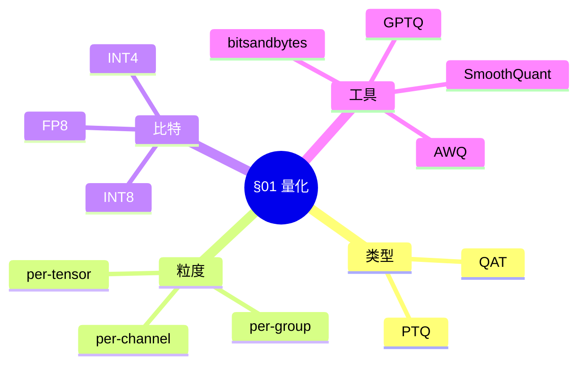
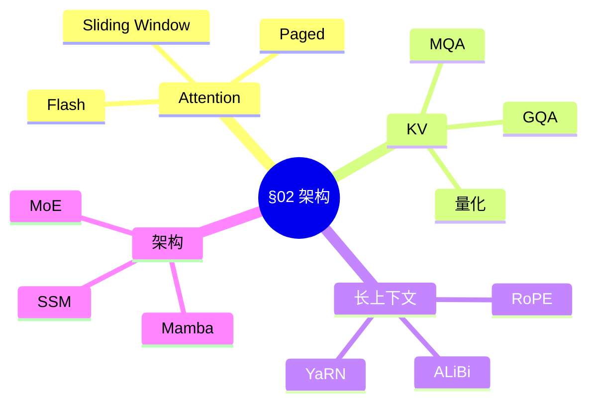
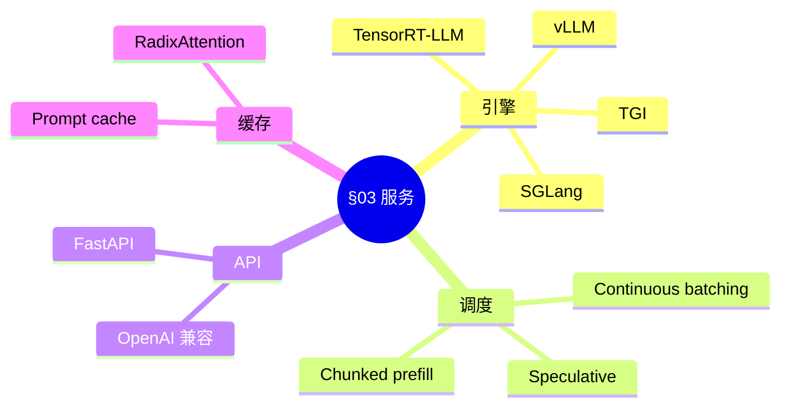
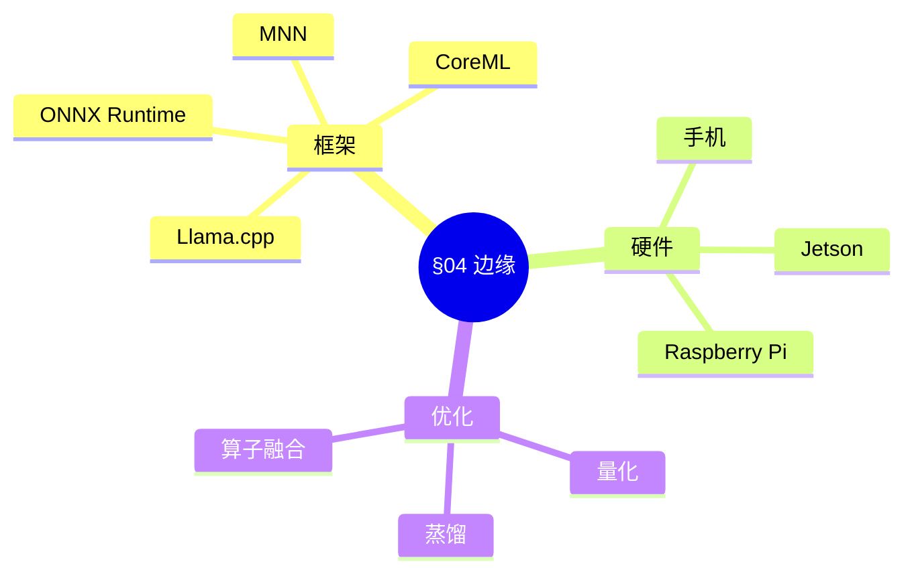
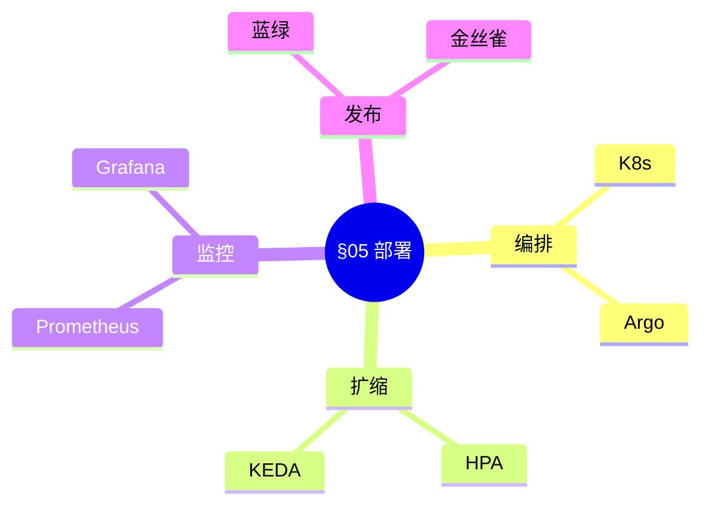
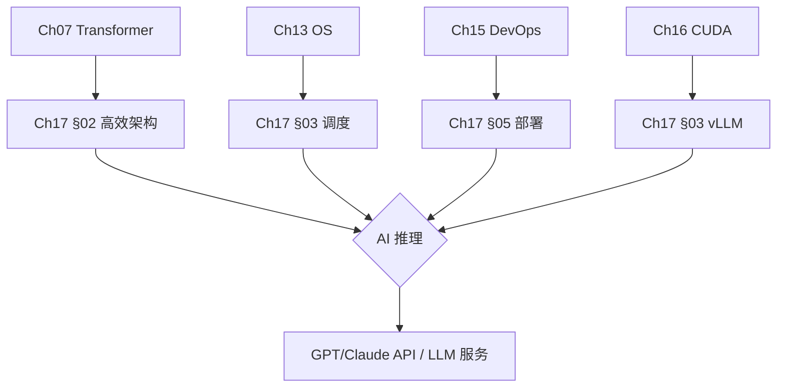
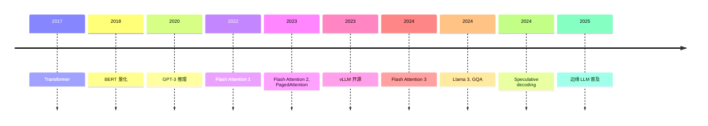
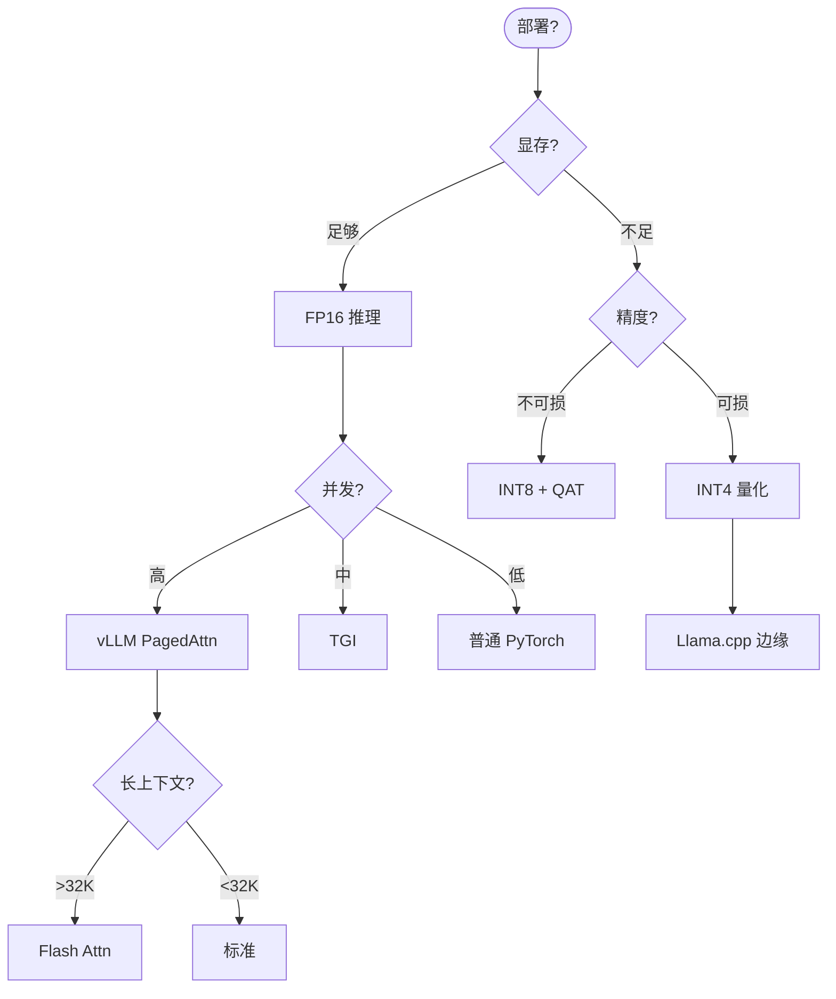

# Ch17 AI 推理 · 思维导图 (Mermaid)

---

## 一 · 章节主入口

---

## 二 · 推理优化三方向

---

## 三 · §01 量化子图

---

## 四 · §02 高效架构子图

---

## 五 · §03 推理服务子图

---

## 六 · §04 边缘推理子图

---

## 七 · §05 大规模部署子图

---

## 八 · 跨章桥接

---

## 九 · 演进时间线

---

## 十 · 推理优化决策树

---

## 十一 · 推理服务对比

| 引擎 | 吞吐 | 易用 | 部署 |
|------|------|------|------|
| **vLLM** | 极高 | 高 | K8s / Docker |
| **TGI** | 高 | 高 | HF Spaces |
| **TensorRT-LLM** | 极高 | 低 | NVIDIA |
| **SGLang** | 高 | 中 | 自托管 |
| **Llama.cpp** | 中 | 极高 | 边缘 |

---

## 十二 · 量化精度 vs 速度

| 精度 | 内存 | 速度 | 精度损失 |
|------|------|------|----------|
| FP16 | 1× | 1× | 0 |
| BF16 | 1× | 1× | 0 |
| INT8 | 0.5× | 1.5× | <1% |
| INT4 | 0.25× | 2× | 1-3% |
| INT2 | 0.125× | 3× | 5-10% |

---

> 这张导图覆盖 Ch17 全章。建议: 先背章节主入口 → 按节背子图 → 演进时间线 → 推理决策树。