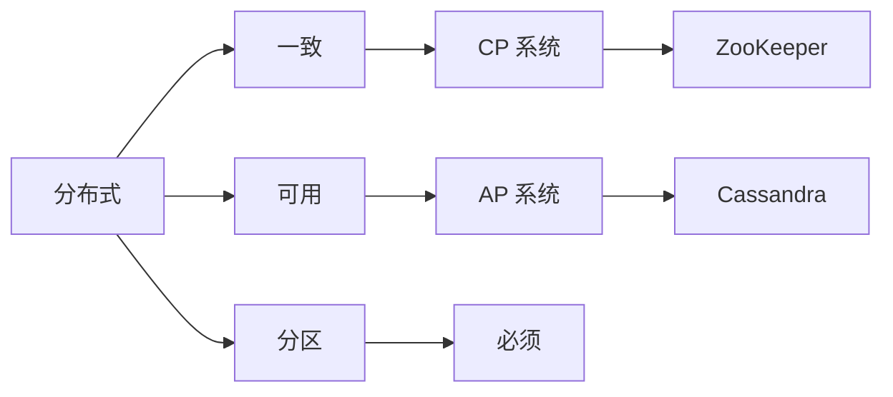
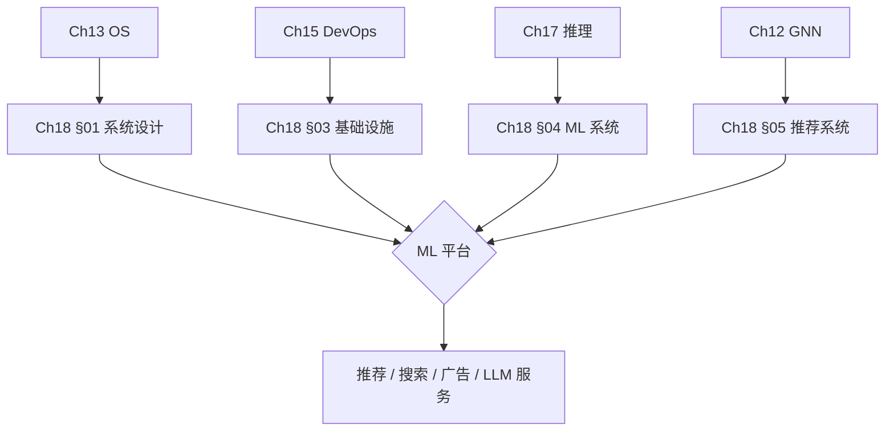
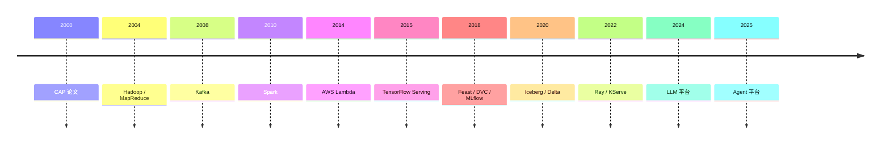
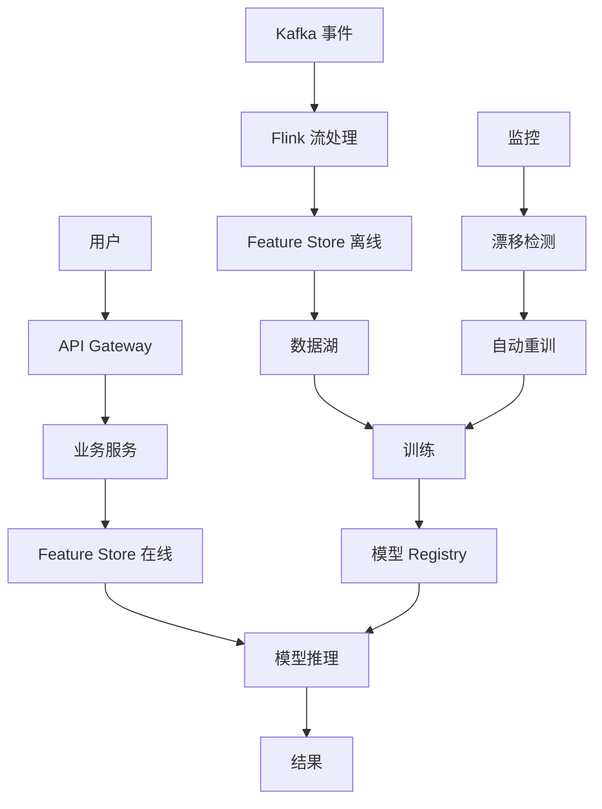

# Ch18 ML 系统设计 · 思维导图 (Mermaid)

---

## 一 · 章节主入口

```
🌳 Ch18 章 知识图谱
├─ §01 基础
│  └─ CAP
│  └─ 可扩展
│  └─ 一致性
├─ §02 云计算
│  └─ IaaS
│  └─ PaaS
│  └─ SaaS
├─ §03 基础设施
│  └─ Kafka
│  └─ Spark
│  └─ 数据湖
├─ §04 ML 系统
│  └─ Feature Store
│  └─ Registry
│  └─ 监控
├─ §05 案例
│  └─ Netflix
│  └─ DoorDash
│  └─ Uber
```

---

## 二 · CAP 三选二



---

## 三 · §01 基础子图

```
🌳 Ch18 章 知识图谱
├─ CAP
│  └─ 一致
│  └─ 可用
│  └─ 分区
├─ 扩展
│  └─ 水平
│  └─ 垂直
├─ 一致性
│  └─ 强
│  └─ 最终
├─ 可用性
│  └─ SLA
│  └─ SLO
```

---

## 四 · §02 云计算子图

```
🌳 Ch18 章 知识图谱
├─ 模式
│  └─ IaaS
│  └─ PaaS
│  └─ SaaS
├─ 厂商
│  └─ AWS
│  └─ GCP
│  └─ Azure
│  └─ 阿里云
├─ 服务
│  └─ EC2
│  └─ S3
│  └─ K8s
├─ 边缘
│  └─ CDN
│  └─ IoT
```

---

## 五 · §03 基础设施子图

```
🌳 Ch18 章 知识图谱
├─ 流
│  └─ Kafka
│  └─ Flink
│  └─ Pulsar
├─ 批
│  └─ Spark
│  └─ Hadoop
│  └─ Hive
├─ 湖
│  └─ Iceberg
│  └─ Delta
│  └─ Hudi
├─ 查询
│  └─ Trino
│  └─ Presto
│  └─ ClickHouse
```

---

## 六 · §04 ML 系统子图

```
🌳 Ch18 章 知识图谱
├─ 数据
│  └─ Feature Store
│  └─ 数据湖
├─ 模型
│  └─ Registry
│  └─ 版本
├─ 训练
│  └─ Pipeline
│  └─ 调度
├─ 监控
│  └─ 漂移
│  └─ 性能
├─ 发布
│  └─ A/B
│  └─ 金丝雀
```

---

## 七 · §05 案例子图

```
🌳 Ch18 章 知识图谱
├─ Netflix
│  └─ Eureka
│  └─ Zuul
│  └─ 推荐
├─ DoorDash
│  └─ 派单
│  └─ 物流
├─ Uber
│  └─ Michelangelo
│  └─ ETA
├─ Airbnb
│  └─ ML Platform
├─ Pinterest
│  └─ PinSage
```

---

## 八 · 跨章桥接



---

## 九 · 演进时间线



---

## 十 · ML 系统架构图



---

## 十一 · 关键模式对比

| 模式 | 描述 | 适用 |
|------|------|------|
| **批处理** | 定时处理 | 离线报表 |
| **流处理** | 实时 | 推荐 / 监控 |
| **Lambda** | 批 + 流混合 | 历史 + 实时 |
| **Kappa** | 纯流 | 简单实时 |
| **湖仓一体** | 湖 + 仓 | 现代数据栈 |

---

## 十二 · 数据漂移检测

| 方法 | 公式 | 适用 |
|------|------|------|
| **PSI** | $\sum (P_n - P_r) \ln(P_n / P_r)$ | 通用 |
| **KS 检验** | sup\|F1 - F2\| | 数值特征 |
| **卡方** | $\sum (O - E)^2 / E$ | 类别特征 |
| **模型监控** | 性能下降 | 后置 |

---

> 这张导图覆盖 Ch18 全章。建议: 先背章节主入口 → 按节背子图 → 演进时间线 → 系统架构图。