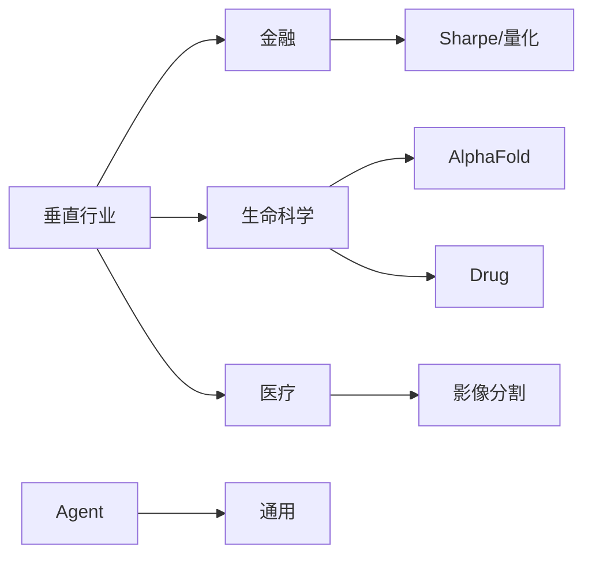
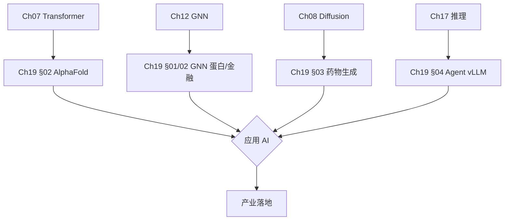
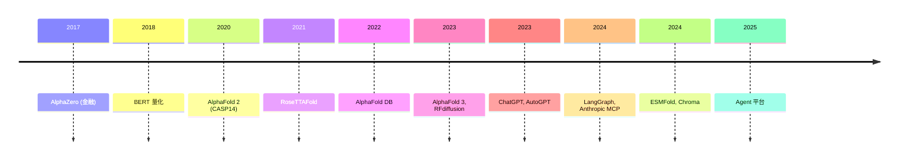
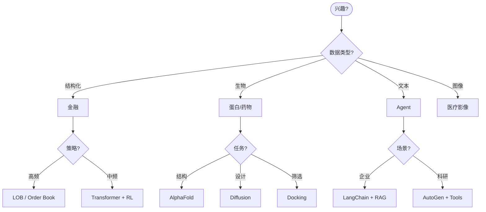

# Ch19 应用 AI · 思维导图 (Mermaid)

---

## 一 · 章节主入口

```
🌳 Ch19 章 知识图谱
├─ §01 金融
│  └─ 量化
│  └─ 风控
│  └─ 反欺诈
├─ §02 蛋白设计
│  └─ AlphaFold
│  └─ Evoformer
│  └─ MSA
├─ §03 药物发现
│  └─ 分子生成
│  └─ docking
│  └─ ADMET
├─ §04 Agent
│  └─ ReAct
│  └─ RAG
│  └─ Tool use
├─ §05 Healthcare
│  └─ 影像
│  └─ 临床
│  └─ 联邦
```

---

## 二 · 五大领域



---

## 三 · §01 金融子图

```
🌳 Ch19 章 知识图谱
├─ 量化
│  └─ 因子
│  └─ 统计套利
│  └─ 高频
├─ 风控
│  └─ VaR
│  └─ 信用
│  └─ 反欺诈
├─ 评估
│  └─ Sharpe
│  └─ Sortino
│  └─ MaxDD
```

---

## 四 · §02 蛋白设计子图

```
🌳 Ch19 章 知识图谱
├─ 模型
│  └─ AlphaFold 2/3
│  └─ RoseTTAFold
│  └─ ESMFold
├─ 结构
│  └─ 3D
│  └─ 残基
│  └─ MSA
├─ 评测
│  └─ pLDDT
│  └─ TM-score
│  └─ RMSD
├─ 设计
│  └─ RFdiffusion
│  └─ Chroma
│  └─ ProteinMPNN
```

---

## 五 · §03 药物子图

```
🌳 Ch19 章 知识图谱
├─ 生成
│  └─ SMILES
│  └─ VAE
│  └─ Diffusion
│  └─ RL
├─ 优化
│  └─ QED
│  └─ LogP
│  └─ ADMET
├─ 对接
│  └─ DiffDock
│  └─ AutoDock
├─ 验证
│  └─ 体外
│  └─ 体内
│  └─ 临床
```

---

## 六 · §04 Agent 子图

```
🌳 Ch19 章 知识图谱
├─ 框架
│  └─ ReAct
│  └─ Plan-Execute
│  └─ Reflexion
├─ 工具
│  └─ Function call
│  └─ MCP
│  └─ Browser
├─ 记忆
│  └─ 短期
│  └─ 长期
│  └─ 向量库
├─ 平台
│  └─ LangChain
│  └─ AutoGen
│  └─ LlamaIndex
```

---

## 七 · §05 医疗子图

```
🌳 Ch19 章 知识图谱
├─ 影像
│  └─ 分割
│  └─ 检测
│  └─ 配准
├─ 临床
│  └─ EHR
│  └─ MIMIC
│  └─ 预测
├─ 合规
│  └─ HIPAA
│  └─ 联邦
│  └─ 差分隐私
```

---

## 八 · 跨章桥接



---

## 九 · 演进时间线



---

## 十 · 决策树 (选应用方向)



---

## 十一 · AI 应用成熟度

| 领域 | 成熟度 | 商业化 |
|------|--------|--------|
| 金融 (量化) | ★★★★★ | 成熟 |
| 蛋白设计 | ★★★★ | AlphaFold DB |
| 药物发现 | ★★★ | 早期 |
| Agent | ★★★ | 早期 (2024) |
| 医疗 | ★★ | 试点 |

---

## 十二 · 评测指标速查

| 领域 | 指标 |
|------|------|
| 金融 | Sharpe, MaxDD, IR |
| 蛋白 | pLDDT, TM-score |
| 药物 | QED, LogP, hit rate |
| Agent | Accuracy, completion |
| 医疗 | AUROC, Dice, sensitivity |

---

> 这张导图覆盖 Ch19 全章。建议: 先背章节主入口 → 按节背子图 → 演进时间线 → 决策树。